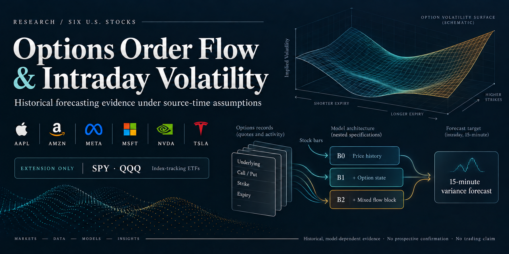
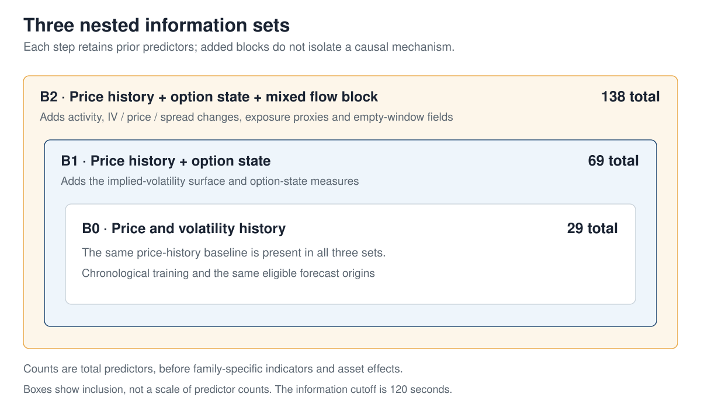
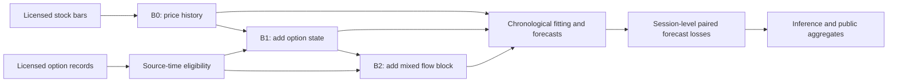

# Options Order Flow and Intraday Volatility

*Historical forecasting evidence under source-time assumptions.*



Miguel Guerrero · Master of Data Science · Sydney Polytechnic Institute · September 2026

## In one minute

**Can information from options markets improve forecasts of how much a stock will
move over the next 15 minutes?** This study compares price history alone, then adds
option state, then a mixed block conventionally called **flow**. It forecasts
realized variance, not price direction or trading profit.

The historical result is conditional: adding B2 gives **+0.62% lower forecast loss**
in the linear model at 15 minutes (**p = 0.003**); **the tree model does not improve**.
The final 25-session window does not confirm the full test sequence.
The study does **not** isolate timely trading activity as the source of the gain.

**Historical development evidence. Independent prospective confirmation: pending.
Economic/trading value: not demonstrated. Causality: not established.**
This is the fourth evaluation of overlapping historical data; cross-version
research search is not multiplicity-adjusted.

## Start here

| Step | Reader's question | Read next |
| --- | --- | --- |
| 1 | What was compared, and what was found? | This page, below |
| 2 | What weakens that finding? | [Evidence and interpretation](docs/CURRENT.md) · [B2 attribution](docs/B2_INTERPRETATION.md) |
| 3 | How did the study work? | [Illustrated research walkthrough](docs/RESEARCH_WALKTHROUGH.md) · [Frozen methodology](docs/rp4/specification_v4.md) |
| 4 | Where are the numbers and their sources? | [Claim-to-artifact evidence map](docs/EVIDENCE_MAP.md) |
| 5 | What can be reproduced without licensed data? | [Reproduction guide](docs/reproduce.md) |

The [examiner FAQ](docs/FAQ.md) answers the main objections. The
[documentation index](docs/INDEX.md) holds the longer reading route; historical
versions and corrections remain available without competing with the headline.

## The experiment

**Primary universe:** AAPL, AMZN, META, MSFT, NVDA and TSLA. SPY and QQQ are
index-tracking ETFs used as market context; a [separate eight-asset extension](docs/rp4/results_universe_v1.md)
also evaluates them as targets. They are not two additional primary stocks or
direct index-option instruments.

An option contract is identified by its **underlying, call/put type, strike and
expiry**. Its quotes and recorded activity contribute different information:
option *state* describes the market snapshot; the added B2 block mixes activity,
price changes, exposure proxies and empty-window handling. A contract's identity
is not proof of the trader's intention or a dealer's inventory.
[Contract terminology](docs/glossary.md) · [Feature definitions](docs/B2_INTERPRETATION.md).



Counts precede family-specific indicators and asset effects. B2 adds **69 columns**;
an improvement from that complete block does not establish which columns are
necessary. The comparison controls forecast origins, not causal attribution.



This is a computational diagram, not a causal model. Future realized variance is
used only for scoring. FMP supplies stock bars and Unusual Whales options records.
The primary **120-second source-time cutoff** is an assumption about availability,
not observed historical client receipt.

**160,832 forecast origins → 2,514 asset-sessions → 419 calendar sessions.**
These are not 160,832 independent observations or six independent replications.
Expanding walk-forward fitting keeps time order; inference uses 9,999 circular
bootstrap resamples of five-session blocks. [Design and data scope](docs/CURRENT.md).

## Results

**Current primary historical result: RP4 v4, RV15.** Positive percentages mean
lower mean QLIKE forecast loss; they are not investment returns.

| Model family | First test: option state, B1/B0 | Second test: mixed B2 block, B2/B1 |
| --- | ---: | ---: |
| Linear | +0.880% (p = 0.0390) | +0.623% (p = 0.0032) |
| Trees | +1.170% (p = 0.0135) | −0.115% (p = 0.6280) |

The p-values belong to the declared one-sided sequence: test B2/B1 only after
B1/B0 passes, at 5% within each family. The linear B2/B1 difference has a positive
95% interval **[0.000335; 0.001932] in QLIKE units**. Its separate bilateral
Holm-adjusted p = **0.0248** is a comparability analysis, not another adjustment
to that sequence. Neither family passes both steps under the stricter bilateral
Holm sensitivity. [Saved statistics](artifacts/rp4_v4_b4/primary_statistics.csv).

### Read the adverse evidence alongside the gain

| Check | What the saved evidence shows | What it permits |
| --- | --- | --- |
| Final historical window, 25 sessions | Neither family passes H1. Linear H2 nominal p = **0.1758**; **97.54%** of its accumulated gain comes from **31 August 2026**. | No confirmation; H2 remains unopened. A short inconclusive window does not prove zero effect. |
| Development stability, 419 sessions | Omitting each session individually leaves linear B2/B1 gains between **0.543% and 0.707%**. | The extreme one-day concentration is a final-window issue, not a description of the whole historical study. |
| Assumed availability, 60 / 120 / 300 seconds | Linear B2/B1 gains **1.447% / 0.623% / 0.194%**; p = **0.0001 / 0.0032 / 0.1948**. | Sensitivity to source-time assumptions, not a measured or causal cost of delivery latency. The 60-second result does not strengthen the registered finding. |
| Within-asset-session placebo | About **81.63%** of the gain survives; **12/50** permutations exceed aligned flow, empirical p = **0.255**. | Timely order flow is not demonstrated. Whole-session shuffling is not an executable information set or a causal attribution. |

[Exact arithmetic, sources and missing controls](docs/B2_INTERPRETATION.md) ·
[Full timing table and uncertainty](docs/CURRENT.md).

## Limits

An improved **mixed B2 block** is not proof of informed trades, aggressive buying,
dealer inventories or causal hedging. Broad component ablations and genuinely
available-at-origin controls have not established which information is necessary.
The existing narrow gamma ablation is not a substitute for that decomposition.

These results establish neither the dealer-hedging mechanism, economic alpha,
profitability nor broader generalization. More independent evidence—not new prose
or another interpretation of these same sessions—is needed for a stronger claim.
[Proposed decisive controls, not executed experiments](docs/rp4/PROSPECTIVE_RESEARCH.md).
Existing prospective protocols and one-shot rules remain unchanged.

## Reproduce / inspect

[](https://github.com/mguerrero896/does-option-flow-predict-volatility/actions/workflows/ci.yml)

**This is a substantive research repository, not a complete, portable, independently
executed scientific reproduction.** Public code, aggregates and provenance support
inspection; public checks do not replace reconstruction from licensed observations.

From a clean clone with Python 3.12 and `uv`:

```sh
uv sync --frozen
uv run --frozen python scripts/verify_public_projection.py --output-dir ../public-verification
```

This verifies public contracts, artifact references and the declared publication
boundary; it does not refit the study or open prospective data. Skipped tests remain
skipped, not passed. [Exact scope and figure regeneration](docs/reproduce.md) ·
[Reproducibility contract](docs/reproducibility_contract_v1.md).

| Public and inspectable | Restricted or not yet established |
| --- | --- |
| Source code, specifications, aggregate losses, inference summaries and figure producers | Licensed observations and granular feature/forecast panels |
| Claim-to-source pointers, hashes and declared public derivatives | Independent verification of private bytes from hashes alone |
| Public contract checks and selected aggregate reconstructions | A complete clean-machine licensed refit or independent prospective confirmation |

[Data access and licensing](data/DATA_ACCESS.md) explains the legitimate restriction.
It does not make missing independent reproduction evidence disappear.

## Explore and cite

[Evidence map](docs/EVIDENCE_MAP.md) · [Research history](docs/RESEARCH_WALKTHROUGH.md#research-timeline) ·
[Machine-readable state](data/CANONICAL_STATE.json) · [Findings ledger](docs/scientific_findings_ledger.md) ·
[Corrections](docs/known_defects_and_resolutions.md) · [Development guide](docs/DEVELOPER_GUIDE.md).

Miguel Guerrero (2026), *Options Order Flow and Intraday Volatility*.
Use [CITATION.cff](CITATION.cff) and identify the commit when citing a result.

[Contributing](CONTRIBUTING.md) · [Issues](https://github.com/mguerrero896/does-option-flow-predict-volatility/issues) ·
[License](LICENSE) · [Security](SECURITY.md) · [Visual provenance and editorial method](docs/READER_GUIDE.md).

Research only. Not investment advice. `capital_go=false`.
