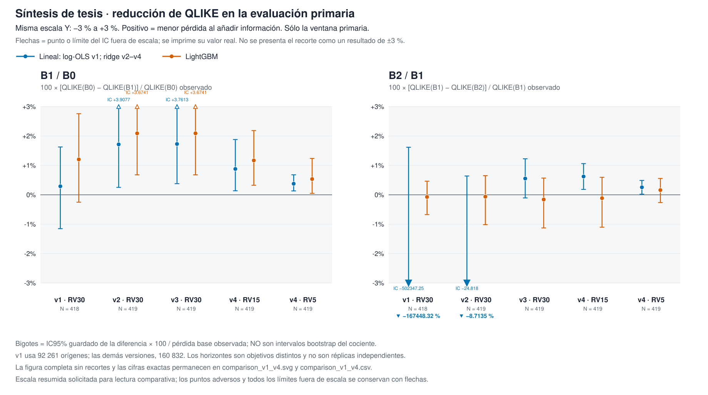

fuera de muestra walk-forward, partición fijada 2026-09-07.

# ¿Las opciones mejoran el pronóstico de volatilidad intradía?

[](../../actions/workflows/ci.yml)

El estado y la superficie de opciones mejoran el pronóstico medio de RV30 y RV15
en ambas familias bajo las pruebas de v3/v4. El flujo añade una mejora pequeña
en la familia lineal a **15 minutos (+0,623 % de reducción de QLIKE)**, con
**IC95 % positivo** de la diferencia QLIKE [0,000335; 0,001932], y a
**5 minutos (+0,256 %, secundario)**; en árboles no supera la prueba de la media.
No es una ventaja universal ni evidencia de rentabilidad.



## Pregunta, diseño y respuesta

Seis activos: AAPL, AMZN, META, MSFT, NVDA y TSLA. B0 contiene historia de precios
y volatilidad; B1 añade superficie de opciones; B2 añade composición y actividad
del flujo. Los conjuntos son anidados: 29/69/138 predictores en v3/v4.
La familia lineal es winsorizada con filtro de rango (ridge nominal); la otra
es LightGBM. QLIKE mide error de pronóstico, no beneficios de una estrategia.

Partición de calendario: 2026-08-01, fijada el 2026-09-07. Entrenamiento expansivo
sólo con el pasado; 60 sesiones de calentamiento; selección sobre las últimas
diez sesiones de entrenamiento; purga/embargo de 60 minutos. Primaria v2–v4:
419 sesiones, 160.832 orígenes. Ventana final: 25 sesiones, 9.750 orígenes.

Cada celda muestra **reducción porcentual de QLIKE (p)**. En v1/v2 se usa p
bilateral con Holm; en v3/v4, H1→H2 unilateral al 5 % por familia. H2 sólo se
abre cuando H1 rechaza. No se corrige la búsqueda entre versiones.

| Versión / objetivo | Lineal B1/B0 | Lineal B2/B1 | Árboles B1/B0 | Árboles B2/B1 | Sesiones |
| --- | ---: | ---: | ---: | ---: | ---: |
| v1 · RV30 | +0,290 % (1,000) | −167.448,32 % (1,000) | +1,204 % (0,4724) | −0,073 % (1,000) | 418 |
| v2 · RV30 | +1,715 % (0,1842) | −8,714 % (0,3752) | +2,091 % (0,0264) | −0,063 % (0,8858) | 419 |
| v3 · RV30 | +1,729 % (0,0439) | +0,554 % (0,0525) | +2,091 % (0,0053) | −0,159 % (0,6631) | 419 |
| v4 · RV15, primario | +0,880 % (0,0390) | +0,623 % (0,0032) | +1,170 % (0,0135) | −0,115 % (0,6280) | 419 |
| v4 · RV5, secundario | +0,377 % (0,0092) | +0,256 % (0,0172) | +0,536 % (0,0608) | +0,160 % (no abierta; nominal 0,1927) | 419 |

El flujo lineal es positivo en los tres bloques de ambos horizontes; por activo,
en seis de seis a 15 minutos y **tres de seis a 5 minutos**. En árboles, la
mediana pareada de B2 es positiva a 15/5 minutos: p bilateral 0,0435/0,0038 y
Holm 0,0870/0,0096; no sustituye la media primaria. La ventana final de 25
sesiones no confirma la secuencia completa. El programa termina en v4, sin v5.

[Resultado final y límites](docs/rp4/RESULTADO_FINAL.md) ·
[Informe completo con ambas ventanas](docs/rp4/results_v4.md) ·
[Anexo de 40 paneles sin recorte](docs/figures/rp4/comparison_v1_v4.svg) ·
[Datos agregados de las figuras](artifacts/rp4_closeout_figures/comparison_v1_v4.csv)

## Cómo verificar y reproducir

Verificación del informe contra los resultados guardados, sin datos licenciados,
entrenamiento ni inferencia nueva:

```powershell
uv run --offline --frozen --no-sync python -B artifacts/rp4_closeout_code/check_final.py
uv run --offline --frozen --no-sync python -B -m pytest artifacts/rp4_closeout_figures_code -q -p no:cacheprovider
```

Requiere el entorno Python 3.12 instalado con las dependencias fijadas en
`uv.lock`. El [runbook](docs/rp4/OPERATING_GUIDE.md) separa verificación pública,
ejecuciones históricas y reproducción con licencia y originales. No se declara
una nueva ejecución completa ni CI remota aprobada. La proyección de publicación
puede tener bytes distintos: sus hashes no se presentan como los del freeze.

Las fuentes de proveedores y los derivados por origen no se redistribuyen.
La licencia del código no concede derechos sobre esos datos.
[Acceso a datos](data/DATA_ACCESS.md) · [Estado generado](STATUS.md) ·
[Estado legible por máquina](data/CANONICAL_STATE.json).

## Divulgaciones

Cuarta evaluación de las mismas ventanas: v1 inicial; v2 corrige cobertura y
estabilidad; v3 añade desbalance y ventanas vacías; v4 cambia el horizonte bajo
un antecedente condicional. RV5 es secundario, no una réplica independiente.

La ventana 20 de julio a 28 de agosto fue leída una vez por el puente de Fase 8
con otra especificación. El PIT es proxy de tiempo fuente a 120 s, como en la
literatura; no demuestra recepción histórica por el cliente.

El hueco UW 2025-01-25–2025-02-24 se acepta sin relleno. Las marcas de sucesos
en las figuras son contexto temporal, no atribución causal.

## Historial: resultados y correcciones conservados

- El programa de 2024 y RP2 distinguió superficie y flujo con resultados
  dependientes de modelo y muestra; su señal se estudió como absorbida por
  información de estado, no se presenta como réplica de RP4.
  [Registro de resultados anteriores](docs/rp2_v3/SUPERSEDED_RESULTS.md).
- El sucesor PIT v2.2 tiene una lectura de evaluación fechada 2026-09-02,
  cifras favorables y adversas y disposición histórica
  `GLOBAL_EDGE_NOT_CONFIRMED`.
  [Resultado y límites originales](docs/pit_v22_claims_and_limitations_v2.md).
  La auditoría de exposición (`PASS_RETROSPECTIVE_EXPOSURE_VERIFIED`) mostró que las
  32 sesiones del holdout ya se habían leído en C3 y RP2-v3, por lo que se reclasificó
  como remedición retrospectiva descriptiva; la sensibilidad de reparación del
  historial B2 es un análisis separado con alfa gastado cero.
  [Addendum de exposición](docs/pit_v22_claims_and_limitations_v3.md) ·
  [Auditoría de exposición](artifacts/target_blind_v22/successor_holdout_exposure_v1.json) ·
  [Cierre de la reparación B2](docs/b2_repair_and_evidence_closeout_20260905.md).
- El puente Fase 8 se abrió el 2026-08-30, con resultado mixto y correcciones
  descriptivas preservadas. [Addendum](reports/phase8a_exploratory_bridge_addendum_v13.md).
- RP3 conserva su protocolo, contador de lectura cero y fecha **prevista**
  2029-01-30; esa fecha no es una lectura realizada. [Prerregistro](docs/rp3/PREREGISTRATION.md).
  C10 permanece inactivo por decisión 128: no se inventa fecha de lectura.
  Fase 9 dejó de ser cohorte sellada para RP4; sus originales no se modifican.
- v1 conserva su fallo numérico; v2 conserva sus resultados; la regla de ventana
  vacía de v3 acotó los apagones del proveedor sin eliminar todo el daño.
  [Auditoría de instrumento y modelos](artifacts/rp4_closeout_audit/REPORT.md).
  El cambio de vencimientos del 26 de enero de 2026 y los extremos AMZN/TSLA
  se documentan con límites de verificación.
  [Censo y barras](artifacts/rp4_market_audit/REPORT.md).

## Referencia de trabajo

<details>
<summary>Trazabilidad técnica anterior, no resultado vigente de RP4</summary>

El registro histórico `rp2-v3-20260831-b1-spot-cutoff-remediation` conserva el
hash científico `033f2eb6be35e5db06aec2f9e01ef5f3379a8be68b0372087f24e40fa681bea4`.
Su disposición es `HISTORICAL_MEASUREMENT_NOT_CURRENT_CLAIM`, por
`SUPERSEDED_BY_PIT_V22_SUCCESSOR_V2`; no se presenta como una réplica de RP4.
El puente Fase 8 conserva `MIXED_EXPLORATORY`: su auditoría concluyó
«no aggregation change» y «not confirmatory»; la sensibilidad materializada
mejoró sólo «one of eight B1-inclusive primary cells». Son diagnósticos
históricos, no la conclusión del programa cerrado en v4.

[Estado canónico e historial](data/CANONICAL_STATE.json) ·
[Límites PIT anteriores](docs/pit_v22_claims_and_limitations.md) ·
[Acceso a datos](data/DATA_ACCESS.md) ·
[Contrato de reproducción histórico](docs/reproducibility_contract_v1.md).

</details>

La ruta vigente de lectura es este README → [RESULTADO_FINAL](docs/rp4/RESULTADO_FINAL.md)
→ [RUNBOOK](docs/rp4/OPERATING_GUIDE.md). Los protocolos y recibos anteriores se conservan
como historia; no autorizan volver a ejecutar campañas cerradas.
La preparación es local: no se ha publicado esta entrega ni abierto su PR.

[Guía de desarrollo](docs/DEVELOPER_GUIDE.md) · [Licencia](LICENSE) ·
[Citación](CITATION.cff) · [Seguridad](SECURITY.md).

RESEARCH_ONLY · NOT INVESTMENT ADVICE · capital_go=false.

## Navegación

[Contribuir](CONTRIBUTING.md) · [Índice de documentación](docs/INDEX.md) ·
[Declaración de asistencia](docs/AI_ASSISTANCE_STATEMENT.md) ·
[Amenazas a la validez](docs/threats_to_validity_matrix_v1.md) ·
[Scripts](scripts/README.md) · [Índice de informes](reports/INDEX.md) ·
[Base de datos](supabase/README.md) · [Issues](https://github.com/mguerrero896/does-option-flow-predict-volatility/issues).
