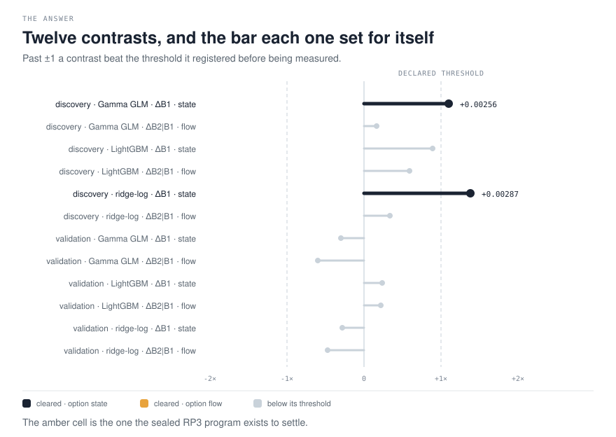
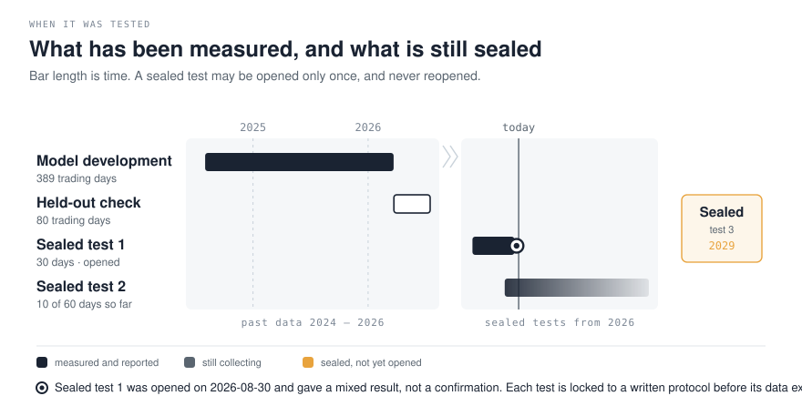
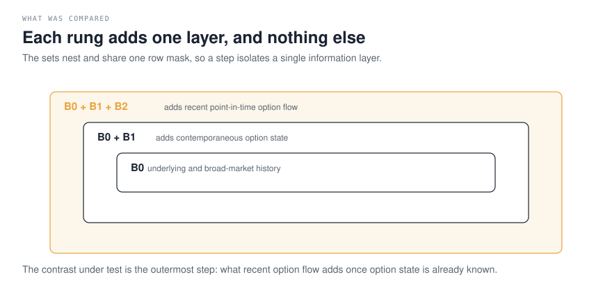
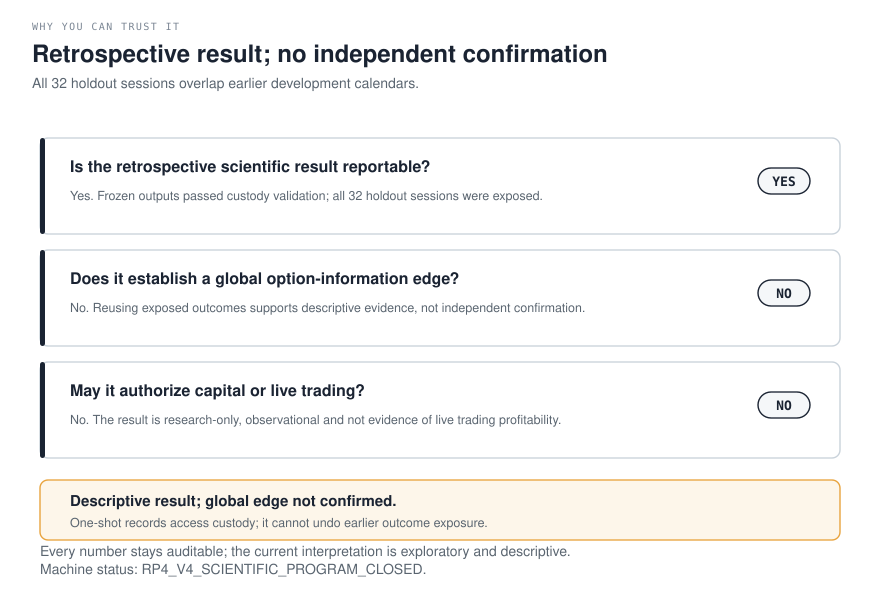
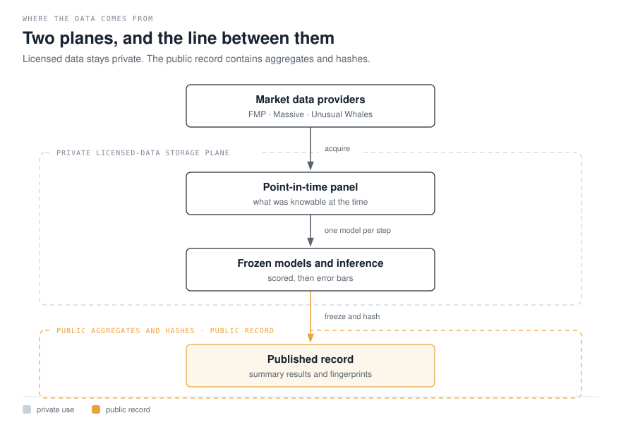

# Does option-market information improve intraday volatility forecasts?

[](../../actions/workflows/ci.yml)


Six large US equities. Every five minutes of the New York session, predict how much the
stock will actually move over the next thirty minutes. Then ask whether knowing what the
options market is doing makes that prediction better.

---

## The answer

**The corrected measurement does not establish an incremental option-flow contribution.**

The twelve headline comparisons separate option *state* (B1 over B0) from recent option
*flow* (B2 over B1), across three model families and two calendar roles.



Every comparison registers a detection threshold before it is run, so it cannot be
declared a success after the fact. Two of the twelve beat their own threshold (their
registered minimum detectable effect), and both are discovery option-state contrasts. No flow contrast clears its own
MDE. Discovery LightGBM flow is positive with an interval excluding zero, but its
+0.00096 estimate remains below its 0.00129 MDE; all three validation flow estimates are
negative. **The result is mixed by family and role, not a universal flow finding.**

The earlier flow exception motivated a sealed question before this timing remediation;
that programme remains frozen rather than rewritten around the updated retrospective run.
[`docs/rp3/PREREGISTRATION.md`](docs/rp3/PREREGISTRATION.md) fixes two hypotheses, on
sessions that mostly did not exist when it was written, to be opened once at 662 sessions
— estimated 2029-01-30.

Two further points a reader should have before going on:

- **Did the option-*state* layer help?** In discovery, yes. It did not hold up under
  validation, so it is not stated as a finding.
- **Did the signal weaken over time?** That cannot be claimed. The data do not show that
  fall, and splitting by date cannot separate a change in the market from simply having
  less data to train on.

---

## When it was tested



*Bar length is time. The dark bars are measured and reported; the amber card is a test that has never been opened.*

Retrospective work can always be re-run until it agrees with you. The defence against that
is a cohort you are allowed to look at only once, under a protocol written and hashed
before that data existed.

One such read is spent. Phase 8A opened on 2026-08-30 and returned `MIXED_EXPLORATORY`:
the state layer was positive in all four cells with descriptive Holm p below 0.05 in
three, while the flow layer crossed zero in all four and cleared Holm in none. An audit
reproduced the registered inference exactly and found **no aggregation change**. A separate
post-hoc rebuild then corrected the information clock on the same 30 materialized sessions:
only one of eight B1-inclusive primary cells lowered paired QLIKE, although the qualitative
B1-positive/B2-conditional-null pattern survived. Both exercises are descriptive,
**not confirmatory**, and cannot promote anything. Full result in the
[Phase 8A addendum](reports/phase8a_exploratory_bridge_addendum_v13.md).

One cohort is still collecting, and one is sealed until 2029.

---

## What was compared



Three models see three progressively larger pictures of the same moment, and all three are
scored on exactly the same moments. That is what lets the difference between two steps be
attributed to the information added and to nothing else.

The loss function is QLIKE. The model families are Gamma GLM, ridge-log and
LightGBM-QLIKE. Results are aggregated by trading session before any interval is computed,
because minutes within one session are not independent observations.

One distinction does a lot of work here: knowing *when a fact was true* is not the same as
knowing *when you could have seen it*. Unusual Whales `created_at` is `PROXY_ONLY`, and
Massive SIP timestamps establish when something happened at the source, not when a
subscriber received it. The rules used are in
[`docs/provider_timing_pit_contract_v22.md`](docs/provider_timing_pit_contract_v22.md).

---

## Why you can trust it



A number in this repository is not a claim until it passes three gates. Failing one does
not delete the number — it keeps it auditable and marks it as history.

The current bundle stops at the third gate. Its point-in-time inputs have not received a
successor method freeze, so every number it produced stays historical. That is the state
this repository publishes, stated in full under
[Governance and current state](#governance-and-current-state).

---

## Where the data comes from



Provider data is licensed and is not redistributed. Panels are built and evaluated on one
machine; what reaches this repository is aggregate results, schemas and SHA-256 pointers.
Custody and access boundaries are in [`data/DATA_ACCESS.md`](data/DATA_ACCESS.md) and
[`data/GATED_DATA_POINTERS.json`](data/GATED_DATA_POINTERS.json).

That boundary has a consequence worth stating plainly: hosted CI can prove this repository
is internally consistent, but it can never verify a licensed panel, because it cannot see
one. Only a local run can.

---

## Reproducing it

A methodological smoke demo, on synthetic inputs, exercising the primitives only:

```powershell
uv sync --locked
uv run python scripts/run_public_repro_demo.py
```

It does not acquire provider data, build licensed panels, run the cascade or publish
anything.

Hosted CI runs static quality, hermetic tests and scientific contracts against tracked
public inputs; exact commands are in [`docs/ci_contract_v1.md`](docs/ci_contract_v1.md).

Running `pytest` on a fresh clone reports failures from the panel guard, by design: it
fails closed when the licensed panels are absent rather than skipping, because a silent
skip would let an unverified run look green. Each failure names `RP2_PANEL_UNVERIFIED`. To
reproduce what hosted CI reproduces, set the same opt-out CI sets:

```powershell
$env:MDS650_PANEL_GUARD_MAY_SKIP = "1"; uv run pytest tests -q --ignore=tests/unit/test_independent_replication_panel.py --cov=src/mds650 --cov-report=term --cov-fail-under=90
```

The local Tier 2 gate additionally requires licensed evidence and live credentials:

```powershell
uv run python scripts/run_local_evidence_gates.py
```

Boundaries between the two tiers are in
[`docs/reproducibility_contract_v1.md`](docs/reproducibility_contract_v1.md).

---

## Governance and current state

This section is the machine-checked position, kept separate from the finding above: the
finding says what the evidence shows, this says what the project is permitted to claim.

**No result is currently eligible as the project headline.** The corrected-protocol bundle
is `rp2-v3-20260831-b1-spot-cutoff-remediation`, scientific hash
`033f2eb6be35e5db06aec2f9e01ef5f3379a8be68b0372087f24e40fa681bea4`, status
`REBUILD_COMPLETE_PIT_V22_BLOCKED`. Partition roles, the shared 120-second market cutoff
for both B0 and B1 spot, and the XNYS expiry calendar are repaired and the 13-step rebuild
passes, but `PIT_V22_RECONCILIATION_BLOCKED` remains and the consumed successor attempt adds
`PIT_V22_SUCCESSOR_FAIL_CLOSED_PRE_OOS`.

The authority is [`data/CANONICAL_STATE.json`](data/CANONICAL_STATE.json): one run
manifest, one hash, one eligibility state and its blocking reasons. If any document
disagrees with it, the canonical state wins.

Superseded measurements stay available for audit, never as current findings:

- [`docs/rp2_v3/SUPERSEDED_RESULTS.md`](docs/rp2_v3/SUPERSEDED_RESULTS.md) — what was
  retired, and why.
- [`docs/rp2_v3/VERDICT.md`](docs/rp2_v3/VERDICT.md) — the narrative for the
  corrected-protocol bundle, marked `HISTORICAL_MEASUREMENT_NOT_CURRENT_CLAIM`.
- [`docs/pit_v22_claims_and_limitations.md`](docs/pit_v22_claims_and_limitations.md) — the
  point-in-time evidence boundary, consumed pre-OOS failure and future-authority boundary.

No causal mechanism, formal equivalence, confirmatory discovery or live trading result is
claimed. Residual risks are in the
[threats-to-validity matrix](docs/threats_to_validity_matrix_v1.md).

---

## Repository map

| Path | What is there |
| --- | --- |
| `src/mds650/` | Research and validation code |
| `scripts/` | Producers and verification entrypoints; see [`scripts/README.md`](scripts/README.md) |
| `tests/` | Unit, behavioural, contract and synthetic end-to-end tests |
| `configs/`, `schemas/`, `specs/` | Frozen configuration and machine-readable contracts |
| `artifacts/` | Public aggregates and frozen evidence records |
| `supabase/` | Database schema and access controls; see [`supabase/README.md`](supabase/README.md) |
| `docs/` | Methodology, limitations and history; see [`docs/INDEX.md`](docs/INDEX.md) |
| `reports/` | Deliverables; see [`reports/INDEX.md`](reports/INDEX.md) |

The figures above are generated by `scripts/render_figures.py` from the evidence they
describe, in the palette defined in `scripts/figure_style.py`.

New readers of the code should start with the
[developer guide](docs/DEVELOPER_GUIDE.md) and the
[architecture map](docs/architecture.md).

---

## Scope

Research evidence. Not investment advice, not an order-routing system, not evidence of
live profitability. `capital_go=false`.

[Issues](https://github.com/mguerrero896/does-option-flow-predict-volatility/issues) and
methodological discussion are welcome; boundaries are in
[`CONTRIBUTING.md`](CONTRIBUTING.md), and computational assistance is disclosed in
[`docs/AI_ASSISTANCE_STATEMENT.md`](docs/AI_ASSISTANCE_STATEMENT.md).

See [`CITATION.cff`](CITATION.cff), [`LICENSE`](LICENSE) for the MIT licence covering
project-authored material, and [`SECURITY.md`](SECURITY.md) for private vulnerability
reporting.
