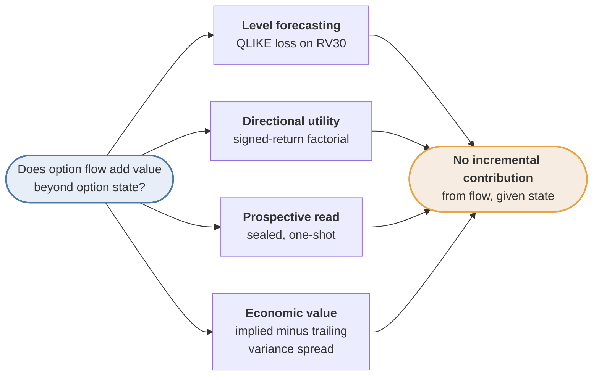
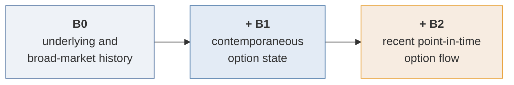
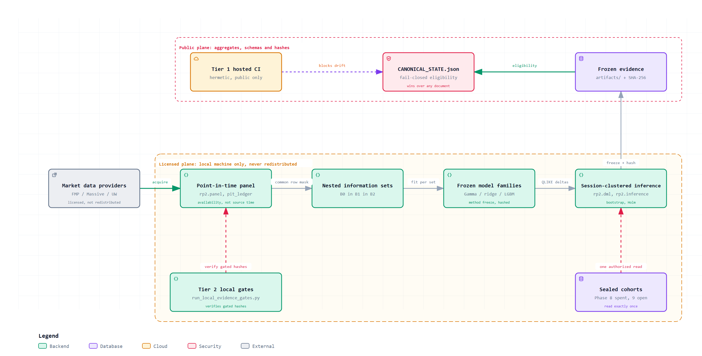

# Does option-market information improve intraday volatility forecasts?

[](../../actions/workflows/ci.yml)


Research code and public evidence for testing whether option state and recent option-flow
activity improve forecasts of 30-minute realized variance for large US equities.

## The short answer

**On this evidence, not from recent option *flow*.** Four independent tests were put to
the same question, and all four agree: once contemporaneous option state is already in the
model, adding recent point-in-time flow produces no incremental contribution above the
minimum detectable effect each test declared for itself.

Only some of those tests were sealed before their data existed. The prospective read was,
under a protocol frozen and hashed in advance and opened once. The level-forecasting
comparison was not: it is retrospective and exploratory, because validation was consulted
adaptively during development, and its stricter sequential alpha is a conservative
post-hoc sensitivity rather than a preregistered confirmation.

The option-*state* layer is a weaker and more careful story. It shows a positive
contribution in discovery and in the single sealed prospective read, but that contribution
does **not** replicate under validation, and it is not promoted to a confirmatory claim.
Nine of the twelve headline contrasts fall below their own minimum detectable effect.

The repository does not claim the effect faded over time. Era-split point estimates rise
rather than fall, every era estimate sits below its familywise minimum detectable effect,
and a time split cannot separate a regime change from a smaller training sample. A
decay reading was tested, withdrawn, and is
[recorded as invalidated](docs/rp2_v3/SUPERSEDED_RESULTS.md).

This repository exists to make that null result *credible* rather than merely asserted.
Any single test that fails to find an effect can be dismissed as a weak test. The design
answer is pre-registration, sealed one-shot reads, hash-pinned evidence and a fail-closed
canonical state that refuses to promote a measurement it cannot support. The machinery is
the contribution; the null is what the machinery returned.

No measurement here is promoted to a confirmatory claim. The governing eligibility state,
with its blocking reason, is stated in full under
[Governance and current state](#governance-and-current-state).

## How the answer was reached

The same question was put to four instruments that fail in different ways, so that no
single methodological weakness could produce the shared answer:



A statistical test, a decision-utility test, a prospective test and an economic test are
vulnerable to different failure modes. Agreement across all four is much harder to explain
by one flawed choice than agreement within any single one of them.

| Instrument | What it would have caught | Record |
| --- | --- | --- |
| Level forecasting | A real reduction in QLIKE loss on RV30 | [`rp2_v3/VERDICT.md`](docs/rp2_v3/VERDICT.md) |
| Directional utility | Value in the sign of returns that a variance loss cannot score | [`extension_b2_directional_utility_v2.md`](docs/rp2/extension_b2_directional_utility_v2.md) |
| Prospective read | An effect that survives on data sealed before the protocol was written | [`phase8a addendum v10`](reports/phase8a_exploratory_bridge_addendum_v10.md) |
| Economic value | A tradable spread that statistical loss functions miss | [`block11_economics_v1.md`](docs/rp2/block11_economics_v1.md) |

## Research design

Forecast origins occur every five minutes during the New York trading session. Models
predict realized variance over the next 30 one-minute returns using nested information
sets evaluated on a common row mask:



| Set | Information available at forecast time |
| --- | --- |
| B0 | Underlying and broad-market price/volume history |
| B0+B1 | B0 plus contemporaneous option-state features |
| B0+B1+B2 | B0+B1 plus recent point-in-time option-flow activity |

Because the sets are nested and share one row mask, the difference between adjacent rungs
isolates the contribution of exactly one information layer.

Primary loss is QLIKE. Primary model families are Gamma GLM, ridge-log and
LightGBM-QLIKE. Inference aggregates loss differences by trading session before
bootstrap or long-run variance estimation.

The distinction between information time and client availability is material. Unusual
Whales `created_at` is `PROXY_ONLY`; Massive SIP timestamps establish source time, not
historical client receipt. See
[`docs/provider_timing_pit_contract_v22.md`](docs/provider_timing_pit_contract_v22.md).

Development and validation partitions are retrospective research samples. Only a protocol
sealed before future observations and read under its specific access contract can be
described as prospective or one-read.

## Evidence and data access



Two planes, and the rule that separates them. Licensed panels stay on one machine and are
never redistributed, so hosted CI can prove the public repository is internally sound but
can never verify a licensed hash; only the local Tier 2 run can. Everything published is an
aggregate, a schema or a SHA-256 pointer. An
[explorable version](docs/figures/architecture.html) of the same diagram is in the
repository.

Commercial provider data is not distributed. Public artifacts contain aggregate results,
schemas and SHA-256 pointers. Custody, licensing and access boundaries are documented in
[`data/DATA_ACCESS.md`](data/DATA_ACCESS.md) and
[`data/GATED_DATA_POINTERS.json`](data/GATED_DATA_POINTERS.json).

The project uses Financial Modeling Prep, Unusual Whales and Massive. Provider timestamps
and subscription access are not interchangeable with proof of client receipt time.

## Reproduction levels

The public repository is repo-first; the wheel is not presented as a standalone research
distribution.

Methodological smoke demo using synthetic, already-structured inputs:

```powershell
uv sync --locked
uv run python scripts/run_public_repro_demo.py
```

This demo exercises methodological primitives only. It does not acquire provider data,
normalize raw payloads, build licensed panels, run the full RP2 cascade, create manifests
or publish results.

Hosted CI runs static quality, hermetic tests and scientific contracts against tracked
public inputs. Exact commands and exclusions are in
[`docs/ci_contract_v1.md`](docs/ci_contract_v1.md).

Running `pytest` on a fresh clone reports failures from the panel guard, by design. It
fails closed when the licensed panels are absent rather than skipping, because a silent
skip would let an unverified run look green; each failure names
`RP2_PANEL_UNVERIFIED` and the panel it wanted. To reproduce what hosted CI reproduces,
set the same opt-out CI sets:

```powershell
$env:MDS650_PANEL_GUARD_MAY_SKIP = "1"; uv run pytest
``` The local Tier 2 gate additionally
requires licensed evidence and live access-posture credentials:

```powershell
uv run python scripts/run_local_evidence_gates.py
```

A Tier 1 pass does not verify providers, Supabase end to end, licensed panel hashes or a
scientific rebuild. Full boundaries are in
[`docs/reproducibility_contract_v1.md`](docs/reproducibility_contract_v1.md).

## Governance and current state

This section states the machine-checked eligibility position. It is deliberately separate
from the finding above: the finding describes what the evidence shows, this describes what
the project is permitted to claim.

**No result is currently eligible as the project headline.** The corrected-protocol bundle
is `rp2-v3-20260827-remediation3`, scientific hash
`386610a4908d601c1ad09688d8371cfa3fdd70e4e7ddf50c416e8d3b0907cb47`. Its status is
`REBUILD_COMPLETE_PIT_V22_BLOCKED`: the model-protocol divergence between the two
inference stages is repaired and the full rebuild passes, but
`PIT_V22_RECONCILIATION_BLOCKED` remains. Corrected point-in-time inputs have not received
a successor method freeze or authorized evaluation, so this historical measurement cannot
become a current claim.

The machine-readable authority is
[`data/CANONICAL_STATE.json`](data/CANONICAL_STATE.json). It identifies one run manifest,
one scientific hash, one scorecard, the eligibility state and blocking reasons. If another
document disagrees with it, the canonical state wins.

Historical measurements remain available for audit, not as current findings:

- [`docs/rp2_v3/SUPERSEDED_RESULTS.md`](docs/rp2_v3/SUPERSEDED_RESULTS.md) records retired
  results and why each was replaced or withdrawn.
- [`docs/rp2_v3/VERDICT.md`](docs/rp2_v3/VERDICT.md) is the narrative attached to the
  corrected-protocol bundle; its status is `HISTORICAL_MEASUREMENT_NOT_CURRENT_CLAIM`.
- [`docs/pit_v22_claims_and_limitations.md`](docs/pit_v22_claims_and_limitations.md) states
  the target-blind PIT evidence boundary and the required next gate.

No causal mechanism, formal equivalence, confirmatory discovery or live trading result is
claimed from the PIT-blocked bundle. The current
[threats-to-validity matrix](docs/threats_to_validity_matrix_v1.md) records the evidence
boundary, mitigations and residual risks.

Separately, the sole Phase 8A bridge read is complete and classified
`MIXED_EXPLORATORY`. ΔB1 is positive in all four primary cells and has descriptive Holm
p below 0.05 in three; incremental B2 conditional on B1 has mixed signs, four
zero-crossing intervals and no Holm p below 0.05. A cube-level audit reproduces the
registered inference exactly and finds no aggregation change. The read is descriptive,
not confirmatory, and cannot make the PIT-blocked bundle eligible. The exact result,
dispersion comparison and execution-recovery limitation are in the
[`Phase 8A addendum`](reports/phase8a_exploratory_bridge_addendum_v10.md).

## Repository map

| Path | Purpose and maintained index |
| --- | --- |
| `src/mds650/` | Reusable research and validation code |
| `scripts/` | Explicit producers and verification entrypoints; see [`scripts/README.md`](scripts/README.md) |
| `tests/` | Unit, behavioral, contract and synthetic end-to-end tests |
| `configs/` | Frozen research configuration |
| `schemas/`, `specs/` | Machine-readable contracts |
| `artifacts/` | Public aggregates and frozen evidence records |
| `supabase/` | Versioned database schema and access controls; see [`supabase/README.md`](supabase/README.md) |
| `docs/` | Methodology, limitations and history; see [`docs/INDEX.md`](docs/INDEX.md) |
| `reports/` | Current and historical deliverables; see [`reports/INDEX.md`](reports/INDEX.md) |

Maintainers and new programmers should begin with the
[`developer guide`](docs/DEVELOPER_GUIDE.md) and the current
[`architecture map`](docs/architecture.md). They define the source-of-truth hierarchy,
safe execution planes, change workflow and commenting conventions without relocating
frozen evidence.

## Scope

This repository reports research evidence. It is not investment advice, an order-routing
system or evidence of live profitability. `capital_go=false`.

[Issues](https://github.com/mguerrero896/does-option-flow-predict-volatility/issues) and
methodological discussion are welcome. Contribution boundaries are in
[`CONTRIBUTING.md`](CONTRIBUTING.md), and computational assistance is disclosed in
[`docs/AI_ASSISTANCE_STATEMENT.md`](docs/AI_ASSISTANCE_STATEMENT.md).

See [`CITATION.cff`](CITATION.cff) for citation metadata, [`LICENSE`](LICENSE) for the MIT
license covering project-authored material and [`SECURITY.md`](SECURITY.md) for private
vulnerability reporting.
