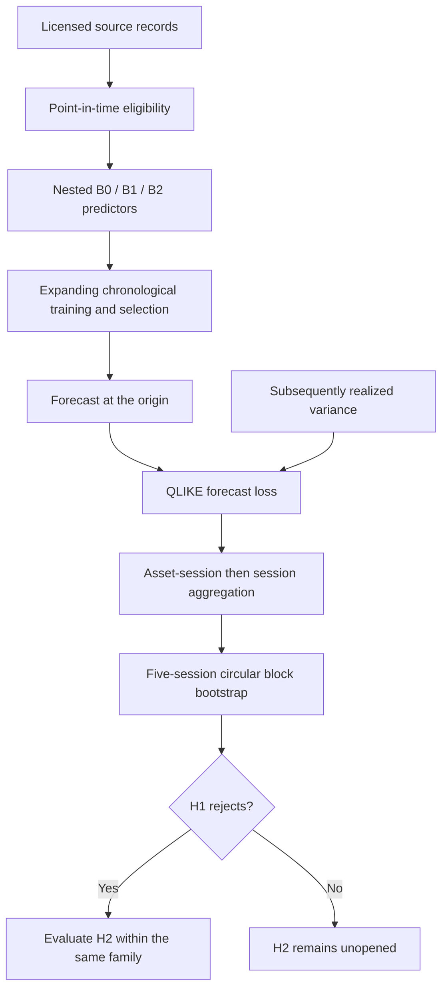

# Evidence map

**Status: CURRENT.** Navigation from the [current scientific summary](CURRENT.md) to saved results, identified rows and implementation provenance. This map describes historical evidence; it does not authorize another evaluation.

## Claims and identifiable rows

The source is [primary_statistics.csv](../artifacts/rp4_v4_b4/primary_statistics.csv). Select rows by `(horizon_minutes, window, family, contrast)`, not physical line numbers. Each selector below identifies one row. Percentages use `qlike_reduction_percent`; the registered decision uses `p_for_decision`, not an unopened hypothesis's `p_raw`. The [full report](rp4/results_v4.md) retains the historical narrative.

| Claim and result | CSV row selector | Required fields and interpretation |
| --- | --- | --- |
| Historical linear option-state improvement: +0.8800546831% | `15, primary, log_ridge_harq, B1_over_B0` | `p_for_decision=0.039`; `hypothesis_status=REJECTED` |
| Historical linear flow improvement: +0.6227940964% | `15, primary, log_ridge_harq, B2_over_B1` | `estimate=0.0011337596590923558`; `ci_low=0.00033503697025205506`; `ci_high=0.0019321615865300122`; `p_for_decision=0.0032` |
| Historical tree option-state improvement: +1.1699687137% | `15, primary, lightgbm_qlike, B1_over_B0` | `p_for_decision=0.0135`; `hypothesis_status=REJECTED` |
| Tree flow does not improve the primary mean: -0.1147393674% | `15, primary, lightgbm_qlike, B2_over_B1` | `p_for_decision=0.628`; `hypothesis_status=NOT_REJECTED` |
| Separate bilateral Holm sensitivity does not reject both contrasts in either family | The four RV15 primary selectors above | `p_holm_bilateral`: linear H1/H2 `0.0918/0.0248`; trees `0.0447/0.8048`. These are separate from the registered one-sided sequence. |
| Final historical window does not confirm either complete sequence | `15, confirmation, log_ridge_harq, B1_over_B0` and `15, confirmation, lightgbm_qlike, B1_over_B0` | H1 `p_for_decision=0.3908/0.0568`; both `NOT_REJECTED` |
| Final-window H2 is unopened in both families | `15, confirmation, log_ridge_harq, B2_over_B1` and `15, confirmation, lightgbm_qlike, B2_over_B1` | `p_for_decision` empty; `hypothesis_status=NOT_TESTED`. Nominal `p_raw=0.1758/0.7554` cannot supply formal rejection. |
| RV5 is secondary | `5, primary, log_ridge_harq, B2_over_B1` | +0.2563185779%; `p_for_decision=0.0172`; `inference_role=SECONDARY` |
| Sample size is not an independent-observation count | Any RV15 primary row; any RV15 confirmation row | Primary: `N_origins=160832`, `N_asset_sessions=2514`, `N_sessions=419`. Final: `9750`, `150`, `25`. Inference preserves session dependence. |

The [B4 receipt](../artifacts/rp4_v4_b4/receipt.json) records `successful_primary_rv15_families=[log_ridge_harq]`, `joint_across_both_families_confirmed=false` and `confirmation_window_sequence_satisfied=false`. The receipt reports a completed historical reporting stage, not prospective confirmation.

## Producer chain

### Official conceptual model

Scope: historical v4 evaluation. Metric: paired mean QLIKE; arrows describe computation, not causality. Future realized variance is used for scoring, never as an input at the forecast origin. A source-time cutoff is an availability proxy, not historical receipt evidence.

### One forecast anatomy

Scope: one conceptual RV15 forecast, with no invented market values. Metric: realized variance over the future target interval. The figure separates information eligibility from target realization; it does not illustrate an executable trading decision. Exact timing and guards are in the [specification](rp4/specification_v4.md).

### Canonical figure route

| Reader's question | Canonical figure | Scope, metric, interpretation and limitation |
| --- | --- | --- |
| What information is added? | [Information sets](figures/public_refresh/information_sets.svg) | Six-stock v4 design; 29/69/138 predictors. Nested information, not independent feeds. |
| What is one forecast? | One forecast anatomy above | RV15 timing, no empirical values; future targets are used only for scoring. |
| How do records become eligible evidence? | [PIT/data pipeline](figures/data-pipeline.svg) | Licensed FMP/UW records to public aggregates. No metric of actual historical receipt. |
| How did the research change? | [Historical timeline](figures/public_refresh/programme_timeline.architecture.svg) | Earlier nulls through v4/extensions; sequence is not elapsed-time scale or independent replication. |
| Which comparisons improved? | [Primary result matrix](figures/public_refresh/result_matrix.svg) | RV15, 419 historical sessions; percentage QLIKE reduction and one-sided p-values. Cross-version search is not adjusted. |
| When did flow gains accumulate? | [B2/B1 cumulative result](figures/rp4/v4_B2_over_B1_cumulative_v2.svg) | Saved paired loss differences by session; gain and reversals are model-dependent, not cumulative trading profit. |
| What evidence comes next? | Prospective roadmap below | Registered cumulative session thresholds; no observed future results or guaranteed power. |

The [registered amendment](rp4/prospective_confirmation_v1_amendment_3.md) fixes these dependent reads. The first verdict is retained; later reads cannot rescue it. Planning power for H2 is not power for the full sequence. Existing figures remain available for audit; these seven views define the primary reading route.

### Recorded implementation

1. [evaluate_v4.py](../artifacts/rp4_v4_code/evaluate_v4.py) enforces the explicit horizon contract and imports `fit_ridge` from the [v3 model snapshot](../artifacts/rp4_v3_code/models.py) and `fit_lightgbm` from the [v2 model snapshot](../artifacts/rp4_v2_code/models.py). Those imports identify the implementations used by the recorded evaluation path.
2. [aggregate_v4.py](../artifacts/rp4_v4_code/aggregate_v4.py), `aggregate_records()`, produces contrasts from session losses using the v3 aggregation/inference path. `_comparability()` supplies the separate bilateral comparison. Saved [primary summary](../artifacts/rp4_v4_b2_rv15/summary.json) and [final-window summary](../artifacts/rp4_v4_b3_rv15/summary.json) preserve the resulting inference.
3. [report_v4_checked.py](../artifacts/rp4_v4_code/report_v4_checked.py), `run()`, validates saved results through `verify_results()`, joins `summary["contrasts"]` with `summary["comparability_bilateral"]` by family/contrast, and emits `primary_statistics.csv`. It does not replace the registered inference with the bilateral values. The report receipt records zero new model fits and zero new inference in this stage.
4. The [report manifest](../artifacts/rp4_v4_b4/report_manifest.json) records inputs and output hashes. The [receipt](../artifacts/rp4_v4_b4/receipt.json) records the reporting checks and closure scope. The [canonical-state producer](../scripts/generate_canonical_state.py) maintains the public state; it is not the historical fitting implementation.

## Byte identities and historical provenance

The following SHA-256 values were calculated from the public files' bytes for this map. Equality with a historical recorded value is stated only where checked. A public derivative hash is not substituted for an original execution hash.

| Public file | Calculated SHA-256 | Historical comparison |
| --- | --- | --- |
| [primary_statistics.csv](../artifacts/rp4_v4_b4/primary_statistics.csv) | `5c215fc38344839ecedea7b27f69efcb85fbefea84f1367d06229cb7407902d4` | Matches the output value in the report manifest and receipt. |
| [evaluate_v4.py](../artifacts/rp4_v4_code/evaluate_v4.py) | `42bab85ef140dc85357d1672838261475c84af797e582782a0c552625e987450` | Matches the report manifest's input value. |
| [aggregate_v4.py](../artifacts/rp4_v4_code/aggregate_v4.py) | `53ced372a3e12b7dc3525130b118d62ff045b60853f9cfad86f7dfd8f7f811f0` | Matches the report manifest's input value. |
| [metrics.py](../src/mds650/metrics.py) | `a2641344e84a0dbe5bd849c7c658e73c1c20a5f3ec77ea9bc92a2080e1090b75` | Maintained source currently matches the report manifest's input value. This does not establish identity for every maintained module. |
| [report_v4_checked.py](../artifacts/rp4_v4_code/report_v4_checked.py) | `5b595d1c00245ee964b3d48e07c038eebb1e843947b9ce1751d0cc39e69ebca5` | Public bytes differ from the historical receipt value below; do not claim byte-identical execution code. |
| [report_manifest.json](../artifacts/rp4_v4_b4/report_manifest.json) | `231a7d7bb7d467cf1f934a9dbae2b757e99087f6ba71d1f9702c9c00a464ed3c` | Public bytes differ from the historical receipt value below. |
| [receipt.json](../artifacts/rp4_v4_b4/receipt.json) | `cd1eb1f23ab0da8bd7623b7f627ccc57dd38f6d7f1aec0ba7227301e09bd401d` | Public receipt identity; no original-receipt byte equality is asserted. |

The receipt records historical hashes `17c0c0fc67336aa945db9c156bf6f0e1043206391e3d3f0bb5873382c0424c7c` for the checked report producer and `a387b789158b78232b29911ae63638a0367ae3acb5a21e5672dbcfaec4cba56f` for the report manifest. These two values are transcribed provenance, not calculated identities of the current public files. The [reproducibility contract](reproducibility_contract_v1.md) explains the distinction between original and public-derivative identities.

## Verification boundary

Public inspection can verify these CSV selectors, compare saved summaries, hash the available files and trace the cited functions. It cannot reconstruct licensed features or independently reproduce model fits without the exact entitled inputs and execution context. The [reproduction guide](reproduce.md) separates public checks from licensed reconstruction. Historical reuse, the source-time proxy and the failed final sequence remain substantive limitations even when every public file hash matches.

RESEARCH_ONLY. NOT INVESTMENT ADVICE. capital_go=false.
