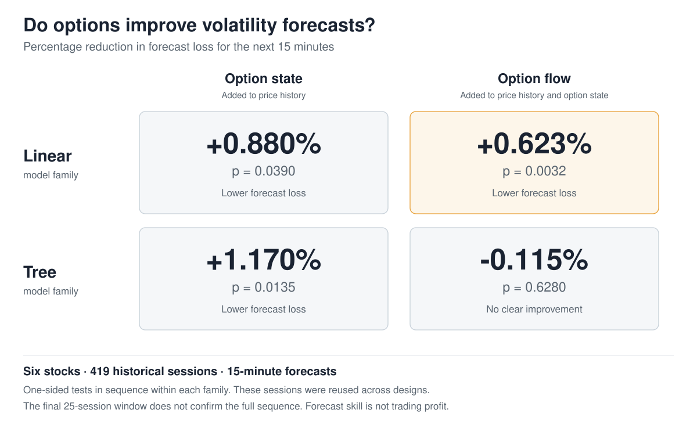
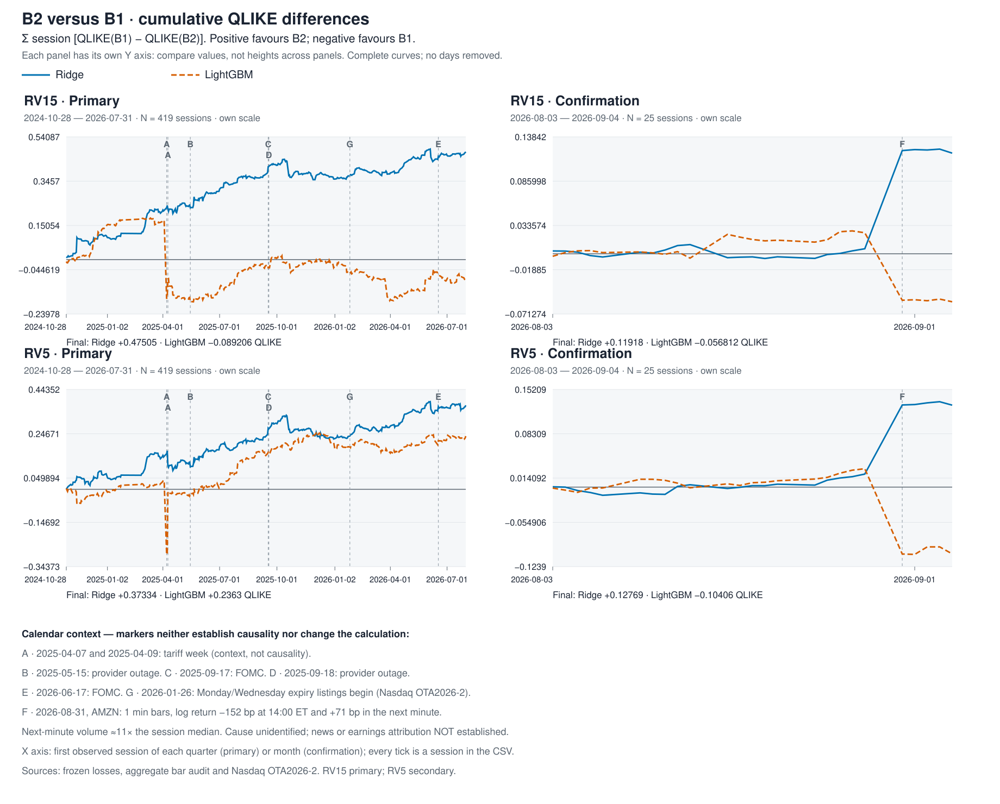
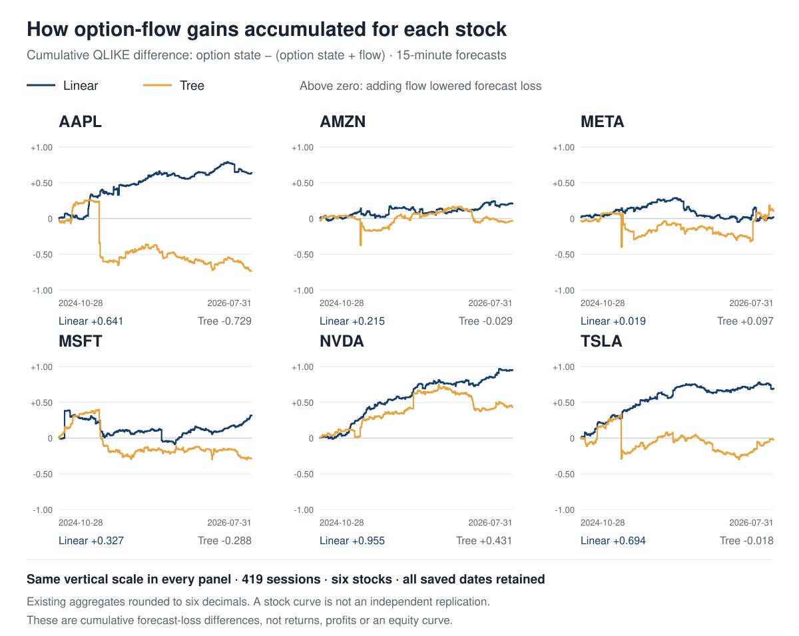

# Research walkthrough and historical record

Return to the [research overview](../README.md) for the concise conclusion.
This longer route preserves the study's chronology, comparisons and source links.
Read the [B2 interpretation boundary](B2_INTERPRETATION.md) alongside every use of
the shorthand “flow”: the block includes price changes, exposure proxies and
empty-window handling, not just trading activity.

**Does option-market information improve intraday realized-volatility forecasts, and does trade-derived option flow add predictive information beyond option state?**

Author: Miguel Guerrero · Master of Data Science research project, Sydney Polytechnic Institute, September 2026

## In one minute

**Status: CURRENT. Historical evidence: completed. Independent prospective confirmation: pending. Economic/trading value: not demonstrated. Causality: not established.**

- **What was studied:** six stocks, roughly two years of historical data and **160,832 matched forecast origins**, with three nested information sets and two model families. Evaluation follows time order, with rules written before each calculation; the historical sample was already known when the final design was fixed.
- **What was found:** option state improves both model families. Adding order flow gives a small improvement in the linear model at 15 minutes: **+0.62%** lower forecast loss, **p = 0.003**, with positive signs in **six of six assets**. The tree model does not improve, and no economic value is demonstrated. Exact estimates and uncertainty appear below.
- **What remains:** prospective replication under rules fixed in advance, with **20 new sessions**, a **40-session** stability check and a **335-session** final extension. These are registered future checks, not completed confirmation.
- **Timing limitation:** timely order flow is not demonstrated (placebo p = 0.255); most of the linear increment survives a within-asset-session flow shuffle. Linear flow gains at 60 / 120 / 300 seconds decrease to 1.447% / 0.623% / 0.194% (p = 0.0001 / 0.0032 / 0.1948); the less conservative 60-second assumption does not strengthen the registered finding. [Completed robustness evidence and interpretation](../docs/CURRENT.md).

**Historical development evidence. This is the fourth evaluation of overlapping historical data. Cross-version research search is not multiplicity-adjusted. Independent prospective confirmation is pending.**

160,832 forecast origins are not 160,832 independent statistical observations: **160,832 origins → 2,514 asset-sessions → 419 calendar sessions → session-aware block-bootstrap inference**. The six stocks are correlated, not six independent replications.

Read the [current scientific evidence](../docs/CURRENT.md) for the concise result, adverse evidence and next test.

**Choose your route:** [2-minute overview](#in-one-minute) · [Scientific result](../docs/CURRENT.md) · [Methodology](../docs/rp4/specification_v4.md) · [Reproduce / inspect](../docs/reproduce.md) · [Full audit trail](../docs/EVIDENCE_MAP.md) · [Examiner questions](../docs/FAQ.md).



*Primary 15-minute results: percentage reduction in forecast loss, with the declared one-sided p-values.*
[PNG alternative](../docs/figures/public_refresh/result_matrix.png) · [Saved statistics](../artifacts/rp4_v4_b4/primary_statistics.csv).

[Glossary of labels and option-market terms](../docs/glossary.md) · [Visual glossary (PNG)](../docs/figures/public_refresh/glossary.png).

| What the project establishes | What it does not establish |
| --- | --- |
| Historical predictive comparison with chronological expanding walk-forward fitting | Independent prospective replication or universal market generalization |
| Point-in-time eligibility discipline using a source-time proxy | Historical client receipt or execution feasibility |
| Historical option-state improvement in both primary families | Causal dealer-hedging or informed-trading mechanisms |
| Historical linear-model incremental flow information at RV15 | Profitable strategy or transaction-cost-adjusted alpha |
| Preservation of failed and null versions | Six independent asset replications or an optimal horizon |
| Reporting of the completed 60 / 120 / 300-second timing sensitivity | Stability of the flow increment under conservative timing assumptions |

**OOS fitting ≠ prospective scientific design. Predictive information ≠ causality. Predictive information ≠ tradability. Statistical significance ≠ economic significance.**

<details>
<summary>Research history, data and method: inspect the supporting record</summary>

<a id="history-and-prospective-replication"></a>

## Research timeline

**July 2026 — define three questions.** The proposal dated **2026-07-26** asked whether option state improves on price history, whether trade-derived flow adds information beyond option state, and whether any improvement survives changes in assets, time segments, volatility regimes and timing assumptions. Its original target was 30-minute realized variance. The date is declared in the proposal, without an independent timestamp authenticating submission. [Proposal and delivery comparison](../docs/rp4/DEFENSE_PACKAGE/revision_2/correction_7/examiner_qa.md) · [Source extracts and original hashes](../docs/archive/rp4/DEFENSE_PACKAGE/revision_2/correction_4/proposal_source_extract.json).

**18 August 2026 — test what the data could establish.** Construction of point-in-time inputs required distinguishing exchange execution, provider creation and actual client receipt. The availability audit measured the observable clocks and their limits; an event timestamp alone could not establish that a forecaster had received the record. This discipline shaped the later conservative information cutoff. [Availability audit](../docs/rp2/block2_pit_ledger_v1.md) · [Dated measurement record](../artifacts/rp2_block2_pit/ledger.json).

**18–24 August 2026 — retain the validation nulls.** The earlier research program (RP2) ran on **2026-08-18–2026-08-19**. Favorable development results did not carry through validation across the tested families, and the economic checks found no usable value. A subsequent remeasurement corrected measurement defects rather than treating a favorable development result as confirmation. This established the need for a clearer separation of information sets, timing and evaluation. [Historical report and corrections](../docs/rp2/FINAL_REPORT.md) · [Execution provenance](../artifacts/rp2_block8_ladder/provenance.json) · [Remeasurement manifest](../artifacts/rp2_v3/rp2-v3-20260824-remeasure/run_manifest.json).

**30–31 August 2026 — examine a limited prospective bridge.** An exploratory 20-session prospective check was evaluated once, on 30 August, and produced mixed findings. The next day's documented sensitivity corrected the information clock; its audit found **no aggregation change**, and only **one of eight B1-inclusive primary cells** improved in forecast loss. These outcomes remain distinct from the later historical result and are not confirmatory. [Bridge report](../reports/phase8a_exploratory_bridge_addendum_v13.md) · [Evaluation record](../artifacts/phase8_bridge/result_20260830_v1.json) · [Correction record](../artifacts/phase8_bridge/materialized_remediation_20260831_v1.json).

**1–2 September 2026 — evaluate the corrected point-in-time design.** A corrected point-in-time evaluation was completed on 2 September 2026. It did not confirm a global forecasting advantage. An earlier run of the same design that did not reach evaluation is retained in the record. [Successor report](../docs/pit_v22_claims_and_limitations_v2.md) · [First-attempt record](../artifacts/target_blind_v22/successor_evaluation_run_v1.json) · [Successor execution](../artifacts/target_blind_v22/successor_evaluation_run_v2.json) · [Saved result](../artifacts/target_blind_v22/successor_evaluation_result_v2.json).

**7 September 2026 — register and repair the historical walk-forward study.** The intraday forecasting study presented here (RP4) went through four specifications, versions 1–4 (v1–v4). The first exposed extreme numerical failures in linear flow forecasts. The second changed coverage, model capacity and numerical stability while retaining the known provider gap. Both results remain visible. [First-version report](../docs/rp4/results_v1.md) · [First-version receipt](../artifacts/rp4_b4/receipt.json) · [Second-version report](../docs/rp4/results_v2.md) · [Second-version receipt](../artifacts/rp4_v2_b4/receipt.json).

**7–8 September 2026 — distinguish empty activity from unknown data.** The third specification added signed gamma imbalance and explicit empty-window handling: no qualifying trades is different from unavailable provider data. At the original 30-minute horizon, option state improved both families, but incremental flow did not pass the primary decision. Its registration followed already observed first- and second-version results. [Third-version report](../docs/rp4/results_v3.md) · [Empty-window registration](../artifacts/rp4_v3_a1_empty_window/receipt.json) · [Closeout receipt](../artifacts/rp4_v3_b4/receipt.json).

**8 September 2026 — complete the shorter-horizon comparison.** A conditional declaration dated the previous evening proposed that flow information might be short-lived. The fourth specification was fixed and hashed on **8 September 2026 (Australia/Sydney; 7 September UTC)** before its new model fits were run. It made 15 minutes primary and 5 minutes secondary, retaining the predictors and training rules. The linear flow result was favorable; the tree mean result and the final historical window did not confirm the full sequence. The recorded hashes establish the order of these documents; they do not independently prove that the design preceded knowledge of the historical sample. [Fourth-version report](../docs/rp4/results_v4.md) · [Conditional declaration](../docs/rp4/predeclaration_v4_text.md) · [Freeze manifest](../artifacts/rp4_v4_a1/freeze_manifest.json) · [Report receipt](../artifacts/rp4_v4_b4/receipt.json).

**8–9 September 2026 — close extensions and prepare new evidence.** Two registered exploratory extensions were complete by 9 September, Australia/Sydney: one compared five model families and combinations; the other added SPY and QQQ as forecast targets. Neither supplied an independent sample or replaced the fourth specification's headline. In parallel, the prospective rules were fixed and hashed on 8 September for future sessions. The next evidence must come from those registered reads, rather than another interpretation of the same history. [Five-family report](../docs/rp4/results_v5.md) · [Completion receipt](../artifacts/rp4_v5_run_a3_20260908/reports/5_control/receipt.json) · [Eight-asset report](../docs/rp4/results_universe_v1.md) · [Aggregate provenance](../artifacts/rp4_universe_public_v1/import_receipt.json) · [Prospective protocol](../docs/rp4/prospective_confirmation_v1.md) · [Registration receipt](../docs/rp4/prospective_confirmation_v1_receipt.json).

The timeline also includes a separately registered long-run study (RP3), whose estimated read date remains **2029-01-30**, not a completed read. [Long-run protocol](../docs/rp3/PREREGISTRATION.md) · [Seal manifest](../artifacts/rp3/frozen/freeze_manifest.json). The [scientific findings ledger](../docs/scientific_findings_ledger.md) relates these studies to one another.


*The sequence preserves nulls, technical corrections, changed specifications and prospective gates as distinct events.*
[PNG alternative](../docs/figures/public_refresh/programme_timeline.architecture.png).

<a id="question-and-data"></a>

## Data and point-in-time discipline

[Glossary of labels and option-market terms](../docs/glossary.md) · [PNG reference sheet](../docs/figures/public_refresh/glossary.png).

The six stocks are **AAPL, AMZN, META, MSFT, NVDA and TSLA**. Licensed one-minute bars come from FMP and options records from Unusual Whales. A third provider, Massive, was audited; its option-trade endpoint was not authorised and it does not feed the reported results. The primary source window spans **2024-08-02–2026-07-31**; after warm-up and eligibility checks, it supplies **419 evaluated sessions** and **160,832 forecast origins** in each of the second, third and fourth specifications (the first evaluated **418 sessions** and **92,261 origins**). The separate **25-session** final historical window ends on **2026-09-04**. [Coverage](../artifacts/rp4_v4_b4/coverage.csv) · [Registered windows](../artifacts/rp4_v4_a1/specification.json).

Availability uses a **120-second source-time proxy**. Records must satisfy the relevant clocks and quality rules before a forecast origin; later records are not treated as earlier information. This does not establish historical receipt by a trading client. The Unusual Whales gap **2025-01-25–2025-02-24** remains unfilled, and absence of a provider record is distinguished from a valid empty activity window. Licensed inputs remain in private storage; public aggregates and source hashes support inspection within that boundary. [Data access](../data/DATA_ACCESS.md) · [Availability limits](../docs/pit_v22_claims_and_limitations.md) · [Provider audit](../artifacts/provider_audit/2026-07-20/provider_audit_summary.md) · [Audit manifest](../artifacts/provider_audit/2026-07-20/provider_audit_manifest.json).


*Licensed observations and analytical panels remain private; the public record exposes aggregate evidence and its provenance.*
[PNG alternative](../docs/figures/data-pipeline.png).

## Method

The comparison adds information in three nested steps:

- **B0:** price and volatility history.
- **B1:** B0 + option state / implied-volatility surface.
- **B2:** B1 + trade-derived option flow, composition and imbalance information.

The sets contain 29, 69 and 138 predictors before family-specific indicators and asset effects. They are nested information sets, not necessarily independent economic feeds. The B2/B1 comparison tests for incremental predictive information beyond the implemented B1 representation. The baseline includes multiscale volatility and market context. [Proposal alignment and deviations](../docs/rp4/DEFENSE_PACKAGE/revision_2/correction_7/examiner_qa.md).


*Each comparison measures a whole-block increment on common forecast origins;
it does not isolate an economic mechanism or the contribution of each feature.*
[PNG alternative](../docs/figures/public_refresh/information_sets.png).

The two families are a winsorized ridge regression on log variance with rank filtering (the linear model) and a LightGBM tree model. Expanding chronological training uses **60 warm-up sessions**, the last **10 training sessions** for selection, **60-minute purge/embargo**, and a calendar partition at **2026-08-01**. Model selection and transformations use the permitted training data. The primary target is **15-minute realized variance**, with **5 minutes** secondary; the change from 30 minutes is disclosed and does not establish an optimal horizon.

**QLIKE** measures forecast loss. The **first test (H1)** asks whether option state improves B1 over B0; only a successful first test opens the **second test (H2)**, option flow improving B2 over B1. The rule uses a one-sided **5%** sequence within each family. Uncertainty comes from **9,999** circular bootstrap resamples of **five-session blocks**, retaining the dependence within sessions and the joint asset composition.


*Training and evaluation follow time order; only the future registered sample can provide prospective replication.*
[PNG alternative](../docs/figures/public_refresh/proposal_to_replication_readme.workflow.png) · [Full report](../docs/rp4/results_v4.md) · [Registered design](../docs/rp4/specification_v4.md) · [Decisions and deviations](../docs/research_decisions_current.md).

</details>

## Results

**Current primary historical result: RP4 v4, RV15.**

| Model family | First test: option state, B1/B0 | Second test: option flow, B2/B1 |
| --- | ---: | ---: |
| Linear | +0.880% (p = 0.0390) | +0.623% (p = 0.0032) |
| Trees | +1.170% (p = 0.0135) | −0.115% (p = 0.6280) |

Historical development evidence on overlapping data; cross-version research search is not multiplicity-adjusted. Independent prospective confirmation is pending. Option state improves both families; the incremental flow finding is model-dependent.

These p-values belong to the declared one-sided sequence. The linear flow difference has a positive **95% interval [0.000335; 0.001932]** in QLIKE units. Its **bilateral Holm-adjusted p = 0.0248** comes from a separate comparability analysis; it is not another adjustment to the one-sided sequence. [Saved statistics](../artifacts/rp4_v4_b4/primary_statistics.csv) · [Loss comparisons and uncertainty figure](../docs/figures/rp4/thesis_summary.svg).

**Stricter sensitivity:** bilateral Holm H1/H2 p-values are **0.0918 / 0.0248** for linear and **0.0447 / 0.8048** for LightGBM. Neither model family passes both sequential steps under this stricter bilateral Holm sensitivity. It does not replace the primary inference.

**Final historical window:** 25 sessions, 9,750 origins. Linear H1 p = **0.3908**; LightGBM H1 p = **0.0568**; both H2 gates are closed. Linear H2's nominal +1.997% (p = 0.1758) is not a formal rejection, and 97.54% of its gain falls on 31 August 2026. The final historical window did not confirm the complete registered sequence. [Evidence and interpretation](../docs/CURRENT.md).

<details>
<summary>Version timeline, secondary results and exploratory extensions</summary>

The table retains all four historical specifications. Realized variance is measured over **30, 15 and 5 minutes** (RV30, RV15 and RV5, respectively). Cells show **percentage QLIKE reduction (p)**; negative values mean worse forecasts. The first two specifications use bilateral Holm-adjusted p-values. The third and fourth use the one-sided sequence at **5% per family**, with the **second test opened only if the first rejects**. Cross-version search is not adjusted; **the fourth specification supplies the headline**.

| Version / target | Linear B1/B0 | Linear B2/B1 | Trees B1/B0 | Trees B2/B1 | Sessions |
| --- | ---: | ---: | ---: | ---: | ---: |
| v1 · RV30 | +0.290 % (1.0000) | numerical failure (retained in the CSV) | +1.204 % (0.4724) | −0.073 % (1.0000) | 418 |
| v2 · RV30 | +1.715 % (0.1842) | −8.714 % (0.3752) | +2.091 % (0.0264) | −0.063 % (0.8858) | 419 |
| v3 · RV30 | +1.729 % (0.0439) | +0.554 % (0.0525) | +2.091 % (0.0053) | −0.159 % (0.6631) | 419 |
| v4 · RV15, primary | +0.880 % (0.0390) | +0.623 % (0.0032) | +1.170 % (0.0135) | −0.115 % (0.6280) | 419 |
| v4 · RV5, secondary | +0.377 % (0.0092) | +0.256 % (0.0172) | +0.536 % (0.0608) | +0.160 % (not opened; nominal 0.1927) | 419 |

[All 40 comparison cells and source hashes](../artifacts/rp4_closeout_figures/comparison_v1_v4.csv). The first version's numerical failure is retained. Coverage and specification changed between versions; their differences do not isolate one repair's causal effect.



*Accumulated paired loss differences show when the linear and tree results gain or reverse.*
[PNG alternative](../docs/figures/rp4/v4_B2_over_B1_cumulative_v2.png).

Linear flow ends with a positive improvement in **six of six assets** at 15 minutes. That consistency does not make six correlated stocks six independent replications. At the secondary five-minute horizon, linear flow improves **0.256%**, with positive signs in **three of six assets**. Positive tree medians are also secondary and do not replace the primary mean test.



*The six asset paths retain local reversals and show the cross-sectional scope of the aggregate result.*
[PNG alternative](../docs/figures/public_refresh/cumulative_by_asset_rv15.png) · [Aggregate figure data and import receipt](../artifacts/rp4_readme_figures_v1/import_receipt.json) · [Stability checks](../artifacts/rp4_v4_b4/robustness.csv). The [detailed numerical argument](../docs/rp4/DEFENSE_PACKAGE/revision_2/correction_7/README.md) supports these figures.

**HAR and persistence references.** The price-history set includes heterogeneous autoregressive volatility features, but that is not a standalone benchmark comparison. Separate HAR and seasonal-persistence model rows were absent from the four-version comparison; they are present in the closed five-family extension, alongside ridge, Elastic Net and LightGBM. The distinction prevents treating a feature choice as proof of superiority over those reference models. [Benchmark rows and scope](../docs/rp4/results_v5.md).

**Five-family extension.** The closed registered model-combination extension, version 5 (v5), compares five families at 15 minutes on the same historical sessions. Its primary selector fails the first test (**p = 0.3594**), leaving the second unopened. After Holm adjustment across the two selector chains, the secondary ensemble passes the two-test chain (**p = 0.0498**) but not the stricter Bonferroni **×5** correction for the five historical versions (**p = 0.249**), so it remains a candidate for prospective testing, not a confirmed result. This correction does not cover all adaptive search. Its disclosed post hoc averaging analysis also reuses these sessions. [Exploratory extension](../docs/rp4/results_v5.md) · [Saved selector inference](../artifacts/rp4_v5_run_a3_20260908/reports/5_control/summary.json).

**Eight-asset extension.** Adding SPY/QQQ as targets gives linear state/flow improvements of **1.40% / 0.56%** (p = **0.0208 / 0.0093**). Trees fail the first test, so the joint claim across both families fails. It reuses the historical period and preserves the six-asset headline. Both extensions motivate further tests and supply no independent confirmation. [Closed eight-asset report](../docs/rp4/results_universe_v1.md) · [Saved aggregate results](../artifacts/rp4_universe_public_v1/primary_summary.json).

</details>

## Limits

The v4 design was frozen at **2026-09-07T16:37Z (8 September 2026, 02:37 Australia/Sydney)** before its fits but after earlier historical results and the historical sample were known. The [current evidence page](../docs/CURRENT.md) separates this specification history from prospective design.

This is the **fourth evaluation of reused historical windows**: the design was fixed on **8 September 2026 (Australia/Sydney; 7 September UTC)**, after the historical sample had been observed, so chronology within each fit does not make the design an unseen-data preregistration.<br>
The **final 25-session window does not confirm the full test sequence**, and prospective replication remains pending.<br>
The **120-second availability proxy** does not establish actual historical client receipt, while the gap in the source data remains unfilled.<br>
A small forecasting improvement establishes neither the dealer-hedging mechanism, economic alpha, profitability nor broader generalization.

[Findings](../docs/scientific_findings_ledger.md) · [Validity](../docs/threats_to_validity_matrix_v1.md).

## What would change the conclusion

A successful **registered prospective sequence on new sessions**, using the fixed primary linear model at 15 minutes, would support replication of the historical finding. An adverse or inconclusive result would remain part of the record rather than trigger a change of family, horizon or read rule. The plan distinguishes **20 new sessions**, a **40-session** stability check and the final **335-session** extension. [Prospective protocol](../docs/rp4/prospective_confirmation_v1.md) · [Final-look amendment](../docs/rp4/prospective_confirmation_v1_amendment_3.md) · [Calculations and seal](../docs/rp4/prospective_confirmation_v1_amendment_3_receipt.json).

The **335-session** target is a normal-approximation power plan for the option-flow test, not guaranteed success or **80% joint power for the first and second tests**. The earlier **537-session** validation-study plan concerned a different effect and does not contradict it. A secondary **45-session combination of 25 historical + 20 new** reuses known data and is not an independent replication. The separately registered long-run study retains its own gate and estimated **2029-01-30** read date. [Reconciliation and sources](../docs/scientific_findings_ledger.md) · [Secondary pooling rules and receipt](../docs/rp4/prospective_confirmation_v1_amendment_2_receipt.json) · [Long-run registration](../docs/rp3/PREREGISTRATION.md).

Evidence of practical value would additionally require observed client availability and an evaluation of a defined decision after costs. Neither follows from a positive forecast-loss difference.

## Reproduce

[](https://github.com/mguerrero896/does-option-flow-predict-volatility/actions/workflows/ci.yml)

From a clean clone, use Python **3.12** and `uv`. These three commands install the locked environment, configure the repository hook and run the public verification:

```sh
uv sync --frozen
git config --local core.hooksPath scripts/hooks
uv run --frozen python scripts/verify_public_projection.py --output-dir ../public-verification
```

Public aggregate CSVs support numerical cross-checks, figure regeneration and artifact-hash verification. Rebuilding feature panels or refitting the study requires licensed inputs and their recorded hashes. The [reproduction guide](../docs/reproduce.md) contains the checked figure commands and database catalog dry run; the [reproducibility contract](../docs/reproducibility_contract_v1.md) defines the boundaries. A public check is not a new scientific evaluation. Original and public-derivative hashes remain distinct where provenance redactions were necessary.

## Defects and corrections

Every documented defect has a recorded status, evidence and resolution or remaining scope in the [defects and resolutions register](../docs/known_defects_and_resolutions.md), with the historical record retained for inspection.

## Watch the project

The full technical walkthrough runs 29 minutes 12 seconds and complements the written evidence. It is not distributed in the repository; the [chapter guide](../docs/INDEX.md#video-chapter-guide) identifies the sections. A short 6–8 minute overview remains optional and has not been produced.

## Cite this work

Miguel Guerrero (2026). *Options Order Flow and Intraday Volatility*.
Master of Data Science research project, Sydney Polytechnic Institute.
Use [CITATION.cff](../CITATION.cff) and include the commit used when citing results.

Companion final report: *Can option trading improve short-term volatility forecasts? Comparing 15-minute forecasts for six U.S. stocks* — Miguel Antonio Guerrero Quijano, Sydney Polytechnic Institute, September 2026.

The [numbered reading route](../docs/INDEX.md) holds the detailed documentation.
[Contributing](../CONTRIBUTING.md) · [Development guide](../docs/DEVELOPER_GUIDE.md) · [Computational assistance](../docs/AI_ASSISTANCE_STATEMENT.md) · [Scripts](../scripts/README.md) · [Reports](../reports/INDEX.md) · [Database](../supabase/README.md) · [Issues](https://github.com/mguerrero896/does-option-flow-predict-volatility/issues) · [License](../LICENSE) · [Security](../SECURITY.md).

<details>
<summary>Historical bundle identity retained for audit</summary>

The bundle from the earlier validation study `rp2-v3-20260831-b1-spot-cutoff-remediation` retains scientific hash `033f2eb6be35e5db06aec2f9e01ef5f3379a8be68b0372087f24e40fa681bea4`. Its measurements are superseded and are not current claims. [Superseded measurements](../docs/rp2_v3/SUPERSEDED_RESULTS.md) · [Machine-readable state](../data/CANONICAL_STATE.json) · [Generated state](../STATUS.md).

</details>

Research only. Not investment advice. Capital deployment is not authorized.
