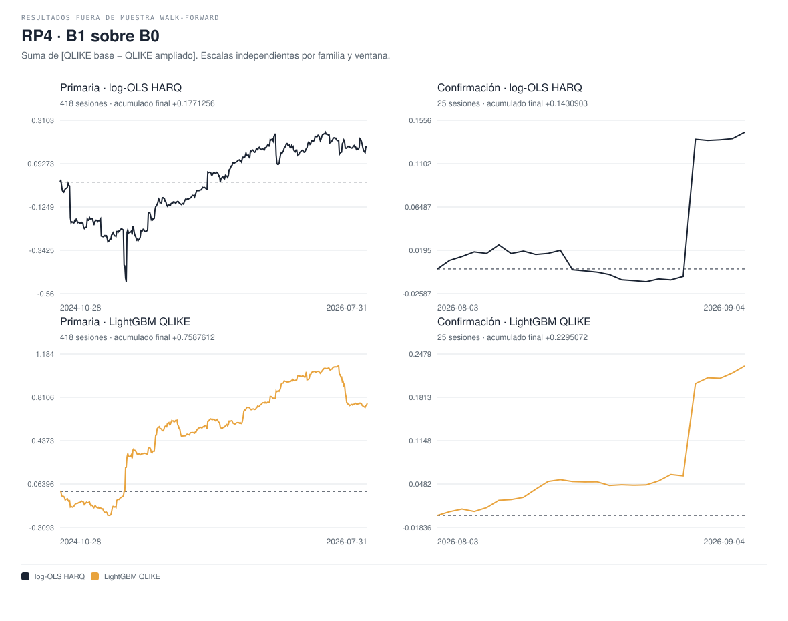
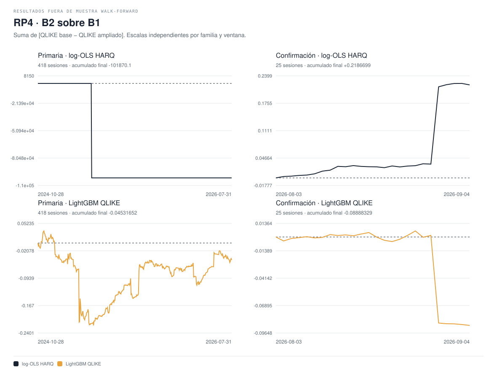

# RP4 — resultados v1

fuera de muestra walk-forward, partición fijada 2026-09-07.

RESEARCH_ONLY · NOT INVESTMENT ADVICE · capital_go=false.

Delta = QLIKE del conjunto base menos QLIKE del ampliado: positivo favorece al ampliado; negativo lo perjudica. Reducción (%) = 100 × delta / QLIKE base. Las medias dan igual peso a activos dentro de cada sesión y después a sesiones. Los intervalos son percentiles del bootstrap de bloques de 5 sesiones (9.999 réplicas); p bilateral centrado y Holm de cuatro contrastes por ventana.

## Primaria

Sesiones evaluadas: 418; orígenes: 92261; fechas: 2024-10-28 a 2026-07-31.

| Familia | Contraste | Estimación | IC 95 % | p crudo | p Holm | Reducción % | N sesiones | N orígenes | N activo-sesión |
| --- | --- | --- | --- | --- | --- | --- | --- | --- | --- |
| log-OLS HARQ | B1_over_B0 | +0.00042374551 | [-0.0016802447, 0.0023750514] | 0.6746 | 1 | +0.2903038 | 418 | 92261 | 2504 |
| log-OLS HARQ | B2_over_B1 | -243.70844 | [-731.12866, 0.0023546663] | 0.6095 | 1 | -167448.32 | 418 | 92261 | 2504 |
| LightGBM QLIKE | B1_over_B0 | +0.0018152183 | [-0.0003787914, 0.0041613972] | 0.1181 | 0.4724 | +1.2035977 | 418 | 92261 | 2504 |
| LightGBM QLIKE | B2_over_B1 | -0.00010841274 | [-0.0010017585, 0.00069008833] | 0.8002 | 1 | -0.072759829 | 418 | 92261 | 2504 |

### DM y GW por sesión

GW se informa como diagnóstico HAC asintótico, sin atribuirle la garantía del test original de memoria fija.

| Familia | Contraste | DM | p DM | GW | p GW |
| --- | --- | --- | --- | --- | --- |
| log-OLS HARQ | B1_over_B0 | 0.42722652 | 0.66921435 | 4.5900263 | 0.10076007 |
| log-OLS HARQ | B2_over_B1 | -1.0072838 | 0.31379843 | 1.1084049 | 0.5745303 |
| LightGBM QLIKE | B1_over_B0 | 1.5101564 | 0.13100351 | 4.8458257 | 0.08866298 |
| LightGBM QLIKE | B2_over_B1 | -0.2486833 | 0.80360577 | 0.05346222 | 0.973623 |

### Mincer–Zarnowitz

| Modelo / conjunto | Intercepto | Pendiente | p conjunto a=0, b=1 | N sesiones |
| --- | --- | --- | --- | --- |
| lightgbm_qlike__B0 | -7.2617476e-06 | 1.5076609 | 0.0017040353 | 418 |
| lightgbm_qlike__B1 | -6.6352291e-06 | 1.4580727 | 0.0045824013 | 418 |
| lightgbm_qlike__B2 | -7.3266521e-06 | 1.5049117 | 0.006483821 | 418 |
| log_ols_harq__B0 | -4.4856392e-07 | 1.0216779 | 0.82291213 | 418 |
| log_ols_harq__B1 | 4.6354795e-06 | 0.73359889 | 0.00046139363 | 418 |
| log_ols_harq__B2 | NO VERIFICABLE | NO VERIFICABLE | NO VERIFICABLE | NO VERIFICABLE |

### Secundarios predefinidos

| Subconjunto | Familia | Contraste | Delta | Reducción % | N sesiones | N orígenes |
| --- | --- | --- | --- | --- | --- | --- |
| first_hour | log-OLS HARQ | B1_over_B0 | +0.00075365738 | +0.76348146 | 418 | 7210 |
| first_hour | log-OLS HARQ | B2_over_B1 | +0.0010682114 | +1.0904613 | 418 | 7210 |
| first_hour | LightGBM QLIKE | B1_over_B0 | +0.0050238733 | +4.0223114 | 418 | 7210 |
| first_hour | LightGBM QLIKE | B2_over_B1 | -0.00041798461 | -0.34867998 | 418 | 7210 |
| high_flow | log-OLS HARQ | B1_over_B0 | +0.0018990594 | +1.2788339 | 392 | 41451 |
| high_flow | log-OLS HARQ | B2_over_B1 | -259.87401 | -177267.1 | 392 | 41451 |
| high_flow | LightGBM QLIKE | B1_over_B0 | +0.0009191675 | +0.608772 | 392 | 41451 |
| high_flow | LightGBM QLIKE | B2_over_B1 | +0.00061931429 | +0.41268915 | 392 | 41451 |
| event | log-OLS HARQ | B1_over_B0 | +0.0033650591 | +1.8332001 | 56 | 9506 |
| event | log-OLS HARQ | B2_over_B1 | +0.0004337262 | +0.24069562 | 56 | 9506 |
| event | LightGBM QLIKE | B1_over_B0 | +0.00077609892 | +0.45322262 | 56 | 9506 |
| event | LightGBM QLIKE | B2_over_B1 | -0.0011638527 | -0.68275566 | 56 | 9506 |

| Subconjunto | Cobertura | Membresía verificada | Membresía desconocida |
| --- | --- | --- | --- |
| first_hour | COMPLETE_COVERAGE | 92261 | 0 |
| high_flow | PARTIAL_COVERAGE | 91926 | 335 |
| event | COMPLETE_COVERAGE | 92261 | 0 |

### Estabilidad: todos los signos

| Subconjunto | Familia | B1 sobre B0 | B2 sobre B1 |
| --- | --- | --- | --- |
| asset_AAPL | log-OLS HARQ | +0.0019582353 | +0.00079848383 |
| asset_AAPL | LightGBM QLIKE | +0.00060875049 | -0.00043750776 |
| asset_AMZN | log-OLS HARQ | +0.0023314741 | +0.0006013408 |
| asset_AMZN | LightGBM QLIKE | +0.0019563691 | +0.00049508255 |
| asset_META | log-OLS HARQ | +0.00071433683 | +0.00088156886 |
| asset_META | LightGBM QLIKE | +0.0019152985 | -0.0014261402 |
| asset_MSFT | log-OLS HARQ | -0.0039902478 | -224.11478 |
| asset_MSFT | LightGBM QLIKE | -0.00076977472 | +0.00096226109 |
| asset_NVDA | log-OLS HARQ | +0.00070211286 | +0.00042365826 |
| asset_NVDA | LightGBM QLIKE | +0.0028709658 | +0.00057554061 |
| asset_TSLA | log-OLS HARQ | +0.0007503384 | -1238.6748 |
| asset_TSLA | LightGBM QLIKE | +0.0042515558 | -0.00083863123 |
| last30sessions | log-OLS HARQ | +0.00017386525 | -0.0012632342 |
| last30sessions | LightGBM QLIKE | -0.0029803133 | -0.00050083923 |
| chronological_block_1 | log-OLS HARQ | -0.00056378463 | -732.88049 |
| chronological_block_1 | LightGBM QLIKE | +0.0037670774 | -0.0013878858 |
| leave_block_1_out | log-OLS HARQ | +0.00091574081 | +0.00092579401 |
| leave_block_1_out | LightGBM QLIKE | +0.00084278671 | +0.00052903081 |
| chronological_block_2 | log-OLS HARQ | +0.0017263701 | +0.00023456025 |
| chronological_block_2 | LightGBM QLIKE | +0.0017098208 | +0.00094110476 |
| leave_block_2_out | log-OLS HARQ | -0.00022523232 | -365.12603 |
| leave_block_2_out | LightGBM QLIKE | +0.0018677281 | -0.00063129063 |
| chronological_block_3 | log-OLS HARQ | +0.00011090175 | +0.0016120904 |
| chronological_block_3 | LightGBM QLIKE | -1.8054314e-05 | +0.00011990025 |
| leave_block_3_out | log-OLS HARQ | +0.00058129273 | -366.44013 |
| leave_block_3_out | LightGBM QLIKE | +0.0027384491 | -0.0002233905 |

### Exclusiones de calidad

Los conteos de motivos se solapan; no deben sumarse como exclusiones disjuntas.

| Activo | Programados | Elegibles | Objetivo inválido | Predictor obligatorio incompleto | Gate fallido |
| --- | --- | --- | --- | --- | --- |
| AAPL | 27055 | 13759 | 7 | 13296 | 0 |
| AMZN | 27055 | 14426 | 0 | 12629 | 0 |
| META | 27054 | 11715 | 0 | 15339 | 0 |
| MSFT | 27055 | 10123 | 0 | 16932 | 0 |
| NVDA | 27055 | 21560 | 0 | 5495 | 0 |
| TSLA | 27055 | 20678 | 7 | 6371 | 0 |

Sesiones omitidas: 2025-10-20: no eligible origins.

## Confirmación

Sesiones evaluadas: 25; orígenes: 5360; fechas: 2026-08-03 a 2026-09-04.

| Familia | Contraste | Estimación | IC 95 % | p crudo | p Holm | Reducción % | N sesiones | N orígenes | N activo-sesión |
| --- | --- | --- | --- | --- | --- | --- | --- | --- | --- |
| log-OLS HARQ | B1_over_B0 | +0.0057236107 | [-0.0023060234, 0.017995993] | 0.3585 | 0.647 | +2.6647328 | 25 | 5360 | 150 |
| log-OLS HARQ | B2_over_B1 | +0.0087467944 | [0.00055846115, 0.023447609] | 0.0586 | 0.2312 | +4.1837168 | 25 | 5360 | 150 |
| LightGBM QLIKE | B1_over_B0 | +0.0091802888 | [0.0016390168, 0.021021638] | 0.0578 | 0.2312 | +4.4712598 | 25 | 5360 | 150 |
| LightGBM QLIKE | B2_over_B1 | -0.0035553314 | [-0.010764728, 0.00047970784] | 0.3235 | 0.647 | -1.8126736 | 25 | 5360 | 150 |

### DM y GW por sesión

GW se informa como diagnóstico HAC asintótico, sin atribuirle la garantía del test original de memoria fija.

| Familia | Contraste | DM | p DM | GW | p GW |
| --- | --- | --- | --- | --- | --- |
| log-OLS HARQ | B1_over_B0 | 1.0422386 | 0.29730106 | 1.3692624 | 0.50427618 |
| log-OLS HARQ | B2_over_B1 | 1.388333 | 0.16503567 | 1.9512562 | 0.37695551 |
| LightGBM QLIKE | B1_over_B0 | 1.7681996 | 0.077027546 | 3.206488 | 0.20124262 |
| LightGBM QLIKE | B2_over_B1 | -1.1529986 | 0.24891096 | 1.2433244 | 0.537051 |

### Mincer–Zarnowitz

| Modelo / conjunto | Intercepto | Pendiente | p conjunto a=0, b=1 | N sesiones |
| --- | --- | --- | --- | --- |
| lightgbm_qlike__B0 | 1.5871667e-06 | 0.82525579 | 0.11172178 | 25 |
| lightgbm_qlike__B1 | 8.2640971e-07 | 0.90287691 | 0.49139998 | 25 |
| lightgbm_qlike__B2 | 4.9245303e-07 | 0.92340393 | 0.35545617 | 25 |
| log_ols_harq__B0 | 2.6000688e-06 | 0.73283808 | 0.0021319866 | 25 |
| log_ols_harq__B1 | 2.6864246e-06 | 0.74283825 | 0.0011813859 | 25 |
| log_ols_harq__B2 | 2.5150732e-06 | 0.7620392 | 0.00017158109 | 25 |

### Secundarios predefinidos

| Subconjunto | Familia | Contraste | Delta | Reducción % | N sesiones | N orígenes |
| --- | --- | --- | --- | --- | --- | --- |
| first_hour | log-OLS HARQ | B1_over_B0 | +0.0017160616 | +1.6687369 | 25 | 408 |
| first_hour | log-OLS HARQ | B2_over_B1 | +0.00024894855 | +0.24619144 | 25 | 408 |
| first_hour | LightGBM QLIKE | B1_over_B0 | +0.00011298083 | +0.10966923 | 25 | 408 |
| first_hour | LightGBM QLIKE | B2_over_B1 | -8.1364921e-05 | -0.079066734 | 25 | 408 |
| high_flow | log-OLS HARQ | B1_over_B0 | +0.0079798261 | +3.3378847 | 24 | 2081 |
| high_flow | log-OLS HARQ | B2_over_B1 | +0.011480409 | +4.96797 | 24 | 2081 |
| high_flow | LightGBM QLIKE | B1_over_B0 | +0.010888073 | +4.786155 | 24 | 2081 |
| high_flow | LightGBM QLIKE | B2_over_B1 | -0.0047166753 | -2.1775675 | 24 | 2081 |
| event | log-OLS HARQ | B1_over_B0 | -0.0045628929 | -5.4406387 | 2 | 320 |
| event | log-OLS HARQ | B2_over_B1 | +0.00077100468 | +0.87188377 | 2 | 320 |
| event | LightGBM QLIKE | B1_over_B0 | +0.00013542991 | +0.17440118 | 2 | 320 |
| event | LightGBM QLIKE | B2_over_B1 | -0.0019971607 | -2.5763562 | 2 | 320 |

| Subconjunto | Cobertura | Membresía verificada | Membresía desconocida |
| --- | --- | --- | --- |
| first_hour | COMPLETE_COVERAGE | 5360 | 0 |
| high_flow | COMPLETE_COVERAGE | 5360 | 0 |
| event | COMPLETE_COVERAGE | 5360 | 0 |

### Estabilidad: todos los signos

| Subconjunto | Familia | B1 sobre B0 | B2 sobre B1 |
| --- | --- | --- | --- |
| asset_AAPL | log-OLS HARQ | +0.0024106172 | +0.001559874 |
| asset_AAPL | LightGBM QLIKE | +0.0036323937 | +0.00038265771 |
| asset_AMZN | log-OLS HARQ | +0.034145065 | +0.044714974 |
| asset_AMZN | LightGBM QLIKE | +0.040195064 | -0.021901079 |
| asset_META | log-OLS HARQ | +0.00050713696 | +0.004060844 |
| asset_META | LightGBM QLIKE | +0.0065526172 | -0.00017970653 |
| asset_MSFT | log-OLS HARQ | -0.00040026436 | +0.0043624195 |
| asset_MSFT | LightGBM QLIKE | +0.00018821426 | +0.00054164231 |
| asset_NVDA | log-OLS HARQ | +0.0021881837 | -0.00057658172 |
| asset_NVDA | LightGBM QLIKE | +0.003527776 | -0.00084614461 |
| asset_TSLA | log-OLS HARQ | -0.0045090742 | -0.0016407636 |
| asset_TSLA | LightGBM QLIKE | +0.00098566754 | +0.00067064143 |
| last30sessions | log-OLS HARQ | +0.0057236107 | +0.0087467944 |
| last30sessions | LightGBM QLIKE | +0.0091802888 | -0.0035553314 |
| chronological_block_1 | log-OLS HARQ | +0.0018960934 | +0.0033928287 |
| chronological_block_1 | LightGBM QLIKE | +0.005035718 | +0.0001833476 |
| leave_block_1_out | log-OLS HARQ | +0.0075247953 | +0.011266308 |
| leave_block_1_out | LightGBM QLIKE | +0.011130675 | -0.0053147098 |
| chronological_block_2 | log-OLS HARQ | -0.0034264891 | -0.00016663992 |
| chronological_block_2 | LightGBM QLIKE | +0.00076150186 | -0.00046376901 |
| leave_block_2_out | log-OLS HARQ | +0.01002954 | +0.012941352 |
| leave_block_2_out | LightGBM QLIKE | +0.013142071 | -0.0050101843 |
| chronological_block_3 | log-OLS HARQ | +0.01725927 | +0.021428928 |
| chronological_block_3 | LightGBM QLIKE | +0.020347718 | -0.0096266571 |
| leave_block_3_out | log-OLS HARQ | -0.00076519781 | +0.0016130944 |
| leave_block_3_out | LightGBM QLIKE | +0.0028986099 | -0.0001402107 |

### Exclusiones de calidad

Los conteos de motivos se solapan; no deben sumarse como exclusiones disjuntas.

| Activo | Programados | Elegibles | Objetivo inválido | Predictor obligatorio incompleto | Gate fallido |
| --- | --- | --- | --- | --- | --- |
| AAPL | 1625 | 740 | 0 | 885 | 0 |
| AMZN | 1625 | 875 | 0 | 750 | 0 |
| META | 1625 | 638 | 0 | 987 | 0 |
| MSFT | 1625 | 772 | 0 | 853 | 0 |
| NVDA | 1625 | 1249 | 0 | 376 | 0 |
| TSLA | 1625 | 1086 | 0 | 539 | 0 |

Sesiones omitidas: ninguna.

## Evolución de pérdidas

Cada figura muestra ambas familias y ambas ventanas, sin eliminar sesiones adversas.

## Divulgación

La ventana 20 de julio a 28 de agosto fue leída una vez por el puente de Fase 8 con otra especificación. El PIT es proxy de tiempo fuente a 120 s, como en la literatura.

La lectura previa se atribuye al propietario y al protocolo del puente; no se presenta created_at como prueba de recepción por el cliente. Hueco aceptado de UW: 2025-01-25 a 2025-02-24, sin relleno. La convención call largo / put corto y el OI del cierre previo no identifican posiciones observadas de dealers.

Limitación: la exposición previa no desaparece al fijar la partición, el tiempo fuente y el posicionamiento son proxies, y la inferencia depende de supuestos de dependencia y aproximaciones asintóticas/bootstrap.

## Lectura del resultado completo

La ejecución RP4 está terminada; la jerarquía global robusta no queda
demostrada. En la primaria B1 mejora en promedio en ambas familias, pero B2
empeora en ambas. En confirmación log-OLS muestra B2 > B1 > B0 en promedio
(+2,6647 % y +4,1837 % de reducción incremental de QLIKE); LightGBM mejora
con B1 (+4,4713 %) y empeora al añadir B2 (-1,8127 %). Ninguno de los ocho
contrastes de las dos tablas tiene p Holm inferior a 0,05.

La estabilidad tampoco es uniforme: en confirmación el segundo bloque
temporal es negativo para ambos incrementos log-OLS, y B1 log-OLS pasa a
-0,00076519781 al retirar el tercer bloque. B2 LightGBM es negativo al
retirar cualquiera de los tres bloques. Tener más información disponible
no garantiza que el estimador extraiga una mejora estable de ella.

En la primaria, el 2025-05-15 aporta el 99,94095565 % de la suma de pérdidas
QLIKE por sesión de B2 log-OLS. Dos pronósticos, en MSFT y TSLA, alcanzan el
suelo fijado de 1e-12. El diagnóstico reproduce por activo la pérdida
agregada a partir de los pronósticos guardados. La sesión permanece en todas
las cifras primarias; no hubo reajuste ni cambio de suelo. Los metadatos de
rango del ajuste no bastan para atribuir causalmente el extremo a una
variable concreta. Evidencia: [diagnóstico](../../../../../artifacts/rp4_b2/tail_diagnostic.json).

Los intervalos percentiles y los p bilaterales centrados no son inversiones
del mismo test. Su asimetría explica que en dos contrastes de confirmación
el IC percentil excluya cero mientras el p crudo supere 0,05. Ambos se
reportan tal como fueron especificados; los p Holm de esa ventana son
0,2312 o 0,6470. El secundario de eventos de confirmación tiene solo dos
sesiones: se informa su media, no una confirmación inferencial adicional.

## Datos y cobertura realmente ejecutados

Los archivos registrados y sus columnas exactas permanecen en el
[inventario aceptado](../../artifacts/rp4_inventory_v1/REPORT.md).
La [especificación](specification_v1.md) fija conjuntos anidados de 29,
71 y 136 predictores, más intercepto y contrastes de activo comunes.
Las 25 celdas admiten NaN; las demás variables son obligatorias. Los
diagnósticos de calidad, antigüedad y latencia no se usan como predictores.

A2 contiene 185.729 orígenes y 479 sesiones: 181.829 orígenes registrados
más 3.900 reconstruidos del 20 al 31 de julio. Hay 185.715 RV30 finitos;
14 ventanas se excluyen por falta de barras observadas (siete AAPL y siete
TSLA). De los 83.509 cruces con objetivos registrados, 83.502 conservan
pares finitos tras ese control y coinciden exactamente, diferencia máxima
y media cero. No se rellenaron ventanas del objetivo ni el hueco UW.

El RV30 reutiliza la indexación de barras de rp2_block3. Con barras rotuladas
al comienzo, la última barra usada termina un minuto después de la etiqueta
nominal de target_end; las particiones por sesión y el embargo de 60 minutos
separan holgadamente ese minuto. No se cambió el objetivo para mejorar
resultados. Las comparaciones son por asset, session_date y origin_minute.

La cobertura ATM 8–30 días de A2 es 99,7577–99,7836 %, no el 100 % declarado
inicialmente. La mínima ala extrema con vencimiento ≥8 días es 82,86868 %.
En la extensión de 25 sesiones, esas cifras son 100 % y 93,84615 %,
respectivamente. Todas las celdas se conservan, incluidas las poco pobladas:
[cobertura A2](../../../../../artifacts/rp4_a2/coverage.csv) y
[cobertura de extensión](../../../../../artifacts/rp4_b1/coverage.csv).

B1 cerró 331 trabajos: 280 activo-sesiones FMP, 25 sesiones UW, 11 copias
phase9, seis dividendos, seis earnings, dos años Treasury y un calendario
FOMC. Faltantes finales: cero. Se revalidaron los 54 archivos originales de
phase9 por hash sin modificarlos. La extensión añade 9.750 RV30 finitos,
sin bloques activo-sesión excluidos en materialización. Tras aplicar la
misma máscara de predictores a las seis celdas de evaluación, quedan 5.360
orígenes en confirmación, 54,9744 % de esos 9.750. Las exclusiones no se
confunden con descargas faltantes ni se resuelven con imputación no registrada.

El panel completo tiene 195.479 filas. Se comprobó igualdad exacta, por
claves y también tras releer el parquet, de las 185.729 filas de desarrollo
antes y después de la unión. Las nuevas respuestas de dividendos produjeron
cero diferencias de tasa/caja histórica en el desarrollo comparado. Las
griegas nuevas usan tasas y dividendos reales; las columnas griegas antiguas
del B2 registrado conservan su convención histórica r=q=0, divulgada en A1.

## Trazabilidad y etapas

| Etapa | Cierre verificado | Commit |
| --- | --- | --- |
| INIT | Rama desde origin/main; decisión 128, inventario y estado generado | 0d98e79a |
| A1 | Especificación y decisión 129 antes de evaluar | 9748d246 |
| A2 | Materialización de desarrollo y comparación RV30 | 643b5226 |
| B1 | Entradas completas y prueba de unión inmutable | fdd12c5e |
| B2 | 418 sesiones primarias, salida 0 | 71a491b3 |
| B3 | 25 sesiones de confirmación, salida 0 | 852d6133 |

Los comandos exactos, códigos observados y hashes por etapa están en
[A1](../../../../../artifacts/rp4_a1), [A2](../../../../../artifacts/rp4_a2/receipt.json),
[B1](../../../../../artifacts/rp4_b1/receipt.json),
[B2](../../../../../artifacts/rp4_b2/receipt.json) y
[B3](../../../../../artifacts/rp4_b3/receipt.json). Los códigos de salida originales
perdidos por transporte de algunos trabajadores A2 siguen como NO VERIFICABLE;
los manifiestos, hashes y comando de unión posteriores sí fueron comprobados.
El PASS de software no equivale a significación estadística.

| Artefacto | SHA-256 |
| --- | --- |
| Especificación Markdown | 24a0fe96ba917bf284cbc0eda3f64f7ab3f41ede665f7021a9be20bdbeebd03d |
| Especificación JSON | 865865558087108356f4eb6da7f9d431f1c4d32fd330f20ea78eb126ec6462a5 |
| Panel de desarrollo A2 | 51f04c5937a7922757f929ef0ca53941b7766719cf2799673669f8545f97a949 |
| Panel completo B1 | ecb1c6cce76cb6464d3cdf3d4ef409c60e204adf2df22fba6851e32199819d93 |
| Evaluador, ambas ventanas | 0064e37bebb00a0fb2550682e0c5590d64f16d88b2dfd9a4403b9ea82946ff14 |
| Resultado primario | d311d2773ae195968a59cea7d4e0c68dcf35d5d80e005c6cc0f1e028496d2eb2 |
| Resultado de confirmación | 76816cf06a6483c009f9f148728c02ee39d065e7926fbf44dd80fa27dbf29ad7 |

Los CSV del evaluador contienen finales CRLF; se preservan byte a byte con
atributos Git `-text`, en lugar de cambiar un artefacto ya calculado. El
control de espacios de Git usa `cr-at-eol` para reconocer esos finales como
terminadores. Los ZIP de historial B1 contienen únicamente versiones de
código; los datos licenciados y pronósticos por origen permanecen privados.
El cierre B4 registra la verificación final del informe, figuras y bytes Git.

## Operación diaria activada

Nombre: **RP4 colección diaria**. Activa martes a sábado a las 09:10,
Australia/Sydney, con raíz nueva RP4. La aplicación admite un solo seguimiento
por tarea: se actualizó el seguimiento de esta tarea, conservando su ID
interno y una copia de la configuración anterior. El recolector K3 separado
no fue modificado, y phase9 permanece intacto.

El modo diario se ejecutó ahora sobre la última sesión cerrada, 2026-09-04:
24 trabajos PASS, faltantes cero, salida 0. Reutilizó los archivos recibidos
por hash. Manifiesto SHA-256:
`270d3b92cb2bad3914f942efe2c66c7afbe1da91f1bcdc0c26f4ae76e081eaa2`.
Esto verifica el comando de colección; no acredita de antemano una futura
activación del planificador con el equipo apagado o sin acceso al proveedor.

La colección añade barras y tape; no reajusta modelos ni reescribe este
informe. Los snapshots exógenos v1 quedan preservados y una extensión
analítica posterior deberá vincular los exógenos correspondientes a sus
fechas. No hay publicación automática, operación con capital ni compra
adicional. El [runbook](operations_v1.md) contiene entorno y recuperación.
