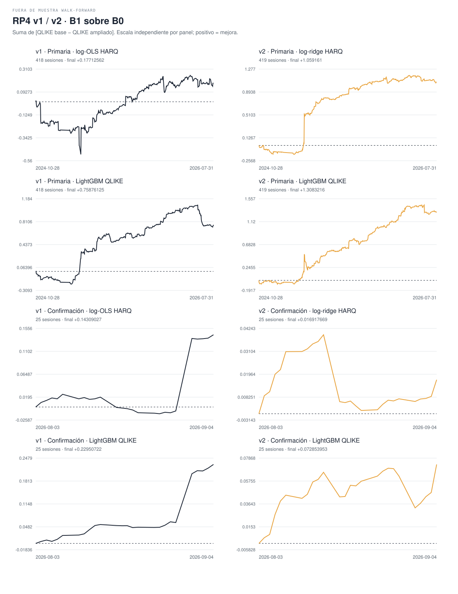
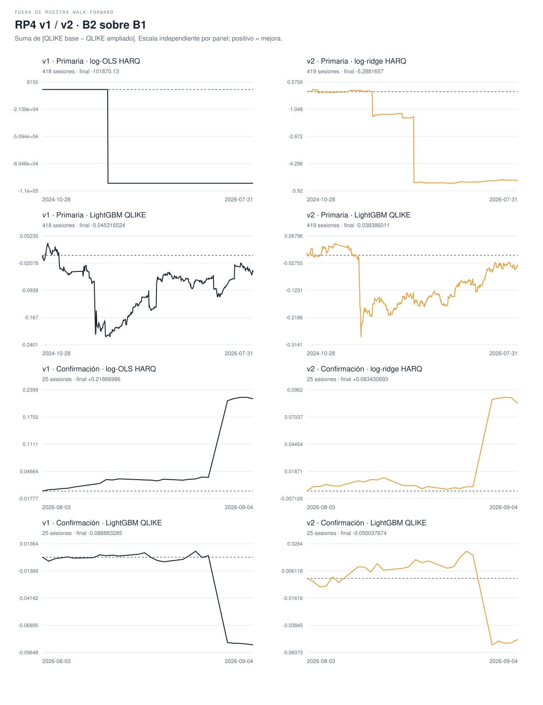

# RP4 — resultados v2 comparados con v1

fuera de muestra walk-forward, partición fijada 2026-09-07.

RESEARCH_ONLY · NOT INVESTMENT ADVICE · capital_go=false.

Delta = pérdida QLIKE base menos ampliada; positivo favorece al conjunto rico. Reducción % = 100 × delta / pérdida base. Se mantienen medias por activo-sesión y luego por sesión, bootstrap de cinco sesiones (9.999 réplicas), IC percentil 95% y p bilateral centrado; Holm corrige cuatro contrastes por ventana y versión.

La familia lineal cambia de log-OLS a log-ridge. Las muestras elegibles cambian por la nueva obligatoriedad: las diferencias entre versiones no aíslan un único cambio del modelo. No se reevalúa ni se sobrescribe v1.

Alto flujo conserva la definición de v1: el tercil superior por activo se calcula con la prima del día anterior y solo el entrenamiento elegible bajo la máscara v1 del panel original fijado por SHA-256, con el mismo embargo de 60 minutos. No se recalcula el umbral con la máscara ampliada de v2; los orígenes recuperados se clasifican contra ese mismo umbral. Por ello puede cambiar N sin cambiar la regla.

## Primaria

V2: 2/4 contrastes positivos; 1/4 con p Holm < 0,05. Esto no establece por sí solo una jerarquía global robusta.

| Familia | Contraste | v1 Delta | v1 IC95% | v1 p crudo | v1 p Holm | v1 Reducción % | v1 N sesiones | v1 N orígenes | v1 N activo-sesión | v2 Delta | v2 IC95% | v2 p crudo | v2 p Holm | v2 Reducción % | v2 N sesiones | v2 N orígenes | v2 N activo-sesión |
| --- | --- | --- | --- | --- | --- | --- | --- | --- | --- | --- | --- | --- | --- | --- | --- | --- | --- |
| Lineal: OLS v1 → ridge v2 | B1_over_B0 | +0.00042374551 | [-0.0016802447, 0.0023750514] | 0.6746 | 1 | +0.2903038 | 418 | 92261 | 2504 | +0.0025278305 | [0.00037254832, 0.005758785] | 0.0614 | 0.1842 | +1.7152838 | 419 | 160832 | 2514 |
| Lineal: OLS v1 → ridge v2 | B2_over_B1 | -243.70844 | [-731.12866, 0.0023546663] | 0.6095 | 1 | -167448.32 | 418 | 92261 | 2504 | -0.01262092 | [-0.035946654, 0.00092737479] | 0.1876 | 0.3752 | -8.7135086 | 419 | 160832 | 2514 |
| LightGBM QLIKE | B1_over_B0 | +0.0018152183 | [-0.0003787914, 0.0041613972] | 0.1181 | 0.4724 | +1.2035977 | 418 | 92261 | 2504 | +0.0031224859 | [0.0010149407, 0.0054860165] | 0.0066 | 0.0264 | +2.0911798 | 419 | 160832 | 2514 |
| LightGBM QLIKE | B2_over_B1 | -0.00010841274 | [-0.0010017585, 0.00069008833] | 0.8002 | 1 | -0.072759829 | 418 | 92261 | 2504 | -9.1613392e-05 | [-0.0014834878, 0.00095377847] | 0.8858 | 0.8858 | -0.06266543 | 419 | 160832 | 2514 |

### Cobertura efectiva por activo

| Activo | v1 programados | v1 elegibles | v1 % | v2 programados | v2 elegibles | v2 % |
| --- | --- | --- | --- | --- | --- | --- |
| AAPL | 27055 | 13759 | 50.855664 | 27055 | 26898 | 99.419701 |
| AMZN | 27055 | 14426 | 53.321013 | 27055 | 26743 | 98.846794 |
| META | 27054 | 11715 | 43.302284 | 27054 | 26853 | 99.257041 |
| MSFT | 27055 | 10123 | 37.416374 | 27055 | 26729 | 98.795047 |
| NVDA | 27055 | 21560 | 79.689521 | 27055 | 26764 | 98.924413 |
| TSLA | 27055 | 20678 | 76.429495 | 27055 | 26845 | 99.223803 |

Motivos de exclusión —se solapan, no deben sumarse—:

| Versión | Activo | RV30 inválido | Obligatorios incompletos | Gate |
| --- | --- | --- | --- | --- |
| v1 | AAPL | 7 | 13296 | 0 |
| v1 | AMZN | 0 | 12629 | 0 |
| v1 | META | 0 | 15339 | 0 |
| v1 | MSFT | 0 | 16932 | 0 |
| v1 | NVDA | 0 | 5495 | 0 |
| v1 | TSLA | 7 | 6371 | 0 |
| v2 | AAPL | 7 | 155 | 0 |
| v2 | AMZN | 0 | 312 | 0 |
| v2 | META | 0 | 201 | 0 |
| v2 | MSFT | 0 | 326 | 0 |
| v2 | NVDA | 0 | 291 | 0 |
| v2 | TSLA | 7 | 203 | 0 |

v1: 419 sesiones programadas, 418 ejecutadas; 2024-10-28 a 2026-07-31. Omitidas: 2025-10-20: no eligible origins. columna rp4_eligible ausente: se conservó el fallback de v1 (sin exclusión por esa compuerta opcional).

v2: 419 sesiones programadas, 419 ejecutadas; 2024-10-28 a 2026-07-31. Omitidas: ninguna. columna rp4_eligible ausente: se conservó el fallback de v1 (sin exclusión por esa compuerta opcional).

### DM, GW y Mincer–Zarnowitz

GW es el diagnóstico HAC asintótico de v1, no la garantía del test original con memoria fija. MZ utiliza medias de sesión en niveles.

| Versión | Familia | Contraste | DM | p DM | GW | p GW |
| --- | --- | --- | --- | --- | --- | --- |
| v1 | log-OLS HARQ | B1_over_B0 | 0.42722652 | 0.66921435 | 4.5900263 | 0.10076007 |
| v1 | log-OLS HARQ | B2_over_B1 | -1.0072838 | 0.31379843 | 1.1084049 | 0.5745303 |
| v1 | LightGBM QLIKE | B1_over_B0 | 1.5101564 | 0.13100351 | 4.8458257 | 0.08866298 |
| v1 | LightGBM QLIKE | B2_over_B1 | -0.2486833 | 0.80360577 | 0.05346222 | 0.973623 |
| v2 | log-ridge HARQ | B1_over_B0 | 1.7341751 | 0.082887023 | 7.3212178 | 0.025716849 |
| v2 | log-ridge HARQ | B2_over_B1 | -1.2831652 | 0.19943421 | 1.8349999 | 0.39951661 |
| v2 | LightGBM QLIKE | B1_over_B0 | 2.7433783 | 0.0060810588 | 9.0968775 | 0.010583715 |
| v2 | LightGBM QLIKE | B2_over_B1 | -0.14374826 | 0.88569926 | 1.2876884 | 0.5252693 |

| Versión | Modelo | Intercepto | Pendiente | p a=0,b=1 | N | Estado |
| --- | --- | --- | --- | --- | --- | --- |
| v1 | lightgbm_qlike__B0 | -7.2617476e-06 | 1.5076609 | 0.0017040353 | 418 | COMPUTED |
| v1 | lightgbm_qlike__B1 | -6.6352291e-06 | 1.4580727 | 0.0045824013 | 418 | COMPUTED |
| v1 | lightgbm_qlike__B2 | -7.3266521e-06 | 1.5049117 | 0.006483821 | 418 | COMPUTED |
| v1 | log_ols_harq__B0 | -4.4856392e-07 | 1.0216779 | 0.82291213 | 418 | COMPUTED |
| v1 | log_ols_harq__B1 | 4.6354795e-06 | 0.73359889 | 0.00046139363 | 418 | COMPUTED |
| v1 | log_ols_harq__B2 | NO VERIFICABLE | NO VERIFICABLE | NO VERIFICABLE | NO VERIFICABLE | NO VERIFICABLE: rank deficient MZ design |
| v2 | lightgbm_qlike__B0 | -7.9746042e-06 | 1.551595 | 0.026225248 | 419 | COMPUTED |
| v2 | lightgbm_qlike__B1 | -5.6817366e-06 | 1.4045448 | 0.03219629 | 419 | COMPUTED |
| v2 | lightgbm_qlike__B2 | -7.3943586e-06 | 1.5115656 | 0.043554088 | 419 | COMPUTED |
| v2 | log_ridge_harq__B0 | -5.7573017e-06 | 1.326939 | 4.3738577e-09 | 419 | COMPUTED |
| v2 | log_ridge_harq__B1 | -1.7997393e-06 | 1.0936633 | 0.059098247 | 419 | COMPUTED |
| v2 | log_ridge_harq__B2 | -4.3320198e-06 | 1.2295832 | 6.1654254e-06 | 419 | COMPUTED |

### Colas: secundarios descriptivos pareados

| Familia v2 | Contraste | v1 mediana Δ | v2 mediana Δ | v1 recortada | v2 recortada | v2 removidas por cola | N v2 |
| --- | --- | --- | --- | --- | --- | --- | --- |
| log-ridge HARQ | B1_over_B0 | +0.00085748199 | +0.00066878616 | +0.00065346225 | +0.0010767744 | 20 | 419 |
| log-ridge HARQ | B2_over_B1 | +0.0010561747 | +0.00092168077 | +0.0011516627 | +0.00094770171 | 20 | 419 |
| LightGBM QLIKE | B1_over_B0 | +0.0007370385 | +0.0019490061 | +0.00099011134 | +0.0021401286 | 20 | 419 |
| LightGBM QLIKE | B2_over_B1 | +0.0001261654 | +0.00057677504 | +0.0001409082 | +0.00036159549 | 20 | 419 |

Recorte simétrico: floor(0,05 N) por cola; no sustituye la media primaria. Mediana de diferencias no equivale a diferencia de medianas.

[Diez días de mayor pérdida por cada modelo de primaria, con valores y signos](../../../../../artifacts/rp4_v2_b4/top_loss_primary.csv). Se conserva el ranking de cada familia/conjunto, sin quitar los días adversos.

### Secundarios y estabilidad registrados

| Subconjunto | Familia | Contraste | Delta v2 | Reducción % | N sesiones | N orígenes | Estado |
| --- | --- | --- | --- | --- | --- | --- | --- |
| first_hour | log-ridge HARQ | B1_over_B0 | +0.0017968557 | +1.7481246 | 419 | 12451 | COMPLETE_COVERAGE |
| first_hour | log-ridge HARQ | B2_over_B1 | -0.011161764 | -11.052261 | 419 | 12451 | COMPLETE_COVERAGE |
| first_hour | LightGBM QLIKE | B1_over_B0 | +0.0022212899 | +1.8949834 | 419 | 12451 | COMPLETE_COVERAGE |
| first_hour | LightGBM QLIKE | B2_over_B1 | -0.0015477782 | -1.3459152 | 419 | 12451 | COMPLETE_COVERAGE |
| high_flow | log-ridge HARQ | B1_over_B0 | +0.0025151784 | +1.742732 | 393 | 75030 | PARTIAL_COVERAGE |
| high_flow | log-ridge HARQ | B2_over_B1 | -0.003316058 | -2.3384023 | 393 | 75030 | PARTIAL_COVERAGE |
| high_flow | LightGBM QLIKE | B1_over_B0 | +0.0040600903 | +2.767146 | 393 | 75030 | PARTIAL_COVERAGE |
| high_flow | LightGBM QLIKE | B2_over_B1 | -0.00029508704 | -0.2068395 | 393 | 75030 | PARTIAL_COVERAGE |
| event | log-ridge HARQ | B1_over_B0 | +0.0043875551 | +2.5273316 | 56 | 15047 | COMPLETE_COVERAGE |
| event | log-ridge HARQ | B2_over_B1 | +9.7672703e-05 | +0.057720488 | 56 | 15047 | COMPLETE_COVERAGE |
| event | LightGBM QLIKE | B1_over_B0 | -0.00020511884 | -0.12744919 | 56 | 15047 | COMPLETE_COVERAGE |
| event | LightGBM QLIKE | B2_over_B1 | -0.00011839846 | -0.07347244 | 56 | 15047 | COMPLETE_COVERAGE |

| Subconjunto | Familia | B1 sobre B0 v2 | B2 sobre B1 v2 |
| --- | --- | --- | --- |
| asset_AAPL | log-ridge HARQ | +0.0032166744 | -0.00075044739 |
| asset_AAPL | LightGBM QLIKE | +0.0022956157 | -0.00031805639 |
| asset_AMZN | log-ridge HARQ | +0.0037183464 | -0.0049274256 |
| asset_AMZN | LightGBM QLIKE | +0.0028413229 | +0.00044826141 |
| asset_META | log-ridge HARQ | +0.0029971272 | -0.0025465951 |
| asset_META | LightGBM QLIKE | +0.0033088929 | -0.00055577083 |
| asset_MSFT | log-ridge HARQ | +0.0018535222 | -0.0046268366 |
| asset_MSFT | LightGBM QLIKE | +0.0027085583 | -0.00054277446 |
| asset_NVDA | log-ridge HARQ | +0.0012602489 | -0.05387606 |
| asset_NVDA | LightGBM QLIKE | +0.002976642 | +0.0013968699 |
| asset_TSLA | log-ridge HARQ | +0.0021210641 | -0.0089981583 |
| asset_TSLA | LightGBM QLIKE | +0.0046038837 | -0.00097820995 |
| last30sessions | log-ridge HARQ | -0.00076569874 | -0.00027496106 |
| last30sessions | LightGBM QLIKE | +0.00040877274 | -0.00021383163 |
| chronological_block_1 | log-ridge HARQ | +0.005708163 | -0.009757584 |
| chronological_block_1 | LightGBM QLIKE | +0.0034004662 | -0.0012270462 |
| leave_block_1_out | log-ridge HARQ | +0.00094902262 | -0.014042362 |
| leave_block_1_out | LightGBM QLIKE | +0.0029844886 | +0.00047204791 |
| chronological_block_2 | log-ridge HARQ | +0.0020119144 | -0.029553322 |
| chronological_block_2 | LightGBM QLIKE | +0.0038847409 | +0.00023241638 |
| leave_block_2_out | log-ridge HARQ | +0.0027839461 | -0.0042151923 |
| leave_block_2_out | LightGBM QLIKE | +0.0027440807 | -0.00025247103 |
| chronological_block_3 | log-ridge HARQ | -9.8792662e-05 | +0.0012485838 |
| chronological_block_3 | LightGBM QLIKE | +0.0020970057 | +0.00070828042 |
| leave_block_3_out | log-ridge HARQ | +0.0038600387 | -0.019655453 |
| leave_block_3_out | LightGBM QLIKE | +0.0036426036 | -0.00049731493 |

## Confirmación

V2: 3/4 contrastes positivos; 0/4 con p Holm < 0,05. Esto no establece por sí solo una jerarquía global robusta.

| Familia | Contraste | v1 Delta | v1 IC95% | v1 p crudo | v1 p Holm | v1 Reducción % | v1 N sesiones | v1 N orígenes | v1 N activo-sesión | v2 Delta | v2 IC95% | v2 p crudo | v2 p Holm | v2 Reducción % | v2 N sesiones | v2 N orígenes | v2 N activo-sesión |
| --- | --- | --- | --- | --- | --- | --- | --- | --- | --- | --- | --- | --- | --- | --- | --- | --- | --- |
| Lineal: OLS v1 → ridge v2 | B1_over_B0 | +0.0057236107 | [-0.0023060234, 0.017995993] | 0.3585 | 0.647 | +2.6647328 | 25 | 5360 | 150 | +0.00067670677 | [-0.0029467222, 0.0037440418] | 0.7081 | 1 | +0.37644116 | 25 | 9750 | 150 |
| Lineal: OLS v1 → ridge v2 | B2_over_B1 | +0.0087467944 | [0.00055846115, 0.023447609] | 0.0586 | 0.2312 | +4.1837168 | 25 | 5360 | 150 | +0.0033372277 | [-0.00061599701, 0.010201394] | 0.341 | 1 | +1.8634613 | 25 | 9750 | 150 |
| LightGBM QLIKE | B1_over_B0 | +0.0091802888 | [0.0016390168, 0.021021638] | 0.0578 | 0.2312 | +4.4712598 | 25 | 5360 | 150 | +0.0029141581 | [-0.0016852924, 0.0074221881] | 0.2193 | 0.8772 | +1.6658018 | 25 | 9750 | 150 |
| LightGBM QLIKE | B2_over_B1 | -0.0035553314 | [-0.010764728, 0.00047970784] | 0.3235 | 0.647 | -1.8126736 | 25 | 5360 | 150 | -0.002001507 | [-0.0079928456, 0.0016425359] | 0.5665 | 1 | -1.1634902 | 25 | 9750 | 150 |

### Cobertura efectiva por activo

| Activo | v1 programados | v1 elegibles | v1 % | v2 programados | v2 elegibles | v2 % |
| --- | --- | --- | --- | --- | --- | --- |
| AAPL | 1625 | 740 | 45.538462 | 1625 | 1625 | 100 |
| AMZN | 1625 | 875 | 53.846154 | 1625 | 1625 | 100 |
| META | 1625 | 638 | 39.261538 | 1625 | 1625 | 100 |
| MSFT | 1625 | 772 | 47.507692 | 1625 | 1625 | 100 |
| NVDA | 1625 | 1249 | 76.861538 | 1625 | 1625 | 100 |
| TSLA | 1625 | 1086 | 66.830769 | 1625 | 1625 | 100 |

Motivos de exclusión —se solapan, no deben sumarse—:

| Versión | Activo | RV30 inválido | Obligatorios incompletos | Gate |
| --- | --- | --- | --- | --- |
| v1 | AAPL | 0 | 885 | 0 |
| v1 | AMZN | 0 | 750 | 0 |
| v1 | META | 0 | 987 | 0 |
| v1 | MSFT | 0 | 853 | 0 |
| v1 | NVDA | 0 | 376 | 0 |
| v1 | TSLA | 0 | 539 | 0 |
| v2 | AAPL | 0 | 0 | 0 |
| v2 | AMZN | 0 | 0 | 0 |
| v2 | META | 0 | 0 | 0 |
| v2 | MSFT | 0 | 0 | 0 |
| v2 | NVDA | 0 | 0 | 0 |
| v2 | TSLA | 0 | 0 | 0 |

v1: 25 sesiones programadas, 25 ejecutadas; 2026-08-03 a 2026-09-04. Omitidas: ninguna. columna rp4_eligible ausente: se conservó el fallback de v1 (sin exclusión por esa compuerta opcional).

v2: 25 sesiones programadas, 25 ejecutadas; 2026-08-03 a 2026-09-04. Omitidas: ninguna. columna rp4_eligible ausente: se conservó el fallback de v1 (sin exclusión por esa compuerta opcional).

### DM, GW y Mincer–Zarnowitz

GW es el diagnóstico HAC asintótico de v1, no la garantía del test original con memoria fija. MZ utiliza medias de sesión en niveles.

| Versión | Familia | Contraste | DM | p DM | GW | p GW |
| --- | --- | --- | --- | --- | --- | --- |
| v1 | log-OLS HARQ | B1_over_B0 | 1.0422386 | 0.29730106 | 1.3692624 | 0.50427618 |
| v1 | log-OLS HARQ | B2_over_B1 | 1.388333 | 0.16503567 | 1.9512562 | 0.37695551 |
| v1 | LightGBM QLIKE | B1_over_B0 | 1.7681996 | 0.077027546 | 3.206488 | 0.20124262 |
| v1 | LightGBM QLIKE | B2_over_B1 | -1.1529986 | 0.24891096 | 1.2433244 | 0.537051 |
| v2 | log-ridge HARQ | B1_over_B0 | 0.39878809 | 0.69004935 | 0.34536496 | 0.84140473 |
| v2 | log-ridge HARQ | B2_over_B1 | 1.13822 | 0.25502862 | 1.4118957 | 0.49364045 |
| v2 | LightGBM QLIKE | B1_over_B0 | 1.4041693 | 0.16026843 | 2.6635068 | 0.26401393 |
| v2 | LightGBM QLIKE | B2_over_B1 | -0.77617184 | 0.43764753 | 2.7600863 | 0.2515677 |

| Versión | Modelo | Intercepto | Pendiente | p a=0,b=1 | N | Estado |
| --- | --- | --- | --- | --- | --- | --- |
| v1 | lightgbm_qlike__B0 | 1.5871667e-06 | 0.82525579 | 0.11172178 | 25 | COMPUTED |
| v1 | lightgbm_qlike__B1 | 8.2640971e-07 | 0.90287691 | 0.49139998 | 25 | COMPUTED |
| v1 | lightgbm_qlike__B2 | 4.9245303e-07 | 0.92340393 | 0.35545617 | 25 | COMPUTED |
| v1 | log_ols_harq__B0 | 2.6000688e-06 | 0.73283808 | 0.0021319866 | 25 | COMPUTED |
| v1 | log_ols_harq__B1 | 2.6864246e-06 | 0.74283825 | 0.0011813859 | 25 | COMPUTED |
| v1 | log_ols_harq__B2 | 2.5150732e-06 | 0.7620392 | 0.00017158109 | 25 | COMPUTED |
| v2 | lightgbm_qlike__B0 | 2.4782695e-06 | 0.7542495 | 0.021933289 | 25 | COMPUTED |
| v2 | lightgbm_qlike__B1 | 2.1268504e-06 | 0.80076339 | 0.078533674 | 25 | COMPUTED |
| v2 | lightgbm_qlike__B2 | 1.8805187e-06 | 0.8112615 | 0.22111798 | 25 | COMPUTED |
| v2 | log_ridge_harq__B0 | 2.9407088e-06 | 0.69160813 | 8.9332146e-05 | 25 | COMPUTED |
| v2 | log_ridge_harq__B1 | 2.9522347e-06 | 0.70805544 | 3.1992607e-05 | 25 | COMPUTED |
| v2 | log_ridge_harq__B2 | 2.8703718e-06 | 0.7142593 | 2.0076956e-06 | 25 | COMPUTED |

### Colas: secundarios descriptivos pareados

| Familia v2 | Contraste | v1 mediana Δ | v2 mediana Δ | v1 recortada | v2 recortada | v2 removidas por cola | N v2 |
| --- | --- | --- | --- | --- | --- | --- | --- |
| log-ridge HARQ | B1_over_B0 | +0.00064988334 | +0.0012048094 | +0.00086440072 | +0.0017925753 | 1 | 25 |
| log-ridge HARQ | B2_over_B1 | +0.001636616 | +0.00011362152 | +0.001755479 | +0.00034101046 | 1 | 25 |
| LightGBM QLIKE | B1_over_B0 | +0.0034965265 | +0.004249739 | +0.0040575366 | +0.0033183909 | 1 | 25 |
| LightGBM QLIKE | B2_over_B1 | -0.00013616493 | +0.00049689441 | -0.00022932075 | +0.00046612945 | 1 | 25 |

Recorte simétrico: floor(0,05 N) por cola; no sustituye la media primaria. Mediana de diferencias no equivale a diferencia de medianas.

[Diez días de mayor pérdida por cada modelo de confirmación, con valores y signos](../../../../../artifacts/rp4_v2_b4/top_loss_confirmation.csv). Se conserva el ranking de cada familia/conjunto, sin quitar los días adversos.

### Secundarios y estabilidad registrados

| Subconjunto | Familia | Contraste | Delta v2 | Reducción % | N sesiones | N orígenes | Estado |
| --- | --- | --- | --- | --- | --- | --- | --- |
| first_hour | log-ridge HARQ | B1_over_B0 | +0.0020072794 | +1.9797665 | 25 | 750 | COMPLETE_COVERAGE |
| first_hour | log-ridge HARQ | B2_over_B1 | +2.2843247e-05 | +0.022985199 | 25 | 750 | COMPLETE_COVERAGE |
| first_hour | LightGBM QLIKE | B1_over_B0 | +0.0013680484 | +1.405036 | 25 | 750 | COMPLETE_COVERAGE |
| first_hour | LightGBM QLIKE | B2_over_B1 | -0.00082673317 | -0.86118531 | 25 | 750 | COMPLETE_COVERAGE |
| high_flow | log-ridge HARQ | B1_over_B0 | +0.0024484525 | +1.3237838 | 24 | 4095 | COMPLETE_COVERAGE |
| high_flow | log-ridge HARQ | B2_over_B1 | +0.0054727785 | +2.9986153 | 24 | 4095 | COMPLETE_COVERAGE |
| high_flow | LightGBM QLIKE | B1_over_B0 | +0.0038194385 | +2.1604724 | 24 | 4095 | COMPLETE_COVERAGE |
| high_flow | LightGBM QLIKE | B2_over_B1 | -0.0020801867 | -1.2026442 | 24 | 4095 | COMPLETE_COVERAGE |
| event | log-ridge HARQ | B1_over_B0 | -0.0062317032 | -7.4036293 | 2 | 455 | COMPLETE_COVERAGE |
| event | log-ridge HARQ | B2_over_B1 | -0.0011478894 | -1.2697523 | 2 | 455 | COMPLETE_COVERAGE |
| event | LightGBM QLIKE | B1_over_B0 | +0.0032313511 | +4.1985085 | 2 | 455 | COMPLETE_COVERAGE |
| event | LightGBM QLIKE | B2_over_B1 | -0.00011109221 | -0.15066842 | 2 | 455 | COMPLETE_COVERAGE |

| Subconjunto | Familia | B1 sobre B0 v2 | B2 sobre B1 v2 |
| --- | --- | --- | --- |
| asset_AAPL | log-ridge HARQ | +0.0041870136 | -0.00024647817 |
| asset_AAPL | LightGBM QLIKE | +0.007617682 | +0.00024585904 |
| asset_AMZN | log-ridge HARQ | +0.0013179256 | +0.019826299 |
| asset_AMZN | LightGBM QLIKE | -0.0012194896 | -0.014486582 |
| asset_META | log-ridge HARQ | +0.0023384698 | +0.00074212961 |
| asset_META | LightGBM QLIKE | +0.0075455518 | -0.00044679332 |
| asset_MSFT | log-ridge HARQ | +0.0020235146 | +0.0041795128 |
| asset_MSFT | LightGBM QLIKE | +0.0023063124 | +0.0013784263 |
| asset_NVDA | log-ridge HARQ | +0.0010360177 | -0.00073686981 |
| asset_NVDA | LightGBM QLIKE | +0.0029843065 | -0.00062152164 |
| asset_TSLA | log-ridge HARQ | -0.0068427007 | -0.0037412276 |
| asset_TSLA | LightGBM QLIKE | -0.0017494143 | +0.0019215695 |
| last30sessions | log-ridge HARQ | +0.00067670677 | +0.0033372277 |
| last30sessions | LightGBM QLIKE | +0.0029141581 | -0.002001507 |
| chronological_block_1 | log-ridge HARQ | +0.0043419239 | +0.0013740818 |
| chronological_block_1 | LightGBM QLIKE | +0.0070827198 | +0.00065750012 |
| leave_block_1_out | log-ridge HARQ | -0.0010481013 | +0.0042610611 |
| leave_block_1_out | LightGBM QLIKE | +0.00095248205 | -0.0032528044 |
| chronological_block_2 | log-ridge HARQ | -0.0040941694 | -0.0011672973 |
| chronological_block_2 | LightGBM QLIKE | +0.00067813967 | +0.00038369484 |
| leave_block_2_out | log-ridge HARQ | +0.002921825 | +0.0054570042 |
| leave_block_2_out | LightGBM QLIKE | +0.0039664021 | -0.0031239549 |
| chronological_block_3 | log-ridge HARQ | +0.0016595148 | +0.0090862686 |
| chronological_block_3 | LightGBM QLIKE | +0.0011963419 | -0.0064852482 |
| leave_block_3_out | log-ridge HARQ | +0.00012387727 | +0.00010339225 |
| leave_block_3_out | LightGBM QLIKE | +0.0038804297 | +0.00052059748 |

## Rondas, lambda y acotamiento

[Selección y cotas por sesión/modelo](../../../../../artifacts/rp4_v2_b4/fit_selection.csv). Los conteos son de pronósticos finales; no de candidatos de validación. No se publican coeficientes ni series por origen.

| Ventana | Modelo | Ajustes | Elección: frecuencia | Cota baja / log bajo | Cota alta / log alto | Piso LGB |
| --- | --- | --- | --- | --- | --- | --- |
| Primaria | log_ridge_harq__B0 | 419 | lambda 0.0001: 129; 0.01: 1; 1: 50; 100: 177; 10000: 62 | 0 | 0 | no aplica |
| Primaria | log_ridge_harq__B1 | 419 | lambda 0.0001: 144; 0.01: 5; 1: 44; 100: 163; 10000: 63 | 0 | 0 | no aplica |
| Primaria | log_ridge_harq__B2 | 419 | lambda 0.0001: 138; 0.01: 4; 1: 61; 100: 150; 10000: 66 | 2 | 0 | no aplica |
| Primaria | lightgbm_qlike__B0 | 419 | rondas mín=15, mediana=134, máx=958; tope 2000: 0 | 0 | 0 | 0 |
| Primaria | lightgbm_qlike__B1 | 419 | rondas mín=17, mediana=138, máx=1101; tope 2000: 0 | 0 | 0 | 0 |
| Primaria | lightgbm_qlike__B2 | 419 | rondas mín=16, mediana=154, máx=794; tope 2000: 0 | 0 | 0 | 0 |
| Confirmación | log_ridge_harq__B0 | 25 | lambda 0.0001: 4; 1: 3; 100: 18 | 0 | 0 | no aplica |
| Confirmación | log_ridge_harq__B1 | 25 | lambda 0.0001: 4; 100: 21 | 0 | 0 | no aplica |
| Confirmación | log_ridge_harq__B2 | 25 | lambda 0.0001: 13; 1: 1; 100: 11 | 0 | 0 | no aplica |
| Confirmación | lightgbm_qlike__B0 | 25 | rondas mín=30, mediana=252, máx=438; tope 2000: 0 | 0 | 0 | 0 |
| Confirmación | lightgbm_qlike__B1 | 25 | rondas mín=28, mediana=245, máx=727; tope 2000: 0 | 0 | 0 | 0 |
| Confirmación | lightgbm_qlike__B2 | 25 | rondas mín=32, mediana=268, máx=627; tope 2000: 0 | 0 | 0 | 0 |

Las cotas ridge son 0,1 × mínimo y 10 × máximo del RV30 de su entrenamiento. Los umbrales numéricos LightGBM permanecen en [-30,30] log y piso 1e-12; sus conteos pueden solaparse.

## Saneamiento IV y preservación

Filtro por operación, antes de los productores B1/B2/rejilla/dealers: IV finita en [0,03;3], extremos incluidos. El denominador incluye todas las filas UW originales del activo, antes de filtrar NBBO, tamaño u horario; no son celdas agregadas ni orígenes elegibles. Descarte total incluye IV nula, no finita y finita fuera de rango. Descarte nuevo cuenta únicamente las filas admitidas por [0,01;5] que deja de admitir [0,03;3]: no es el descarte total ni la pérdida de filas utilizables del panel. [Conteos por activo y sesión](../../../../../artifacts/rp4_v2_b4/iv_filter_counts.csv).

| Activo | Filas UW | IV nula | No finita | IV<0,03 | IV>3 | Descartadas | Aceptadas | Descarte nuevo vs [0,01;5] | % descarte |
| --- | --- | --- | --- | --- | --- | --- | --- | --- | --- |
| AAPL | 78631081 | 120649 | 0 | 6020248 | 112095 | 6252992 | 72378089 | 6038901 | 7.952316 |
| AMZN | 58485421 | 50798 | 0 | 3060852 | 95211 | 3206861 | 55278560 | 3104871 | 5.4831802 |
| META | 60652739 | 97777 | 0 | 4828808 | 212493 | 5139078 | 55513661 | 4938433 | 8.4729529 |
| MSFT | 45834439 | 30615 | 0 | 3762799 | 62529 | 3855943 | 41978496 | 3763984 | 8.4127636 |
| NVDA | 202625438 | 593414 | 0 | 7606702 | 380902 | 8581018 | 194044420 | 7786346 | 4.2349164 |
| TSLA | 253820232 | 444623 | 0 | 1120098 | 362041 | 1926762 | 251893470 | 1358323 | 0.75910497 |

La materialización verifica que B0/HARQ, RV30, claves, relojes y estratos se conservan por clave; solo cambia el universo de operaciones IV admitidas y las columnas de opciones derivadas. No hubo nuevas descargas para v2.

## Fe de erratas adjunta a v1

El informe v1 permanece inalterado. Su frase absoluta sobre ausencia de diagnósticos en X no era correcta: sí entraron `b2_5m_observed_span_s` y `b2_30m_observed_span_s`. Los otros siete diagnósticos señalados, incluido `b1_median_quote_age_s`, ya estaban excluidos; `b1_pcp_residual` también. No se afirma que se usaron los nueve.

La auditoría distingue el máximo OLS por origen del promedio de sesión y la mediana del contraste pareado de la diferencia de medianas marginales. [Cifras y hashes auditados de v1](../../artifacts/rp4_v2_audit/REPORT.md).

## Evolución acumulada

Cada figura conserva ocho series reales: v1/v2 × dos ventanas × dos familias. Escalas independientes, explícitas por panel; ningún extremo se elimina.

## Divulgación

La ventana 20 de julio a 28 de agosto fue leída una vez por el puente de Fase 8 con otra especificación. El PIT es proxy de tiempo fuente a 120 s, como en la literatura.

Hueco aceptado UW: 2025-01-25 a 2025-02-24, sin relleno. La convención call largo / put corto y el OI del cierre previo no identifican posiciones observadas de dealers.

Limitación: v2 responde a resultados ya observados; un hash nuevo y una ejecución no eliminan la selección adaptativa, Holm por versión no controla la búsqueda entre v1/v2 y el tiempo fuente sigue siendo un proxy de disponibilidad histórica.

## Trazabilidad

[Especificación v2](specification_v2.md) · [Decisión 130](decision_130_v2.md) · [Informe v1 intacto](results_v1.md) · [Manifiesto de entradas/salidas del informe](../../../../../artifacts/rp4_v2_b4/report_manifest.json).

Recibos por etapa, con comandos, códigos de salida y hashes: [A1](../../../../../artifacts/rp4_v2_a1/receipt.json) · [A2](../../../../../artifacts/rp4_v2_a2/receipt.json) · [B2 primaria](../../../../../artifacts/rp4_v2_b2/receipt.json) · [B3 confirmación](../../../../../artifacts/rp4_v2_b3/receipt.json) · [B4 informe](../../../../../artifacts/rp4_v2_b4/receipt.json). El recibo B4 se emite externamente después de que el generador termine con código 0, para evitar la autorreferencia de su hash.

La evaluación se ejecuta en cuatro particiones disjuntas de sesiones (shards); cada sesión conserva todo el pasado permitido como entrenamiento, y los resultados se agregan una sola vez por ventana.

Se conservan los secundarios y desgloses completos de ambas versiones en [CSV](../../../../../artifacts/rp4_v2_b4/secondary_and_robustness.csv). El generador solo verifica y presenta agregados terminados: no ajusta modelos, no abre paneles por origen y no activa colectores ni publica resultados.
