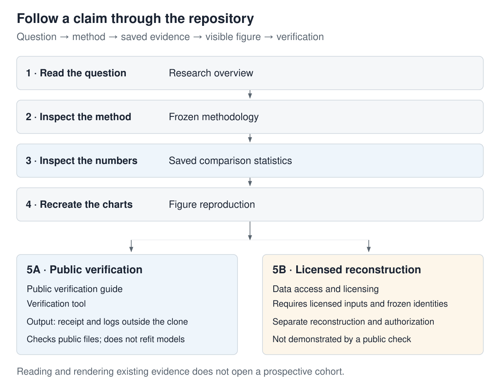

# Reproduce public checks and figures

**Status: CURRENT.**

The public repository contains source code, aggregate results, registered protocols,
translated reports and provenance records. The commands below verify those public
materials. They do not fetch licensed observations, refit the scientific models or
read a prospective cohort.

## Reproduction boundaries

| Route | Required inputs | What can be established | What it does not establish |
| --- | --- | --- | --- |
| Public verification | This clone, committed dependencies and saved public aggregates | Reporting consistency, artifact identities, contract behavior and figure reproducibility within the declared checks | A fresh fit from licensed observations or historical client receipt |
| Licensed reconstruction | Original licensed observations, frozen identities, calendars and recorded environment | An authorized reconstruction can test the scientific pipeline against its registered inputs | Completion from public aggregates alone; a new authorization to replay a consumed evaluation |
| Independent prospective replication | Newly collected eligible sessions and the registered protocol | A future authorized evaluation can assess generalization beyond historical development | An outcome before its registered look or a rescue of a historical result |

See the [data access policy](../data/DATA_ACCESS.md),
[historical execution guide](rp4/OPERATING_GUIDE.md) and
[prospective restrictions](rp4/prospective_confirmation_v1_amendment_3.md).
These routes answer different questions; success on one does not certify the others.

## Quickstart: clean environment and public contracts

Use Python 3.12, Git and an existing installation of `uv`. Clone the repository,
enter its directory and install the committed dependency lock:

```sh
git clone https://github.com/mguerrero896/does-option-flow-predict-volatility.git
cd does-option-flow-predict-volatility
uv sync --frozen
```

### First reproduce a figure you can inspect

```sh
uv run --frozen python docs/figures/public_refresh/render_reader_diagnostics.py
uv run --frozen python docs/figures/public_refresh/render_reader_diagnostics.py --check
```

Expected output: four `rendered` messages followed by four `verified` messages.
Open these local SVG files in a browser:

| Output | What to look for |
| --- | --- |
| [effect_intervals.svg](figures/public_refresh/effect_intervals.svg) | Linear and tree responses differ; the zero line means no mean loss difference. |
| [asset_heatmap.svg](figures/public_refresh/asset_heatmap.svg) | Each stock/model cell retains its sign on one common scale. |
| [paired_session_losses.svg](figures/public_refresh/paired_session_losses.svg) | 419 session pairs per family; below the diagonal favors B2. |
| [timing_sensitivity.svg](figures/public_refresh/timing_sensitivity.svg) | The mixed-block gain depends more on the assumed source-time cutoff than the option-state gain. |

No provider credentials are required. The producer reads committed aggregate CSVs,
not private feature panels. It does not refit a model, recalculate inference or
evaluate new sessions. [Definitions and exact transformations](VISUAL_EVIDENCE.md).

### Then verify the public record

```sh
uv run --frozen python scripts/verify_public_projection.py --output-dir ../public-verification
```

Successful verification ends with `status: PASS`. The output directory contains
the receipt, per-command logs and a JUnit test report. Keep the receipt with the
commit you inspected; do not substitute a screenshot of a green badge.

Contract tests check artifact identities, scientific reporting, source timing,
archived evidence, translated numerical claims and internal Markdown links. Some
checks explicitly skip when their licensed oracle or optional training dependency
is unavailable; a skip is not evidence that the missing computation passed.
The same commands work in PowerShell and POSIX shells. The verifier requires a clean
committed checkout descended from `origin/main` and writes its logs outside the clone.
It isolates inherited private evidence settings and records the two declared public-tier
opt-outs. Its receipt identifies the checked commit and individual command exits.
It runs the public contract subset and secret scan, **not the full hermetic suite or
a coverage measurement**. Synthetic fixtures may fit small models; no scientific
model fit or prospective data read is part of this route.

The full hermetic suite is a separate [CI job](../.github/workflows/ci.yml), with its
own coverage threshold and explicit licensed-test exclusion. Use its actual run
record for pass, skip and coverage counts. A coverage percentage measures exercised
code under those tests, not scientific completeness. Installing the versioned
pre-push hook is a contributor step in the [development guide](DEVELOPER_GUIDE.md),
not a prerequisite for reading or checking the research.
The public verifier deselects only the assertion that this reader's clone has that
hook installed; it still runs the hook's positive/negative fixture tests and the
secret scan, and records this boundary in its receipt.

### When a command does not pass

| Symptom | Next action |
| --- | --- |
| `uv` or Python is unavailable | Install the prerequisites before running repository commands; see the [uv installation guide](https://docs.astral.sh/uv/getting-started/installation/). |
| An output directory already contains an earlier receipt | Choose a new sibling directory before running; the public verifier can overwrite logs at a reused path. |
| Verifier reports a dirty checkout | Inspect `git status --short`. Preserve your changes; use a separate clean clone for verification rather than resetting work. |
| A chart differs or an assertion fails | Keep the log and commit ID. Compare the [source mapping](VISUAL_EVIDENCE.md); do not update evidence hashes simply to pass. |
| Licensed-input tests are skipped | These inputs are not distributed. Public skips are not passes; the [separate local route](LOCAL_CONTRACT_VERIFICATION.md) requires the correct licensed evidence. |



## Reports, hashes and database inputs

```sh
uv run --frozen python scripts/build_rp4_english_defense.py --check
uv run --frozen python -m scripts.build_rp4_v5_english
uv run --frozen python -m scripts.build_rp4_universe_english
uv run --frozen python -m scripts.build_rp4_v5_public_receipt
uv run --frozen python scripts/verify_rp4_public_metadata.py
uv run --frozen pytest tests/contract/test_canonical_state_current.py -q
uv run --frozen python scripts/sync_supabase_catalog.py --rp4-v4 --dry-run
```

These checks read public files. The defense producer validates its claim matrix and
manifest; the v5 producer checks the complete translation against archived evidence;
the state contract checks generated status; the loader's dry run validates the three
fixed source hashes and 24/36/3 rows without contacting or writing the database.
The [database receipt](../artifacts/rp4_public_refresh/supabase_receipt.json) separately
records the actual authenticated write, full readback and anonymous read verification.

An archived original's hash identifies its historical bytes. Where private locators
required a public derivative, the [redaction record](../artifacts/rp4_public_refresh/archive_redactions.json)
stores separate original and public hashes. The original pin does not assert byte
equality with the derivative. The archive resolver and numerical contracts enforce
that distinction.
Historical publication-implementation and administrative sources remain private. Their expected
pins and explicit non-distribution are recorded; their bytes cannot be verified
from this clone. Every source selected for a numerical claim must still be present
and its value checked. A missing unregistered source fails the public contract.

## Regenerate research figures from saved CSVs

The [RP4 figure guide](figures/rp4/README.md) gives the CSV inputs, exact regeneration
command and translation receipt. Rendering uses existing producers and saved
aggregates; it does not recompute bootstrap inference or fit a model. Original
figures and their historical hashes are retained in the archive.

```sh
uv run --frozen --no-sync python docs/figures/rp4/reproduce_english.py --verify
uv run --frozen --no-sync python docs/figures/rp4/reproduce_english.py --render
```

The first command checks hashes without writing; the second regenerates six SVGs
from five CSVs. Optional PNG rendering uses the existing Sharp installation and
recorded fonts described in the figure guide.

The five programme diagrams have versioned Archify JSON sources. With Node.js:

```sh
node docs/figures/public_refresh/reproduce.mjs --verify
```

This checks all 15 JSON/HTML/SVG hashes. Regeneration also requires the recorded
Archify installation and Chrome/Chromium, configured with `ARCHIFY_HOME`:

```sh
node docs/figures/public_refresh/reproduce.mjs --render
node docs/figures/public_refresh/reproduce.mjs --verify
```

See the [diagram guide](figures/public_refresh/README.md) for recorded renderer
versions and visual validation. Different browser versions can change rendered
bytes; inspect a difference before accepting a new manifest.

## Verify a publication candidate without remote writes

On a clean branch descending from `origin/main`, use an output directory outside
the clone. Git Bash can run the mirror's verification-only entry point:

```sh
bash scripts/publish_mirror.sh --dry-run --output-dir ../public-verification
```

The command runs the public contracts, full-history exclusion check, secret scan
including tags and Markdown language screening, then writes logs and a receipt.
It exits before publication operations. Use the recorded commit and logs to state
which candidate was checked; a check on an earlier commit does not validate later edits.

## What requires licensed inputs

Reconstructing feature panels, per-origin forecasts and complete model fits requires
the original provider observations, exact calendars, source availability fields,
frozen input hashes and the recorded execution environment. Public aggregate losses
cannot reconstruct those observations. Access to the licensed bucket remains
private and managed under the [data access policy](../data/DATA_ACCESS.md).

The [historical execution guide](rp4/OPERATING_GUIDE.md) records the original commands and
their portability limits. Relocating and translating documents does not constitute
an identical rerun of a closed registered execution. Prospective cohorts and their
read authorizations remain governed by their own protocols.

RESEARCH_ONLY · NOT INVESTMENT ADVICE · capital_go=false.
