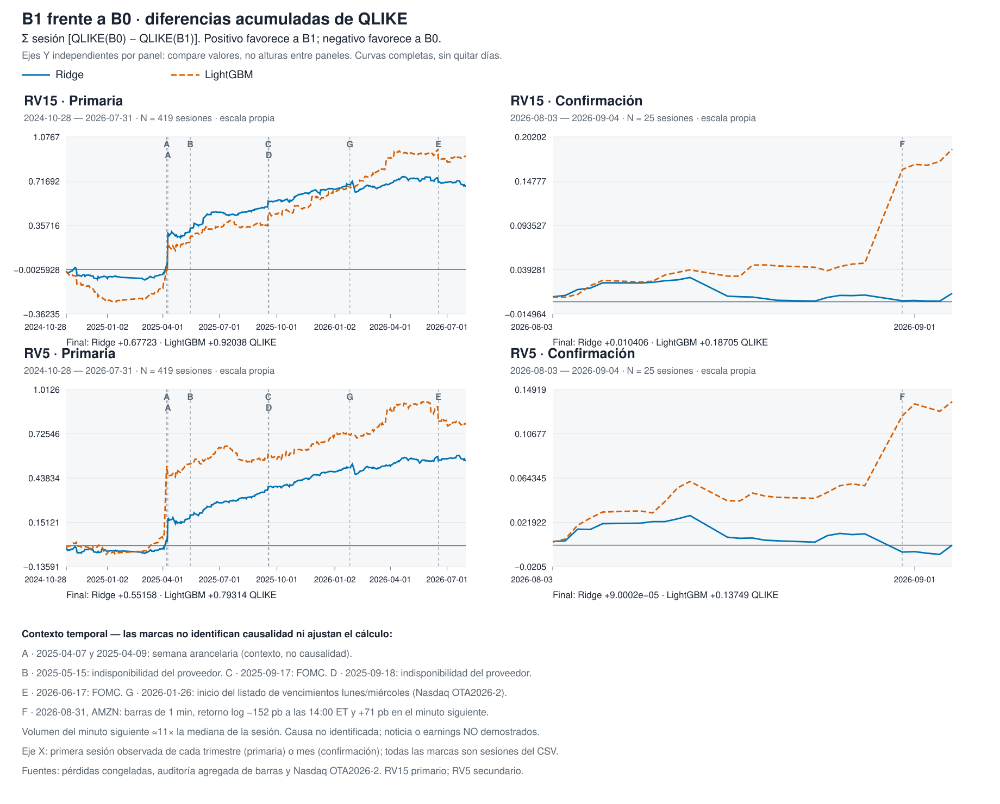

# Defense — option information and intraday volatility

Presentation script with frozen figures and notes for examiner questions. Linked figures remain as produced; their hashes and sources appear in the [revised figure manifest](../../../../../artifacts/rp4_closeout_figures_revision2/manifest.json). The [claims matrix](claims_matrix.csv) and [examiner questions](examiner_qa.md) complete traceability. Slide labels describe presentation order, not new scientific versions.

RESEARCH_ONLY · NOT INVESTMENT ADVICE · capital_go=false.

## 1. The answer has a precise scope

**Message.** Adding option state improves the mean forecast in the development sample; the flow increment depends on family, horizon and statistic.

**Slide content.**

- Question: do options add predictive information about intraday realized variation beyond prices and volatility history?
- B1 > B0: both families, 30 and 15 minutes.
- B2 > B1 > B0: linear family, 15 and 5 minutes, under a pre-declared, locally sealed sequence without a third-party timestamp; RV15 primary and RV5 secondary, not independent replication.
- Trees: B1 > B0 at 30/15 minutes; B2 ≥ B1 in the descriptive median at 15/5, without mean confirmation.

**Speaker notes.** Define “greater” as lower forecast loss in the corresponding contrast, not greater financial return. The hierarchy does not claim improvement on every date, asset or regime. “B2 ≥ B1 in the median” summarizes the sign of the paired-difference median; it is neither equivalence nor general tree dominance. Historical closure is reached in the linear family at 15 minutes; the final window is not independent confirmation.

Linear H1 is marginal: p = 0.0439 at RV30 and 0.0390 at RV15. Linear B1/B0 was not detected under the formal v1/v2 rule, and later rejections fail the saved bilateral/Holm sensitivity at RV30/RV15, which leaves both linear H1 tests unrejected; tree H1 is not combined with linear H2 to open a sequence. The conclusion comes from a design fixed with the sample already observed, although each walk-forward fit uses only its past.

**Evidence.** [Conclusion and limits](../../../RESULTADO_FINAL_revision_2.md) · [Contrasts in both windows](../../../results_v4.md).

## 2. What is compared, and how timing is protected

**Message.** Contrasts change the information set within a common temporal procedure.

**Slide content.**

- Assets: AAPL, AMZN, META, MSFT, NVDA, TSLA.
- B0 ⊂ B1 ⊂ B2: 29/69/138 predictors; history → state/surface → composition/activity/imbalance.
- Families: winsorized linear model with rank filtering; LightGBM.
- Expanding past-only training; 60 initial sessions.
- Selection: last ten training sessions; 60-minute purging/embargo.
- Primary v2–v4: 419 sessions; 160,832 origins.
- Final window: 25 sessions; 9,750 origins.
- Split: 2026-08-01, fixed on 2026-09-07 with the sample already observed.

**Speaker notes.** Development spans 2024-08-02–2026-07-31 and the final window 2026-08-03–2026-09-04. Warm-up belongs to training; it does not make every calendar session an evaluated observation. Predictor counts precede each family's asset effects and indicators. To isolate the horizon change, v4 preserves the eligible keys and causal masks of the original 30-minute target: RV15/RV5 receive no enlarged sample merely because they are shorter. Source time approximates availability; this timing discipline does not establish what a historical client received.

Distinguish forecast origin, record creation and exchange execution; historical client receipt is unobserved. The 120-second cutoff determines which records may enter predictors: `created_at <= t − 120 seconds`; gamma imbalance also requires `executed_at <= t − 120 seconds`, using the maximum of both clocks. One-minute bars are labeled by their start and must have closed by the cutoff. The implementation retains the target's index convention and neither adds visibility delay to the horizon nor applies it twice to inherited predictors. [Bar rule](../../../../../src/mds650/rp2/b1_snapshot.py) · [HAR integration](../../../../../artifacts/rp4_code/materialize.py) · [Preserved targets](../../../../../artifacts/rp4_v4_code/materialize_targets.py) · [Sources and selectors](horizon_pit_evidence.json).

B0 contains past realized variances at 5/15/30 minutes, session-to-date, previous day and week; four logarithmic HAR components and quarticity attenuation; positive/negative semivariances, jump proxy, Parkinson range, returns, volume and dollar volume; SPY/QQQ returns and variance; weekday, proximity to open/close and clock terms. These are 29 registered columns before effects and indicators. The [executable registration](../../../../../artifacts/rp4_v4_a1/specification.json), [price producer](../../../../../scripts/rp2_block4_b0_panel.py), [HAR/HARQ components](../../../../../src/mds650/har.py) and [integration](../../../../../artifacts/rp4_code/materialize.py) verify composition; it is neither inferred from the model name nor claimed that every column survives pruning in each fit. This is an intraday adaptation of established ideas, not an exact replication of their results.

The complete temporal label is “walk-forward out of sample, design fixed with the sample already observed and split fixed on 2026-09-07.” Training-time controls do not make retrospective development blind.

**Evidence.** [Complete design](../../../specification_v4.md) · [Sample and coverage](../../../results_v4.md) · [Executable contract](../../../../../artifacts/rp4_v4_a1/specification.json).

## 3. Proposal → delivery: answer the original objective first

**Message.** The contribution includes RV30 non-rejections and discloses differences between proposal and delivery.

**Slide content.**

| Original RV30 questions | v3 answer |
| --- | --- |
| RQ1: option state over prices | **Yes**: linear H1 p **0.0439**; trees **0.0053**. |
| RQ2: activity over option state | **Not detected at 5 %**: linear H2 **0.0525**; trees **0.6631**. |
| RQ3: stability across assets, time, volatility and timing assumptions | **Partial**: favorable B1 asset signs; documented learning, instrument and expiry circumstances; not every regime or PIT variant established. |

| Proposal → delivery | Status |
| --- | --- |
| B0 ⊂ B1 ⊂ B2; bars, contracts/quotes and trade-level activity | **ALIGNED** in information types, without claiming independent sources. |
| Five-minute origins, expanding walk-forward, QLIKE; bootstrap of **5 sessions / 9,999 replicates** | **ALIGNED**; bootstrap parameters fixed in the execution registration. |
| Non-annualized RV30 → primary RV15/secondary RV5, after reading RV30 | **DECLARED DEVIATION**, locally pre-declared v4 extension. |
| Eight targets → six equities; SPY/QQQ as B0 controls | **DECLARED DEVIATION**; roles fixed, reason for reduction not located. |
| Seasonal persistence/HAR-RV/regularized linear/trees → rank-filtered linear and LightGBM | **DECLARED DEVIATION**; HAR/HARQ are predictors, separate comparisons **PENDING**. |
| Asset/regime analysis; MAE/RMSE, PIT variants and placebo | Delivered breakdowns **ALIGNED**; the three remaining robustness checks **PENDING**, without execution. Current PIT: **120 seconds**. |

**Speaker notes.** The original RV30 equation sums thirty squared one-minute log returns without a square root or annualization. Answering the proposal first avoids presenting a favorable extension to another horizon as the original objective's answer. Asset signs do not equal individual rejection: none of the **12** B1 asset/family contrasts rejects after Holm within its four-contrast subset; minimum **0.0624**. Learning, empty-window and expiry diagnostics are neither three predefined volatility regimes nor causal tests. The [verifiable inventory](../../../../archive/rp4/DEFENSE_PACKAGE/revision_2/correction_4/proposal_alignment_evidence.json) bounds the search and absences.

The v4 predecessor declares **2026-09-07 20:20 Australia/Sydney** and its executable freeze is **2026-09-08T02:37:21.501511+10:00**; subsequent evaluations and the prior RV30 reading appear in the [examiner-question](examiner_qa.md) chronology. This sequence explains the extension; it neither erases historical search nor authenticates the seal through a third party.

The proposal states, translated, **“Model choice will depend on the benchmark and simplicity, not on B2 producing a favorable sign.”** It also states, translated, **“a null or negative result would be equally valuable”**; the English original retains **“a null or negative result would be equally informative”**. Alongside this, v4 closure states, translated, **“Otherwise, the project closes with B1 > B0 as the main result and B2 as an informative null at 30, 15 and 5 minutes. There is no v5.”** These are commitments to accept adverse results, not identical inference rules: the requirement changes from both families in v3 to at least one in v4. Non-rejection does not establish equivalence to zero. [Original quotations](../../../../archive/rp4/DEFENSE_PACKAGE/revision_2/correction_4/proposal_source_extract.json) · [Registered closure](../../../predeclaration_v4_text.md).

**Exam deliverable inventory.**

| Deliverable | Status and path |
| --- | --- |
| Final report | **ALIGNED**: [report](../../../RESULTADO_FINAL_revision_2.md) and [summary](executive_summary.md). |
| Presentation | **ALIGNED**: [script](defense_slides.md) and [figures](../../../../../artifacts/rp4_closeout_figures_revision2/manifest.json), without establishing native format. |
| Literature matrix | **ALIGNED**: [matrix](../../../../literature_matrix.csv); the matrix alone does not establish the peer-review requirement and includes a working paper; the publication inventory is not expanded. |
| Dictionary | RP4 update **PENDING**: [predecessor](../../../../data_dictionary.md). |
| Reproducible code | **ALIGNED** as code and procedure: [evaluator](../../../../../artifacts/rp4_v4_code/evaluate_v4.py) and [runbook](../../../OPERATING_GUIDE.md); full reproduction not executed. |
| Versioned panel | **DECLARED DEVIATION** in access: [release and hashes](../../../../../artifacts/rp4_v4_a2/evaluation_release_rv15.json); payload privately held under its license. |
| Comparison tables | **ALIGNED**: [version table](../../../../../artifacts/rp4_closeout_figures/comparison_v1_v4.csv). |
| Intervals | **ALIGNED**: [statistics](../../../../../artifacts/rp4_v4_b4/primary_statistics.csv). |
| Robustness | **ALIGNED** for present analyses: [breakdowns](../../../../../artifacts/rp4_v4_b4/robustness.csv); MAE/RMSE, PIT and placebo remain pending. |
| Examiner notebook | RP4 update **PENDING**: [earlier notebook](../../../../../notebooks/canonical_rv30_defense.ipynb), inspected without execution. |

**Evidence.** [Proposal and original equation](../../../../archive/rp4/DEFENSE_PACKAGE/revision_2/correction_4/proposal_source_extract.json) · [Saved RV30](../../../../../artifacts/rp4_v3_b2/summary.json) · [Complete table and limits](examiner_qa.md#proposal--delivery). Preparing this slide executes none of the outstanding analyses.

The timing-variant status in this inventory reflects the earlier documentary inspection's scope. Visibility cutoffs of 60 and 300 seconds were assigned to a separate evaluation; no readiness, execution or result is inspected or claimed here. These are information-cutoff sensitivities, not target horizons. [Assignment and limits](horizon_pit_evidence.json).

## 4. What the contrast tests and what it does not

**Message.** The decision concerns mean QLIKE differences within each family; it neither certifies a strategy nor controls all historical search.

**Slide content.**

- QLIKE = y/f − log(y/f) − 1; delta = baseline loss − expanded loss.
- Asset/session mean and equal weights across assets and sessions.
- H1: B1/B0, one-sided at 5 %; rejection alone opens H2: B2/B1 at 5 %.
- Circular bootstrap: five-session blocks, 9,999 replicates.
- The historical “at least one family” rule is operational; it offers no global 5 % control across families or versions.

**Speaker notes.** Rejection means evidence of a positive mean difference under the registered procedure; non-rejection does not prove absence. Closed H2 retains a diagnostic nominal p only. The published interval is a bilateral 95 % percentile interval and the primary p uses a centered one-sided null: they are not a test/interval pair obtained by exact inversion, so their recipes explain apparent discrepancies without changing the rule. QLIKE assesses forecast-variance scale; it includes no trading rules, costs, exposure or portfolio results. Family-specific tests also do not remove the effect of revisiting the same windows.

The baseline contains multiscale HAR persistence, quarticity-based adaptation to measurement error and semivariances for differently signed returns. B1/B0 is not compared against a naive model: its predecessors are [Corsi (2009)](https://doi.org/10.1093/jjfinec/nbp001), [Bollerslev, Patton and Quaedvlieg (2016)](https://scholars.duke.edu/publication/1072550) and [Patton and Sheppard (2015)](https://scholars.duke.edu/publication/1082826). References support the types of controls, not a comparable improvement percentage or this B0's empirical strength in another population. Corsi's article was verified on the author's institutional page and the [2004 working version](https://www.greta.it/old/jae/poster/06_1_Corsi.pdf) was read; that reading is not presented as full text of the 2009 published version.

Saved complementary diagnostics, primary RV15, 419 sessions; statistics and p-values rounded to six decimals:

| Contrast | DM HAC(5), statistic | Bilateral DM p | GW statistic | GW p |
| --- | ---: | ---: | ---: | ---: |
| Linear H1 | 1.911952 | 0.055882 | 7.029704 | 0.029752 |
| Linear H2 | 2.734853 | 0.006241 | 7.618946 | 0.022160 |
| Trees H1 | 2.425315 | 0.015295 | 7.128308 | 0.028321 |
| Trees H2 | −0.257628 | 0.796694 | 0.057964 | 0.971434 |

DM is bilateral normal with HAC(5); GW uses a constant and the previous session's delta, HAC(5), and two degrees of freedom. These are not the same null and are not multiplicity-adjusted here. The block bootstrap is the registered inference; DM/GW neither replace it nor permit choosing the favorable diagnostic. For example, DM does not reject linear H1, unlike the one-sided bootstrap. [Original statistics](../../../../../artifacts/rp4_v4_b4/primary_statistics.csv) · [Sources, formulas and verified bibliography](../../../../archive/rp4/DEFENSE_PACKAGE/revision_2/correction_2/examiner_evidence.json).

**Evidence.** [Registered inference](../../../specification_v4.md) · [Inference producer](../../../../../artifacts/rp4_v3_code/inference.py) · [Decisions and formal p-values](../../../results_v4.md).

## 5. All four versions are shown in full

**Message.** The history contains corrections and adaptation; adverse signs remain visible.

**Slide content.** Table retained from the historical README; each cell shows percentage QLIKE reduction (p).

| Version / target | Linear B1/B0 | Linear B2/B1 | Trees B1/B0 | Trees B2/B1 | Sessions |
| --- | ---: | ---: | ---: | ---: | ---: |
| v1 · RV30 | +0.290 % (1.000) | −167,448.32 % (1.000) | +1.204 % (0.4724) | −0.073 % (1.000) | 418 |
| v2 · RV30 | +1.715 % (0.1842) | −8.714 % (0.3752) | +2.091 % (0.0264) | −0.063 % (0.8858) | 419 |
| v3 · RV30 | +1.729 % (0.0439) | +0.554 % (0.0525) | +2.091 % (0.0053) | −0.159 % (0.6631) | 419 |
| v4 · RV15, primary | +0.880 % (0.0390) | +0.623 % (0.0032) | +1.170 % (0.0135) | −0.115 % (0.6280) | 419 |
| v4 · RV5, secondary | +0.377 % (0.0092) | +0.256 % (0.0172) | +0.536 % (0.0608) | +0.160 % (not opened; nominal 0.1927) | 419 |

**Speaker notes.** v1 retains its numerical failure and 92,261 origins; it is not a stable estimate of flow's economic effect. v2 changes coverage, capacity and stability; v3 adds imbalance and empty-window handling; v4 changes horizon through a conditional predecessor. The linear family moves from log-OLS in v1 to nominal ridge later. V1/v2 p-values are bilateral with Holm; v3/v4 are one-sided sequential. Sample, procedure and target change: rows do not causally isolate each modification's benefit and their p-values are not interchangeable. Linear v3 B2/B1 remains at p = 0.0525; it is not rounded to rejection. The historical programme ends at v4, without v5.

The inference change was registered in v3 before execution: moving from bilateral/Holm across four contrasts to a one-sided sequence per family, without cross-family Holm, makes the corresponding decision less demanding. B2 gained gamma imbalance and indicators after failing in v1/v2; the empty-window rule followed the v2 diagnosis. Linear B1/B0 did not reject under the formal v1/v2 rule even though its estimate was positive.

RV15's motivation is a short-lived-flow and minute-scale-hedging hypothesis, not a demonstrated mechanism; RV5 remains secondary. The predecessor is **pre-declared and locally sealed, without a third-party timestamp**. The v4 specification's closure rule is retained in translation:

> If neither rejects, investigation of this mechanism closes with B1>B0 as the main result observed at 30 minutes and B2 not detected at 30/15/5 according to each estimate and interval. Non-rejection establishes neither equivalence to zero nor causal absorption; “informative null” describes closure, not proof of absence.

The predecessor adds “There is no v5.” RV5 is not promoted to rescue an adverse RV15 result. [Projected predecessor text](../../../predeclaration_v4_text.md) · [v3 rule](../../../specification_v3.md) · [v4 closure](../../../specification_v4.md).

Complete chronology of the inspected receipts; dates without a clock time are not assigned an invented one. The UTC and Australia/Sydney columns convert the same instant rather than recording separate events:

| Event and evidence type | UTC | Australia/Sydney | Source |
| --- | --- | --- | --- |
| Last historical session: 2026-09-04 | Time not recorded | Time not recorded | [Registration](../../../../../artifacts/rp4_v4_b3_rv15/summary.json) |
| Split 2026-08-01; design declared 2026-09-07 | Time not recorded | Time not recorded | [Registration](../../../../../artifacts/rp4_v4_a1/specification.json) |
| v1 freeze: date 2026-09-07, no stored time/zone | Time not recorded | Time not recorded | [Registration](../../../../../artifacts/rp4_a1/freeze.json) |
| v3 registration; v1/v2 already known | 2026-09-07T08:18:58.166170+00:00 | 2026-09-07T18:18:58.166170+10:00 | [Registration](../../../../../artifacts/rp4_v3_a1/freeze.json) |
| v3 empty-window registration | 2026-09-07T08:30:43.053218+00:00 | 2026-09-07T18:30:43.053218+10:00 | [Registration](../../../../../artifacts/rp4_v3_a1_empty_window/freeze.json) |
| Conditional v4 predecessor: time declared in the text | 2026-09-07T10:20:00+00:00 | 2026-09-07T20:20:00+10:00 | [Registration](../../../predeclaration_v4_text_receipt.json) |
| v3 closure verification | 2026-09-07T16:18:46+00:00 | 2026-09-08T02:18:46+10:00 | [Registration](../../../../../artifacts/rp4_v3_b4/receipt.json) |
| Executable v4 freeze | 2026-09-07T16:37:21.501511+00:00 | 2026-09-08T02:37:21.501511+10:00 | [Registration](../../../../../artifacts/rp4_v4_a1/freeze_manifest.json) |
| Primary RV15 started | 2026-09-07T17:24:29.535011+00:00 | 2026-09-08T03:24:29.535011+10:00 | [Registration](../../../../../artifacts/rp4_v4_b2_rv15/receipt.json) |
| Primary RV15 finished | 2026-09-07T18:13:29.790569+00:00 | 2026-09-08T04:13:29.790569+10:00 | [Registration](../../../../../artifacts/rp4_v4_b2_rv15/receipt.json) |
| Final RV15 started | 2026-09-07T18:14:50.222385+00:00 | 2026-09-08T04:14:50.222385+10:00 | [Registration](../../../../../artifacts/rp4_v4_b3_rv15/receipt.json) |
| Final RV15 finished | 2026-09-07T18:23:27.273395+00:00 | 2026-09-08T04:23:27.273395+10:00 | [Registration](../../../../../artifacts/rp4_v4_b3_rv15/receipt.json) |
| Primary RV5 started | 2026-09-07T18:24:38.947836+00:00 | 2026-09-08T04:24:38.947836+10:00 | [Registration](../../../../../artifacts/rp4_v4_b2_rv5/receipt.json) |
| Primary RV5 finished | 2026-09-07T19:16:40.533194+00:00 | 2026-09-08T05:16:40.533194+10:00 | [Registration](../../../../../artifacts/rp4_v4_b2_rv5/receipt.json) |
| Final RV5 started | 2026-09-07T19:17:15.307438+00:00 | 2026-09-08T05:17:15.307438+10:00 | [Registration](../../../../../artifacts/rp4_v4_b3_rv5/receipt.json) |
| Final RV5 finished | 2026-09-07T19:25:22.707101+00:00 | 2026-09-08T05:25:22.707101+10:00 | [Registration](../../../../../artifacts/rp4_v4_b3_rv5/receipt.json) |
| v4 report generated no later than | 2026-09-07T19:26:27+00:00 | 2026-09-08T05:26:27+10:00 | [Registration](../../../../../artifacts/rp4_v4_b4/receipt.json) |
| Prospective v1 registration | 2026-09-08T04:24:01.918499+00:00 | 2026-09-08T14:24:01.918499+10:00 | [Registration](../../../prospective_confirmation_v1_receipt.json) |
| Amendment 1 | 2026-09-08T04:31:58.752153+00:00 | 2026-09-08T14:31:58.752153+10:00 | [Registration](../../../prospective_confirmation_v1_amendment_1_receipt.json) |
| Amendment 2 | 2026-09-08T05:27:15.316335+00:00 | 2026-09-08T15:27:15.316335+10:00 | [Registration](../../../prospective_confirmation_v1_amendment_2_receipt.json) |
| Amendment 3 | 2026-09-08T06:56:21.897094+00:00 | 2026-09-08T16:56:21.897094+10:00 | [Registration](../../../prospective_confirmation_v1_amendment_3_receipt.json) |

The time 2026-09-07 20:20 Australia/Sydney, equivalent to 10:20 UTC, is a **claim in the predecessor text**; it is neither authenticated by a third party nor inferred from file modification time. v3 closure verification is recorded at 16:18:46 UTC, and the executable v4 registration linking the predecessor's hash was frozen later, at 16:37:21.501511 UTC. This chain traces local content but does not independently prove the predecessor was written before v3 became known. The public projection follows the results and has its own hash; the sealed local original's hash is `6f8ad8d53a8f4336851415a99c25b316bf44db74165e29246110a3bb133eabee`.

The v3 registration already declares v1/v2 results known; the inspected receipts do not assign an exact execution time to each. The sample ends on 2026-09-04, before the September 7 design decision. Training therefore remains separated from its future targets, but the historical design was fixed with the sample already observed; prospective replication establishes a different registration/acquisition relationship. [Selectors, hashes and each time's limits](../../../../archive/rp4/DEFENSE_PACKAGE/revision_2/correction_2/examiner_evidence.json).

The file-drawer review is bounded and reproducible: searching literally for `rv_10|rv_20|rv_60|rv_45` in 62 allowed files—27 code files and 35 v3/v4 registrations/aggregates—yielded zero matches, empty stdout and stderr, and `rg` exit code 1 for no matches. The six primary-contrast summaries contain only the linear and LightGBM families; registrations fix RV30 for v3 and primary RV15/secondary RV5 for v4. This inventory contains no evidence of other primary horizons or families. The search does not prove no other experiment ever occurred outside the inspected scope or deny the documented secondaries. No panels, reserved results or new data were opened. [Inventory, patterns, command and search hashes](../../../../archive/rp4/DEFENSE_PACKAGE/revision_2/correction_2/examiner_evidence.json).

**Evidence.** [Original table](../../../../../README.md) · [Aggregate data and source hashes](../../../../../artifacts/rp4_closeout_figures/comparison_v1_v4.csv) · [Instrument/model audit](../../../../../artifacts/rp4_closeout_audit/REPORT.md).

## 6. Magnitude, uncertainty and disagreement between families

**Message.** Linear flow's increment is small and measurable; the tree mean does not reproduce it.

**Slide content.**

- Linear B2/B1 at 15 minutes: +0.623 %; QLIKE delta CI95 % [0.000335; 0.001932]; p = 0.0032.
- Linear B2/B1 at 5 minutes: +0.256 %; secondary result.
- Trees B2/B1 at 15 minutes: −0.115 %; p = 0.6280.
- Paired tree median at 15/5 minutes: bilateral p 0.0435/0.0038; Holm 0.0870/0.0096.

**Speaker notes.** The summary scale runs from −3 % to +3 %; off-scale values have arrows and their actual magnitudes. Do not interpret v1's numerical disaster as a loss limited to the chart edge. The complete appendix retains untrimmed intervals. Percentage whiskers are the saved delta CI multiplied by 100 and divided by observed mean baseline loss: they are not bootstrap ratio intervals with an uncertain denominator. The CI quoted above remains in QLIKE units. A positive median can coexist with an adverse mean; these are different estimands and the difference does not authorize discarding high-loss sessions. At 15 minutes, the tree median fails Holm; at 5 it passes as a secondary. Do not turn that secondary into mean confirmation.

In the linear family and primary window, RV15 shows +0.623 % B2/B1 improvement and positive signs in 6/6 assets; secondary RV5 shows +0.256 % and 3/6. The largest relative effect observed among the examined horizons is at 15 minutes and does not increase monotonically as the horizon shortens. This descriptively compares targets with different baseline losses; it is not a test of an optimum or a significant difference between horizons, and assets are not independent replications. RV30 retains the proposal answer and rejection limits already stated. [Estimates, signs and scope](horizon_pit_evidence.json).

**Evidence.** [Results and intervals](../../../results_v4.md) · [Summary manifest and clipping inventory](../../../../../artifacts/rp4_closeout_figures_revision2/manifest.json) · [Complete appendix](../../../../figures/rp4/comparison_v1_v4.svg) · [Percentage-interval definition](../../../../../artifacts/rp4_closeout_figures/README.md).

## 7. Option state over time

**Message.** B1's mean advantage does not imply uniform gains from the start of training.

**Slide content.**

- Curve = sum of session QLIKE differences; a positive sign favors B1.
- Each panel has its own vertical axis: compare values, not heights.
- Annotated dates provide context; they neither change the sample nor attribute causes.

**Speaker notes.** Begin with primary RV15 and then the final window; do not add them as independent replications. The evaluated October 2024–February 2025 segment contains 64 sessions, equivalent to 15.27 % of 419, and has negative linear B1 gain. The denominator for 15.27 % is 100 × 64 / 419, rounded; these are not all calendar sessions. Training size grows over time alongside regime changes: the curve does not establish that longer learning would have caused improvement. The January 26, 2026 marker identifies the expiry change; it does not identify its effect on the curve. Keep adverse segments and window separation visible.

**Evidence.** [Descriptive audit and denominators](../../../../../artifacts/rp4_closeout_audit/REPORT.md) · [Month/training profiles](../../../../../artifacts/rp4_closeout_audit/descriptive_profiles.csv) · [Annotation sources](../../../../../artifacts/rp4_closeout_figures_revision2/annotation_sources.json).

## 8. Flow does not win in every session

**Message.** B2's path exposes concentration and fragility without removing inconvenient days.

**Slide content.**

- Primary window (419 sessions), linear family: positive increment in all three blocks at both horizons.
- Primary window (419 sessions), by asset: six of six positive at 15 minutes; three of six at 5 minutes.
- October and November 2025 are negative for linear B2 at RV30 and RV15.

**Speaker notes.** Block and asset counts refer exclusively to the primary window (419 sessions), although the figure also shows the final window. Block/asset robustness is descriptive and does not establish complete monthly stability. April markers identify temporal context without proving tariff causality. The AMZN marker on August 31, 2026 retains an observed shock: −152 and +71 basis points from 14:00 ET, with next-minute volume near 11 times the session median. The audit checks internal consistency of provider bars, not independent price validation or a causal news event. Do not remove that session or recalculate a “clean” p-value. A visual jump in the cumulative curve also does not replace the final window's formal sequence. Original curve coordinates are preserved in the annotated version.

The six assets are US technology-related megacaps sharing risk factors; independence between variances is not assumed and cross-correlation is not estimated here. “Six of six” at RV15 is consistency in a homogeneous sample, not six replications; at RV5 only three of six are positive. The resampling unit is the session, with assets jointly aggregated, and no generalization to other sectors, sizes or markets is claimed.

In the final window, 2026-08-31 contributes +0.1162479043 of +0.1191828314 in cumulative linear RV15 B2/B1 delta: 100 × contribution / sum = 97.54 %, rounded. The other 24 sessions sum to +0.0029349271. This is arithmetic concentration in saved losses, not a new test removing the shock or evidence of its cause. The favorable final path depends heavily on that session. [Decomposition, denominators and hashes](../../../../archive/rp4/DEFENSE_PACKAGE/revision_2/correction_2/examiner_evidence.json).

**Evidence.** [Block/asset results](../../../RESULTADO_FINAL_revision_2.md) · [Profiles and adverse losses](../../../../../artifacts/rp4_closeout_audit/REPORT.md) · [Shock verification and limits](../../../../../artifacts/rp4_market_audit/REPORT.md) · [Curve custody](../../../../../artifacts/rp4_closeout_figures_revision2/manifest.json).

## 9. Instrument, regime and numerical stability

**Message.** Limitations remain part of the result; the old-rule bilateral/Holm sensitivity does not establish a complete sequence in a family.

**Slide content.**

- Instrument incidents: 2025-05-15 and 2025-09-18 are labeled provider unavailability; 412 empty five-minute windows remain in the primary sample, none in the final window.
- Expiry change: listed from 2026-01-26; mean coverage 20.04 → 23.10 cells per origin; the final window belongs to the new regime.
- Nominal ridge: lambda 0.0001 selected in 111/419 B2 sessions; 88–97 columns pruned; the grid does not guarantee correlated-coefficient stability.

**Speaker notes.** Dates retain annotation-manifest labels; the census establishes empty windows, not an independently verified external cause. Zero activity is retained, shapes and ratios without trades become undefined, and indicators are added; no window is excluded to improve the sign. In empty rows, linear QLIKE moves from 0.103 in B1 to 0.202 in B2 with equal session/asset weights, a different denominator from the origin average. For expiries, distinguish listing and first presence on January 26, the cell increase on the 29 and first Monday/Wednesday expirations on February 2/4. Ridge penalization applies to the sum of errors without dividing by N; it may be very weak in large samples. Pruned columns include presence indicators and collinearity: they are not “88 constants.” These observations bound interpretation; they do not authorize changing the grid, warm-up or exclusions in an already-closed test.

The old-rule sensitivity uses saved bilateral p-values rather than automatically doubling one-sided values. Primary window; RV5 retains its secondary role.

| Horizon | Family / contrast | Registered one-sided p | Saved bilateral p | Bilateral Holm across four contrasts | Individual rejection |
| --- | --- | ---: | ---: | ---: | --- |
| RV15 | Linear B1/B0 | 0.0390 | 0.0459 | 0.0918 | No |
| RV15 | Linear B2/B1 | 0.0032 | 0.0062 | 0.0248 | Yes |
| RV15 | Trees B1/B0 | 0.0135 | 0.0149 | 0.0447 | Yes |
| RV15 | Trees B2/B1 | 0.6280 | 0.8048 | 0.8048 | No |
| RV30 | Linear B1/B0 | 0.0439 | 0.0467 | 0.1401 | No |
| RV30 | Linear B2/B1 | 0.0525 | 0.1013 | 0.2026 | No |
| RV30 | Trees B1/B0 | 0.0053 | 0.0066 | 0.0264 | Yes |
| RV30 | Trees B2/B1 | 0.6631 | 0.7249 | 0.7249 | No |
| RV5 | Linear B1/B0 | 0.0092 | 0.0099 | 0.0396 | Yes |
| RV5 | Linear B2/B1 | 0.0172 | 0.0343 | 0.1029 | No |
| RV5 | Trees B1/B0 | 0.0608 | 0.0731 | 0.1462 | No |
| RV5 | Trees B2/B1 | 0.1927 (nominal) | 0.4014 | 0.4014 | No |

Under the v1/v2 bilateral/Holm sensitivity, flow survives only in linear RV15, and state survives for trees at RV30 and RV15 and for linear RV5. The complete linear RV15 sequence would not open if H1 after Holm were additionally required, because that H1 does not reject. V1/v2 did not use H1→H2: the preceding sentence is a conditional interpretation, not a retrospective attribution of that sequence to those versions. A tree H1 rejection does not open linear H2.

Tree RV5 H2 retains only a nominal one-sided p; its registered test is not reopened. This later comparison neither corrects historical search nor creates a new registered rule. [Source rows and limits](../../../../archive/rp4/DEFENSE_PACKAGE/revision_2/correction_5/holm_evidence.json).

**Evidence.** [Limits with figures and definitions](../../../RESULTADO_FINAL_revision_2.md) · [Empty-window audit](../../../../../artifacts/rp4_closeout_audit/REPORT.md) · [Lambda selection](../../../../../artifacts/rp4_closeout_audit/ridge_lambda_counts.csv) · [Market-change census](../../../../../artifacts/rp4_market_audit/REPORT.md).

## 10. What B2 contributes, and which mechanism remains unidentified

**Message.** Predictive improvement by the set does not identify gamma imbalance's causal contribution.

**Slide content.**

- In linear RV15's primary window, the three 5-minute premium shares (buy, passive and sell) have mean absolute coefficients of 0.250–0.312, versus 0.00489 for total gamma imbalance.
- The count of trades with identified direction has mean slope −0.04271; it counts trades, not a signed balance.
- Flow composition and activity are descriptive interpretations of the fit; prospective ablation is needed to isolate the registered block.

**Speaker notes.** Magnitudes concern transformed, training-scaled and winsorized variables; they are not comparable elasticities without accounting for those transformations. Collinearity and rank filtering prevent interpreting a small or pruned coefficient as a true zero effect. The set can improve prediction without verifying intermediary inventories or causal hedging. The prospective amendment compares full B2 with B2 minus the four gamma-imbalance-block columns and their indicators: 134 versus 138 predictors before effects and indicators. It retains the three historical gamma-exposure columns. Even a future rejection would therefore concern the removed block's joint contribution, which includes a trade count, rather than establish “the gamma mechanism” in isolation.

**Evidence.** [Published interpretation](../../../RESULTADO_FINAL_revision_2.md) · [Column/horizon coefficients](../../../../../artifacts/rp4_closeout_audit/b2_coefficient_summary.csv) · [Coefficient-interpretation limits](../../../../../artifacts/rp4_closeout_audit/REPORT.md) · [Registered ablation](../../../prospective_confirmation_v1_amendment_1.md).

## 11. The 25 final sessions do not confirm

**Message.** A favorable second-contrast estimate is insufficient when the first step does not reject.

**Slide content.**

- Linear RV15: H1 p = 0.3908; H2 not opened, nominal 0.1758; no confirmation.
- LightGBM RV15: H1 p = 0.0568; H2 not opened, nominal 0.7554; no confirmation.

Sample: 25 sessions, 9,750 origins; 2026-08-03–2026-09-04.

**Speaker notes.** In the linear family, 15-minute B2/B1 delta is +0.0047673133, with CI95 % [−0.0011087291; 0.014742153]; material uncertainty remains, and H1 failure prevents opening H2. Do not present the file's “confirmation” term as a confirmed test or attribute non-rejection exclusively to limited power: regime and window composition also change. Part of the calendar had been read under another specification and the split was fixed later, limiting independence. RV5 and its secondaries do not rescue RV15. Intervals do not establish equivalence to zero.

Cumulative final linear B2/B1 delta is +0.1191828314 and 2026-08-31 contributes +0.1162479043, or 97.54 %; the other 24 sessions sum to +0.0029349271. Do not remove the session or convert concentration into causal explanation. The six assets share factors and form a homogeneous sample; they are not six independent replications. Sessions are resampled rather than multiplying evidence by asset count. [Concentration and provenance](../../../../archive/rp4/DEFENSE_PACKAGE/revision_2/correction_2/examiner_evidence.json).

Date-verified overlap is 20 of the 25 final sessions, or 80 %: sessions from 2026-08-03 through 2026-08-28 lie in the declared bridge window; the five from 2026-08-31 through 2026-09-04 do not. Only `session_date` in final aggregates is counted, without reopening the bridge evaluation. The [historical README](../../../../../README.md) declares opening on 2026-08-30 and mixed/exploratory, non-confirmatory results without aggregation changes; a sensitivity improved only one of eight primary cells containing B1. This review compares that statement with the retained addendum and public aggregates without repeating the evaluation or verifying each person's historical knowledge. The record identifies the earlier reading under another specification as an owner declaration; alone it does not independently verify each person's knowledge. It is disclosed because these sessions were not unknown when the split was fixed. [Counted dates, statement source and limits](../../../../archive/rp4/DEFENSE_PACKAGE/revision_2/correction_2/examiner_evidence.json).

**Evidence.** [Final-window comparison and p/CI recipes](../../../results_v4.md) · [Final RV15 aggregate summary](../../../../../artifacts/rp4_v4_b3_rv15/summary.json) · [Disclosures and regime change](../../../RESULTADO_FINAL_revision_2.md).

### Repaired secondaries: calculation and usefulness

**Speaker note.** Jump AUC can now be reported in both windows and families, but no H1 rejects and their H2 tests remain unopened for decisions. Affine recalibration applied only to LightGBM reproduces saved arithmetic and retains instability from negative outputs clipped to the positive floor. A computable endpoint is not a demonstrated improvement. Original-forecast calibration diagnostics do cover both families. [Repair results and limits](../../../results_v3_revision3.md) · [Examiner answer](examiner_qa.md#28-what-remains-of-the-failed-secondaries-and-what-does-repaired-mean).

### Programme convergence and its limits

| Programme and historical disposition | Estimand, loss and window | Family | STATE: B1 over B0 | FLOW: B2 over B1 | Artifact |
|---|---|---|---|---|---|
| RP2, superseded history; no current claim | Mean QLIKE delta, RV30; D/V roles, 156/32 evaluated sessions | Log ridge, Gamma GLM and LightGBM | Positive in all three families in D; mixed signs and intervals crossing zero in V; Gamma D +0.002564 and V −0.001496 | All six D/V intervals cross zero; no confirmed positive increment | [Historical verdict](../../../../rp2_v3/VERDICT.md), [inference](../../../../../artifacts/rp2_v3/rp2-v3-20260831-b1-spot-cutoff-remediation/rp2_block10_inference/inference.json), [supersessions](../../../../rp2_v3/SUPERSEDED_RESULTS.md) |
| PIT v2.2 successor, `GLOBAL_EDGE_NOT_CONFIRMED` | Mean QLIKE delta, RV30; 32-session holdout, read 2026-09-02 | Confirmatory Gamma GLM; robustness LightGBM | Gamma B1a +0.008171, CI [0.002658; 0.014024], Holm 0.0084; baseline QLIKE 0.2129; effect below MDE 0.008416 | Gamma −0.003127, CI [−0.013923; 0.008609], Holm 0.5595; not confirmed for trees either | [Result and limits](../../../../pit_v22_claims_and_limitations_v2.md), [aggregate](../../../../../artifacts/target_blind_v22/successor_evaluation_result_v2.json) |
| Phase 8A, `MIXED_EXPLORATORY`; opened 2026-08-30 | Primary total delta; state/flow disaggregated, QLIKE RV30; 20 primary sessions, 2026-08-03–2026-08-28; sensitivity 30, 2026-07-20–2026-08-28 | D/V training roles × Gamma GLM/LightGBM | Four of four primary cells positive; descriptive Holm < 0.05 in three | Four of four primary intervals cross zero | [Addendum](../../../../../reports/phase8a_exploratory_bridge_addendum_v13.md), [protocol](../../../../phase8_bridge_protocol_v2.md), [aggregate](../../../../../artifacts/phase8_bridge/materialized_remediation_20260831_v1.json) |
| RP4 v3/v4, historical development closure; final window unconfirmed | Mean QLIKE delta; v3 RV30, v4 primary RV15/secondary RV5; 419 primary and 25 final sessions | Linear and LightGBM | Both families: at 30 minutes +1.729 %/+2.091 %; at 15 +0.880 %/+1.170 %, linear/trees respectively | Linear: +0.623 % at 15 and +0.256 % at 5 under H1→H2; at 30 no rejection; tree mean unconfirmed and positive median at 15/5 | [Version table](../../../RESULTADO_FINAL_revision_2.md), [contrasts](../../../results_v4.md), [aggregates](../../../../../artifacts/rp4_closeout_figures/comparison_v1_v4.csv) |

**Additional speaker notes.** Present convergence, not identical replication. RP2 validation is not uniformly positive and the successor's Gamma is the same PIT evaluation: do not count it twice. Phase 8 state and flow contrasts disaggregate its primary total-information estimand. They share twenty sessions with RP4's final window; evidence is not independent. Block 12 already warned about limited power; the 335 look retains the current amendment's joint-power limitation. RP3 retains its long-term programme and documented dependence with Phase 8; withdrawing Phase 9 for RP4 does not cancel RP3, and C10 remains inactive. The [convergence question](examiner_qa.md) distinguishes Gamma masks, the bridge's primary size and [historical dispositions](../../../../../README.md).

## 12. Four disclosures in four statements

**Message.** These restrictions form part of the defended conclusion.

**Slide content.**

1. This is the fourth evaluation, without correction for historical search: (a) v1/v2 used bilateral/Holm across four contrasts and v3/v4 a one-sided sequence at 5 % per family without cross-family Holm, a less demanding change registered before v3; (b) B2 added gamma imbalance and indicators after failing in v1/v2; (c) decision 132 fixed empty windows after diagnosing v2; (d) primary RV15/secondary RV5 was pre-declared and locally sealed without a third-party timestamp; (e) the 2026-08-01 split was fixed on 2026-09-07 with observed data, with the closure rule translated as “If neither rejects, investigation of this mechanism closes with B1>B0 as the main result observed at 30 minutes and B2 not detected at 30/15/5 according to each estimate and interval” and “There is no v5”; the saved bilateral/Holm sensitivity retains linear flow at RV15 and tree state at RV30/RV15 and linear state at RV5, without a complete linear RV15 sequence.
2. The 2026-07-20–2026-08-28 window had been read under another specification and overlaps 20/25 final sessions; the historical README reports mixed/exploratory results, a favorable sensitivity in one of eight B1-inclusive cells and no aggregation change, without independent confirmation.
3. The 120-second PIT cutoff imposes a visibility delay after the record-creation timestamp rather than a forecast horizon, and remains a proxy that does not establish when a historical client received the record.
4. The provider gap 2025-01-25–2025-02-24 is retained without filling.

**Speaker notes.** Read the complete statements. v4's conditional registration limits discretion in the last change but neither erases prior adaptation nor provides an independent third-party timestamp. Timing controls in code and hashes establish specific properties, not historical client receipt. A disclosed gap remains a coverage limitation. Closed research can support a bounded conclusion without promising universal generalization or financial usefulness.

The first disclosure identifies what changed, when the split was fixed and which rule prevented another version. The v4 closure rule states, translated:

> If neither rejects, investigation of this mechanism closes with B1>B0 as the main result observed at 30 minutes and B2 not detected at 30/15/5 according to each estimate and interval. Non-rejection establishes neither equivalence to zero nor causal absorption; “informative null” describes closure, not proof of absence.

The original text adds “There is no v5.” The prior bridge reading is mixed/exploratory according to the historical README, without aggregation changes; documentation and public aggregates were compared without reopening or recalculating the evaluation to write this package. [Projected pre-declaration](../../../predeclaration_v4_text.md) · [Overlap and source limits](../../../../archive/rp4/DEFENSE_PACKAGE/revision_2/correction_2/examiner_evidence.json).

Complete chronology of the inspected receipts; dates without a clock time are not assigned an invented one. The UTC and Australia/Sydney columns convert the same instant rather than recording separate events:

| Event and evidence type | UTC | Australia/Sydney | Source |
| --- | --- | --- | --- |
| Last historical session: 2026-09-04 | Time not recorded | Time not recorded | [Registration](../../../../../artifacts/rp4_v4_b3_rv15/summary.json) |
| Split 2026-08-01; design declared 2026-09-07 | Time not recorded | Time not recorded | [Registration](../../../../../artifacts/rp4_v4_a1/specification.json) |
| v1 freeze: date 2026-09-07, no stored time/zone | Time not recorded | Time not recorded | [Registration](../../../../../artifacts/rp4_a1/freeze.json) |
| v3 registration; v1/v2 already known | 2026-09-07T08:18:58.166170+00:00 | 2026-09-07T18:18:58.166170+10:00 | [Registration](../../../../../artifacts/rp4_v3_a1/freeze.json) |
| v3 empty-window registration | 2026-09-07T08:30:43.053218+00:00 | 2026-09-07T18:30:43.053218+10:00 | [Registration](../../../../../artifacts/rp4_v3_a1_empty_window/freeze.json) |
| Conditional v4 predecessor: time declared in the text | 2026-09-07T10:20:00+00:00 | 2026-09-07T20:20:00+10:00 | [Registration](../../../predeclaration_v4_text_receipt.json) |
| v3 closure verification | 2026-09-07T16:18:46+00:00 | 2026-09-08T02:18:46+10:00 | [Registration](../../../../../artifacts/rp4_v3_b4/receipt.json) |
| Executable v4 freeze | 2026-09-07T16:37:21.501511+00:00 | 2026-09-08T02:37:21.501511+10:00 | [Registration](../../../../../artifacts/rp4_v4_a1/freeze_manifest.json) |
| Primary RV15 started | 2026-09-07T17:24:29.535011+00:00 | 2026-09-08T03:24:29.535011+10:00 | [Registration](../../../../../artifacts/rp4_v4_b2_rv15/receipt.json) |
| Primary RV15 finished | 2026-09-07T18:13:29.790569+00:00 | 2026-09-08T04:13:29.790569+10:00 | [Registration](../../../../../artifacts/rp4_v4_b2_rv15/receipt.json) |
| Final RV15 started | 2026-09-07T18:14:50.222385+00:00 | 2026-09-08T04:14:50.222385+10:00 | [Registration](../../../../../artifacts/rp4_v4_b3_rv15/receipt.json) |
| Final RV15 finished | 2026-09-07T18:23:27.273395+00:00 | 2026-09-08T04:23:27.273395+10:00 | [Registration](../../../../../artifacts/rp4_v4_b3_rv15/receipt.json) |
| Primary RV5 started | 2026-09-07T18:24:38.947836+00:00 | 2026-09-08T04:24:38.947836+10:00 | [Registration](../../../../../artifacts/rp4_v4_b2_rv5/receipt.json) |
| Primary RV5 finished | 2026-09-07T19:16:40.533194+00:00 | 2026-09-08T05:16:40.533194+10:00 | [Registration](../../../../../artifacts/rp4_v4_b2_rv5/receipt.json) |
| Final RV5 started | 2026-09-07T19:17:15.307438+00:00 | 2026-09-08T05:17:15.307438+10:00 | [Registration](../../../../../artifacts/rp4_v4_b3_rv5/receipt.json) |
| Final RV5 finished | 2026-09-07T19:25:22.707101+00:00 | 2026-09-08T05:25:22.707101+10:00 | [Registration](../../../../../artifacts/rp4_v4_b3_rv5/receipt.json) |
| v4 report generated no later than | 2026-09-07T19:26:27+00:00 | 2026-09-08T05:26:27+10:00 | [Registration](../../../../../artifacts/rp4_v4_b4/receipt.json) |
| Prospective v1 registration | 2026-09-08T04:24:01.918499+00:00 | 2026-09-08T14:24:01.918499+10:00 | [Registration](../../../prospective_confirmation_v1_receipt.json) |
| Amendment 1 | 2026-09-08T04:31:58.752153+00:00 | 2026-09-08T14:31:58.752153+10:00 | [Registration](../../../prospective_confirmation_v1_amendment_1_receipt.json) |
| Amendment 2 | 2026-09-08T05:27:15.316335+00:00 | 2026-09-08T15:27:15.316335+10:00 | [Registration](../../../prospective_confirmation_v1_amendment_2_receipt.json) |
| Amendment 3 | 2026-09-08T06:56:21.897094+00:00 | 2026-09-08T16:56:21.897094+10:00 | [Registration](../../../prospective_confirmation_v1_amendment_3_receipt.json) |

The time 2026-09-07 20:20 Australia/Sydney, equivalent to 10:20 UTC, is a **claim in the predecessor text**; it is neither authenticated by a third party nor inferred from file modification time. v3 closure verification is recorded at 16:18:46 UTC, and the executable v4 registration linking the predecessor's hash was frozen later, at 16:37:21.501511 UTC. This chain traces local content but does not independently prove the predecessor was written before v3 became known. The public projection follows the results and has its own hash; the sealed local original's hash is `6f8ad8d53a8f4336851415a99c25b316bf44db74165e29246110a3bb133eabee`.

The v3 registration already declares v1/v2 results known; the inspected receipts do not assign an exact execution time to each. The sample ends on 2026-09-04, before the September 7 design decision. Training therefore remains separated from its future targets, but the historical design was fixed with the sample already observed; prospective replication establishes a different registration/acquisition relationship. [Selectors, hashes and each time's limits](../../../../archive/rp4/DEFENSE_PACKAGE/revision_2/correction_2/examiner_evidence.json).

**Evidence.** [Four final-result disclosures](../../../RESULTADO_FINAL_revision_2.md) · [Conditional predecessor and v4 limits](../../../specification_v4.md).

## 13. What prospective replication would change

**Message.** The next evidence comes from new sessions under rules fixed before their losses, while retaining the historical result.

**Slide content.**

- Early primary consistency: first 20 complete sessions; confirms only if H1 and H2 reject in linear RV15 at 5 %.
- Follow-up: first 40 cumulative sessions, calendar permitting; stability, without rescue or independence.
- Secondary A: linear RV15, full B2 versus B2 without four gamma-imbalance columns and their indicators.
- Secondary B: LightGBM RV15, median paired B2/B1 differences; bilateral p.
- Secondary C: LightGBM RV15, mean paired deltas trimmed by 5 % in each tail; bilateral p. The three A/B/C secondaries share Holm at 5 % and require a positive sign.
- Secondary D: 25 observed historical sessions plus 20 new = 45; its own secondary linear RV15 sequence. No secondary rescues the primary.
- A/B/C/D have a single look when 20 prospective sessions are complete.
- Final look: first 335 prospective sessions, once; same linear RV15 sequence at 5 %, without rescuing the 20-session verdict or selecting success between looks.

**Speaker notes.** The original registration remains intact and amendments have their own hashes and receipts, preceding the first observed acquisition; these are local records, not independent seals. The collector is enabled, with first execution scheduled for 2026-09-09 at 10:00 Australia/Sydney for the New York session of 2026-09-08. A correct download receipt is not a scientifically complete session: coverage, keys and eligibility will be checked without consulting results. No prospective results are available in this package.

The primary retains v4 sets, families, masks and procedure, with RV15 primary and RV5 secondary; it is not v5. The new ablation is fit with the same temporal selection and common mask, removing only the fixed block without selecting variables by result. The median concerns session deltas, not the difference between two medians. Secondaries are read even if the primary fails; they are not retested at 40 or 335, and no global 5 % control over primary and secondary tests combined is claimed.

If the primary look does not confirm, that result is published with effects and intervals, and the stability look does not transform it into confirmation. Favorable replication would strengthen temporal generalization; it would not establish historical client receipt, causal hedging or profitability. The available conclusion remains a small linear-flow improvement at 15 minutes within a design with explicit limits.

Amendment 3 records planning power from saved historical intervals without new fits or bootstrap. The 20, 40 and 45 looks are consistency checks with limited power rather than high-power designs; their rules and verdicts remain.

| Assumed sessions | Marginal H2 power | Marginal H1 power | Role |
| --- | ---: | ---: | --- |
| 20 | 14.99 % | 11.27 % | Early primary consistency |
| 40 | 21.62 % | 15.08 % | Cumulative stability |
| 45 | 23.18 % | 15.96 % | Hypothetical new sessions; not D's power |
| 120 | 43.81 % | 27.91 % | Planning; no look |
| 146 | 49.91 % | 31.69 % | Planning; no look |
| 335 | 80.05 % | 54.98 % | Final look; 80 % applies only to H2 alone |

For H2, SE419 is approximated as CI width / (2 × Φ⁻¹(0.975)), giving 0.000407437235805319; effect/SE is 2.7826608848143843. It is scaled by √(419/n) and Φ(effect/SE(n) − Φ⁻¹(0.95)) is applied. The normal recipe does not exactly invert the centered bootstrap p. It assumes stable effect, dependence and composition despite historical selection; the observed effect may be optimistic.

**335 does not offer 80 % joint power:** H1 reaches 54.98 %, an upper bound on sequence power under this approximation. The look occurs once that number of eligible prospective sessions is complete, approximately January 2028 if collector and coverage permit. It is cumulative, not independent of 20/40; it retains the early result, permits no success-by-either-look rule and claims no global 5 % control between looks. There are no looks at 120/146 or additional interim inspections.

The table's 45 sessions are new only hypothetically: D contains 25 already observed and 20 new sessions and does not have that conditional power. No justified power exists for A or Holm B/C. A binomial sign sensitivity, distinct from the bootstrap median, with positive probability 0.59 and assumed independence gives 10.79 % at 20 and 27.95 % at 45; using 249/419 gives 11.52 % and 29.95 %. It registers no additional test. In 20 sessions, only four five-session block lengths fit, and these calculations do not validate finite-sample inference calibration.

[Amendment 3: final look, limits and seal chain](../../../prospective_confirmation_v1_amendment_3.md) · [Calculation receipt and pre-acquisition state](../../../prospective_confirmation_v1_amendment_3_receipt.json).

**Evidence.** [Original registration](../../../prospective_confirmation_v1.md) · [Secondary/schedule amendment](../../../prospective_confirmation_v1_amendment_1.md) · [Original receipt](../../../prospective_confirmation_v1_receipt.json) · [Amendment receipt](../../../prospective_confirmation_v1_amendment_1_receipt.json) · [Amendment 2: pooling and trimming](../../../prospective_confirmation_v1_amendment_2.md) · [Amendment 2 receipt](../../../prospective_confirmation_v1_amendment_2_receipt.json) · [Historical result that remains closed](../../../RESULTADO_FINAL_revision_2.md).
