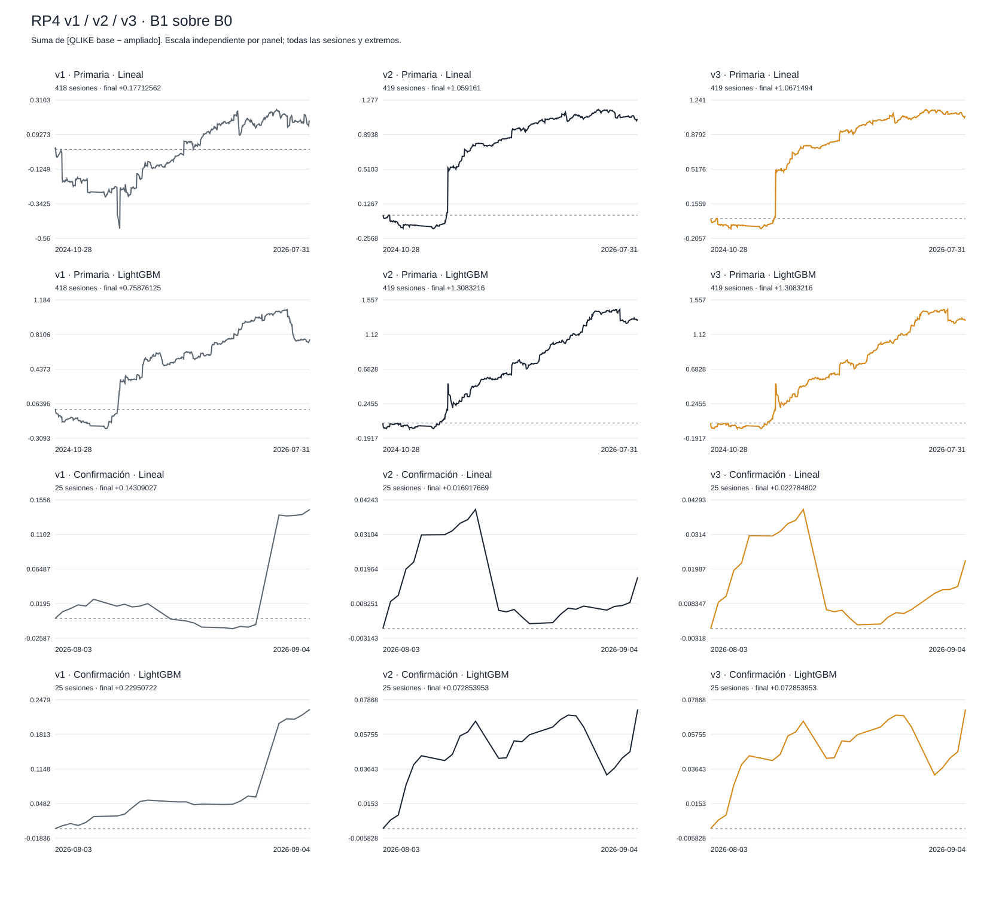
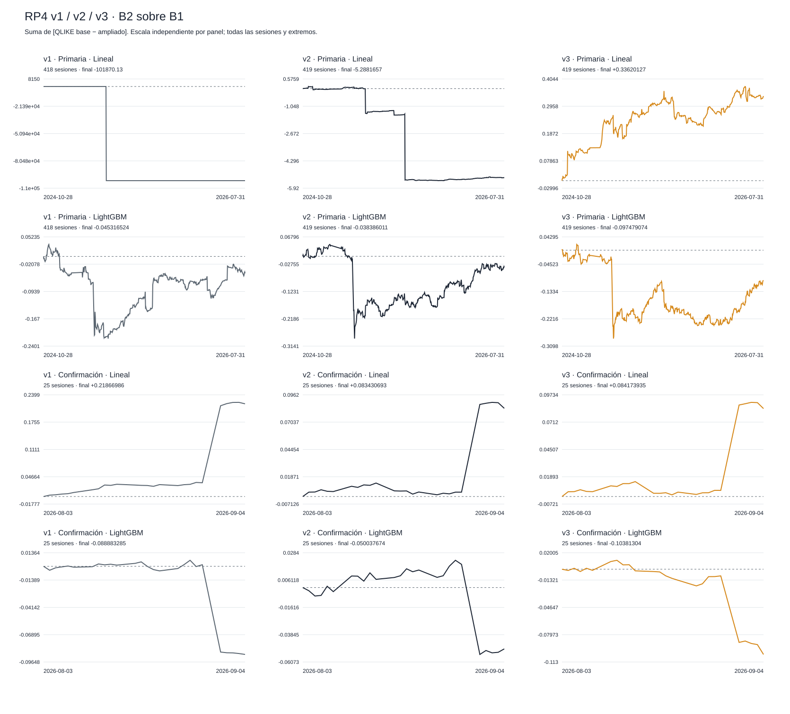

# RP4 — v3 results and v1/v2 comparison

out-of-sample walk-forward, split fixed 2026-09-07.

RESEARCH_ONLY · NOT INVESTMENT ADVICE · capital_go=false.

Delta QLIKE = baseline loss minus expanded-model loss: positive values favour B1 over B0 or B2 over B1. Assets receive equal weight within each session, and sessions receive equal weight. Reduction % = 100 × mean(delta) / mean(baseline loss).

The v3 primary decision is one-sided: H1 followed by H2, alpha 0.05 per family and window; the conjunction requires both hypotheses in both families. An unopened H2 retains its nominal p-value only as a diagnostic that cannot be promoted to primary evidence. The 95% CI is a two-sided percentile interval, not the inversion of that one-sided test.

The comparability table retains two-sided p-values and Holm adjustment over four contrasts; it is not the v3 decision rule. Secondary analyses, MZ recalibration and one favourable family cannot rescue a failed primary conjunction. The circular bootstrap uses five-session blocks, 9,999 resamples and seed 20260907.

## Primary

Registered primary conjunction: **NOT SATISFIED IN THIS WINDOW**. This describes the criterion of this specification, not a guarantee of a financial edge or universal stability.

| Family | Contrast | v1 Delta | v1 95% CI | v1 two-sided p | v1 Holm | v1 Reduction % | v1 N sessions | v1 N origins | v2 Delta | v2 95% CI | v2 two-sided p | v2 Holm | v2 Reduction % | v2 N sessions | v2 N origins | v3 Delta | v3 95% CI | v3 two-sided p | v3 Holm | v3 Reduction % | v3 N sessions | v3 N origins |
| --- | --- | --- | --- | --- | --- | --- | --- | --- | --- | --- | --- | --- | --- | --- | --- | --- | --- | --- | --- | --- | --- | --- |
| Linear OLS v1 / ridge v2–v3 | B1_over_B0 | +0.00042374551 | [-0.0016802447, 0.0023750514] | 0.6746 | 1 | +0.2903038 | 418 | 92261 | +0.0025278305 | [0.00037254832, 0.005758785] | 0.0614 | 0.1842 | +1.7152838 | 419 | 160832 | +0.0025468959 | [0.00055700527, 0.0055407196] | 0.0467 | 0.1401 | +1.7289745 | 419 | 160832 |
| Linear OLS v1 / ridge v2–v3 | B2_over_B1 | -243.70844 | [-731.12866, 0.0023546663] | 0.6095 | 1 | -167448.32 | 418 | 92261 | -0.01262092 | [-0.035946654, 0.00092737479] | 0.1876 | 0.3752 | -8.7135086 | 419 | 160832 | +0.00080238966 | [-0.0001534347, 0.0017735437] | 0.1013 | 0.2026 | +0.55429022 | 419 | 160832 |
| LightGBM QLIKE | B1_over_B0 | +0.0018152183 | [-0.0003787914, 0.0041613972] | 0.1181 | 0.4724 | +1.2035977 | 418 | 92261 | +0.0031224859 | [0.0010149407, 0.0054860165] | 0.0066 | 0.0264 | +2.0911798 | 419 | 160832 | +0.0031224859 | [0.0010149407, 0.0054860165] | 0.0066 | 0.0264 | +2.0911798 | 419 | 160832 |
| LightGBM QLIKE | B2_over_B1 | -0.00010841274 | [-0.0010017585, 0.00069008833] | 0.8002 | 1 | -0.072759829 | 418 | 92261 | -9.1613392e-05 | [-0.0014834878, 0.00095377847] | 0.8858 | 0.8858 | -0.06266543 | 419 | 160832 | -0.00023264695 | [-0.0016475987, 0.00083196677] | 0.7249 | 0.7249 | -0.15913527 | 419 | 160832 |

### One-sided v3 decision

| Family | Contrast | Delta | 95% CI | nominal one-sided p | Holm p | N sessions | Status |
| --- | --- | --- | --- | --- | --- | --- | --- |
| log_ridge_harq | B1_over_B0 | +0.0025468959 | [0.00055700527, 0.0055407196] | 0.0439 | not applicable | 419 | REJECTED |
| log_ridge_harq | B2_over_B1 | +0.00080238966 | [-0.0001534347, 0.0017735437] | 0.0525 | not applicable | 419 | NOT_REJECTED |
| lightgbm_qlike | B1_over_B0 | +0.0031224859 | [0.0010149407, 0.0054860165] | 0.0053 | not applicable | 419 | REJECTED |
| lightgbm_qlike | B2_over_B1 | -0.00023264695 | [-0.0016475987, 0.00083196677] | 0.6631 | not applicable | 419 | NOT_REJECTED |

| Family | Contrast | formal p | Nominal p role | Rejection |
| --- | --- | --- | --- | --- |
| log_ridge_harq | B1_over_B0 | 0.0439 | USED_FOR_FIXED_SEQUENCE | True |
| log_ridge_harq | B2_over_B1 | 0.0525 | USED_FOR_FIXED_SEQUENCE | False |
| lightgbm_qlike | B1_over_B0 | 0.0053 | USED_FOR_FIXED_SEQUENCE | True |
| lightgbm_qlike | B2_over_B1 | 0.6631 | USED_FOR_FIXED_SEQUENCE | False |

### Origin coverage by asset

| Asset | v1 scheduled | v1 eligible | v1 % | v2 scheduled | v2 eligible | v2 % | v3 scheduled | v3 eligible | v3 % | v3 executed |
| --- | --- | --- | --- | --- | --- | --- | --- | --- | --- | --- |
| AAPL | 27055 | 13759 | 50.855664 | 27055 | 26898 | 99.419701 | 27055 | 26898 | 99.419701 | 26898 |
| AMZN | 27055 | 14426 | 53.321013 | 27055 | 26743 | 98.846794 | 27055 | 26743 | 98.846794 | 26743 |
| META | 27054 | 11715 | 43.302284 | 27054 | 26853 | 99.257041 | 27054 | 26853 | 99.257041 | 26853 |
| MSFT | 27055 | 10123 | 37.416374 | 27055 | 26729 | 98.795047 | 27055 | 26729 | 98.795047 | 26729 |
| NVDA | 27055 | 21560 | 79.689521 | 27055 | 26764 | 98.924413 | 27055 | 26764 | 98.924413 | 26764 |
| TSLA | 27055 | 20678 | 76.429495 | 27055 | 26845 | 99.223803 | 27055 | 26845 | 99.223803 | 26845 |

v1: 418 executed sessions / 419 scheduled; 2024-10-28–2026-07-31. Skipped: 2025-10-20: no eligible origins.

v2: 419 executed sessions / 419 scheduled; 2024-10-28–2026-07-31. Skipped: none.

v3: 419 executed sessions / 419 scheduled; 2024-10-28–2026-07-31. Skipped: none.

The optional gate column rp4_eligible is absent: the inherited fallback is retained; no new gate is claimed to have been applied.

### Median, trimmed mean and conditional probability

The median of differences is not the difference of medians. Trimming removes floor(0.05 N) sessions from each tail only for that secondary analysis; no day is removed from the primary mean.

Paired median:

| Family | Contrast | Delta | 95% CI | two-sided p | Holm p | N sessions | Status |
| --- | --- | --- | --- | --- | --- | --- | --- |
| log_ridge_harq | B1_over_B0 | +0.00078803443 | [0.00022008046, 0.0017172431] | 0.0372 | 0.0744 | 419 | COMPUTED |
| log_ridge_harq | B2_over_B1 | +0.00074508207 | [0.00027639691, 0.0013207199] | 0.0074 | 0.0222 | 419 | COMPUTED |
| lightgbm_qlike | B1_over_B0 | +0.0019490061 | [0.00071575008, 0.0027658154] | 0.0002 | 0.0008 | 419 | COMPUTED |
| lightgbm_qlike | B2_over_B1 | +0.00046535248 | [-0.00011232175, 0.0012443421] | 0.1589 | 0.1589 | 419 | COMPUTED |

Mean trimmed by 5% per tail:

| Family | Contrast | Delta | 95% CI | two-sided p | Holm p | N sessions | Status |
| --- | --- | --- | --- | --- | --- | --- | --- |
| log_ridge_harq | B1_over_B0 | +0.0011382412 | [0.0003133859, 0.0019974595] | 0.0073 | 0.0219 | 419 | COMPUTED |
| log_ridge_harq | B2_over_B1 | +0.00081124206 | [0.00018636201, 0.0014937109] | 0.0155 | 0.031 | 419 | COMPUTED |
| lightgbm_qlike | B1_over_B0 | +0.0021401286 | [0.00099083693, 0.00337789] | 0.0007 | 0.0028 | 419 | COMPUTED |
| lightgbm_qlike | B2_over_B1 | +0.00039518741 | [-0.00022680791, 0.00099779488] | 0.2037 | 0.2037 | 419 | COMPUTED |

| Family | Contrast | P(delta>0) | HAC SE | N | Status |
| --- | --- | --- | --- | --- | --- |
| log_ridge_harq | B1_over_B0 | 0.97075182 | 0.0013461682 | 419 | COMPUTED |
| log_ridge_harq | B2_over_B1 | 0.94936672 | 0.00048963695 | 419 | COMPUTED |
| lightgbm_qlike | B1_over_B0 | 0.99695947 | 0.0011381901 | 419 | COMPUTED |
| lightgbm_qlike | B2_over_B1 | 0.35830691 | 0.00064092182 | 419 | COMPUTED |

P(delta>0) is a conditional Gaussian approximation: a likelihood for the mean with plug-in HAC5/N variance and a flat prior. It requires a CLT for the mean, short-memory dependence and finite variance; it does not integrate variance uncertainty and is not the bootstrap sign frequency.

### Quantile 0.90 of log(RV30)

| Family | Contrast | Delta | 95% CI | secondary one-sided p | Holm p | N sessions | Status |
| --- | --- | --- | --- | --- | --- | --- | --- |
| Linear (quantile) | B1_over_B0 | +4.8893717e-05 | [-0.00065569344, 0.00068461406] | 0.4518 | not applicable | 419 | NOT_REJECTED |
| Linear (quantile) | B2_over_B1 | +0.00037840212 | [4.9981076e-05, 0.00072910882] | 0.0167 | not applicable | 419 | NOT_TESTED |
| LightGBM (quantile) | B1_over_B0 | -0.00012704636 | [-0.00058068178, 0.00031892945] | 0.72 | not applicable | 419 | NOT_REJECTED |
| LightGBM (quantile) | B2_over_B1 | +0.00028435349 | [-5.5110528e-05, 0.00059661286] | 0.0367 | not applicable | 419 | NOT_TESTED |

| Family | Set | Mean pinball loss |
| --- | --- | --- |
| Linear (quantile) | B0 | 0.093151976 |
| Linear (quantile) | B1 | 0.093103082 |
| Linear (quantile) | B2 | 0.09272468 |
| LightGBM (quantile) | B0 | 0.09331795 |
| LightGBM (quantile) | B1 | 0.093444997 |
| LightGBM (quantile) | B2 | 0.093160643 |

### Jump: out-of-sample AUC

AUC is pooled over origins with unit weights and ties weighted 0.5; improvement = richer-set AUC − baseline AUC. Resampling duplicates whole sessions and preserves comparisons between them. A single-class resample makes all its CIs/p-values UNVERIFIABLE; it is neither redrawn nor silently discarded.

| Family | Set | AUC | 95% CI | Single-class resamples | N sessions | N origins | Status |
| --- | --- | --- | --- | --- | --- | --- | --- |
| Linear (logit) | B0 | 0.38773608 | [UNVERIFIABLE, UNVERIFIABLE] | 0 | 1 | 390 | UNVERIFIABLE |
| Linear (logit) | B1 | 0.38829546 | [UNVERIFIABLE, UNVERIFIABLE] | 0 | 1 | 390 | UNVERIFIABLE |
| Linear (logit) | B2 | 0.39143869 | [UNVERIFIABLE, UNVERIFIABLE] | 0 | 1 | 390 | UNVERIFIABLE |
| LightGBM (binary) | B0 | 0.43748169 | [UNVERIFIABLE, UNVERIFIABLE] | 0 | 1 | 390 | UNVERIFIABLE |
| LightGBM (binary) | B1 | 0.46469194 | [UNVERIFIABLE, UNVERIFIABLE] | 0 | 1 | 390 | UNVERIFIABLE |
| LightGBM (binary) | B2 | 0.39757865 | [UNVERIFIABLE, UNVERIFIABLE] | 0 | 1 | 390 | UNVERIFIABLE |

| Family | Contrast | Delta | 95% CI | secondary one-sided p | Holm p | N sessions | Status |
| --- | --- | --- | --- | --- | --- | --- | --- |
| Linear (logit) | B1_over_B0 | +0.0005593884 | [UNVERIFIABLE, UNVERIFIABLE] | UNVERIFIABLE | not applicable | 1 | NO_VERIFICABLE |
| Linear (logit) | B2_over_B1 | +0.0031432301 | [UNVERIFIABLE, UNVERIFIABLE] | UNVERIFIABLE | not applicable | 1 | NOT_TESTED |
| LightGBM (binary) | B1_over_B0 | +0.02721025 | [UNVERIFIABLE, UNVERIFIABLE] | UNVERIFIABLE | not applicable | 1 | NO_VERIFICABLE |
| LightGBM (binary) | B2_over_B1 | -0.067113289 | [UNVERIFIABLE, UNVERIFIABLE] | UNVERIFIABLE | not applicable | 1 | NOT_TESTED |

quantile_secondary: N=419 sessions, 160832 origins. Sessions excluded only from this endpoint: none.

jump_secondary: N=1 sessions, 390 origins. Sessions excluded only from this endpoint: 2024-10-28: RP4_V3_LOGISTIC_NOT_CONVERGED:{"converged": false, "ftol": 1e-12, "gradient_inf_norm_objective_over_n": 9.603331423483253e-06, "gtol": 1e-08, "intercept_penalized": false, "iterations": 1000, "lambda": 0.0001, "maxiter": 1000, "message": "STOP: TOTAL NO. OF ITERATIONS REACHED LIMIT", "objective_total_divided_by_n": 0.6345600375767995, "objective_total_sum_scale": 11136.528659472831, "single_class_training": false, "solver": "scipy_minimize_L-BFGS-B", "status": 1, "training_frequency": 0.6500854700854701}; 2024-10-29: RP4_V3_LOGISTIC_NOT_CONVERGED:{"converged": false, "ftol": 1e-12, "gradient_inf_norm_objective_over_n": 5.1358862992881345e-05, "gtol": 1e-08, "intercept_penalized": false, "iterations": 1000, "lambda": 0.0001, "maxiter": 1000, "message": "STOP: TOTAL NO. OF ITERATIONS REACHED LIMIT", "objective_total_divided_by_n": 0.6349032201148039, "objective_total_sum_scale": 11390.163768859582, "single_class_training": false, "solver": "scipy_minimize_L-BFGS-B", "status": 1, "training_frequency": 0.6502229654403567}; 2024-10-30: RP4_V3_LOGISTIC_NOT_CONVERGED:{"converged": false, "ftol": 1e-12, "gradient_inf_norm_objective_over_n": 2.1280725983998327e-05, "gtol": 1e-08, "intercept_penalized": false, "iterations": 1000, "lambda": 0.0001, "maxiter": 1000, "message": "STOP: TOTAL NO. OF ITERATIONS REACHED LIMIT", "objective_total_divided_by_n": 0.6359702717221362, "objective_total_sum_scale": 11657.335080666755, "single_class_training": false, "solver": "scipy_minimize_L-BFGS-B", "status": 1, "training_frequency": 0.648772504091653}; 2024-10-31: RP4_V3_LOGISTIC_NOT_CONVERGED:{"converged": false, "ftol": 1e-12, "gradient_inf_norm_objective_over_n": 3.115980002310587e-05, "gtol": 1e-08, "intercept_penalized": false, "iterations": 1000, "lambda": 0.0001, "maxiter": 1000, "message": "STOP: TOTAL NO. OF ITERATIONS REACHED LIMIT", "objective_total_divided_by_n": 0.636660999263024, "objective_total_sum_scale": 11918.29390620381, "single_class_training": false, "solver": "scipy_minimize_L-BFGS-B", "status": 1, "training_frequency": 0.6478632478632479}; 2024-11-01: RP4_V3_LOGISTIC_NOT_CONVERGED:{"converged": false, "ftol": 1e-12, "gradient_inf_norm_objective_over_n": 9.070600540646869e-06, "gtol": 1e-08, "intercept_penalized": false, "iterations": 1000, "lambda": 0.0001, "maxiter": 1000, "message": "STOP: TOTAL NO. OF ITERATIONS REACHED LIMIT", "objective_total_divided_by_n": 0.6375540969911744, "objective_total_sum_scale": 12183.658793501343, "single_class_training": false, "solver": "scipy_minimize_L-BFGS-B", "status": 1, "training_frequency": 0.6468341182626897}; 2024-11-04: RP4_V3_LOGISTIC_NOT_CONVERGED:{"converged": false, "ftol": 1e-12, "gradient_inf_norm_objective_over_n": 2.586210396878762e-07, "gtol": 1e-08, "intercept_penalized": false, "iterations": 1000, "lambda": 0.0001, "maxiter": 1000, "message": "STOP: TOTAL NO. OF ITERATIONS REACHED LIMIT", "objective_total_divided_by_n": 0.6400927431542613, "objective_total_sum_scale": 12481.808491508096, "single_class_training": false, "solver": "scipy_minimize_L-BFGS-B", "status": 1, "training_frequency": 0.6498461538461539}; 2024-11-05: RP4_V3_LOGISTIC_NOT_CONVERGED:{"converged": false, "ftol": 1e-12, "gradient_inf_norm_objective_over_n": 7.756840415240572e-05, "gtol": 1e-08, "intercept_penalized": false, "iterations": 1000, "lambda": 0.0001, "maxiter": 1000, "message": "STOP: TOTAL NO. OF ITERATIONS REACHED LIMIT", "objective_total_divided_by_n": 0.6359594295439396, "objective_total_sum_scale": 12649.233053628957, "single_class_training": false, "solver": "scipy_minimize_L-BFGS-B", "status": 1, "training_frequency": 0.6497234791352439}; 2024-11-06: RP4_V3_LOGISTIC_NOT_CONVERGED:{"converged": false, "ftol": 1e-12, "gradient_inf_norm_objective_over_n": 1.3550361742440636e-05, "gtol": 1e-08, "intercept_penalized": false, "iterations": 1000, "lambda": 0.0001, "maxiter": 1000, "message": "STOP: TOTAL NO. OF ITERATIONS REACHED LIMIT", "objective_total_divided_by_n": 0.6359562258564398, "objective_total_sum_scale": 12897.1922603686, "single_class_training": false, "solver": "scipy_minimize_L-BFGS-B", "status": 1, "training_frequency": 0.6499506903353057}; 2024-11-07: RP4_V3_LOGISTIC_NOT_CONVERGED:{"converged": false, "ftol": 1e-12, "gradient_inf_norm_objective_over_n": 1.0263802551845208e-05, "gtol": 1e-08, "intercept_penalized": false, "iterations": 1000, "lambda": 0.0001, "maxiter": 1000, "message": "STOP: TOTAL NO. OF ITERATIONS REACHED LIMIT", "objective_total_divided_by_n": 0.63656572932533, "objective_total_sum_scale": 13157.81362515457, "single_class_training": false, "solver": "scipy_minimize_L-BFGS-B", "status": 1, "training_frequency": 0.6492985002418965}; 2024-11-08: RP4_V3_LOGISTIC_NOT_CONVERGED:{"converged": false, "ftol": 1e-12, "gradient_inf_norm_objective_over_n": 1.8143937205168597e-05, "gtol": 1e-08, "intercept_penalized": false, "iterations": 1000, "lambda": 0.0001, "maxiter": 1000, "message": "STOP: TOTAL NO. OF ITERATIONS REACHED LIMIT", "objective_total_divided_by_n": 0.6360477888910298, "objective_total_sum_scale": 13395.166434045086, "single_class_training": false, "solver": "scipy_minimize_L-BFGS-B", "status": 1, "training_frequency": 0.6511870845204178}; 2024-11-11: RP4_V3_LOGISTIC_NOT_CONVERGED:{"converged": false, "ftol": 1e-12, "gradient_inf_norm_objective_over_n": 1.3328714302580841e-05, "gtol": 1e-08, "intercept_penalized": false, "iterations": 1000, "lambda": 0.0001, "maxiter": 1000, "message": "STOP: TOTAL NO. OF ITERATIONS REACHED LIMIT", "objective_total_divided_by_n": 0.6372779477222077, "objective_total_sum_scale": 13669.611978641355, "single_class_training": false, "solver": "scipy_minimize_L-BFGS-B", "status": 1, "training_frequency": 0.6494172494172494}; 2024-11-12: RP4_V3_LOGISTIC_NOT_CONVERGED:{"converged": false, "ftol": 1e-12, "gradient_inf_norm_objective_over_n": 9.9067122332144e-06, "gtol": 1e-08, "intercept_penalized": false, "iterations": 1000, "lambda": 0.0001, "maxiter": 1000, "message": "STOP: TOTAL NO. OF ITERATIONS REACHED LIMIT", "objective_total_divided_by_n": 0.6380585036412056, "objective_total_sum_scale": 13935.19771952393, "single_class_training": false, "solver": "scipy_minimize_L-BFGS-B", "status": 1, "training_frequency": 0.6485347985347986}; 2024-11-13: RP4_V3_LOGISTIC_NOT_CONVERGED:{"converged": false, "ftol": 1e-12, "gradient_inf_norm_objective_over_n": 1.2082240365174574e-05, "gtol": 1e-08, "intercept_penalized": false, "iterations": 1000, "lambda": 0.0001, "maxiter": 1000, "message": "STOP: TOTAL NO. OF ITERATIONS REACHED LIMIT", "objective_total_divided_by_n": 0.6386604588706631, "objective_total_sum_scale": 14197.422000694842, "single_class_training": false, "solver": "scipy_minimize_L-BFGS-B", "status": 1, "training_frequency": 0.6481331533963113}; 2024-11-14: RP4_V3_LOGISTIC_NOT_CONVERGED:{"converged": false, "ftol": 1e-12, "gradient_inf_norm_objective_over_n": 6.508893244277911e-06, "gtol": 1e-08, "intercept_penalized": false, "iterations": 1000, "lambda": 0.0001, "maxiter": 1000, "message": "STOP: TOTAL NO. OF ITERATIONS REACHED LIMIT", "objective_total_divided_by_n": 0.6399153652079139, "objective_total_sum_scale": 14474.885561003013, "single_class_training": false, "solver": "scipy_minimize_L-BFGS-B", "status": 1, "training_frequency": 0.6458443854995579}; 2024-11-15: RP4_V3_LOGISTIC_NOT_CONVERGED:{"converged": false, "ftol": 1e-12, "gradient_inf_norm_objective_over_n": 1.2188416166577692e-06, "gtol": 1e-08, "intercept_penalized": false, "iterations": 1000, "lambda": 0.01, "maxiter": 1000, "message": "STOP: TOTAL NO. OF ITERATIONS REACHED LIMIT", "objective_total_divided_by_n": 0.6431047699461774, "objective_total_sum_scale": 14797.84075646154, "single_class_training": false, "solver": "scipy_minimize_L-BFGS-B", "status": 1, "training_frequency": 0.6458061712299}; 2024-11-18: RP4_V3_LOGISTIC_NOT_CONVERGED:{"converged": false, "ftol": 1e-12, "gradient_inf_norm_objective_over_n": 1.1979506057873529e-05, "gtol": 1e-08, "intercept_penalized": false, "iterations": 1000, "lambda": 0.0001, "maxiter": 1000, "message": "STOP: TOTAL NO. OF ITERATIONS REACHED LIMIT", "objective_total_divided_by_n": 0.640501631025759, "objective_total_sum_scale": 14987.73816600276, "single_class_training": false, "solver": "scipy_minimize_L-BFGS-B", "status": 1, "training_frequency": 0.6454273504273504}; 2024-11-19: RP4_V3_LOGISTIC_NOT_CONVERGED:{"converged": false, "ftol": 1e-12, "gradient_inf_norm_objective_over_n": 1.0384297309028502e-06, "gtol": 1e-08, "intercept_penalized": false, "iterations": 1000, "lambda": 0.01, "maxiter": 1000, "message": "STOP: TOTAL NO. OF ITERATIONS REACHED LIMIT", "objective_total_divided_by_n": 0.643114932730862, "objective_total_sum_scale": 15299.704249667206, "single_class_training": false, "solver": "scipy_minimize_L-BFGS-B", "status": 1, "training_frequency": 0.6462379150903741}; 2024-11-20: RP4_V3_LOGISTIC_NOT_CONVERGED:{"converged": false, "ftol": 1e-12, "gradient_inf_norm_objective_over_n": 2.0152097382737497e-05, "gtol": 1e-08, "intercept_penalized": false, "iterations": 1000, "lambda": 0.0001, "maxiter": 1000, "message": "STOP: TOTAL NO. OF ITERATIONS REACHED LIMIT", "objective_total_divided_by_n": 0.6405555591487277, "objective_total_sum_scale": 15488.633420216236, "single_class_training": false, "solver": "scipy_minimize_L-BFGS-B", "status": 1, "training_frequency": 0.6463192721257237}; 2024-11-21: RP4_V3_LOGISTIC_NOT_CONVERGED:{"converged": false, "ftol": 1e-12, "gradient_inf_norm_objective_over_n": 6.16764047794679e-06, "gtol": 1e-08, "intercept_penalized": false, "iterations": 1000, "lambda": 0.0001, "maxiter": 1000, "message": "STOP: TOTAL NO. OF ITERATIONS REACHED LIMIT", "objective_total_divided_by_n": 0.6406012035580563, "objective_total_sum_scale": 15739.571571421442, "single_class_training": false, "solver": "scipy_minimize_L-BFGS-B", "status": 1, "training_frequency": 0.6458689458689458}; 2024-11-22: RP4_V3_LOGISTIC_NOT_CONVERGED:{"converged": false, "ftol": 1e-12, "gradient_inf_norm_objective_over_n": 5.754806301014751e-06, "gtol": 1e-08, "intercept_penalized": false, "iterations": 1000, "lambda": 0.0001, "maxiter": 1000, "message": "STOP: TOTAL NO. OF ITERATIONS REACHED LIMIT", "objective_total_divided_by_n": 0.6409822086383629, "objective_total_sum_scale": 15998.915927613538, "single_class_training": false, "solver": "scipy_minimize_L-BFGS-B", "status": 1, "training_frequency": 0.6459134615384615}; 2024-11-25: RP4_V3_LOGISTIC_NOT_CONVERGED:{"converged": false, "ftol": 1e-12, "gradient_inf_norm_objective_over_n": 1.4174331437005327e-05, "gtol": 1e-08, "intercept_penalized": false, "iterations": 1000, "lambda": 0.0001, "maxiter": 1000, "message": "STOP: TOTAL NO. OF ITERATIONS REACHED LIMIT", "objective_total_divided_by_n": 0.640761731143785, "objective_total_sum_scale": 16243.309884494949, "single_class_training": false, "solver": "scipy_minimize_L-BFGS-B", "status": 1, "training_frequency": 0.6469033530571993}; 2024-11-26: RP4_V3_LOGISTIC_NOT_CONVERGED:{"converged": false, "ftol": 1e-12, "gradient_inf_norm_objective_over_n": 1.4359900455390702e-05, "gtol": 1e-08, "intercept_penalized": false, "iterations": 1000, "lambda": 0.0001, "maxiter": 1000, "message": "STOP: TOTAL NO. OF ITERATIONS REACHED LIMIT", "objective_total_divided_by_n": 0.6413212580939355, "objective_total_sum_scale": 16507.6091833379, "single_class_training": false, "solver": "scipy_minimize_L-BFGS-B", "status": 1, "training_frequency": 0.6461149961149961}; 2024-11-27: RP4_V3_LOGISTIC_NOT_CONVERGED:{"converged": false, "ftol": 1e-12, "gradient_inf_norm_objective_over_n": 5.147602253286497e-06, "gtol": 1e-08, "intercept_penalized": false, "iterations": 1000, "lambda": 0.0001, "maxiter": 1000, "message": "STOP: TOTAL NO. OF ITERATIONS REACHED LIMIT", "objective_total_divided_by_n": 0.6421055732150458, "objective_total_sum_scale": 16778.218628109145, "single_class_training": false, "solver": "scipy_minimize_L-BFGS-B", "status": 1, "training_frequency": 0.6451205510907003}; 2024-11-29: RP4_V3_LOGISTIC_NOT_CONVERGED:{"converged": false, "ftol": 1e-12, "gradient_inf_norm_objective_over_n": 1.262974711282871e-05, "gtol": 1e-08, "intercept_penalized": false, "iterations": 1000, "lambda": 0.0001, "maxiter": 1000, "message": "STOP: TOTAL NO. OF ITERATIONS REACHED LIMIT", "objective_total_divided_by_n": 0.641821610723037, "objective_total_sum_scale": 17021.10911637494, "single_class_training": false, "solver": "scipy_minimize_L-BFGS-B", "status": 1, "training_frequency": 0.6455505279034691}; 2024-12-02: RP4_V3_LOGISTIC_NOT_CONVERGED:{"converged": false, "ftol": 1e-12, "gradient_inf_norm_objective_over_n": 2.5444288252328663e-06, "gtol": 1e-08, "intercept_penalized": false, "iterations": 1000, "lambda": 0.0001, "maxiter": 1000, "message": "STOP: TOTAL NO. OF ITERATIONS REACHED LIMIT", "objective_total_divided_by_n": 0.6412404807548615, "objective_total_sum_scale": 17255.781337113323, "single_class_training": false, "solver": "scipy_minimize_L-BFGS-B", "status": 1, "training_frequency": 0.6465997770345596}; 2024-12-03: RP4_V3_LOGISTIC_NOT_CONVERGED:{"converged": false, "ftol": 1e-12, "gradient_inf_norm_objective_over_n": 1.4461732615545451e-05, "gtol": 1e-08, "intercept_penalized": false, "iterations": 1000, "lambda": 0.0001, "maxiter": 1000, "message": "STOP: TOTAL NO. OF ITERATIONS REACHED LIMIT", "objective_total_divided_by_n": 0.6412060367282411, "objective_total_sum_scale": 17504.92480268098, "single_class_training": false, "solver": "scipy_minimize_L-BFGS-B", "status": 1, "training_frequency": 0.6468864468864469}; 2024-12-04: RP4_V3_LOGISTIC_NOT_CONVERGED:{"converged": false, "ftol": 1e-12, "gradient_inf_norm_objective_over_n": 1.601813266650091e-05, "gtol": 1e-08, "intercept_penalized": false, "iterations": 1000, "lambda": 0.0001, "maxiter": 1000, "message": "STOP: TOTAL NO. OF ITERATIONS REACHED LIMIT", "objective_total_divided_by_n": 0.6416807561448766, "objective_total_sum_scale": 17768.140137651633, "single_class_training": false, "solver": "scipy_minimize_L-BFGS-B", "status": 1, "training_frequency": 0.6455760202239076}; 2024-12-05: RP4_V3_LOGISTIC_NOT_CONVERGED:{"converged": false, "ftol": 1e-12, "gradient_inf_norm_objective_over_n": 5.037354432722777e-07, "gtol": 1e-08, "intercept_penalized": false, "iterations": 1000, "lambda": 0.01, "maxiter": 1000, "message": "STOP: TOTAL NO. OF ITERATIONS REACHED LIMIT", "objective_total_divided_by_n": 0.6444473671145248, "objective_total_sum_scale": 18096.082068575855, "single_class_training": false, "solver": "scipy_minimize_L-BFGS-B", "status": 1, "training_frequency": 0.645014245014245}; 2024-12-06: RP4_V3_LOGISTIC_NOT_CONVERGED:{"converged": false, "ftol": 1e-12, "gradient_inf_norm_objective_over_n": 3.487693966076058e-05, "gtol": 1e-08, "intercept_penalized": false, "iterations": 1000, "lambda": 0.0001, "maxiter": 1000, "message": "STOP: TOTAL NO. OF ITERATIONS REACHED LIMIT", "objective_total_divided_by_n": 0.6426643133255985, "objective_total_sum_scale": 18296.65300037979, "single_class_training": false, "solver": "scipy_minimize_L-BFGS-B", "status": 1, "training_frequency": 0.643905865823674}; 2024-12-09: RP4_V3_LOGISTIC_NOT_CONVERGED:{"converged": false, "ftol": 1e-12, "gradient_inf_norm_objective_over_n": 1.3633951975872831e-05, "gtol": 1e-08, "intercept_penalized": false, "iterations": 1000, "lambda": 0.0001, "maxiter": 1000, "message": "STOP: TOTAL NO. OF ITERATIONS REACHED LIMIT", "objective_total_divided_by_n": 0.6432246741969742, "objective_total_sum_scale": 18563.464097324675, "single_class_training": false, "solver": "scipy_minimize_L-BFGS-B", "status": 1, "training_frequency": 0.6434511434511434}; 2024-12-10: RP4_V3_LOGISTIC_NOT_CONVERGED:{"converged": false, "ftol": 1e-12, "gradient_inf_norm_objective_over_n": 3.446450307353321e-05, "gtol": 1e-08, "intercept_penalized": false, "iterations": 1000, "lambda": 0.0001, "maxiter": 1000, "message": "STOP: TOTAL NO. OF ITERATIONS REACHED LIMIT", "objective_total_divided_by_n": 0.6432691709590118, "objective_total_sum_scale": 18815.623250551096, "single_class_training": false, "solver": "scipy_minimize_L-BFGS-B", "status": 1, "training_frequency": 0.6435213675213676}; 2024-12-11: RP4_V3_LOGISTIC_NOT_CONVERGED:{"converged": false, "ftol": 1e-12, "gradient_inf_norm_objective_over_n": 4.3855412041980396e-05, "gtol": 1e-08, "intercept_penalized": false, "iterations": 1000, "lambda": 0.0001, "maxiter": 1000, "message": "STOP: TOTAL NO. OF ITERATIONS REACHED LIMIT", "objective_total_divided_by_n": 0.643033719085178, "objective_total_sum_scale": 19059.519433684676, "single_class_training": false, "solver": "scipy_minimize_L-BFGS-B", "status": 1, "training_frequency": 0.6441295546558704}; 2024-12-12: RP4_V3_LOGISTIC_NOT_CONVERGED:{"converged": false, "ftol": 1e-12, "gradient_inf_norm_objective_over_n": 2.621716672378218e-05, "gtol": 1e-08, "intercept_penalized": false, "iterations": 1000, "lambda": 0.0001, "maxiter": 1000, "message": "STOP: TOTAL NO. OF ITERATIONS REACHED LIMIT", "objective_total_divided_by_n": 0.644245502436473, "objective_total_sum_scale": 19346.692438167287, "single_class_training": false, "solver": "scipy_minimize_L-BFGS-B", "status": 1, "training_frequency": 0.6424575424575425}; 2024-12-13: RP4_V3_LOGISTIC_NOT_CONVERGED:{"converged": false, "ftol": 1e-12, "gradient_inf_norm_objective_over_n": 3.7634940540910327e-07, "gtol": 1e-08, "intercept_penalized": false, "iterations": 1000, "lambda": 0.01, "maxiter": 1000, "message": "STOP: TOTAL NO. OF ITERATIONS REACHED LIMIT", "objective_total_divided_by_n": 0.6463470339142183, "objective_total_sum_scale": 19661.876771670522, "single_class_training": false, "solver": "scipy_minimize_L-BFGS-B", "status": 1, "training_frequency": 0.6427679158448389}; 2024-12-16: RP4_V3_LOGISTIC_NOT_CONVERGED:{"converged": false, "ftol": 1e-12, "gradient_inf_norm_objective_over_n": 1.54418112204417e-05, "gtol": 1e-08, "intercept_penalized": false, "iterations": 1000, "lambda": 0.0001, "maxiter": 1000, "message": "STOP: TOTAL NO. OF ITERATIONS REACHED LIMIT", "objective_total_divided_by_n": 0.6442306556899771, "objective_total_sum_scale": 19709.592680179157, "single_class_training": false, "solver": "scipy_minimize_L-BFGS-B", "status": 1, "training_frequency": 0.6423481728443485}; 2024-12-17: RP4_V3_LOGISTIC_NOT_CONVERGED:{"converged": false, "ftol": 1e-12, "gradient_inf_norm_objective_over_n": 1.2177903040983214e-05, "gtol": 1e-08, "intercept_penalized": false, "iterations": 1000, "lambda": 0.0001, "maxiter": 1000, "message": "STOP: TOTAL NO. OF ITERATIONS REACHED LIMIT", "objective_total_divided_by_n": 0.6439972768032695, "objective_total_sum_scale": 19953.6116244725, "single_class_training": false, "solver": "scipy_minimize_L-BFGS-B", "status": 1, "training_frequency": 0.6429447456751872}; 2024-12-18: RP4_V3_LOGISTIC_NOT_CONVERGED:{"converged": false, "ftol": 1e-12, "gradient_inf_norm_objective_over_n": 1.512742947416834e-05, "gtol": 1e-08, "intercept_penalized": false, "iterations": 1000, "lambda": 0.0001, "maxiter": 1000, "message": "STOP: TOTAL NO. OF ITERATIONS REACHED LIMIT", "objective_total_divided_by_n": 0.6440423580764534, "objective_total_sum_scale": 20206.18494229065, "single_class_training": false, "solver": "scipy_minimize_L-BFGS-B", "status": 1, "training_frequency": 0.6430483840122394}; 2024-12-19: RP4_V3_LOGISTIC_NOT_CONVERGED:{"converged": false, "ftol": 1e-12, "gradient_inf_norm_objective_over_n": 1.657863178641388e-05, "gtol": 1e-08, "intercept_penalized": false, "iterations": 1000, "lambda": 0.0001, "maxiter": 1000, "message": "STOP: TOTAL NO. OF ITERATIONS REACHED LIMIT", "objective_total_divided_by_n": 0.6438081567698419, "objective_total_sum_scale": 20449.92229163726, "single_class_training": false, "solver": "scipy_minimize_L-BFGS-B", "status": 1, "training_frequency": 0.6435587457499056}; 2024-12-23: RP4_V3_LOGISTIC_NOT_CONVERGED:{"converged": false, "ftol": 1e-12, "gradient_inf_norm_objective_over_n": 6.08336954715032e-07, "gtol": 1e-08, "intercept_penalized": false, "iterations": 1000, "lambda": 0.0001, "maxiter": 1000, "message": "STOP: TOTAL NO. OF ITERATIONS REACHED LIMIT", "objective_total_divided_by_n": 0.643704380016523, "objective_total_sum_scale": 20948.715343257725, "single_class_training": false, "solver": "scipy_minimize_L-BFGS-B", "status": 1, "training_frequency": 0.643344395280236}; 2024-12-24: RP4_V3_LOGISTIC_NOT_CONVERGED:{"converged": false, "ftol": 1e-12, "gradient_inf_norm_objective_over_n": 5.603298427719233e-07, "gtol": 1e-08, "intercept_penalized": false, "iterations": 1000, "lambda": 0.0001, "maxiter": 1000, "message": "STOP: TOTAL NO. OF ITERATIONS REACHED LIMIT", "objective_total_divided_by_n": 0.6439112501103649, "objective_total_sum_scale": 21206.573111134756, "single_class_training": false, "solver": "scipy_minimize_L-BFGS-B", "status": 1, "training_frequency": 0.6429829355681059}; 2024-12-26: RP4_V3_LOGISTIC_NOT_CONVERGED:{"converged": false, "ftol": 1e-12, "gradient_inf_norm_objective_over_n": 3.0969420748194916e-06, "gtol": 1e-08, "intercept_penalized": false, "iterations": 1000, "lambda": 0.0001, "maxiter": 1000, "message": "STOP: TOTAL NO. OF ITERATIONS REACHED LIMIT", "objective_total_divided_by_n": 0.6458628268809049, "objective_total_sum_scale": 21522.732842979276, "single_class_training": false, "solver": "scipy_minimize_L-BFGS-B", "status": 1, "training_frequency": 0.642809986796303}; 2024-12-27: RP4_V3_LOGISTIC_NOT_CONVERGED:{"converged": false, "ftol": 1e-12, "gradient_inf_norm_objective_over_n": 4.645581891454048e-06, "gtol": 1e-08, "intercept_penalized": false, "iterations": 1000, "lambda": 0.0001, "maxiter": 1000, "message": "STOP: TOTAL NO. OF ITERATIONS REACHED LIMIT", "objective_total_divided_by_n": 0.6455599788681183, "objective_total_sum_scale": 21764.409127559742, "single_class_training": false, "solver": "scipy_minimize_L-BFGS-B", "status": 1, "training_frequency": 0.6434122323070535}; 2024-12-30: RP4_V3_LOGISTIC_NOT_CONVERGED:{"converged": false, "ftol": 1e-12, "gradient_inf_norm_objective_over_n": 1.0885860414252634e-05, "gtol": 1e-08, "intercept_penalized": false, "iterations": 1000, "lambda": 0.0001, "maxiter": 1000, "message": "STOP: TOTAL NO. OF ITERATIONS REACHED LIMIT", "objective_total_divided_by_n": 0.6459431300159619, "objective_total_sum_scale": 22029.244506064366, "single_class_training": false, "solver": "scipy_minimize_L-BFGS-B", "status": 1, "training_frequency": 0.6427691766361717}; 2024-12-31: RP4_V3_LOGISTIC_NOT_CONVERGED:{"converged": false, "ftol": 1e-12, "gradient_inf_norm_objective_over_n": 5.736990008254291e-06, "gtol": 1e-08, "intercept_penalized": false, "iterations": 1000, "lambda": 0.0001, "maxiter": 1000, "message": "STOP: TOTAL NO. OF ITERATIONS REACHED LIMIT", "objective_total_divided_by_n": 0.6462567217226326, "objective_total_sum_scale": 22291.97935910049, "single_class_training": false, "solver": "scipy_minimize_L-BFGS-B", "status": 1, "training_frequency": 0.642894416420247}; 2025-01-02: RP4_V3_LOGISTIC_NOT_CONVERGED:{"converged": false, "ftol": 1e-12, "gradient_inf_norm_objective_over_n": 7.99746068131141e-06, "gtol": 1e-08, "intercept_penalized": false, "iterations": 1000, "lambda": 0.0001, "maxiter": 1000, "message": "STOP: TOTAL NO. OF ITERATIONS REACHED LIMIT", "objective_total_divided_by_n": 0.646085109006085, "objective_total_sum_scale": 22538.03294256827, "single_class_training": false, "solver": "scipy_minimize_L-BFGS-B", "status": 1, "training_frequency": 0.6435615181745212}; 2025-01-03: RP4_V3_LOGISTIC_NOT_CONVERGED:{"converged": false, "ftol": 1e-12, "gradient_inf_norm_objective_over_n": 2.2361927963889423e-06, "gtol": 1e-08, "intercept_penalized": false, "iterations": 1000, "lambda": 0.0001, "maxiter": 1000, "message": "STOP: TOTAL NO. OF ITERATIONS REACHED LIMIT", "objective_total_divided_by_n": 0.6461438065399203, "objective_total_sum_scale": 22792.07663188915, "single_class_training": false, "solver": "scipy_minimize_L-BFGS-B", "status": 1, "training_frequency": 0.6435618302432387}; 2025-01-06: RP4_V3_LOGISTIC_NOT_CONVERGED:{"converged": false, "ftol": 1e-12, "gradient_inf_norm_objective_over_n": 3.0948087015623703e-06, "gtol": 1e-08, "intercept_penalized": false, "iterations": 1000, "lambda": 0.0001, "maxiter": 1000, "message": "STOP: TOTAL NO. OF ITERATIONS REACHED LIMIT", "objective_total_divided_by_n": 0.6461751150770242, "objective_total_sum_scale": 23045.18930410699, "single_class_training": false, "solver": "scipy_minimize_L-BFGS-B", "status": 1, "training_frequency": 0.6435340960071781}; 2025-01-07: RP4_V3_LOGISTIC_NOT_CONVERGED:{"converged": false, "ftol": 1e-12, "gradient_inf_norm_objective_over_n": 5.1979598667374954e-06, "gtol": 1e-08, "intercept_penalized": false, "iterations": 1000, "lambda": 0.0001, "maxiter": 1000, "message": "STOP: TOTAL NO. OF ITERATIONS REACHED LIMIT", "objective_total_divided_by_n": 0.6466176814662666, "objective_total_sum_scale": 23313.153887584776, "single_class_training": false, "solver": "scipy_minimize_L-BFGS-B", "status": 1, "training_frequency": 0.6429799744827204}; 2025-01-08: RP4_V3_LOGISTIC_NOT_CONVERGED:{"converged": false, "ftol": 1e-12, "gradient_inf_norm_objective_over_n": 8.14276752961311e-06, "gtol": 1e-08, "intercept_penalized": false, "iterations": 1000, "lambda": 0.0001, "maxiter": 1000, "message": "STOP: TOTAL NO. OF ITERATIONS REACHED LIMIT", "objective_total_divided_by_n": 0.6475059961106874, "objective_total_sum_scale": 23597.70852225789, "single_class_training": false, "solver": "scipy_minimize_L-BFGS-B", "status": 1, "training_frequency": 0.6420535616288003}; 2025-01-10: RP4_V3_LOGISTIC_NOT_CONVERGED:{"converged": false, "ftol": 1e-12, "gradient_inf_norm_objective_over_n": 2.6513747542975994e-06, "gtol": 1e-08, "intercept_penalized": false, "iterations": 1000, "lambda": 0.0001, "maxiter": 1000, "message": "STOP: TOTAL NO. OF ITERATIONS REACHED LIMIT", "objective_total_divided_by_n": 0.6473990837895535, "objective_total_sum_scale": 23846.29785230441, "single_class_training": false, "solver": "scipy_minimize_L-BFGS-B", "status": 1, "training_frequency": 0.6421512732801217}; 2025-01-13: RP4_V3_LOGISTIC_NOT_CONVERGED:{"converged": false, "ftol": 1e-12, "gradient_inf_norm_objective_over_n": 5.196695844771994e-06, "gtol": 1e-08, "intercept_penalized": false, "iterations": 1000, "lambda": 0.0001, "maxiter": 1000, "message": "STOP: TOTAL NO. OF ITERATIONS REACHED LIMIT", "objective_total_divided_by_n": 0.6473410586752731, "objective_total_sum_scale": 23956.79789945451, "single_class_training": false, "solver": "scipy_minimize_L-BFGS-B", "status": 1, "training_frequency": 0.6424556852572417}; 2025-01-14: RP4_V3_LOGISTIC_NOT_CONVERGED:{"converged": false, "ftol": 1e-12, "gradient_inf_norm_objective_over_n": 2.6960825656433906e-06, "gtol": 1e-08, "intercept_penalized": false, "iterations": 1000, "lambda": 0.0001, "maxiter": 1000, "message": "STOP: TOTAL NO. OF ITERATIONS REACHED LIMIT", "objective_total_divided_by_n": 0.6481409127486946, "objective_total_sum_scale": 24239.17385497568, "single_class_training": false, "solver": "scipy_minimize_L-BFGS-B", "status": 1, "training_frequency": 0.6415048933098026}; 2025-01-15: RP4_V3_LOGISTIC_NOT_CONVERGED:{"converged": false, "ftol": 1e-12, "gradient_inf_norm_objective_over_n": 7.339394670043404e-06, "gtol": 1e-08, "intercept_penalized": false, "iterations": 1000, "lambda": 0.0001, "maxiter": 1000, "message": "STOP: TOTAL NO. OF ITERATIONS REACHED LIMIT", "objective_total_divided_by_n": 0.6485709351929149, "objective_total_sum_scale": 24508.198499069866, "single_class_training": false, "solver": "scipy_minimize_L-BFGS-B", "status": 1, "training_frequency": 0.6409706785222822}; 2025-01-16: RP4_V3_LOGISTIC_NOT_CONVERGED:{"converged": false, "ftol": 1e-12, "gradient_inf_norm_objective_over_n": 5.87018724713045e-06, "gtol": 1e-08, "intercept_penalized": false, "iterations": 1000, "lambda": 0.0001, "maxiter": 1000, "message": "STOP: TOTAL NO. OF ITERATIONS REACHED LIMIT", "objective_total_divided_by_n": 0.6488564243556048, "objective_total_sum_scale": 24772.040569048277, "single_class_training": false, "solver": "scipy_minimize_L-BFGS-B", "status": 1, "training_frequency": 0.6409188537901409}; 2025-01-17: RP4_V3_LOGISTIC_NOT_CONVERGED:{"converged": false, "ftol": 1e-12, "gradient_inf_norm_objective_over_n": 6.707314238754534e-06, "gtol": 1e-08, "intercept_penalized": false, "iterations": 1000, "lambda": 0.0001, "maxiter": 1000, "message": "STOP: TOTAL NO. OF ITERATIONS REACHED LIMIT", "objective_total_divided_by_n": 0.6489470835819144, "objective_total_sum_scale": 25028.591119587276, "single_class_training": false, "solver": "scipy_minimize_L-BFGS-B", "status": 1, "training_frequency": 0.6409977183157022}; 2025-01-21: RP4_V3_LOGISTIC_NOT_CONVERGED:{"converged": false, "ftol": 1e-12, "gradient_inf_norm_objective_over_n": 2.7941872526194545e-06, "gtol": 1e-08, "intercept_penalized": false, "iterations": 1000, "lambda": 0.0001, "maxiter": 1000, "message": "STOP: TOTAL NO. OF ITERATIONS REACHED LIMIT", "objective_total_divided_by_n": 0.6492885356689042, "objective_total_sum_scale": 25294.98277258917, "single_class_training": false, "solver": "scipy_minimize_L-BFGS-B", "status": 1, "training_frequency": 0.6404589557985523}; 2025-01-22: RP4_V3_LOGISTIC_NOT_CONVERGED:{"converged": false, "ftol": 1e-12, "gradient_inf_norm_objective_over_n": 3.1309226844541224e-06, "gtol": 1e-08, "intercept_penalized": false, "iterations": 1000, "lambda": 0.0001, "maxiter": 1000, "message": "STOP: TOTAL NO. OF ITERATIONS REACHED LIMIT", "objective_total_divided_by_n": 0.6493027770341708, "objective_total_sum_scale": 25548.765670740555, "single_class_training": false, "solver": "scipy_minimize_L-BFGS-B", "status": 1, "training_frequency": 0.6404137440276507}; 2025-01-23: RP4_V3_LOGISTIC_NOT_CONVERGED:{"converged": false, "ftol": 1e-12, "gradient_inf_norm_objective_over_n": 4.062396891290397e-06, "gtol": 1e-08, "intercept_penalized": false, "iterations": 1000, "lambda": 0.0001, "maxiter": 1000, "message": "STOP: TOTAL NO. OF ITERATIONS REACHED LIMIT", "objective_total_divided_by_n": 0.6492343094386359, "objective_total_sum_scale": 25799.272988472512, "single_class_training": false, "solver": "scipy_minimize_L-BFGS-B", "status": 1, "training_frequency": 0.6405959031657356}; 2025-01-24: RP4_V3_LOGISTIC_NOT_CONVERGED:{"converged": false, "ftol": 1e-12, "gradient_inf_norm_objective_over_n": 4.098304576183439e-06, "gtol": 1e-08, "intercept_penalized": false, "iterations": 1000, "lambda": 0.0001, "maxiter": 1000, "message": "STOP: TOTAL NO. OF ITERATIONS REACHED LIMIT", "objective_total_divided_by_n": 0.6493566505138373, "objective_total_sum_scale": 26057.38367181926, "single_class_training": false, "solver": "scipy_minimize_L-BFGS-B", "status": 1, "training_frequency": 0.6403757974481659}; 2025-02-25: RP4_V3_LOGISTIC_NOT_CONVERGED:{"converged": false, "ftol": 1e-12, "gradient_inf_norm_objective_over_n": 2.784349659929054e-06, "gtol": 1e-08, "intercept_penalized": false, "iterations": 1000, "lambda": 0.0001, "maxiter": 1000, "message": "STOP: TOTAL NO. OF ITERATIONS REACHED LIMIT", "objective_total_divided_by_n": 0.649134982562332, "objective_total_sum_scale": 26301.65122346057, "single_class_training": false, "solver": "scipy_minimize_L-BFGS-B", "status": 1, "training_frequency": 0.6408756602004048}; 2025-02-26: RP4_V3_LOGISTIC_NOT_CONVERGED:{"converged": false, "ftol": 1e-12, "gradient_inf_norm_objective_over_n": 8.782610273723535e-06, "gtol": 1e-08, "intercept_penalized": false, "iterations": 1000, "lambda": 0.0001, "maxiter": 1000, "message": "STOP: TOTAL NO. OF ITERATIONS REACHED LIMIT", "objective_total_divided_by_n": 0.6494091517889401, "objective_total_sum_scale": 26566.02958138196, "single_class_training": false, "solver": "scipy_minimize_L-BFGS-B", "status": 1, "training_frequency": 0.6403148528405201}; 2025-02-27: RP4_V3_LOGISTIC_NOT_CONVERGED:{"converged": false, "ftol": 1e-12, "gradient_inf_norm_objective_over_n": 5.495087032264467e-06, "gtol": 1e-08, "intercept_penalized": false, "iterations": 1000, "lambda": 0.0001, "maxiter": 1000, "message": "STOP: TOTAL NO. OF ITERATIONS REACHED LIMIT", "objective_total_divided_by_n": 0.6496883045705472, "objective_total_sum_scale": 26830.827602154455, "single_class_training": false, "solver": "scipy_minimize_L-BFGS-B", "status": 1, "training_frequency": 0.6401036369799991}; 2025-02-28: RP4_V3_LOGISTIC_NOT_CONVERGED:{"converged": false, "ftol": 1e-12, "gradient_inf_norm_objective_over_n": 5.956845615176413e-06, "gtol": 1e-08, "intercept_penalized": false, "iterations": 1000, "lambda": 0.0001, "maxiter": 1000, "message": "STOP: TOTAL NO. OF ITERATIONS REACHED LIMIT", "objective_total_divided_by_n": 0.6495034047381105, "objective_total_sum_scale": 27076.497936722353, "single_class_training": false, "solver": "scipy_minimize_L-BFGS-B", "status": 1, "training_frequency": 0.6404001151410478}; 2025-03-03: RP4_V3_LOGISTIC_NOT_CONVERGED:{"converged": false, "ftol": 1e-12, "gradient_inf_norm_objective_over_n": 4.964675720011601e-06, "gtol": 1e-08, "intercept_penalized": false, "iterations": 1000, "lambda": 0.0001, "maxiter": 1000, "message": "STOP: TOTAL NO. OF ITERATIONS REACHED LIMIT", "objective_total_divided_by_n": 0.6495950692280704, "objective_total_sum_scale": 27333.661322978747, "single_class_training": false, "solver": "scipy_minimize_L-BFGS-B", "status": 1, "training_frequency": 0.6401444935595798}; 2025-03-04: RP4_V3_LOGISTIC_NOT_CONVERGED:{"converged": false, "ftol": 1e-12, "gradient_inf_norm_objective_over_n": 1.1102894826413032e-05, "gtol": 1e-08, "intercept_penalized": false, "iterations": 1000, "lambda": 0.0001, "maxiter": 1000, "message": "STOP: TOTAL NO. OF ITERATIONS REACHED LIMIT", "objective_total_divided_by_n": 0.649693562316547, "objective_total_sum_scale": 27591.186204459114, "single_class_training": false, "solver": "scipy_minimize_L-BFGS-B", "status": 1, "training_frequency": 0.6398700197795988}; 2025-03-05: RP4_V3_LOGISTIC_NOT_CONVERGED:{"converged": false, "ftol": 1e-12, "gradient_inf_norm_objective_over_n": 4.326937603012998e-06, "gtol": 1e-08, "intercept_penalized": false, "iterations": 1000, "lambda": 0.0001, "maxiter": 1000, "message": "STOP: TOTAL NO. OF ITERATIONS REACHED LIMIT", "objective_total_divided_by_n": 0.6497414213378493, "objective_total_sum_scale": 27846.617835697543, "single_class_training": false, "solver": "scipy_minimize_L-BFGS-B", "status": 1, "training_frequency": 0.6399972000559989}; 2025-03-06: RP4_V3_LOGISTIC_NOT_CONVERGED:{"converged": false, "ftol": 1e-12, "gradient_inf_norm_objective_over_n": 2.472243480850999e-06, "gtol": 1e-08, "intercept_penalized": false, "iterations": 1000, "lambda": 0.0001, "maxiter": 1000, "message": "STOP: TOTAL NO. OF ITERATIONS REACHED LIMIT", "objective_total_divided_by_n": 0.6496689441278403, "objective_total_sum_scale": 28096.882495640835, "single_class_training": false, "solver": "scipy_minimize_L-BFGS-B", "status": 1, "training_frequency": 0.6402145763965964}; 2025-03-07: RP4_V3_LOGISTIC_NOT_CONVERGED:{"converged": false, "ftol": 1e-12, "gradient_inf_norm_objective_over_n": 6.030109959017759e-06, "gtol": 1e-08, "intercept_penalized": false, "iterations": 1000, "lambda": 0.0001, "maxiter": 1000, "message": "STOP: TOTAL NO. OF ITERATIONS REACHED LIMIT", "objective_total_divided_by_n": 0.649262000656611, "objective_total_sum_scale": 28332.49518465319, "single_class_training": false, "solver": "scipy_minimize_L-BFGS-B", "status": 1, "training_frequency": 0.6407947201979926}; 2025-03-10: RP4_V3_LOGISTIC_NOT_CONVERGED:{"converged": false, "ftol": 1e-12, "gradient_inf_norm_objective_over_n": 1.2786997236370048e-05, "gtol": 1e-08, "intercept_penalized": false, "iterations": 1000, "lambda": 0.0001, "maxiter": 1000, "message": "STOP: TOTAL NO. OF ITERATIONS REACHED LIMIT", "objective_total_divided_by_n": 0.6491306518577591, "objective_total_sum_scale": 28579.924339993417, "single_class_training": false, "solver": "scipy_minimize_L-BFGS-B", "status": 1, "training_frequency": 0.6410920323430545}; 2025-03-11: RP4_V3_LOGISTIC_NOT_CONVERGED:{"converged": false, "ftol": 1e-12, "gradient_inf_norm_objective_over_n": 1.0908624622973805e-05, "gtol": 1e-08, "intercept_penalized": false, "iterations": 1000, "lambda": 0.0001, "maxiter": 1000, "message": "STOP: TOTAL NO. OF ITERATIONS REACHED LIMIT", "objective_total_divided_by_n": 0.6485345852404779, "objective_total_sum_scale": 28806.609207211546, "single_class_training": false, "solver": "scipy_minimize_L-BFGS-B", "status": 1, "training_frequency": 0.6420595254176235}; 2025-03-12: RP4_V3_LOGISTIC_NOT_CONVERGED:{"converged": false, "ftol": 1e-12, "gradient_inf_norm_objective_over_n": 4.53187449592189e-06, "gtol": 1e-08, "intercept_penalized": false, "iterations": 1000, "lambda": 0.0001, "maxiter": 1000, "message": "STOP: TOTAL NO. OF ITERATIONS REACHED LIMIT", "objective_total_divided_by_n": 0.648701891341945, "objective_total_sum_scale": 29067.03434724987, "single_class_training": false, "solver": "scipy_minimize_L-BFGS-B", "status": 1, "training_frequency": 0.641626495268702}; 2025-03-13: RP4_V3_LOGISTIC_NOT_CONVERGED:{"converged": false, "ftol": 1e-12, "gradient_inf_norm_objective_over_n": 1.3334932777654077e-06, "gtol": 1e-08, "intercept_penalized": false, "iterations": 1000, "lambda": 0.0001, "maxiter": 1000, "message": "STOP: TOTAL NO. OF ITERATIONS REACHED LIMIT", "objective_total_divided_by_n": 0.64912697838924, "objective_total_sum_scale": 29339.241169236873, "single_class_training": false, "solver": "scipy_minimize_L-BFGS-B", "status": 1, "training_frequency": 0.6409575644940042}; 2025-03-14: RP4_V3_LOGISTIC_NOT_CONVERGED:{"converged": false, "ftol": 1e-12, "gradient_inf_norm_objective_over_n": 1.0392282799027302e-05, "gtol": 1e-08, "intercept_penalized": false, "iterations": 1000, "lambda": 0.0001, "maxiter": 1000, "message": "STOP: TOTAL NO. OF ITERATIONS REACHED LIMIT", "objective_total_divided_by_n": 0.6494014719277177, "objective_total_sum_scale": 29604.914302240795, "single_class_training": false, "solver": "scipy_minimize_L-BFGS-B", "status": 1, "training_frequency": 0.6403878213564973}; 2025-03-17: RP4_V3_LOGISTIC_NOT_CONVERGED:{"converged": false, "ftol": 1e-12, "gradient_inf_norm_objective_over_n": 1.2395927356917845e-06, "gtol": 1e-08, "intercept_penalized": false, "iterations": 1000, "lambda": 0.0001, "maxiter": 1000, "message": "STOP: TOTAL NO. OF ITERATIONS REACHED LIMIT", "objective_total_divided_by_n": 0.6490521722992572, "objective_total_sum_scale": 29842.120777975244, "single_class_training": false, "solver": "scipy_minimize_L-BFGS-B", "status": 1, "training_frequency": 0.6411979642437687}; 2025-03-18: RP4_V3_LOGISTIC_NOT_CONVERGED:{"converged": false, "ftol": 1e-12, "gradient_inf_norm_objective_over_n": 2.722081299065576e-06, "gtol": 1e-08, "intercept_penalized": false, "iterations": 1000, "lambda": 0.0001, "maxiter": 1000, "message": "STOP: TOTAL NO. OF ITERATIONS REACHED LIMIT", "objective_total_divided_by_n": 0.6489941061419714, "objective_total_sum_scale": 30092.55871359093, "single_class_training": false, "solver": "scipy_minimize_L-BFGS-B", "status": 1, "training_frequency": 0.6414768806073153}; 2025-03-19: RP4_V3_LOGISTIC_NOT_CONVERGED:{"converged": false, "ftol": 1e-12, "gradient_inf_norm_objective_over_n": 1.7831544132753715e-06, "gtol": 1e-08, "intercept_penalized": false, "iterations": 1000, "lambda": 0.0001, "maxiter": 1000, "message": "STOP: TOTAL NO. OF ITERATIONS REACHED LIMIT", "objective_total_divided_by_n": 0.6491404461239941, "objective_total_sum_scale": 30352.508979865717, "single_class_training": false, "solver": "scipy_minimize_L-BFGS-B", "status": 1, "training_frequency": 0.6415586637580735}; 2025-03-20: RP4_V3_LOGISTIC_NOT_CONVERGED:{"converged": false, "ftol": 1e-12, "gradient_inf_norm_objective_over_n": 4.621773519829429e-06, "gtol": 1e-08, "intercept_penalized": false, "iterations": 1000, "lambda": 0.0001, "maxiter": 1000, "message": "STOP: TOTAL NO. OF ITERATIONS REACHED LIMIT", "objective_total_divided_by_n": 0.6500222716029458, "objective_total_sum_scale": 30647.250061535688, "single_class_training": false, "solver": "scipy_minimize_L-BFGS-B", "status": 1, "training_frequency": 0.6398786799015865}; 2025-03-21: RP4_V3_LOGISTIC_NOT_CONVERGED:{"converged": false, "ftol": 1e-12, "gradient_inf_norm_objective_over_n": 2.9031445207586094e-06, "gtol": 1e-08, "intercept_penalized": false, "iterations": 1000, "lambda": 0.0001, "maxiter": 1000, "message": "STOP: TOTAL NO. OF ITERATIONS REACHED LIMIT", "objective_total_divided_by_n": 0.6502294179072352, "objective_total_sum_scale": 30910.606068474146, "single_class_training": false, "solver": "scipy_minimize_L-BFGS-B", "status": 1, "training_frequency": 0.6395304808784551}; 2025-03-24: RP4_V3_LOGISTIC_NOT_CONVERGED:{"converged": false, "ftol": 1e-12, "gradient_inf_norm_objective_over_n": 2.767391400064779e-06, "gtol": 1e-08, "intercept_penalized": false, "iterations": 1000, "lambda": 0.0001, "maxiter": 1000, "message": "STOP: TOTAL NO. OF ITERATIONS REACHED LIMIT", "objective_total_divided_by_n": 0.6506375089189066, "objective_total_sum_scale": 31183.754527465357, "single_class_training": false, "solver": "scipy_minimize_L-BFGS-B", "status": 1, "training_frequency": 0.6383950926389584}; 2025-03-25: RP4_V3_LOGISTIC_NOT_CONVERGED:{"converged": false, "ftol": 1e-12, "gradient_inf_norm_objective_over_n": 8.158245372262714e-06, "gtol": 1e-08, "intercept_penalized": false, "iterations": 1000, "lambda": 0.0001, "maxiter": 1000, "message": "STOP: TOTAL NO. OF ITERATIONS REACHED LIMIT", "objective_total_divided_by_n": 0.6504110280649036, "objective_total_sum_scale": 31426.560054040012, "single_class_training": false, "solver": "scipy_minimize_L-BFGS-B", "status": 1, "training_frequency": 0.6389751231425141}; 2025-03-26: RP4_V3_LOGISTIC_NOT_CONVERGED:{"converged": false, "ftol": 1e-12, "gradient_inf_norm_objective_over_n": 2.41276784946583e-06, "gtol": 1e-08, "intercept_penalized": false, "iterations": 1000, "lambda": 0.0001, "maxiter": 1000, "message": "STOP: TOTAL NO. OF ITERATIONS REACHED LIMIT", "objective_total_divided_by_n": 0.6504966224017502, "objective_total_sum_scale": 31684.38948394445, "single_class_training": false, "solver": "scipy_minimize_L-BFGS-B", "status": 1, "training_frequency": 0.6384782787221812}; 2025-03-27: RP4_V3_LOGISTIC_NOT_CONVERGED:{"converged": false, "ftol": 1e-12, "gradient_inf_norm_objective_over_n": 4.426448952375695e-06, "gtol": 1e-08, "intercept_penalized": false, "iterations": 1000, "lambda": 0.0001, "maxiter": 1000, "message": "STOP: TOTAL NO. OF ITERATIONS REACHED LIMIT", "objective_total_divided_by_n": 0.6510287361356181, "objective_total_sum_scale": 31956.39654195295, "single_class_training": false, "solver": "scipy_minimize_L-BFGS-B", "status": 1, "training_frequency": 0.6375748685979709}; 2025-03-28: RP4_V3_LOGISTIC_NOT_CONVERGED:{"converged": false, "ftol": 1e-12, "gradient_inf_norm_objective_over_n": 1.1071227746986954e-06, "gtol": 1e-08, "intercept_penalized": false, "iterations": 1000, "lambda": 0.0001, "maxiter": 1000, "message": "STOP: TOTAL NO. OF ITERATIONS REACHED LIMIT", "objective_total_divided_by_n": 0.6510598243856127, "objective_total_sum_scale": 32204.023153409948, "single_class_training": false, "solver": "scipy_minimize_L-BFGS-B", "status": 1, "training_frequency": 0.6375748018761119}; 2025-03-31: RP4_V3_LOGISTIC_NOT_CONVERGED:{"converged": false, "ftol": 1e-12, "gradient_inf_norm_objective_over_n": 2.1861499055143896e-05, "gtol": 1e-08, "intercept_penalized": false, "iterations": 1000, "lambda": 0.0001, "maxiter": 1000, "message": "STOP: TOTAL NO. OF ITERATIONS REACHED LIMIT", "objective_total_divided_by_n": 0.6517261846381315, "objective_total_sum_scale": 32478.122685256643, "single_class_training": false, "solver": "scipy_minimize_L-BFGS-B", "status": 1, "training_frequency": 0.6364329574186298}; 2025-04-01: RP4_V3_LOGISTIC_NOT_CONVERGED:{"converged": false, "ftol": 1e-12, "gradient_inf_norm_objective_over_n": 3.970128691245549e-06, "gtol": 1e-08, "intercept_penalized": false, "iterations": 1000, "lambda": 0.0001, "maxiter": 1000, "message": "STOP: TOTAL NO. OF ITERATIONS REACHED LIMIT", "objective_total_divided_by_n": 0.6517017904444103, "objective_total_sum_scale": 32731.070723280067, "single_class_training": false, "solver": "scipy_minimize_L-BFGS-B", "status": 1, "training_frequency": 0.6364885313794202}; 2025-04-02: RP4_V3_LOGISTIC_NOT_CONVERGED:{"converged": false, "ftol": 1e-12, "gradient_inf_norm_objective_over_n": 2.053138509452057e-06, "gtol": 1e-08, "intercept_penalized": false, "iterations": 1000, "lambda": 0.0001, "maxiter": 1000, "message": "STOP: TOTAL NO. OF ITERATIONS REACHED LIMIT", "objective_total_divided_by_n": 0.6516673268681351, "objective_total_sum_scale": 32983.49008210379, "single_class_training": false, "solver": "scipy_minimize_L-BFGS-B", "status": 1, "training_frequency": 0.6365037341447031}; 2025-04-03: RP4_V3_LOGISTIC_NOT_CONVERGED:{"converged": false, "ftol": 1e-12, "gradient_inf_norm_objective_over_n": 1.7816751355229763e-05, "gtol": 1e-08, "intercept_penalized": false, "iterations": 1000, "lambda": 0.0001, "maxiter": 1000, "message": "STOP: TOTAL NO. OF ITERATIONS REACHED LIMIT", "objective_total_divided_by_n": 0.6519656166090831, "objective_total_sum_scale": 33252.85430952968, "single_class_training": false, "solver": "scipy_minimize_L-BFGS-B", "status": 1, "training_frequency": 0.6358520900321544}; 2025-04-07: RP4_V3_LOGISTIC_NOT_CONVERGED:{"converged": false, "ftol": 1e-12, "gradient_inf_norm_objective_over_n": 9.683857820481881e-06, "gtol": 1e-08, "intercept_penalized": false, "iterations": 1000, "lambda": 0.0001, "maxiter": 1000, "message": "STOP: TOTAL NO. OF ITERATIONS REACHED LIMIT", "objective_total_divided_by_n": 0.6519586764760607, "objective_total_sum_scale": 33506.76421881066, "single_class_training": false, "solver": "scipy_minimize_L-BFGS-B", "status": 1, "training_frequency": 0.6357940615636066}; 2025-04-08: RP4_V3_LOGISTIC_NOT_CONVERGED:{"converged": false, "ftol": 1e-12, "gradient_inf_norm_objective_over_n": 7.769582493854601e-06, "gtol": 1e-08, "intercept_penalized": false, "iterations": 1000, "lambda": 0.0001, "maxiter": 1000, "message": "STOP: TOTAL NO. OF ITERATIONS REACHED LIMIT", "objective_total_divided_by_n": 0.6521120882362115, "objective_total_sum_scale": 33768.972377223974, "single_class_training": false, "solver": "scipy_minimize_L-BFGS-B", "status": 1, "training_frequency": 0.6356789742005252}; 2025-04-09: RP4_V3_LOGISTIC_NOT_CONVERGED:{"converged": false, "ftol": 1e-12, "gradient_inf_norm_objective_over_n": 2.433453433313579e-06, "gtol": 1e-08, "intercept_penalized": false, "iterations": 1000, "lambda": 0.0001, "maxiter": 1000, "message": "STOP: TOTAL NO. OF ITERATIONS REACHED LIMIT", "objective_total_divided_by_n": 0.6519283312602967, "objective_total_sum_scale": 34013.70875517472, "single_class_training": false, "solver": "scipy_minimize_L-BFGS-B", "status": 1, "training_frequency": 0.636025606623989}; 2025-04-10: RP4_V3_LOGISTIC_NOT_CONVERGED:{"converged": false, "ftol": 1e-12, "gradient_inf_norm_objective_over_n": 3.650275433371182e-06, "gtol": 1e-08, "intercept_penalized": false, "iterations": 1000, "lambda": 0.0001, "maxiter": 1000, "message": "STOP: TOTAL NO. OF ITERATIONS REACHED LIMIT", "objective_total_divided_by_n": 0.6522427655097528, "objective_total_sum_scale": 34284.48872625465, "single_class_training": false, "solver": "scipy_minimize_L-BFGS-B", "status": 1, "training_frequency": 0.6354729472642874}; 2025-04-11: RP4_V3_LOGISTIC_NOT_CONVERGED:{"converged": false, "ftol": 1e-12, "gradient_inf_norm_objective_over_n": 1.9115819048682016e-06, "gtol": 1e-08, "intercept_penalized": false, "iterations": 1000, "lambda": 0.0001, "maxiter": 1000, "message": "STOP: TOTAL NO. OF ITERATIONS REACHED LIMIT", "objective_total_divided_by_n": 0.6524764366667691, "objective_total_sum_scale": 34551.237227252095, "single_class_training": false, "solver": "scipy_minimize_L-BFGS-B", "status": 1, "training_frequency": 0.6350228500207727}; 2025-04-14: RP4_V3_LOGISTIC_NOT_CONVERGED:{"converged": false, "ftol": 1e-12, "gradient_inf_norm_objective_over_n": 7.778704931517318e-06, "gtol": 1e-08, "intercept_penalized": false, "iterations": 1000, "lambda": 0.0001, "maxiter": 1000, "message": "STOP: TOTAL NO. OF ITERATIONS REACHED LIMIT", "objective_total_divided_by_n": 0.6524931759124409, "objective_total_sum_scale": 34806.59597587325, "single_class_training": false, "solver": "scipy_minimize_L-BFGS-B", "status": 1, "training_frequency": 0.6351604679064187}; 2025-04-15: RP4_V3_LOGISTIC_NOT_CONVERGED:{"converged": false, "ftol": 1e-12, "gradient_inf_norm_objective_over_n": 1.4873003783412702e-06, "gtol": 1e-08, "intercept_penalized": false, "iterations": 1000, "lambda": 0.0001, "maxiter": 1000, "message": "STOP: TOTAL NO. OF ITERATIONS REACHED LIMIT", "objective_total_divided_by_n": 0.6525289331021306, "objective_total_sum_scale": 35062.989691309886, "single_class_training": false, "solver": "scipy_minimize_L-BFGS-B", "status": 1, "training_frequency": 0.6351472066103399}; 2025-04-16: RP4_V3_LOGISTIC_NOT_CONVERGED:{"converged": false, "ftol": 1e-12, "gradient_inf_norm_objective_over_n": 3.5776410430437223e-06, "gtol": 1e-08, "intercept_penalized": false, "iterations": 1000, "lambda": 0.0001, "maxiter": 1000, "message": "STOP: TOTAL NO. OF ITERATIONS REACHED LIMIT", "objective_total_divided_by_n": 0.6528857478793855, "objective_total_sum_scale": 35336.78821822386, "single_class_training": false, "solver": "scipy_minimize_L-BFGS-B", "status": 1, "training_frequency": 0.6344505210257926}; 2025-04-17: RP4_V3_LOGISTIC_NOT_CONVERGED:{"converged": false, "ftol": 1e-12, "gradient_inf_norm_objective_over_n": 6.450357114268153e-06, "gtol": 1e-08, "intercept_penalized": false, "iterations": 1000, "lambda": 0.0001, "maxiter": 1000, "message": "STOP: TOTAL NO. OF ITERATIONS REACHED LIMIT", "objective_total_divided_by_n": 0.6529237356111518, "objective_total_sum_scale": 35593.48452310633, "single_class_training": false, "solver": "scipy_minimize_L-BFGS-B", "status": 1, "training_frequency": 0.6345892798180284}; 2025-04-21: RP4_V3_LOGISTIC_NOT_CONVERGED:{"converged": false, "ftol": 1e-12, "gradient_inf_norm_objective_over_n": 4.6587259259285996e-06, "gtol": 1e-08, "intercept_penalized": false, "iterations": 1000, "lambda": 0.0001, "maxiter": 1000, "message": "STOP: TOTAL NO. OF ITERATIONS REACHED LIMIT", "objective_total_divided_by_n": 0.6530397549737958, "objective_total_sum_scale": 35854.494707081285, "single_class_training": false, "solver": "scipy_minimize_L-BFGS-B", "status": 1, "training_frequency": 0.6344528631793677}; 2025-04-22: RP4_V3_LOGISTIC_NOT_CONVERGED:{"converged": false, "ftol": 1e-12, "gradient_inf_norm_objective_over_n": 4.7564167040607885e-06, "gtol": 1e-08, "intercept_penalized": false, "iterations": 1000, "lambda": 0.0001, "maxiter": 1000, "message": "STOP: TOTAL NO. OF ITERATIONS REACHED LIMIT", "objective_total_divided_by_n": 0.6535378012461855, "objective_total_sum_scale": 36136.719182106586, "single_class_training": false, "solver": "scipy_minimize_L-BFGS-B", "status": 1, "training_frequency": 0.6333417730676023}; 2025-04-23: RP4_V3_LOGISTIC_NOT_CONVERGED:{"converged": false, "ftol": 1e-12, "gradient_inf_norm_objective_over_n": 2.8026395334935985e-06, "gtol": 1e-08, "intercept_penalized": false, "iterations": 1000, "lambda": 0.0001, "maxiter": 1000, "message": "STOP: TOTAL NO. OF ITERATIONS REACHED LIMIT", "objective_total_divided_by_n": 0.6537113299091504, "objective_total_sum_scale": 36401.26169466113, "single_class_training": false, "solver": "scipy_minimize_L-BFGS-B", "status": 1, "training_frequency": 0.633575174197256}; 2025-04-24: RP4_V3_LOGISTIC_NOT_CONVERGED:{"converged": false, "ftol": 1e-12, "gradient_inf_norm_objective_over_n": 3.4418594752716736e-06, "gtol": 1e-08, "intercept_penalized": false, "iterations": 1000, "lambda": 0.0001, "maxiter": 1000, "message": "STOP: TOTAL NO. OF ITERATIONS REACHED LIMIT", "objective_total_divided_by_n": 0.6537349504119246, "objective_total_sum_scale": 36657.53360939826, "single_class_training": false, "solver": "scipy_minimize_L-BFGS-B", "status": 1, "training_frequency": 0.6337339943645897}; 2025-04-25: RP4_V3_LOGISTIC_NOT_CONVERGED:{"converged": false, "ftol": 1e-12, "gradient_inf_norm_objective_over_n": 3.431784363985117e-06, "gtol": 1e-08, "intercept_penalized": false, "iterations": 1000, "lambda": 0.0001, "maxiter": 1000, "message": "STOP: TOTAL NO. OF ITERATIONS REACHED LIMIT", "objective_total_divided_by_n": 0.6539803642458791, "objective_total_sum_scale": 36926.34728677932, "single_class_training": false, "solver": "scipy_minimize_L-BFGS-B", "status": 1, "training_frequency": 0.6333593085860016}; 2025-04-28: RP4_V3_LOGISTIC_NOT_CONVERGED:{"converged": false, "ftol": 1e-12, "gradient_inf_norm_objective_over_n": 1.7508604335214451e-06, "gtol": 1e-08, "intercept_penalized": false, "iterations": 1000, "lambda": 0.0001, "maxiter": 1000, "message": "STOP: TOTAL NO. OF ITERATIONS REACHED LIMIT", "objective_total_divided_by_n": 0.6545444259703225, "objective_total_sum_scale": 37213.468794116714, "single_class_training": false, "solver": "scipy_minimize_L-BFGS-B", "status": 1, "training_frequency": 0.6316530059450522}; 2025-04-29: RP4_V3_LOGISTIC_NOT_CONVERGED:{"converged": false, "ftol": 1e-12, "gradient_inf_norm_objective_over_n": 5.5541577054388566e-06, "gtol": 1e-08, "intercept_penalized": false, "iterations": 1000, "lambda": 0.0001, "maxiter": 1000, "message": "STOP: TOTAL NO. OF ITERATIONS REACHED LIMIT", "objective_total_divided_by_n": 0.6547710414543758, "objective_total_sum_scale": 37481.71349701429, "single_class_training": false, "solver": "scipy_minimize_L-BFGS-B", "status": 1, "training_frequency": 0.6309831598071414}; 2025-04-30: RP4_V3_LOGISTIC_NOT_CONVERGED:{"converged": false, "ftol": 1e-12, "gradient_inf_norm_objective_over_n": 8.946340950627191e-06, "gtol": 1e-08, "intercept_penalized": false, "iterations": 1000, "lambda": 0.0001, "maxiter": 1000, "message": "STOP: TOTAL NO. OF ITERATIONS REACHED LIMIT", "objective_total_divided_by_n": 0.654962710639444, "objective_total_sum_scale": 37748.12086499372, "single_class_training": false, "solver": "scipy_minimize_L-BFGS-B", "status": 1, "training_frequency": 0.6306173439289309}; 2025-05-01: RP4_V3_LOGISTIC_NOT_CONVERGED:{"converged": false, "ftol": 1e-12, "gradient_inf_norm_objective_over_n": 3.7139247853443665e-06, "gtol": 1e-08, "intercept_penalized": false, "iterations": 1000, "lambda": 0.0001, "maxiter": 1000, "message": "STOP: TOTAL NO. OF ITERATIONS REACHED LIMIT", "objective_total_divided_by_n": 0.655012553523097, "objective_total_sum_scale": 38006.44840562418, "single_class_training": false, "solver": "scipy_minimize_L-BFGS-B", "status": 1, "training_frequency": 0.6306011305666621}; 2025-05-02: RP4_V3_LOGISTIC_NOT_CONVERGED:{"converged": false, "ftol": 1e-12, "gradient_inf_norm_objective_over_n": 5.316044278759665e-06, "gtol": 1e-08, "intercept_penalized": false, "iterations": 1000, "lambda": 0.0001, "maxiter": 1000, "message": "STOP: TOTAL NO. OF ITERATIONS REACHED LIMIT", "objective_total_divided_by_n": 0.6550218370779594, "objective_total_sum_scale": 38262.44559107192, "single_class_training": false, "solver": "scipy_minimize_L-BFGS-B", "status": 1, "training_frequency": 0.630687848803369}; 2025-05-05: RP4_V3_LOGISTIC_NOT_CONVERGED:{"converged": false, "ftol": 1e-12, "gradient_inf_norm_objective_over_n": 1.9770812457830766e-06, "gtol": 1e-08, "intercept_penalized": false, "iterations": 1000, "lambda": 0.0001, "maxiter": 1000, "message": "STOP: TOTAL NO. OF ITERATIONS REACHED LIMIT", "objective_total_divided_by_n": 0.6550272564394183, "objective_total_sum_scale": 38518.22278766355, "single_class_training": false, "solver": "scipy_minimize_L-BFGS-B", "status": 1, "training_frequency": 0.6307053941908713}; 2025-05-06: RP4_V3_LOGISTIC_NOT_CONVERGED:{"converged": false, "ftol": 1e-12, "gradient_inf_norm_objective_over_n": 2.1040226753377238e-06, "gtol": 1e-08, "intercept_penalized": false, "iterations": 1000, "lambda": 0.0001, "maxiter": 1000, "message": "STOP: TOTAL NO. OF ITERATIONS REACHED LIMIT", "objective_total_divided_by_n": 0.6549549752610561, "objective_total_sum_scale": 38769.40480560295, "single_class_training": false, "solver": "scipy_minimize_L-BFGS-B", "status": 1, "training_frequency": 0.6309592188397473}; 2025-05-07: RP4_V3_LOGISTIC_NOT_CONVERGED:{"converged": false, "ftol": 1e-12, "gradient_inf_norm_objective_over_n": 1.2809703872567354e-05, "gtol": 1e-08, "intercept_penalized": false, "iterations": 1000, "lambda": 0.0001, "maxiter": 1000, "message": "STOP: TOTAL NO. OF ITERATIONS REACHED LIMIT", "objective_total_divided_by_n": 0.6551868086396696, "objective_total_sum_scale": 39038.65080598607, "single_class_training": false, "solver": "scipy_minimize_L-BFGS-B", "status": 1, "training_frequency": 0.6305551825993555}; 2025-05-08: RP4_V3_LOGISTIC_NOT_CONVERGED:{"converged": false, "ftol": 1e-12, "gradient_inf_norm_objective_over_n": 1.581762189431689e-06, "gtol": 1e-08, "intercept_penalized": false, "iterations": 1000, "lambda": 0.0001, "maxiter": 1000, "message": "STOP: TOTAL NO. OF ITERATIONS REACHED LIMIT", "objective_total_divided_by_n": 0.6554571921508234, "objective_total_sum_scale": 39310.38964205349, "single_class_training": false, "solver": "scipy_minimize_L-BFGS-B", "status": 1, "training_frequency": 0.6300730316470471}; 2025-05-09: RP4_V3_LOGISTIC_NOT_CONVERGED:{"converged": false, "ftol": 1e-12, "gradient_inf_norm_objective_over_n": 4.988776288674963e-06, "gtol": 1e-08, "intercept_penalized": false, "iterations": 1000, "lambda": 0.0001, "maxiter": 1000, "message": "STOP: TOTAL NO. OF ITERATIONS REACHED LIMIT", "objective_total_divided_by_n": 0.655465720423607, "objective_total_sum_scale": 39566.53274765061, "single_class_training": false, "solver": "scipy_minimize_L-BFGS-B", "status": 1, "training_frequency": 0.6300609634881718}; 2025-05-12: RP4_V3_LOGISTIC_NOT_CONVERGED:{"converged": false, "ftol": 1e-12, "gradient_inf_norm_objective_over_n": 4.437869628160849e-06, "gtol": 1e-08, "intercept_penalized": false, "iterations": 1000, "lambda": 0.0001, "maxiter": 1000, "message": "STOP: TOTAL NO. OF ITERATIONS REACHED LIMIT", "objective_total_divided_by_n": 0.6555467331932723, "objective_total_sum_scale": 39827.086228424065, "single_class_training": false, "solver": "scipy_minimize_L-BFGS-B", "status": 1, "training_frequency": 0.6298679922309642}; 2025-05-13: RP4_V3_LOGISTIC_NOT_CONVERGED:{"converged": false, "ftol": 1e-12, "gradient_inf_norm_objective_over_n": 5.7847924127290684e-06, "gtol": 1e-08, "intercept_penalized": false, "iterations": 1000, "lambda": 0.0001, "maxiter": 1000, "message": "STOP: TOTAL NO. OF ITERATIONS REACHED LIMIT", "objective_total_divided_by_n": 0.6555905725720141, "objective_total_sum_scale": 40085.42996934323, "single_class_training": false, "solver": "scipy_minimize_L-BFGS-B", "status": 1, "training_frequency": 0.6297592568363208}; 2025-05-14: RP4_V3_LOGISTIC_NOT_CONVERGED:{"converged": false, "ftol": 1e-12, "gradient_inf_norm_objective_over_n": 4.297850804546752e-06, "gtol": 1e-08, "intercept_penalized": false, "iterations": 1000, "lambda": 0.0001, "maxiter": 1000, "message": "STOP: TOTAL NO. OF ITERATIONS REACHED LIMIT", "objective_total_divided_by_n": 0.6555755663410998, "objective_total_sum_scale": 40324.45308564105, "single_class_training": false, "solver": "scipy_minimize_L-BFGS-B", "status": 1, "training_frequency": 0.6299300926678589}; 2025-05-15: RP4_V3_LOGISTIC_NOT_CONVERGED:{"converged": false, "ftol": 1e-12, "gradient_inf_norm_objective_over_n": 4.658589886389147e-06, "gtol": 1e-08, "intercept_penalized": false, "iterations": 1000, "lambda": 0.0001, "maxiter": 1000, "message": "STOP: TOTAL NO. OF ITERATIONS REACHED LIMIT", "objective_total_divided_by_n": 0.6552558501036632, "objective_total_sum_scale": 40546.57674856457, "single_class_training": false, "solver": "scipy_minimize_L-BFGS-B", "status": 1, "training_frequency": 0.6307147820746941}; 2025-05-16: RP4_V3_LOGISTIC_NOT_CONVERGED:{"converged": false, "ftol": 1e-12, "gradient_inf_norm_objective_over_n": 6.72466955060742e-06, "gtol": 1e-08, "intercept_penalized": false, "iterations": 1000, "lambda": 0.0001, "maxiter": 1000, "message": "STOP: TOTAL NO. OF ITERATIONS REACHED LIMIT", "objective_total_divided_by_n": 0.6553132333379739, "objective_total_sum_scale": 40805.6997267223, "single_class_training": false, "solver": "scipy_minimize_L-BFGS-B", "status": 1, "training_frequency": 0.6305545295411842}; 2025-05-19: RP4_V3_LOGISTIC_NOT_CONVERGED:{"converged": false, "ftol": 1e-12, "gradient_inf_norm_objective_over_n": 2.860287565770022e-06, "gtol": 1e-08, "intercept_penalized": false, "iterations": 1000, "lambda": 0.0001, "maxiter": 1000, "message": "STOP: TOTAL NO. OF ITERATIONS REACHED LIMIT", "objective_total_divided_by_n": 0.6554637369800668, "objective_total_sum_scale": 41070.70229543401, "single_class_training": false, "solver": "scipy_minimize_L-BFGS-B", "status": 1, "training_frequency": 0.6303324342871734}; 2025-05-20: RP4_V3_LOGISTIC_NOT_CONVERGED:{"converged": false, "ftol": 1e-12, "gradient_inf_norm_objective_over_n": 2.1570081549100628e-06, "gtol": 1e-08, "intercept_penalized": false, "iterations": 1000, "lambda": 0.0001, "maxiter": 1000, "message": "STOP: TOTAL NO. OF ITERATIONS REACHED LIMIT", "objective_total_divided_by_n": 0.6556446925116807, "objective_total_sum_scale": 41337.742218168954, "single_class_training": false, "solver": "scipy_minimize_L-BFGS-B", "status": 1, "training_frequency": 0.63003378324795}; 2025-05-21: RP4_V3_LOGISTIC_NOT_CONVERGED:{"converged": false, "ftol": 1e-12, "gradient_inf_norm_objective_over_n": 7.537505144220704e-06, "gtol": 1e-08, "intercept_penalized": false, "iterations": 1000, "lambda": 0.0001, "maxiter": 1000, "message": "STOP: TOTAL NO. OF ITERATIONS REACHED LIMIT", "objective_total_divided_by_n": 0.6556002073015212, "objective_total_sum_scale": 41590.621551001204, "single_class_training": false, "solver": "scipy_minimize_L-BFGS-B", "status": 1, "training_frequency": 0.6300067781648513}; 2025-05-22: RP4_V3_LOGISTIC_NOT_CONVERGED:{"converged": false, "ftol": 1e-12, "gradient_inf_norm_objective_over_n": 3.442432613526641e-06, "gtol": 1e-08, "intercept_penalized": false, "iterations": 1000, "lambda": 0.0001, "maxiter": 1000, "message": "STOP: TOTAL NO. OF ITERATIONS REACHED LIMIT", "objective_total_divided_by_n": 0.6556359398711176, "objective_total_sum_scale": 41848.586406033566, "single_class_training": false, "solver": "scipy_minimize_L-BFGS-B", "status": 1, "training_frequency": 0.6299017687884817}; 2025-05-23: RP4_V3_LOGISTIC_NOT_CONVERGED:{"converged": false, "ftol": 1e-12, "gradient_inf_norm_objective_over_n": 1.2423116789186303e-06, "gtol": 1e-08, "intercept_penalized": false, "iterations": 1000, "lambda": 0.0001, "maxiter": 1000, "message": "STOP: TOTAL NO. OF ITERATIONS REACHED LIMIT", "objective_total_divided_by_n": 0.655727164303449, "objective_total_sum_scale": 42110.142764403194, "single_class_training": false, "solver": "scipy_minimize_L-BFGS-B", "status": 1, "training_frequency": 0.6297668914184276}; 2025-05-27: RP4_V3_LOGISTIC_NOT_CONVERGED:{"converged": false, "ftol": 1e-12, "gradient_inf_norm_objective_over_n": 3.0810807111665932e-06, "gtol": 1e-08, "intercept_penalized": false, "iterations": 1000, "lambda": 0.0001, "maxiter": 1000, "message": "STOP: TOTAL NO. OF ITERATIONS REACHED LIMIT", "objective_total_divided_by_n": 0.6559047634919684, "objective_total_sum_scale": 42377.35086445259, "single_class_training": false, "solver": "scipy_minimize_L-BFGS-B", "status": 1, "training_frequency": 0.6294014765744711}; 2025-05-28: RP4_V3_LOGISTIC_NOT_CONVERGED:{"converged": false, "ftol": 1e-12, "gradient_inf_norm_objective_over_n": 3.955005961716872e-06, "gtol": 1e-08, "intercept_penalized": false, "iterations": 1000, "lambda": 0.0001, "maxiter": 1000, "message": "STOP: TOTAL NO. OF ITERATIONS REACHED LIMIT", "objective_total_divided_by_n": 0.6557257479911077, "objective_total_sum_scale": 42609.71483021017, "single_class_training": false, "solver": "scipy_minimize_L-BFGS-B", "status": 1, "training_frequency": 0.6297687016204737}; 2025-05-29: RP4_V3_LOGISTIC_NOT_CONVERGED:{"converged": false, "ftol": 1e-12, "gradient_inf_norm_objective_over_n": 5.854702807551461e-06, "gtol": 1e-08, "intercept_penalized": false, "iterations": 1000, "lambda": 0.0001, "maxiter": 1000, "message": "STOP: TOTAL NO. OF ITERATIONS REACHED LIMIT", "objective_total_divided_by_n": 0.6556695464535942, "objective_total_sum_scale": 42853.90588666046, "single_class_training": false, "solver": "scipy_minimize_L-BFGS-B", "status": 1, "training_frequency": 0.6297678973056503}; 2025-05-30: RP4_V3_LOGISTIC_NOT_CONVERGED:{"converged": false, "ftol": 1e-12, "gradient_inf_norm_objective_over_n": 1.9458034045307395e-06, "gtol": 1e-08, "intercept_penalized": false, "iterations": 1000, "lambda": 0.0001, "maxiter": 1000, "message": "STOP: TOTAL NO. OF ITERATIONS REACHED LIMIT", "objective_total_divided_by_n": 0.655433028511786, "objective_total_sum_scale": 43094.066191621416, "single_class_training": false, "solver": "scipy_minimize_L-BFGS-B", "status": 1, "training_frequency": 0.6301996988547355}; 2025-06-02: RP4_V3_LOGISTIC_NOT_CONVERGED:{"converged": false, "ftol": 1e-12, "gradient_inf_norm_objective_over_n": 5.966467540403558e-06, "gtol": 1e-08, "intercept_penalized": false, "iterations": 1000, "lambda": 0.0001, "maxiter": 1000, "message": "STOP: TOTAL NO. OF ITERATIONS REACHED LIMIT", "objective_total_divided_by_n": 0.6552715051015938, "objective_total_sum_scale": 43335.07044688371, "single_class_training": false, "solver": "scipy_minimize_L-BFGS-B", "status": 1, "training_frequency": 0.6305626540456353}; 2025-06-03: RP4_V3_LOGISTIC_NOT_CONVERGED:{"converged": false, "ftol": 1e-12, "gradient_inf_norm_objective_over_n": 4.938043783069401e-06, "gtol": 1e-08, "intercept_penalized": false, "iterations": 1000, "lambda": 0.0001, "maxiter": 1000, "message": "STOP: TOTAL NO. OF ITERATIONS REACHED LIMIT", "objective_total_divided_by_n": 0.6551277217289724, "objective_total_sum_scale": 43581.06143257643, "single_class_training": false, "solver": "scipy_minimize_L-BFGS-B", "status": 1, "training_frequency": 0.6309096102100026}; 2025-06-04: RP4_V3_LOGISTIC_NOT_CONVERGED:{"converged": false, "ftol": 1e-12, "gradient_inf_norm_objective_over_n": 6.967249855207107e-06, "gtol": 1e-08, "intercept_penalized": false, "iterations": 1000, "lambda": 0.0001, "maxiter": 1000, "message": "STOP: TOTAL NO. OF ITERATIONS REACHED LIMIT", "objective_total_divided_by_n": 0.6554334547101434, "objective_total_sum_scale": 43853.08615429156, "single_class_training": false, "solver": "scipy_minimize_L-BFGS-B", "status": 1, "training_frequency": 0.6304123634298354}; 2025-06-05: RP4_V3_LOGISTIC_NOT_CONVERGED:{"converged": false, "ftol": 1e-12, "gradient_inf_norm_objective_over_n": 1.5359009525517405e-05, "gtol": 1e-08, "intercept_penalized": false, "iterations": 1000, "lambda": 0.0001, "maxiter": 1000, "message": "STOP: TOTAL NO. OF ITERATIONS REACHED LIMIT", "objective_total_divided_by_n": 0.6555600210321209, "objective_total_sum_scale": 44113.28937527244, "single_class_training": false, "solver": "scipy_minimize_L-BFGS-B", "status": 1, "training_frequency": 0.6301585650384153}; 2025-06-06: RP4_V3_LOGISTIC_NOT_CONVERGED:{"converged": false, "ftol": 1e-12, "gradient_inf_norm_objective_over_n": 1.0668176680584032e-05, "gtol": 1e-08, "intercept_penalized": false, "iterations": 1000, "lambda": 0.0001, "maxiter": 1000, "message": "STOP: TOTAL NO. OF ITERATIONS REACHED LIMIT", "objective_total_divided_by_n": 0.6557651631192241, "objective_total_sum_scale": 44382.842005072205, "single_class_training": false, "solver": "scipy_minimize_L-BFGS-B", "status": 1, "training_frequency": 0.6298813551809223}; 2025-06-09: RP4_V3_LOGISTIC_NOT_CONVERGED:{"converged": false, "ftol": 1e-12, "gradient_inf_norm_objective_over_n": 7.275637229988937e-06, "gtol": 1e-08, "intercept_penalized": false, "iterations": 1000, "lambda": 0.0001, "maxiter": 1000, "message": "STOP: TOTAL NO. OF ITERATIONS REACHED LIMIT", "objective_total_divided_by_n": 0.6557173281718358, "objective_total_sum_scale": 44635.33424598504, "single_class_training": false, "solver": "scipy_minimize_L-BFGS-B", "status": 1, "training_frequency": 0.629886442097222}; 2025-06-10: RP4_V3_LOGISTIC_NOT_CONVERGED:{"converged": false, "ftol": 1e-12, "gradient_inf_norm_objective_over_n": 5.192291338194585e-06, "gtol": 1e-08, "intercept_penalized": false, "iterations": 1000, "lambda": 0.0001, "maxiter": 1000, "message": "STOP: TOTAL NO. OF ITERATIONS REACHED LIMIT", "objective_total_divided_by_n": 0.6558067822184112, "objective_total_sum_scale": 44897.18811745464, "single_class_training": false, "solver": "scipy_minimize_L-BFGS-B", "status": 1, "training_frequency": 0.6298330436306803}; 2025-06-11: RP4_V3_LOGISTIC_NOT_CONVERGED:{"converged": false, "ftol": 1e-12, "gradient_inf_norm_objective_over_n": 2.4889564451639473e-05, "gtol": 1e-08, "intercept_penalized": false, "iterations": 1000, "lambda": 0.0001, "maxiter": 1000, "message": "STOP: TOTAL NO. OF ITERATIONS REACHED LIMIT", "objective_total_divided_by_n": 0.6557114945896161, "objective_total_sum_scale": 45142.457845022116, "single_class_training": false, "solver": "scipy_minimize_L-BFGS-B", "status": 1, "training_frequency": 0.6300530176483404}; 2025-06-12: RP4_V3_LOGISTIC_NOT_CONVERGED:{"converged": false, "ftol": 1e-12, "gradient_inf_norm_objective_over_n": 2.262030293882845e-06, "gtol": 1e-08, "intercept_penalized": false, "iterations": 1000, "lambda": 0.0001, "maxiter": 1000, "message": "STOP: TOTAL NO. OF ITERATIONS REACHED LIMIT", "objective_total_divided_by_n": 0.6558739118613358, "objective_total_sum_scale": 45409.43028771959, "single_class_training": false, "solver": "scipy_minimize_L-BFGS-B", "status": 1, "training_frequency": 0.6298692857658699}; 2025-06-13: RP4_V3_LOGISTIC_NOT_CONVERGED:{"converged": false, "ftol": 1e-12, "gradient_inf_norm_objective_over_n": 4.801602452839156e-06, "gtol": 1e-08, "intercept_penalized": false, "iterations": 1000, "lambda": 0.0001, "maxiter": 1000, "message": "STOP: TOTAL NO. OF ITERATIONS REACHED LIMIT", "objective_total_divided_by_n": 0.655891203877638, "objective_total_sum_scale": 45666.42506998055, "single_class_training": false, "solver": "scipy_minimize_L-BFGS-B", "status": 1, "training_frequency": 0.6299317773788151}; 2025-06-16: RP4_V3_LOGISTIC_NOT_CONVERGED:{"converged": false, "ftol": 1e-12, "gradient_inf_norm_objective_over_n": 4.250213519463279e-06, "gtol": 1e-08, "intercept_penalized": false, "iterations": 1000, "lambda": 0.0001, "maxiter": 1000, "message": "STOP: TOTAL NO. OF ITERATIONS REACHED LIMIT", "objective_total_divided_by_n": 0.6556238322710963, "objective_total_sum_scale": 45903.502616460806, "single_class_training": false, "solver": "scipy_minimize_L-BFGS-B", "status": 1, "training_frequency": 0.6304934656859245}; 2025-06-17: RP4_V3_LOGISTIC_NOT_CONVERGED:{"converged": false, "ftol": 1e-12, "gradient_inf_norm_objective_over_n": 9.96587279088511e-06, "gtol": 1e-08, "intercept_penalized": false, "iterations": 1000, "lambda": 0.0001, "maxiter": 1000, "message": "STOP: TOTAL NO. OF ITERATIONS REACHED LIMIT", "objective_total_divided_by_n": 0.6555116639428941, "objective_total_sum_scale": 46151.29869989945, "single_class_training": false, "solver": "scipy_minimize_L-BFGS-B", "status": 1, "training_frequency": 0.6306938427668489}; 2025-06-18: RP4_V3_LOGISTIC_NOT_CONVERGED:{"converged": false, "ftol": 1e-12, "gradient_inf_norm_objective_over_n": 6.606076840279608e-06, "gtol": 1e-08, "intercept_penalized": false, "iterations": 1000, "lambda": 0.0001, "maxiter": 1000, "message": "STOP: TOTAL NO. OF ITERATIONS REACHED LIMIT", "objective_total_divided_by_n": 0.6552460988816684, "objective_total_sum_scale": 46380.28461714114, "single_class_training": false, "solver": "scipy_minimize_L-BFGS-B", "status": 1, "training_frequency": 0.6311261178531569}; 2025-06-20: RP4_V3_LOGISTIC_NOT_CONVERGED:{"converged": false, "ftol": 1e-12, "gradient_inf_norm_objective_over_n": 7.796702632811356e-06, "gtol": 1e-08, "intercept_penalized": false, "iterations": 1000, "lambda": 0.0001, "maxiter": 1000, "message": "STOP: TOTAL NO. OF ITERATIONS REACHED LIMIT", "objective_total_divided_by_n": 0.6552045852349195, "objective_total_sum_scale": 46626.32389907258, "single_class_training": false, "solver": "scipy_minimize_L-BFGS-B", "status": 1, "training_frequency": 0.6312128493739725}; 2025-06-23: RP4_V3_LOGISTIC_NOT_CONVERGED:{"converged": false, "ftol": 1e-12, "gradient_inf_norm_objective_over_n": 3.6805369350066988e-06, "gtol": 1e-08, "intercept_penalized": false, "iterations": 1000, "lambda": 0.0001, "maxiter": 1000, "message": "STOP: TOTAL NO. OF ITERATIONS REACHED LIMIT", "objective_total_divided_by_n": 0.6549964070573152, "objective_total_sum_scale": 46863.02793572973, "single_class_training": false, "solver": "scipy_minimize_L-BFGS-B", "status": 1, "training_frequency": 0.631584832347967}; 2025-06-24: RP4_V3_LOGISTIC_NOT_CONVERGED:{"converged": false, "ftol": 1e-12, "gradient_inf_norm_objective_over_n": 5.18758772240359e-06, "gtol": 1e-08, "intercept_penalized": false, "iterations": 1000, "lambda": 0.0001, "maxiter": 1000, "message": "STOP: TOTAL NO. OF ITERATIONS REACHED LIMIT", "objective_total_divided_by_n": 0.6549293900655806, "objective_total_sum_scale": 47111.035815587406, "single_class_training": false, "solver": "scipy_minimize_L-BFGS-B", "status": 1, "training_frequency": 0.631740647547023}; 2025-06-25: RP4_V3_LOGISTIC_NOT_CONVERGED:{"converged": false, "ftol": 1e-12, "gradient_inf_norm_objective_over_n": 7.098759920428866e-06, "gtol": 1e-08, "intercept_penalized": false, "iterations": 1000, "lambda": 0.0001, "maxiter": 1000, "message": "STOP: TOTAL NO. OF ITERATIONS REACHED LIMIT", "objective_total_divided_by_n": 0.6547540498529446, "objective_total_sum_scale": 47349.848623215395, "single_class_training": false, "solver": "scipy_minimize_L-BFGS-B", "status": 1, "training_frequency": 0.6319952431655074}; 2025-06-26: RP4_V3_LOGISTIC_NOT_CONVERGED:{"converged": false, "ftol": 1e-12, "gradient_inf_norm_objective_over_n": 4.417206753030099e-06, "gtol": 1e-08, "intercept_penalized": false, "iterations": 1000, "lambda": 0.0001, "maxiter": 1000, "message": "STOP: TOTAL NO. OF ITERATIONS REACHED LIMIT", "objective_total_divided_by_n": 0.6546633254376804, "objective_total_sum_scale": 47586.82246273955, "single_class_training": false, "solver": "scipy_minimize_L-BFGS-B", "status": 1, "training_frequency": 0.6321726808733096}; 2025-06-27: RP4_V3_LOGISTIC_NOT_CONVERGED:{"converged": false, "ftol": 1e-12, "gradient_inf_norm_objective_over_n": 4.646955068017341e-06, "gtol": 1e-08, "intercept_penalized": false, "iterations": 1000, "lambda": 0.0001, "maxiter": 1000, "message": "STOP: TOTAL NO. OF ITERATIONS REACHED LIMIT", "objective_total_divided_by_n": 0.6544653008536258, "objective_total_sum_scale": 47819.81613747187, "single_class_training": false, "solver": "scipy_minimize_L-BFGS-B", "status": 1, "training_frequency": 0.632487990474496}; 2025-06-30: RP4_V3_LOGISTIC_NOT_CONVERGED:{"converged": false, "ftol": 1e-12, "gradient_inf_norm_objective_over_n": 8.491504502908908e-06, "gtol": 1e-08, "intercept_penalized": false, "iterations": 1000, "lambda": 0.0001, "maxiter": 1000, "message": "STOP: TOTAL NO. OF ITERATIONS REACHED LIMIT", "objective_total_divided_by_n": 0.6543142281369863, "objective_total_sum_scale": 48060.03437088978, "single_class_training": false, "solver": "scipy_minimize_L-BFGS-B", "status": 1, "training_frequency": 0.63270751929858}; 2025-07-01: RP4_V3_LOGISTIC_NOT_CONVERGED:{"converged": false, "ftol": 1e-12, "gradient_inf_norm_objective_over_n": 8.947635182683983e-06, "gtol": 1e-08, "intercept_penalized": false, "iterations": 1000, "lambda": 0.0001, "maxiter": 1000, "message": "STOP: TOTAL NO. OF ITERATIONS REACHED LIMIT", "objective_total_divided_by_n": 0.6542589134759569, "objective_total_sum_scale": 48311.13242997813, "single_class_training": false, "solver": "scipy_minimize_L-BFGS-B", "status": 1, "training_frequency": 0.6329275063988841}; 2025-07-02: RP4_V3_LOGISTIC_NOT_CONVERGED:{"converged": false, "ftol": 1e-12, "gradient_inf_norm_objective_over_n": 9.045250561447887e-06, "gtol": 1e-08, "intercept_penalized": false, "iterations": 1000, "lambda": 0.0001, "maxiter": 1000, "message": "STOP: TOTAL NO. OF ITERATIONS REACHED LIMIT", "objective_total_divided_by_n": 0.6539540815951284, "objective_total_sum_scale": 48535.81798190883, "single_class_training": false, "solver": "scipy_minimize_L-BFGS-B", "status": 1, "training_frequency": 0.6333822875543998}; 2025-07-03: RP4_V3_LOGISTIC_NOT_CONVERGED:{"converged": false, "ftol": 1e-12, "gradient_inf_norm_objective_over_n": 4.461794156362135e-06, "gtol": 1e-08, "intercept_penalized": false, "iterations": 1000, "lambda": 0.0001, "maxiter": 1000, "message": "STOP: TOTAL NO. OF ITERATIONS REACHED LIMIT", "objective_total_divided_by_n": 0.6539174650166762, "objective_total_sum_scale": 48774.39588066385, "single_class_training": false, "solver": "scipy_minimize_L-BFGS-B", "status": 1, "training_frequency": 0.6335603582345686}; 2025-07-07: RP4_V3_LOGISTIC_NOT_CONVERGED:{"converged": false, "ftol": 1e-12, "gradient_inf_norm_objective_over_n": 1.6413112128084263e-05, "gtol": 1e-08, "intercept_penalized": false, "iterations": 1000, "lambda": 0.0001, "maxiter": 1000, "message": "STOP: TOTAL NO. OF ITERATIONS REACHED LIMIT", "objective_total_divided_by_n": 0.653619507877708, "objective_total_sum_scale": 49007.08346165479, "single_class_training": false, "solver": "scipy_minimize_L-BFGS-B", "status": 1, "training_frequency": 0.6340393182000054}; 2025-07-08: RP4_V3_LOGISTIC_NOT_CONVERGED:{"converged": false, "ftol": 1e-12, "gradient_inf_norm_objective_over_n": 6.235402000343901e-06, "gtol": 1e-08, "intercept_penalized": false, "iterations": 1000, "lambda": 0.0001, "maxiter": 1000, "message": "STOP: TOTAL NO. OF ITERATIONS REACHED LIMIT", "objective_total_divided_by_n": 0.6534115796061627, "objective_total_sum_scale": 49246.32393175727, "single_class_training": false, "solver": "scipy_minimize_L-BFGS-B", "status": 1, "training_frequency": 0.634393907228532}; 2025-07-09: RP4_V3_LOGISTIC_NOT_CONVERGED:{"converged": false, "ftol": 1e-12, "gradient_inf_norm_objective_over_n": 8.015630449428936e-06, "gtol": 1e-08, "intercept_penalized": false, "iterations": 1000, "lambda": 0.0001, "maxiter": 1000, "message": "STOP: TOTAL NO. OF ITERATIONS REACHED LIMIT", "objective_total_divided_by_n": 0.6533958677458108, "objective_total_sum_scale": 49484.93604372898, "single_class_training": false, "solver": "scipy_minimize_L-BFGS-B", "status": 1, "training_frequency": 0.6344886776259325}; 2025-07-10: RP4_V3_LOGISTIC_NOT_CONVERGED:{"converged": false, "ftol": 1e-12, "gradient_inf_norm_objective_over_n": 4.507301157421667e-06, "gtol": 1e-08, "intercept_penalized": false, "iterations": 1000, "lambda": 0.0001, "maxiter": 1000, "message": "STOP: TOTAL NO. OF ITERATIONS REACHED LIMIT", "objective_total_divided_by_n": 0.6532288903891851, "objective_total_sum_scale": 49709.412100836205, "single_class_training": false, "solver": "scipy_minimize_L-BFGS-B", "status": 1, "training_frequency": 0.634773581434466}; 2025-07-11: RP4_V3_LOGISTIC_NOT_CONVERGED:{"converged": false, "ftol": 1e-12, "gradient_inf_norm_objective_over_n": 5.328105239859733e-06, "gtol": 1e-08, "intercept_penalized": false, "iterations": 1000, "lambda": 0.0001, "maxiter": 1000, "message": "STOP: TOTAL NO. OF ITERATIONS REACHED LIMIT", "objective_total_divided_by_n": 0.6533255636484337, "objective_total_sum_scale": 49958.49920106843, "single_class_training": false, "solver": "scipy_minimize_L-BFGS-B", "status": 1, "training_frequency": 0.634657634566093}; 2025-07-14: RP4_V3_LOGISTIC_NOT_CONVERGED:{"converged": false, "ftol": 1e-12, "gradient_inf_norm_objective_over_n": 2.7654241713824527e-06, "gtol": 1e-08, "intercept_penalized": false, "iterations": 1000, "lambda": 0.0001, "maxiter": 1000, "message": "STOP: TOTAL NO. OF ITERATIONS REACHED LIMIT", "objective_total_divided_by_n": 0.6535259434067082, "objective_total_sum_scale": 50228.69695835278, "single_class_training": false, "solver": "scipy_minimize_L-BFGS-B", "status": 1, "training_frequency": 0.6345208046006922}; 2025-07-15: RP4_V3_LOGISTIC_NOT_CONVERGED:{"converged": false, "ftol": 1e-12, "gradient_inf_norm_objective_over_n": 5.5730752299748814e-06, "gtol": 1e-08, "intercept_penalized": false, "iterations": 1000, "lambda": 0.0001, "maxiter": 1000, "message": "STOP: TOTAL NO. OF ITERATIONS REACHED LIMIT", "objective_total_divided_by_n": 0.6534251634755397, "objective_total_sum_scale": 50475.78702815849, "single_class_training": false, "solver": "scipy_minimize_L-BFGS-B", "status": 1, "training_frequency": 0.6347348798674399}; 2025-07-16: RP4_V3_LOGISTIC_NOT_CONVERGED:{"converged": false, "ftol": 1e-12, "gradient_inf_norm_objective_over_n": 4.455950434112053e-06, "gtol": 1e-08, "intercept_penalized": false, "iterations": 1000, "lambda": 0.0001, "maxiter": 1000, "message": "STOP: TOTAL NO. OF ITERATIONS REACHED LIMIT", "objective_total_divided_by_n": 0.6532355681721023, "objective_total_sum_scale": 50711.983628336646, "single_class_training": false, "solver": "scipy_minimize_L-BFGS-B", "status": 1, "training_frequency": 0.6350602844187964}; 2025-07-17: RP4_V3_LOGISTIC_NOT_CONVERGED:{"converged": false, "ftol": 1e-12, "gradient_inf_norm_objective_over_n": 9.24830325701093e-06, "gtol": 1e-08, "intercept_penalized": false, "iterations": 1000, "lambda": 0.0001, "maxiter": 1000, "message": "STOP: TOTAL NO. OF ITERATIONS REACHED LIMIT", "objective_total_divided_by_n": 0.6532163688164853, "objective_total_sum_scale": 50965.24752779982, "single_class_training": false, "solver": "scipy_minimize_L-BFGS-B", "status": 1, "training_frequency": 0.6350901027915203}; 2025-07-18: RP4_V3_LOGISTIC_NOT_CONVERGED:{"converged": false, "ftol": 1e-12, "gradient_inf_norm_objective_over_n": 8.075121022996571e-06, "gtol": 1e-08, "intercept_penalized": false, "iterations": 1000, "lambda": 0.0001, "maxiter": 1000, "message": "STOP: TOTAL NO. OF ITERATIONS REACHED LIMIT", "objective_total_divided_by_n": 0.653558018108357, "objective_total_sum_scale": 51235.68082960465, "single_class_training": false, "solver": "scipy_minimize_L-BFGS-B", "status": 1, "training_frequency": 0.6346705784807705}; 2025-07-21: RP4_V3_LOGISTIC_NOT_CONVERGED:{"converged": false, "ftol": 1e-12, "gradient_inf_norm_objective_over_n": 9.77374963710625e-06, "gtol": 1e-08, "intercept_penalized": false, "iterations": 1000, "lambda": 0.0001, "maxiter": 1000, "message": "STOP: TOTAL NO. OF ITERATIONS REACHED LIMIT", "objective_total_divided_by_n": 0.6534474988480228, "objective_total_sum_scale": 51323.72690202025, "single_class_training": false, "solver": "scipy_minimize_L-BFGS-B", "status": 1, "training_frequency": 0.6348369682848886}; 2025-07-22: RP4_V3_LOGISTIC_NOT_CONVERGED:{"converged": false, "ftol": 1e-12, "gradient_inf_norm_objective_over_n": 6.18634617140055e-06, "gtol": 1e-08, "intercept_penalized": false, "iterations": 1000, "lambda": 0.0001, "maxiter": 1000, "message": "STOP: TOTAL NO. OF ITERATIONS REACHED LIMIT", "objective_total_divided_by_n": 0.653397625266264, "objective_total_sum_scale": 51570.71436939042, "single_class_training": false, "solver": "scipy_minimize_L-BFGS-B", "status": 1, "training_frequency": 0.634991827891596}; 2025-07-23: RP4_V3_LOGISTIC_NOT_CONVERGED:{"converged": false, "ftol": 1e-12, "gradient_inf_norm_objective_over_n": 1.017403538383904e-05, "gtol": 1e-08, "intercept_penalized": false, "iterations": 1000, "lambda": 0.0001, "maxiter": 1000, "message": "STOP: TOTAL NO. OF ITERATIONS REACHED LIMIT", "objective_total_divided_by_n": 0.6532885643727393, "objective_total_sum_scale": 51810.35617470884, "single_class_training": false, "solver": "scipy_minimize_L-BFGS-B", "status": 1, "training_frequency": 0.6351898319189984}; 2025-07-24: RP4_V3_LOGISTIC_NOT_CONVERGED:{"converged": false, "ftol": 1e-12, "gradient_inf_norm_objective_over_n": 4.167103717856115e-06, "gtol": 1e-08, "intercept_penalized": false, "iterations": 1000, "lambda": 0.0001, "maxiter": 1000, "message": "STOP: TOTAL NO. OF ITERATIONS REACHED LIMIT", "objective_total_divided_by_n": 0.6531232146079897, "objective_total_sum_scale": 52051.96083461295, "single_class_training": false, "solver": "scipy_minimize_L-BFGS-B", "status": 1, "training_frequency": 0.6354442450782338}; 2025-07-25: RP4_V3_LOGISTIC_NOT_CONVERGED:{"converged": false, "ftol": 1e-12, "gradient_inf_norm_objective_over_n": 5.013165838697736e-06, "gtol": 1e-08, "intercept_penalized": false, "iterations": 1000, "lambda": 0.0001, "maxiter": 1000, "message": "STOP: TOTAL NO. OF ITERATIONS REACHED LIMIT", "objective_total_divided_by_n": 0.6531542016416797, "objective_total_sum_scale": 52283.034378811535, "single_class_training": false, "solver": "scipy_minimize_L-BFGS-B", "status": 1, "training_frequency": 0.6354391794820543}; 2025-07-28: RP4_V3_LOGISTIC_NOT_CONVERGED:{"converged": false, "ftol": 1e-12, "gradient_inf_norm_objective_over_n": 4.217383374258498e-06, "gtol": 1e-08, "intercept_penalized": false, "iterations": 1000, "lambda": 0.0001, "maxiter": 1000, "message": "STOP: TOTAL NO. OF ITERATIONS REACHED LIMIT", "objective_total_divided_by_n": 0.6533556794509717, "objective_total_sum_scale": 52553.970787997816, "single_class_training": false, "solver": "scipy_minimize_L-BFGS-B", "status": 1, "training_frequency": 0.635155463281823}; 2025-07-29: RP4_V3_LOGISTIC_NOT_CONVERGED:{"converged": false, "ftol": 1e-12, "gradient_inf_norm_objective_over_n": 1.1708077031812543e-05, "gtol": 1e-08, "intercept_penalized": false, "iterations": 1000, "lambda": 0.0001, "maxiter": 1000, "message": "STOP: TOTAL NO. OF ITERATIONS REACHED LIMIT", "objective_total_divided_by_n": 0.6532583813659095, "objective_total_sum_scale": 52796.995640374174, "single_class_training": false, "solver": "scipy_minimize_L-BFGS-B", "status": 1, "training_frequency": 0.6353422996498435}; 2025-07-30: RP4_V3_LOGISTIC_NOT_CONVERGED:{"converged": false, "ftol": 1e-12, "gradient_inf_norm_objective_over_n": 2.4295899543564295e-06, "gtol": 1e-08, "intercept_penalized": false, "iterations": 1000, "lambda": 0.0001, "maxiter": 1000, "message": "STOP: TOTAL NO. OF ITERATIONS REACHED LIMIT", "objective_total_divided_by_n": 0.6531639223568038, "objective_total_sum_scale": 53040.17631498425, "single_class_training": false, "solver": "scipy_minimize_L-BFGS-B", "status": 1, "training_frequency": 0.6355273690043717}; 2025-07-31: RP4_V3_LOGISTIC_NOT_CONVERGED:{"converged": false, "ftol": 1e-12, "gradient_inf_norm_objective_over_n": 1.133792606606362e-05, "gtol": 1e-08, "intercept_penalized": false, "iterations": 1000, "lambda": 0.0001, "maxiter": 1000, "message": "STOP: TOTAL NO. OF ITERATIONS REACHED LIMIT", "objective_total_divided_by_n": 0.6530889203631586, "objective_total_sum_scale": 53288.79045703192, "single_class_training": false, "solver": "scipy_minimize_L-BFGS-B", "status": 1, "training_frequency": 0.6356884613027759}; 2025-08-01: RP4_V3_LOGISTIC_NOT_CONVERGED:{"converged": false, "ftol": 1e-12, "gradient_inf_norm_objective_over_n": 2.8879908619250844e-06, "gtol": 1e-08, "intercept_penalized": false, "iterations": 1000, "lambda": 0.0001, "maxiter": 1000, "message": "STOP: TOTAL NO. OF ITERATIONS REACHED LIMIT", "objective_total_divided_by_n": 0.6529756003415756, "objective_total_sum_scale": 53534.20459400408, "single_class_training": false, "solver": "scipy_minimize_L-BFGS-B", "status": 1, "training_frequency": 0.6358480209794475}; 2025-08-04: RP4_V3_LOGISTIC_NOT_CONVERGED:{"converged": false, "ftol": 1e-12, "gradient_inf_norm_objective_over_n": 3.424863214876051e-06, "gtol": 1e-08, "intercept_penalized": false, "iterations": 1000, "lambda": 0.0001, "maxiter": 1000, "message": "STOP: TOTAL NO. OF ITERATIONS REACHED LIMIT", "objective_total_divided_by_n": 0.6533170007259793, "objective_total_sum_scale": 53816.98793480254, "single_class_training": false, "solver": "scipy_minimize_L-BFGS-B", "status": 1, "training_frequency": 0.6352898330804249}; 2025-08-05: RP4_V3_LOGISTIC_NOT_CONVERGED:{"converged": false, "ftol": 1e-12, "gradient_inf_norm_objective_over_n": 8.00708327742763e-06, "gtol": 1e-08, "intercept_penalized": false, "iterations": 1000, "lambda": 0.0001, "maxiter": 1000, "message": "STOP: TOTAL NO. OF ITERATIONS REACHED LIMIT", "objective_total_divided_by_n": 0.6533757817352285, "objective_total_sum_scale": 54076.64657531618, "single_class_training": false, "solver": "scipy_minimize_L-BFGS-B", "status": 1, "training_frequency": 0.6352443665800761}; 2025-08-06: RP4_V3_LOGISTIC_NOT_CONVERGED:{"converged": false, "ftol": 1e-12, "gradient_inf_norm_objective_over_n": 3.616505014781427e-06, "gtol": 1e-08, "intercept_penalized": false, "iterations": 1000, "lambda": 0.0001, "maxiter": 1000, "message": "STOP: TOTAL NO. OF ITERATIONS REACHED LIMIT", "objective_total_divided_by_n": 0.6531899153570113, "objective_total_sum_scale": 54316.00741151228, "single_class_training": false, "solver": "scipy_minimize_L-BFGS-B", "status": 1, "training_frequency": 0.6356202272863929}; 2025-08-07: RP4_V3_LOGISTIC_NOT_CONVERGED:{"converged": false, "ftol": 1e-12, "gradient_inf_norm_objective_over_n": 4.881962353752094e-06, "gtol": 1e-08, "intercept_penalized": false, "iterations": 1000, "lambda": 0.0001, "maxiter": 1000, "message": "STOP: TOTAL NO. OF ITERATIONS REACHED LIMIT", "objective_total_divided_by_n": 0.6530512351728364, "objective_total_sum_scale": 54555.24713510358, "single_class_training": false, "solver": "scipy_minimize_L-BFGS-B", "status": 1, "training_frequency": 0.6358227893558697}; 2025-08-08: RP4_V3_LOGISTIC_NOT_CONVERGED:{"converged": false, "ftol": 1e-12, "gradient_inf_norm_objective_over_n": 4.59350551913469e-06, "gtol": 1e-08, "intercept_penalized": false, "iterations": 1000, "lambda": 0.0001, "maxiter": 1000, "message": "STOP: TOTAL NO. OF ITERATIONS REACHED LIMIT", "objective_total_divided_by_n": 0.6529752160184488, "objective_total_sum_scale": 54803.55690521239, "single_class_training": false, "solver": "scipy_minimize_L-BFGS-B", "status": 1, "training_frequency": 0.635966114215587}; 2025-08-11: RP4_V3_LOGISTIC_NOT_CONVERGED:{"converged": false, "ftol": 1e-12, "gradient_inf_norm_objective_over_n": 8.107131509140716e-06, "gtol": 1e-08, "intercept_penalized": false, "iterations": 1000, "lambda": 0.0001, "maxiter": 1000, "message": "STOP: TOTAL NO. OF ITERATIONS REACHED LIMIT", "objective_total_divided_by_n": 0.652879748796687, "objective_total_sum_scale": 55050.16753878785, "single_class_training": false, "solver": "scipy_minimize_L-BFGS-B", "status": 1, "training_frequency": 0.636096253513443}; 2025-08-12: RP4_V3_LOGISTIC_NOT_CONVERGED:{"converged": false, "ftol": 1e-12, "gradient_inf_norm_objective_over_n": 7.2915026900131745e-06, "gtol": 1e-08, "intercept_penalized": false, "iterations": 1000, "lambda": 0.0001, "maxiter": 1000, "message": "STOP: TOTAL NO. OF ITERATIONS REACHED LIMIT", "objective_total_divided_by_n": 0.6529923679141516, "objective_total_sum_scale": 55310.412539432386, "single_class_training": false, "solver": "scipy_minimize_L-BFGS-B", "status": 1, "training_frequency": 0.635986918999327}; 2025-08-13: RP4_V3_LOGISTIC_NOT_CONVERGED:{"converged": false, "ftol": 1e-12, "gradient_inf_norm_objective_over_n": 8.65744640610233e-06, "gtol": 1e-08, "intercept_penalized": false, "iterations": 1000, "lambda": 0.0001, "maxiter": 1000, "message": "STOP: TOTAL NO. OF ITERATIONS REACHED LIMIT", "objective_total_divided_by_n": 0.6527645058536382, "objective_total_sum_scale": 55541.77350956851, "single_class_training": false, "solver": "scipy_minimize_L-BFGS-B", "status": 1, "training_frequency": 0.6363721837648525}; 2025-08-14: RP4_V3_LOGISTIC_NOT_CONVERGED:{"converged": false, "ftol": 1e-12, "gradient_inf_norm_objective_over_n": 3.975286848541348e-06, "gtol": 1e-08, "intercept_penalized": false, "iterations": 1000, "lambda": 0.0001, "maxiter": 1000, "message": "STOP: TOTAL NO. OF ITERATIONS REACHED LIMIT", "objective_total_divided_by_n": 0.6529059195544084, "objective_total_sum_scale": 55808.43928575216, "single_class_training": false, "solver": "scipy_minimize_L-BFGS-B", "status": 1, "training_frequency": 0.6361711337552792}; 2025-08-15: RP4_V3_LOGISTIC_NOT_CONVERGED:{"converged": false, "ftol": 1e-12, "gradient_inf_norm_objective_over_n": 4.784067230787882e-06, "gtol": 1e-08, "intercept_penalized": false, "iterations": 1000, "lambda": 0.0001, "maxiter": 1000, "message": "STOP: TOTAL NO. OF ITERATIONS REACHED LIMIT", "objective_total_divided_by_n": 0.6529142414027168, "objective_total_sum_scale": 56063.78716652709, "single_class_training": false, "solver": "scipy_minimize_L-BFGS-B", "status": 1, "training_frequency": 0.6361698906448344}; 2025-08-18: RP4_V3_LOGISTIC_NOT_CONVERGED:{"converged": false, "ftol": 1e-12, "gradient_inf_norm_objective_over_n": 2.552385669576662e-06, "gtol": 1e-08, "intercept_penalized": false, "iterations": 1000, "lambda": 0.0001, "maxiter": 1000, "message": "STOP: TOTAL NO. OF ITERATIONS REACHED LIMIT", "objective_total_divided_by_n": 0.6531286255265284, "objective_total_sum_scale": 56336.91585204176, "single_class_training": false, "solver": "scipy_minimize_L-BFGS-B", "status": 1, "training_frequency": 0.6358208609156358}; 2025-08-19: RP4_V3_LOGISTIC_NOT_CONVERGED:{"converged": false, "ftol": 1e-12, "gradient_inf_norm_objective_over_n": 2.1028196227685446e-06, "gtol": 1e-08, "intercept_penalized": false, "iterations": 1000, "lambda": 0.0001, "maxiter": 1000, "message": "STOP: TOTAL NO. OF ITERATIONS REACHED LIMIT", "objective_total_divided_by_n": 0.6531216968302131, "objective_total_sum_scale": 56583.19820488551, "single_class_training": false, "solver": "scipy_minimize_L-BFGS-B", "status": 1, "training_frequency": 0.6358515611473423}; 2025-08-20: RP4_V3_LOGISTIC_NOT_CONVERGED:{"converged": false, "ftol": 1e-12, "gradient_inf_norm_objective_over_n": 6.7317521491078565e-06, "gtol": 1e-08, "intercept_penalized": false, "iterations": 1000, "lambda": 0.0001, "maxiter": 1000, "message": "STOP: TOTAL NO. OF ITERATIONS REACHED LIMIT", "objective_total_divided_by_n": 0.6528320984312362, "objective_total_sum_scale": 56808.14354128932, "single_class_training": false, "solver": "scipy_minimize_L-BFGS-B", "status": 1, "training_frequency": 0.6363855753981935}; 2025-08-21: RP4_V3_LOGISTIC_NOT_CONVERGED:{"converged": false, "ftol": 1e-12, "gradient_inf_norm_objective_over_n": 6.450343212216612e-06, "gtol": 1e-08, "intercept_penalized": false, "iterations": 1000, "lambda": 0.0001, "maxiter": 1000, "message": "STOP: TOTAL NO. OF ITERATIONS REACHED LIMIT", "objective_total_divided_by_n": 0.6528757618858969, "objective_total_sum_scale": 57066.56459492248, "single_class_training": false, "solver": "scipy_minimize_L-BFGS-B", "status": 1, "training_frequency": 0.6363147537982793}; 2025-08-22: RP4_V3_LOGISTIC_NOT_CONVERGED:{"converged": false, "ftol": 1e-12, "gradient_inf_norm_objective_over_n": 7.645548113627176e-06, "gtol": 1e-08, "intercept_penalized": false, "iterations": 1000, "lambda": 0.0001, "maxiter": 1000, "message": "STOP: TOTAL NO. OF ITERATIONS REACHED LIMIT", "objective_total_divided_by_n": 0.6527331659660354, "objective_total_sum_scale": 57300.83370749438, "single_class_training": false, "solver": "scipy_minimize_L-BFGS-B", "status": 1, "training_frequency": 0.6366390996286424}; 2025-08-25: RP4_V3_LOGISTIC_NOT_CONVERGED:{"converged": false, "ftol": 1e-12, "gradient_inf_norm_objective_over_n": 7.164152658804204e-06, "gtol": 1e-08, "intercept_penalized": false, "iterations": 1000, "lambda": 0.0001, "maxiter": 1000, "message": "STOP: TOTAL NO. OF ITERATIONS REACHED LIMIT", "objective_total_divided_by_n": 0.6527708135596715, "objective_total_sum_scale": 57558.719256437595, "single_class_training": false, "solver": "scipy_minimize_L-BFGS-B", "status": 1, "training_frequency": 0.6365791144982762}; 2025-08-26: RP4_V3_LOGISTIC_NOT_CONVERGED:{"converged": false, "ftol": 1e-12, "gradient_inf_norm_objective_over_n": 2.7133484108945324e-06, "gtol": 1e-08, "intercept_penalized": false, "iterations": 1000, "lambda": 0.0001, "maxiter": 1000, "message": "STOP: TOTAL NO. OF ITERATIONS REACHED LIMIT", "objective_total_divided_by_n": 0.6526641059854966, "objective_total_sum_scale": 57803.849210711494, "single_class_training": false, "solver": "scipy_minimize_L-BFGS-B", "status": 1, "training_frequency": 0.6367906420070908}; 2025-08-27: RP4_V3_LOGISTIC_NOT_CONVERGED:{"converged": false, "ftol": 1e-12, "gradient_inf_norm_objective_over_n": 5.430753397664035e-06, "gtol": 1e-08, "intercept_penalized": false, "iterations": 1000, "lambda": 0.0001, "maxiter": 1000, "message": "STOP: TOTAL NO. OF ITERATIONS REACHED LIMIT", "objective_total_divided_by_n": 0.6526297836487275, "objective_total_sum_scale": 58055.335034256204, "single_class_training": false, "solver": "scipy_minimize_L-BFGS-B", "status": 1, "training_frequency": 0.6368654166104591}; 2025-08-28: RP4_V3_LOGISTIC_NOT_CONVERGED:{"converged": false, "ftol": 1e-12, "gradient_inf_norm_objective_over_n": 2.48275914021915e-06, "gtol": 1e-08, "intercept_penalized": false, "iterations": 1000, "lambda": 0.0001, "maxiter": 1000, "message": "STOP: TOTAL NO. OF ITERATIONS REACHED LIMIT", "objective_total_divided_by_n": 0.6526887152329647, "objective_total_sum_scale": 58315.12595120446, "single_class_training": false, "solver": "scipy_minimize_L-BFGS-B", "status": 1, "training_frequency": 0.6367828442235802}; 2025-08-29: RP4_V3_LOGISTIC_NOT_CONVERGED:{"converged": false, "ftol": 1e-12, "gradient_inf_norm_objective_over_n": 3.5766496638508328e-06, "gtol": 1e-08, "intercept_penalized": false, "iterations": 1000, "lambda": 0.0001, "maxiter": 1000, "message": "STOP: TOTAL NO. OF ITERATIONS REACHED LIMIT", "objective_total_divided_by_n": 0.6527050332436565, "objective_total_sum_scale": 58563.306402753835, "single_class_training": false, "solver": "scipy_minimize_L-BFGS-B", "status": 1, "training_frequency": 0.6367304177254692}; 2025-09-02: RP4_V3_LOGISTIC_NOT_CONVERGED:{"converged": false, "ftol": 1e-12, "gradient_inf_norm_objective_over_n": 1.032854032079935e-05, "gtol": 1e-08, "intercept_penalized": false, "iterations": 1000, "lambda": 0.0001, "maxiter": 1000, "message": "STOP: TOTAL NO. OF ITERATIONS REACHED LIMIT", "objective_total_divided_by_n": 0.6526952259015233, "objective_total_sum_scale": 58815.01950121216, "single_class_training": false, "solver": "scipy_minimize_L-BFGS-B", "status": 1, "training_frequency": 0.6367036210895451}; 2025-09-03: RP4_V3_LOGISTIC_NOT_CONVERGED:{"converged": false, "ftol": 1e-12, "gradient_inf_norm_objective_over_n": 4.794644823360512e-06, "gtol": 1e-08, "intercept_penalized": false, "iterations": 1000, "lambda": 0.0001, "maxiter": 1000, "message": "STOP: TOTAL NO. OF ITERATIONS REACHED LIMIT", "objective_total_divided_by_n": 0.652655127962279, "objective_total_sum_scale": 59052.235978027005, "single_class_training": false, "solver": "scipy_minimize_L-BFGS-B", "status": 1, "training_frequency": 0.6367926613616269}; 2025-09-04: RP4_V3_LOGISTIC_NOT_CONVERGED:{"converged": false, "ftol": 1e-12, "gradient_inf_norm_objective_over_n": 7.769683770469973e-06, "gtol": 1e-08, "intercept_penalized": false, "iterations": 1000, "lambda": 0.0001, "maxiter": 1000, "message": "STOP: TOTAL NO. OF ITERATIONS REACHED LIMIT", "objective_total_divided_by_n": 0.6528481362476479, "objective_total_sum_scale": 59296.89051910137, "single_class_training": false, "solver": "scipy_minimize_L-BFGS-B", "status": 1, "training_frequency": 0.636466728321663}; 2025-09-05: RP4_V3_LOGISTIC_NOT_CONVERGED:{"converged": false, "ftol": 1e-12, "gradient_inf_norm_objective_over_n": 7.754423691514103e-06, "gtol": 1e-08, "intercept_penalized": false, "iterations": 1000, "lambda": 0.0001, "maxiter": 1000, "message": "STOP: TOTAL NO. OF ITERATIONS REACHED LIMIT", "objective_total_divided_by_n": 0.6530037059821056, "objective_total_sum_scale": 59557.85600780392, "single_class_training": false, "solver": "scipy_minimize_L-BFGS-B", "status": 1, "training_frequency": 0.6361204306734206}; 2025-09-08: RP4_V3_LOGISTIC_NOT_CONVERGED:{"converged": false, "ftol": 1e-12, "gradient_inf_norm_objective_over_n": 1.0023391720612333e-05, "gtol": 1e-08, "intercept_penalized": false, "iterations": 1000, "lambda": 0.0001, "maxiter": 1000, "message": "STOP: TOTAL NO. OF ITERATIONS REACHED LIMIT", "objective_total_divided_by_n": 0.6528099883331926, "objective_total_sum_scale": 59786.94997150711, "single_class_training": false, "solver": "scipy_minimize_L-BFGS-B", "status": 1, "training_frequency": 0.6365085604472397}; 2025-09-09: RP4_V3_LOGISTIC_NOT_CONVERGED:{"converged": false, "ftol": 1e-12, "gradient_inf_norm_objective_over_n": 6.524016636734245e-06, "gtol": 1e-08, "intercept_penalized": false, "iterations": 1000, "lambda": 0.0001, "maxiter": 1000, "message": "STOP: TOTAL NO. OF ITERATIONS REACHED LIMIT", "objective_total_divided_by_n": 0.6526872578376266, "objective_total_sum_scale": 60030.25785235787, "single_class_training": false, "solver": "scipy_minimize_L-BFGS-B", "status": 1, "training_frequency": 0.6367451671124448}; 2025-09-10: RP4_V3_LOGISTIC_NOT_CONVERGED:{"converged": false, "ftol": 1e-12, "gradient_inf_norm_objective_over_n": 1.6576980437428288e-05, "gtol": 1e-08, "intercept_penalized": false, "iterations": 1000, "lambda": 0.0001, "maxiter": 1000, "message": "STOP: TOTAL NO. OF ITERATIONS REACHED LIMIT", "objective_total_divided_by_n": 0.6525270259278017, "objective_total_sum_scale": 60266.091060639905, "single_class_training": false, "solver": "scipy_minimize_L-BFGS-B", "status": 1, "training_frequency": 0.6370211568028757}; 2025-09-11: RP4_V3_LOGISTIC_NOT_CONVERGED:{"converged": false, "ftol": 1e-12, "gradient_inf_norm_objective_over_n": 2.7503453089809956e-06, "gtol": 1e-08, "intercept_penalized": false, "iterations": 1000, "lambda": 0.0001, "maxiter": 1000, "message": "STOP: TOTAL NO. OF ITERATIONS REACHED LIMIT", "objective_total_divided_by_n": 0.6524230302064281, "objective_total_sum_scale": 60510.931205585795, "single_class_training": false, "solver": "scipy_minimize_L-BFGS-B", "status": 1, "training_frequency": 0.6372212877905723}; 2025-09-12: RP4_V3_LOGISTIC_NOT_CONVERGED:{"converged": false, "ftol": 1e-12, "gradient_inf_norm_objective_over_n": 1.923462622609487e-05, "gtol": 1e-08, "intercept_penalized": false, "iterations": 1000, "lambda": 0.0001, "maxiter": 1000, "message": "STOP: TOTAL NO. OF ITERATIONS REACHED LIMIT", "objective_total_divided_by_n": 0.6525759935767474, "objective_total_sum_scale": 60775.70743378964, "single_class_training": false, "solver": "scipy_minimize_L-BFGS-B", "status": 1, "training_frequency": 0.637074260189838}; 2025-09-15: RP4_V3_LOGISTIC_NOT_CONVERGED:{"converged": false, "ftol": 1e-12, "gradient_inf_norm_objective_over_n": 3.871703146109857e-06, "gtol": 1e-08, "intercept_penalized": false, "iterations": 1000, "lambda": 0.0001, "maxiter": 1000, "message": "STOP: TOTAL NO. OF ITERATIONS REACHED LIMIT", "objective_total_divided_by_n": 0.6525682659955548, "objective_total_sum_scale": 61029.48937243628, "single_class_training": false, "solver": "scipy_minimize_L-BFGS-B", "status": 1, "training_frequency": 0.6371442013643849}; 2025-09-16: RP4_V3_LOGISTIC_NOT_CONVERGED:{"converged": false, "ftol": 1e-12, "gradient_inf_norm_objective_over_n": 2.9031388499221957e-06, "gtol": 1e-08, "intercept_penalized": false, "iterations": 1000, "lambda": 0.0001, "maxiter": 1000, "message": "STOP: TOTAL NO. OF ITERATIONS REACHED LIMIT", "objective_total_divided_by_n": 0.6523035567799483, "objective_total_sum_scale": 61259.13162431851, "single_class_training": false, "solver": "scipy_minimize_L-BFGS-B", "status": 1, "training_frequency": 0.6376075474912685}; 2025-09-17: RP4_V3_LOGISTIC_NOT_CONVERGED:{"converged": false, "ftol": 1e-12, "gradient_inf_norm_objective_over_n": 3.380413862529218e-06, "gtol": 1e-08, "intercept_penalized": false, "iterations": 1000, "lambda": 0.0001, "maxiter": 1000, "message": "STOP: TOTAL NO. OF ITERATIONS REACHED LIMIT", "objective_total_divided_by_n": 0.6524562869863743, "objective_total_sum_scale": 61524.01803766715, "single_class_training": false, "solver": "scipy_minimize_L-BFGS-B", "status": 1, "training_frequency": 0.6373441079155001}; 2025-09-18: RP4_V3_LOGISTIC_NOT_CONVERGED:{"converged": false, "ftol": 1e-12, "gradient_inf_norm_objective_over_n": 7.766289521052621e-06, "gtol": 1e-08, "intercept_penalized": false, "iterations": 1000, "lambda": 0.0001, "maxiter": 1000, "message": "STOP: TOTAL NO. OF ITERATIONS REACHED LIMIT", "objective_total_divided_by_n": 0.652197516432176, "objective_total_sum_scale": 61752.66964586416, "single_class_training": false, "solver": "scipy_minimize_L-BFGS-B", "status": 1, "training_frequency": 0.6377846309830595}; 2025-09-19: RP4_V3_LOGISTIC_NOT_CONVERGED:{"converged": false, "ftol": 1e-12, "gradient_inf_norm_objective_over_n": 4.8025159403162e-06, "gtol": 1e-08, "intercept_penalized": false, "iterations": 1000, "lambda": 0.0001, "maxiter": 1000, "message": "STOP: TOTAL NO. OF ITERATIONS REACHED LIMIT", "objective_total_divided_by_n": 0.652005701771974, "objective_total_sum_scale": 61988.79009026866, "single_class_training": false, "solver": "scipy_minimize_L-BFGS-B", "status": 1, "training_frequency": 0.6380924332625113}; 2025-09-22: RP4_V3_LOGISTIC_NOT_CONVERGED:{"converged": false, "ftol": 1e-12, "gradient_inf_norm_objective_over_n": 8.463624789651156e-06, "gtol": 1e-08, "intercept_penalized": false, "iterations": 1000, "lambda": 0.0001, "maxiter": 1000, "message": "STOP: TOTAL NO. OF ITERATIONS REACHED LIMIT", "objective_total_divided_by_n": 0.6520764434934448, "objective_total_sum_scale": 62249.825601658216, "single_class_training": false, "solver": "scipy_minimize_L-BFGS-B", "status": 1, "training_frequency": 0.6379891896421688}; 2025-09-23: RP4_V3_LOGISTIC_NOT_CONVERGED:{"converged": false, "ftol": 1e-12, "gradient_inf_norm_objective_over_n": 3.690118491922564e-06, "gtol": 1e-08, "intercept_penalized": false, "iterations": 1000, "lambda": 0.0001, "maxiter": 1000, "message": "STOP: TOTAL NO. OF ITERATIONS REACHED LIMIT", "objective_total_divided_by_n": 0.6520890103110744, "objective_total_sum_scale": 62505.339994357724, "single_class_training": false, "solver": "scipy_minimize_L-BFGS-B", "status": 1, "training_frequency": 0.637970246416425}; 2025-09-24: RP4_V3_LOGISTIC_NOT_CONVERGED:{"converged": false, "ftol": 1e-12, "gradient_inf_norm_objective_over_n": 5.181680864349241e-06, "gtol": 1e-08, "intercept_penalized": false, "iterations": 1000, "lambda": 0.0001, "maxiter": 1000, "message": "STOP: TOTAL NO. OF ITERATIONS REACHED LIMIT", "objective_total_divided_by_n": 0.6522153978977405, "objective_total_sum_scale": 62771.81875527014, "single_class_training": false, "solver": "scipy_minimize_L-BFGS-B", "status": 1, "training_frequency": 0.6378059931008686}; 2025-09-25: RP4_V3_LOGISTIC_NOT_CONVERGED:{"converged": false, "ftol": 1e-12, "gradient_inf_norm_objective_over_n": 4.489916458134692e-06, "gtol": 1e-08, "intercept_penalized": false, "iterations": 1000, "lambda": 0.0001, "maxiter": 1000, "message": "STOP: TOTAL NO. OF ITERATIONS REACHED LIMIT", "objective_total_divided_by_n": 0.6521842075324112, "objective_total_sum_scale": 63023.16871068703, "single_class_training": false, "solver": "scipy_minimize_L-BFGS-B", "status": 1, "training_frequency": 0.6378500320798063}; 2025-09-26: RP4_V3_LOGISTIC_NOT_CONVERGED:{"converged": false, "ftol": 1e-12, "gradient_inf_norm_objective_over_n": 3.095938368573226e-06, "gtol": 1e-08, "intercept_penalized": false, "iterations": 1000, "lambda": 0.0001, "maxiter": 1000, "message": "STOP: TOTAL NO. OF ITERATIONS REACHED LIMIT", "objective_total_divided_by_n": 0.6519360402459866, "objective_total_sum_scale": 63253.4423688266, "single_class_training": false, "solver": "scipy_minimize_L-BFGS-B", "status": 1, "training_frequency": 0.638233839050132}; 2025-09-29: RP4_V3_LOGISTIC_NOT_CONVERGED:{"converged": false, "ftol": 1e-12, "gradient_inf_norm_objective_over_n": 5.352120472710686e-06, "gtol": 1e-08, "intercept_penalized": false, "iterations": 1000, "lambda": 0.0001, "maxiter": 1000, "message": "STOP: TOTAL NO. OF ITERATIONS REACHED LIMIT", "objective_total_divided_by_n": 0.6519704382134572, "objective_total_sum_scale": 63511.04826812572, "single_class_training": false, "solver": "scipy_minimize_L-BFGS-B", "status": 1, "training_frequency": 0.6381628923973967}; 2025-09-30: RP4_V3_LOGISTIC_NOT_CONVERGED:{"converged": false, "ftol": 1e-12, "gradient_inf_norm_objective_over_n": 7.031366633700682e-06, "gtol": 1e-08, "intercept_penalized": false, "iterations": 1000, "lambda": 0.0001, "maxiter": 1000, "message": "STOP: TOTAL NO. OF ITERATIONS REACHED LIMIT", "objective_total_divided_by_n": 0.6519219999483773, "objective_total_sum_scale": 63756.667750951405, "single_class_training": false, "solver": "scipy_minimize_L-BFGS-B", "status": 1, "training_frequency": 0.6382748113458353}; 2025-10-01: RP4_V3_LOGISTIC_NOT_CONVERGED:{"converged": false, "ftol": 1e-12, "gradient_inf_norm_objective_over_n": 5.2592152488570345e-06, "gtol": 1e-08, "intercept_penalized": false, "iterations": 1000, "lambda": 0.0001, "maxiter": 1000, "message": "STOP: TOTAL NO. OF ITERATIONS REACHED LIMIT", "objective_total_divided_by_n": 0.6519438083418532, "objective_total_sum_scale": 64001.32366491973, "single_class_training": false, "solver": "scipy_minimize_L-BFGS-B", "status": 1, "training_frequency": 0.6382092288886625}; 2025-10-02: RP4_V3_LOGISTIC_NOT_CONVERGED:{"converged": false, "ftol": 1e-12, "gradient_inf_norm_objective_over_n": 1.0195615495921227e-05, "gtol": 1e-08, "intercept_penalized": false, "iterations": 1000, "lambda": 0.0001, "maxiter": 1000, "message": "STOP: TOTAL NO. OF ITERATIONS REACHED LIMIT", "objective_total_divided_by_n": 0.6519486917483818, "objective_total_sum_scale": 64252.15136657002, "single_class_training": false, "solver": "scipy_minimize_L-BFGS-B", "status": 1, "training_frequency": 0.6381577612273475}; 2025-10-03: RP4_V3_LOGISTIC_NOT_CONVERGED:{"converged": false, "ftol": 1e-12, "gradient_inf_norm_objective_over_n": 9.059407720321749e-06, "gtol": 1e-08, "intercept_penalized": false, "iterations": 1000, "lambda": 0.0001, "maxiter": 1000, "message": "STOP: TOTAL NO. OF ITERATIONS REACHED LIMIT", "objective_total_divided_by_n": 0.6519919435699641, "objective_total_sum_scale": 64510.69086458653, "single_class_training": false, "solver": "scipy_minimize_L-BFGS-B", "status": 1, "training_frequency": 0.6380781047865459}; 2025-10-06: RP4_V3_LOGISTIC_NOT_CONVERGED:{"converged": false, "ftol": 1e-12, "gradient_inf_norm_objective_over_n": 9.465734218667804e-06, "gtol": 1e-08, "intercept_penalized": false, "iterations": 1000, "lambda": 0.0001, "maxiter": 1000, "message": "STOP: TOTAL NO. OF ITERATIONS REACHED LIMIT", "objective_total_divided_by_n": 0.6519816744025939, "objective_total_sum_scale": 64763.94764510726, "single_class_training": false, "solver": "scipy_minimize_L-BFGS-B", "status": 1, "training_frequency": 0.6380896772504883}; 2025-10-07: RP4_V3_LOGISTIC_NOT_CONVERGED:{"converged": false, "ftol": 1e-12, "gradient_inf_norm_objective_over_n": 6.047808785450322e-06, "gtol": 1e-08, "intercept_penalized": false, "iterations": 1000, "lambda": 0.0001, "maxiter": 1000, "message": "STOP: TOTAL NO. OF ITERATIONS REACHED LIMIT", "objective_total_divided_by_n": 0.6521117285618193, "objective_total_sum_scale": 65031.19001909887, "single_class_training": false, "solver": "scipy_minimize_L-BFGS-B", "status": 1, "training_frequency": 0.6379106333480405}; 2025-10-08: RP4_V3_LOGISTIC_NOT_CONVERGED:{"converged": false, "ftol": 1e-12, "gradient_inf_norm_objective_over_n": 4.960298297574513e-06, "gtol": 1e-08, "intercept_penalized": false, "iterations": 1000, "lambda": 0.0001, "maxiter": 1000, "message": "STOP: TOTAL NO. OF ITERATIONS REACHED LIMIT", "objective_total_divided_by_n": 0.6520001943535089, "objective_total_sum_scale": 65274.34745750719, "single_class_training": false, "solver": "scipy_minimize_L-BFGS-B", "status": 1, "training_frequency": 0.6380626086261662}; 2025-10-09: RP4_V3_LOGISTIC_NOT_CONVERGED:{"converged": false, "ftol": 1e-12, "gradient_inf_norm_objective_over_n": 6.2729954988973885e-06, "gtol": 1e-08, "intercept_penalized": false, "iterations": 1000, "lambda": 0.0001, "maxiter": 1000, "message": "STOP: TOTAL NO. OF ITERATIONS REACHED LIMIT", "objective_total_divided_by_n": 0.6519017717944653, "objective_total_sum_scale": 65518.73567243094, "single_class_training": false, "solver": "scipy_minimize_L-BFGS-B", "status": 1, "training_frequency": 0.638253203852583}; 2025-10-10: RP4_V3_LOGISTIC_NOT_CONVERGED:{"converged": false, "ftol": 1e-12, "gradient_inf_norm_objective_over_n": 5.1387548580914755e-06, "gtol": 1e-08, "intercept_penalized": false, "iterations": 1000, "lambda": 0.0001, "maxiter": 1000, "message": "STOP: TOTAL NO. OF ITERATIONS REACHED LIMIT", "objective_total_divided_by_n": 0.651990667844543, "objective_total_sum_scale": 65781.94644150732, "single_class_training": false, "solver": "scipy_minimize_L-BFGS-B", "status": 1, "training_frequency": 0.6381152496679684}; 2025-10-13: RP4_V3_LOGISTIC_NOT_CONVERGED:{"converged": false, "ftol": 1e-12, "gradient_inf_norm_objective_over_n": 1.0748021543597157e-05, "gtol": 1e-08, "intercept_penalized": false, "iterations": 1000, "lambda": 0.0001, "maxiter": 1000, "message": "STOP: TOTAL NO. OF ITERATIONS REACHED LIMIT", "objective_total_divided_by_n": 0.6520303739190777, "objective_total_sum_scale": 66040.24439201987, "single_class_training": false, "solver": "scipy_minimize_L-BFGS-B", "status": 1, "training_frequency": 0.6380869633900715}; 2025-10-14: RP4_V3_LOGISTIC_NOT_CONVERGED:{"converged": false, "ftol": 1e-12, "gradient_inf_norm_objective_over_n": 5.9952026723529385e-06, "gtol": 1e-08, "intercept_penalized": false, "iterations": 1000, "lambda": 0.0001, "maxiter": 1000, "message": "STOP: TOTAL NO. OF ITERATIONS REACHED LIMIT", "objective_total_divided_by_n": 0.6523278199544278, "objective_total_sum_scale": 66324.7787660465, "single_class_training": false, "solver": "scipy_minimize_L-BFGS-B", "status": 1, "training_frequency": 0.6376851505793025}; 2025-10-15: RP4_V3_LOGISTIC_NOT_CONVERGED:{"converged": false, "ftol": 1e-12, "gradient_inf_norm_objective_over_n": 4.606034122441653e-06, "gtol": 1e-08, "intercept_penalized": false, "iterations": 1000, "lambda": 0.0001, "maxiter": 1000, "message": "STOP: TOTAL NO. OF ITERATIONS REACHED LIMIT", "objective_total_divided_by_n": 0.6525490560813328, "objective_total_sum_scale": 66601.76685988516, "single_class_training": false, "solver": "scipy_minimize_L-BFGS-B", "status": 1, "training_frequency": 0.6372864085279825}; 2025-10-16: RP4_V3_LOGISTIC_NOT_CONVERGED:{"converged": false, "ftol": 1e-12, "gradient_inf_norm_objective_over_n": 5.251341286913189e-06, "gtol": 1e-08, "intercept_penalized": false, "iterations": 1000, "lambda": 0.0001, "maxiter": 1000, "message": "STOP: TOTAL NO. OF ITERATIONS REACHED LIMIT", "objective_total_divided_by_n": 0.652612973754352, "objective_total_sum_scale": 66862.80961302838, "single_class_training": false, "solver": "scipy_minimize_L-BFGS-B", "status": 1, "training_frequency": 0.6372420793722061}; 2025-10-17: RP4_V3_LOGISTIC_NOT_CONVERGED:{"converged": false, "ftol": 1e-12, "gradient_inf_norm_objective_over_n": 6.359542863873334e-06, "gtol": 1e-08, "intercept_penalized": false, "iterations": 1000, "lambda": 0.0001, "maxiter": 1000, "message": "STOP: TOTAL NO. OF ITERATIONS REACHED LIMIT", "objective_total_divided_by_n": 0.6527727417132448, "objective_total_sum_scale": 67133.75984875695, "single_class_training": false, "solver": "scipy_minimize_L-BFGS-B", "status": 1, "training_frequency": 0.6370036171288553}; 2025-10-20: RP4_V3_LOGISTIC_NOT_CONVERGED:{"converged": false, "ftol": 1e-12, "gradient_inf_norm_objective_over_n": 8.548714175505015e-06, "gtol": 1e-08, "intercept_penalized": false, "iterations": 1000, "lambda": 0.0001, "maxiter": 1000, "message": "STOP: TOTAL NO. OF ITERATIONS REACHED LIMIT", "objective_total_divided_by_n": 0.6529262384141535, "objective_total_sum_scale": 67400.26973901624, "single_class_training": false, "solver": "scipy_minimize_L-BFGS-B", "status": 1, "training_frequency": 0.6367942806215368}; 2025-10-21: RP4_V3_LOGISTIC_NOT_CONVERGED:{"converged": false, "ftol": 1e-12, "gradient_inf_norm_objective_over_n": 4.833381605743324e-06, "gtol": 1e-08, "intercept_penalized": false, "iterations": 1000, "lambda": 0.0001, "maxiter": 1000, "message": "STOP: TOTAL NO. OF ITERATIONS REACHED LIMIT", "objective_total_divided_by_n": 0.6529220093597737, "objective_total_sum_scale": 67650.55523378488, "single_class_training": false, "solver": "scipy_minimize_L-BFGS-B", "status": 1, "training_frequency": 0.6368663861328804}; 2025-10-22: RP4_V3_LOGISTIC_NOT_CONVERGED:{"converged": false, "ftol": 1e-12, "gradient_inf_norm_objective_over_n": 2.3166608061838753e-06, "gtol": 1e-08, "intercept_penalized": false, "iterations": 1000, "lambda": 0.0001, "maxiter": 1000, "message": "STOP: TOTAL NO. OF ITERATIONS REACHED LIMIT", "objective_total_divided_by_n": 0.6529036733574911, "objective_total_sum_scale": 67895.4529924455, "single_class_training": false, "solver": "scipy_minimize_L-BFGS-B", "status": 1, "training_frequency": 0.6368689297047793}; 2025-10-23: RP4_V3_LOGISTIC_NOT_CONVERGED:{"converged": false, "ftol": 1e-12, "gradient_inf_norm_objective_over_n": 8.055548688497013e-06, "gtol": 1e-08, "intercept_penalized": false, "iterations": 1000, "lambda": 0.0001, "maxiter": 1000, "message": "STOP: TOTAL NO. OF ITERATIONS REACHED LIMIT", "objective_total_divided_by_n": 0.6528392770536962, "objective_total_sum_scale": 68143.3637388648, "single_class_training": false, "solver": "scipy_minimize_L-BFGS-B", "status": 1, "training_frequency": 0.63700900555662}; 2025-10-24: RP4_V3_LOGISTIC_NOT_CONVERGED:{"converged": false, "ftol": 1e-12, "gradient_inf_norm_objective_over_n": 8.172362549757826e-06, "gtol": 1e-08, "intercept_penalized": false, "iterations": 1000, "lambda": 0.0001, "maxiter": 1000, "message": "STOP: TOTAL NO. OF ITERATIONS REACHED LIMIT", "objective_total_divided_by_n": 0.6529090704487721, "objective_total_sum_scale": 68401.36585649516, "single_class_training": false, "solver": "scipy_minimize_L-BFGS-B", "status": 1, "training_frequency": 0.6368886258638463}; 2025-10-27: RP4_V3_LOGISTIC_NOT_CONVERGED:{"converged": false, "ftol": 1e-12, "gradient_inf_norm_objective_over_n": 1.7435298319191898e-06, "gtol": 1e-08, "intercept_penalized": false, "iterations": 1000, "lambda": 0.0001, "maxiter": 1000, "message": "STOP: TOTAL NO. OF ITERATIONS REACHED LIMIT", "objective_total_divided_by_n": 0.652981035742854, "objective_total_sum_scale": 68663.56783250408, "single_class_training": false, "solver": "scipy_minimize_L-BFGS-B", "status": 1, "training_frequency": 0.6368183806607451}; 2025-10-28: RP4_V3_LOGISTIC_NOT_CONVERGED:{"converged": false, "ftol": 1e-12, "gradient_inf_norm_objective_over_n": 7.094076528796046e-06, "gtol": 1e-08, "intercept_penalized": false, "iterations": 1000, "lambda": 0.0001, "maxiter": 1000, "message": "STOP: TOTAL NO. OF ITERATIONS REACHED LIMIT", "objective_total_divided_by_n": 0.6528406135690293, "objective_total_sum_scale": 68903.40971852963, "single_class_training": false, "solver": "scipy_minimize_L-BFGS-B", "status": 1, "training_frequency": 0.6370613203971803}; 2025-10-29: RP4_V3_LOGISTIC_NOT_CONVERGED:{"converged": false, "ftol": 1e-12, "gradient_inf_norm_objective_over_n": 8.279893496530267e-06, "gtol": 1e-08, "intercept_penalized": false, "iterations": 1000, "lambda": 0.0001, "maxiter": 1000, "message": "STOP: TOTAL NO. OF ITERATIONS REACHED LIMIT", "objective_total_divided_by_n": 0.6528574271103036, "objective_total_sum_scale": 69157.84011122157, "single_class_training": false, "solver": "scipy_minimize_L-BFGS-B", "status": 1, "training_frequency": 0.6370373167439182}; 2025-10-30: RP4_V3_LOGISTIC_NOT_CONVERGED:{"converged": false, "ftol": 1e-12, "gradient_inf_norm_objective_over_n": 9.09715565480949e-06, "gtol": 1e-08, "intercept_penalized": false, "iterations": 1000, "lambda": 0.0001, "maxiter": 1000, "message": "STOP: TOTAL NO. OF ITERATIONS REACHED LIMIT", "objective_total_divided_by_n": 0.6526757815617196, "objective_total_sum_scale": 69389.22571673422, "single_class_training": false, "solver": "scipy_minimize_L-BFGS-B", "status": 1, "training_frequency": 0.6373888915016696}; 2025-10-31: RP4_V3_LOGISTIC_NOT_CONVERGED:{"converged": false, "ftol": 1e-12, "gradient_inf_norm_objective_over_n": 4.645159107501816e-06, "gtol": 1e-08, "intercept_penalized": false, "iterations": 1000, "lambda": 0.0001, "maxiter": 1000, "message": "STOP: TOTAL NO. OF ITERATIONS REACHED LIMIT", "objective_total_divided_by_n": 0.6524273187163058, "objective_total_sum_scale": 69617.25704362341, "single_class_training": false, "solver": "scipy_minimize_L-BFGS-B", "status": 1, "training_frequency": 0.6378613935616888}; 2025-11-03: RP4_V3_LOGISTIC_NOT_CONVERGED:{"converged": false, "ftol": 1e-12, "gradient_inf_norm_objective_over_n": 4.907188566751987e-06, "gtol": 1e-08, "intercept_penalized": false, "iterations": 1000, "lambda": 0.0001, "maxiter": 1000, "message": "STOP: TOTAL NO. OF ITERATIONS REACHED LIMIT", "objective_total_divided_by_n": 0.6525590777417815, "objective_total_sum_scale": 69885.81443075609, "single_class_training": false, "solver": "scipy_minimize_L-BFGS-B", "status": 1, "training_frequency": 0.6375554414305056}; 2025-11-04: RP4_V3_LOGISTIC_NOT_CONVERGED:{"converged": false, "ftol": 1e-12, "gradient_inf_norm_objective_over_n": 2.7057218599550555e-06, "gtol": 1e-08, "intercept_penalized": false, "iterations": 1000, "lambda": 0.0001, "maxiter": 1000, "message": "STOP: TOTAL NO. OF ITERATIONS REACHED LIMIT", "objective_total_divided_by_n": 0.6526545766605497, "objective_total_sum_scale": 70142.74531743926, "single_class_training": false, "solver": "scipy_minimize_L-BFGS-B", "status": 1, "training_frequency": 0.6373786904617904}; 2025-11-05: RP4_V3_LOGISTIC_NOT_CONVERGED:{"converged": false, "ftol": 1e-12, "gradient_inf_norm_objective_over_n": 2.482689466155324e-06, "gtol": 1e-08, "intercept_penalized": false, "iterations": 1000, "lambda": 0.0001, "maxiter": 1000, "message": "STOP: TOTAL NO. OF ITERATIONS REACHED LIMIT", "objective_total_divided_by_n": 0.6525620475361934, "objective_total_sum_scale": 70375.55401654077, "single_class_training": false, "solver": "scipy_minimize_L-BFGS-B", "status": 1, "training_frequency": 0.6375446242292179}; 2025-11-06: RP4_V3_LOGISTIC_NOT_CONVERGED:{"converged": false, "ftol": 1e-12, "gradient_inf_norm_objective_over_n": 5.580529772293859e-06, "gtol": 1e-08, "intercept_penalized": false, "iterations": 1000, "lambda": 0.0001, "maxiter": 1000, "message": "STOP: TOTAL NO. OF ITERATIONS REACHED LIMIT", "objective_total_divided_by_n": 0.6525193914507971, "objective_total_sum_scale": 70617.60610097961, "single_class_training": false, "solver": "scipy_minimize_L-BFGS-B", "status": 1, "training_frequency": 0.6376186208107334}; 2025-11-07: RP4_V3_LOGISTIC_NOT_CONVERGED:{"converged": false, "ftol": 1e-12, "gradient_inf_norm_objective_over_n": 1.235506402257235e-05, "gtol": 1e-08, "intercept_penalized": false, "iterations": 1000, "lambda": 0.0001, "maxiter": 1000, "message": "STOP: TOTAL NO. OF ITERATIONS REACHED LIMIT", "objective_total_divided_by_n": 0.6525979297645458, "objective_total_sum_scale": 70876.70335793802, "single_class_training": false, "solver": "scipy_minimize_L-BFGS-B", "status": 1, "training_frequency": 0.6374911377719669}; 2025-11-10: RP4_V3_LOGISTIC_NOT_CONVERGED:{"converged": false, "ftol": 1e-12, "gradient_inf_norm_objective_over_n": 3.398536584089126e-06, "gtol": 1e-08, "intercept_penalized": false, "iterations": 1000, "lambda": 0.0001, "maxiter": 1000, "message": "STOP: TOTAL NO. OF ITERATIONS REACHED LIMIT", "objective_total_divided_by_n": 0.6526245581452232, "objective_total_sum_scale": 71134.1189641549, "single_class_training": false, "solver": "scipy_minimize_L-BFGS-B", "status": 1, "training_frequency": 0.6374487371212052}; 2025-11-11: RP4_V3_LOGISTIC_NOT_CONVERGED:{"converged": false, "ftol": 1e-12, "gradient_inf_norm_objective_over_n": 3.6645242777689383e-06, "gtol": 1e-08, "intercept_penalized": false, "iterations": 1000, "lambda": 0.0001, "maxiter": 1000, "message": "STOP: TOTAL NO. OF ITERATIONS REACHED LIMIT", "objective_total_divided_by_n": 0.6525927137747115, "objective_total_sum_scale": 71377.32806910908, "single_class_training": false, "solver": "scipy_minimize_L-BFGS-B", "status": 1, "training_frequency": 0.6374491428571428}; 2025-11-12: RP4_V3_LOGISTIC_NOT_CONVERGED:{"converged": false, "ftol": 1e-12, "gradient_inf_norm_objective_over_n": 4.451368622820917e-06, "gtol": 1e-08, "intercept_penalized": false, "iterations": 1000, "lambda": 0.0001, "maxiter": 1000, "message": "STOP: TOTAL NO. OF ITERATIONS REACHED LIMIT", "objective_total_divided_by_n": 0.6527780899588641, "objective_total_sum_scale": 71643.70092916525, "single_class_training": false, "solver": "scipy_minimize_L-BFGS-B", "status": 1, "training_frequency": 0.6372002332531526}; 2025-11-13: RP4_V3_LOGISTIC_NOT_CONVERGED:{"converged": false, "ftol": 1e-12, "gradient_inf_norm_objective_over_n": 8.042782450254859e-06, "gtol": 1e-08, "intercept_penalized": false, "iterations": 1000, "lambda": 0.0001, "maxiter": 1000, "message": "STOP: TOTAL NO. OF ITERATIONS REACHED LIMIT", "objective_total_divided_by_n": 0.6527468741546266, "objective_total_sum_scale": 71887.01325064903, "single_class_training": false, "solver": "scipy_minimize_L-BFGS-B", "status": 1, "training_frequency": 0.6372650503949877}; 2025-11-14: RP4_V3_LOGISTIC_NOT_CONVERGED:{"converged": false, "ftol": 1e-12, "gradient_inf_norm_objective_over_n": 1.0063403166910382e-05, "gtol": 1e-08, "intercept_penalized": false, "iterations": 1000, "lambda": 0.0001, "maxiter": 1000, "message": "STOP: TOTAL NO. OF ITERATIONS REACHED LIMIT", "objective_total_divided_by_n": 0.6527892965199813, "objective_total_sum_scale": 72146.27305138833, "single_class_training": false, "solver": "scipy_minimize_L-BFGS-B", "status": 1, "training_frequency": 0.6371697430329352}; 2025-11-17: RP4_V3_LOGISTIC_NOT_CONVERGED:{"converged": false, "ftol": 1e-12, "gradient_inf_norm_objective_over_n": 5.467515045467141e-06, "gtol": 1e-08, "intercept_penalized": false, "iterations": 1000, "lambda": 0.0001, "maxiter": 1000, "message": "STOP: TOTAL NO. OF ITERATIONS REACHED LIMIT", "objective_total_divided_by_n": 0.6527560499325046, "objective_total_sum_scale": 72393.25696171449, "single_class_training": false, "solver": "scipy_minimize_L-BFGS-B", "status": 1, "training_frequency": 0.6372267907379355}; 2025-11-18: RP4_V3_LOGISTIC_NOT_CONVERGED:{"converged": false, "ftol": 1e-12, "gradient_inf_norm_objective_over_n": 1.687357818473299e-06, "gtol": 1e-08, "intercept_penalized": false, "iterations": 1000, "lambda": 0.0001, "maxiter": 1000, "message": "STOP: TOTAL NO. OF ITERATIONS REACHED LIMIT", "objective_total_divided_by_n": 0.652764621354782, "objective_total_sum_scale": 72641.6053582242, "single_class_training": false, "solver": "scipy_minimize_L-BFGS-B", "status": 1, "training_frequency": 0.6371952589344284}; 2025-11-19: RP4_V3_LOGISTIC_NOT_CONVERGED:{"converged": false, "ftol": 1e-12, "gradient_inf_norm_objective_over_n": 8.360136160381177e-06, "gtol": 1e-08, "intercept_penalized": false, "iterations": 1000, "lambda": 0.0001, "maxiter": 1000, "message": "STOP: TOTAL NO. OF ITERATIONS REACHED LIMIT", "objective_total_divided_by_n": 0.652689067703162, "objective_total_sum_scale": 72877.30323253197, "single_class_training": false, "solver": "scipy_minimize_L-BFGS-B", "status": 1, "training_frequency": 0.6373447253642852}; 2025-11-20: RP4_V3_LOGISTIC_NOT_CONVERGED:{"converged": false, "ftol": 1e-12, "gradient_inf_norm_objective_over_n": 8.296888796079723e-06, "gtol": 1e-08, "intercept_penalized": false, "iterations": 1000, "lambda": 0.0001, "maxiter": 1000, "message": "STOP: TOTAL NO. OF ITERATIONS REACHED LIMIT", "objective_total_divided_by_n": 0.6527214065923337, "objective_total_sum_scale": 73131.55911601166, "single_class_training": false, "solver": "scipy_minimize_L-BFGS-B", "status": 1, "training_frequency": 0.6372488642550495}; 2025-11-21: RP4_V3_LOGISTIC_NOT_CONVERGED:{"converged": false, "ftol": 1e-12, "gradient_inf_norm_objective_over_n": 2.5041852187364096e-06, "gtol": 1e-08, "intercept_penalized": false, "iterations": 1000, "lambda": 0.0001, "maxiter": 1000, "message": "STOP: TOTAL NO. OF ITERATIONS REACHED LIMIT", "objective_total_divided_by_n": 0.6527258332203802, "objective_total_sum_scale": 73386.61815480057, "single_class_training": false, "solver": "scipy_minimize_L-BFGS-B", "status": 1, "training_frequency": 0.6371997047077763}; 2025-11-24: RP4_V3_LOGISTIC_NOT_CONVERGED:{"converged": false, "ftol": 1e-12, "gradient_inf_norm_objective_over_n": 4.067250779244712e-06, "gtol": 1e-08, "intercept_penalized": false, "iterations": 1000, "lambda": 0.0001, "maxiter": 1000, "message": "STOP: TOTAL NO. OF ITERATIONS REACHED LIMIT", "objective_total_divided_by_n": 0.65281111110982, "objective_total_sum_scale": 73650.802366521, "single_class_training": false, "solver": "scipy_minimize_L-BFGS-B", "status": 1, "training_frequency": 0.6370356582551121}; 2025-11-25: RP4_V3_LOGISTIC_NOT_CONVERGED:{"converged": false, "ftol": 1e-12, "gradient_inf_norm_objective_over_n": 5.552826974205513e-06, "gtol": 1e-08, "intercept_penalized": false, "iterations": 1000, "lambda": 0.0001, "maxiter": 1000, "message": "STOP: TOTAL NO. OF ITERATIONS REACHED LIMIT", "objective_total_divided_by_n": 0.652676013713752, "objective_total_sum_scale": 73879.66137232815, "single_class_training": false, "solver": "scipy_minimize_L-BFGS-B", "status": 1, "training_frequency": 0.637263129996908}; 2025-11-26: RP4_V3_LOGISTIC_NOT_CONVERGED:{"converged": false, "ftol": 1e-12, "gradient_inf_norm_objective_over_n": 2.1129467748447288e-06, "gtol": 1e-08, "intercept_penalized": false, "iterations": 1000, "lambda": 0.0001, "maxiter": 1000, "message": "STOP: TOTAL NO. OF ITERATIONS REACHED LIMIT", "objective_total_divided_by_n": 0.65275332411469, "objective_total_sum_scale": 74142.98631956706, "single_class_training": false, "solver": "scipy_minimize_L-BFGS-B", "status": 1, "training_frequency": 0.6370999691860721}; 2025-11-28: RP4_V3_LOGISTIC_NOT_CONVERGED:{"converged": false, "ftol": 1e-12, "gradient_inf_norm_objective_over_n": 6.24960247534706e-06, "gtol": 1e-08, "intercept_penalized": false, "iterations": 1000, "lambda": 0.0001, "maxiter": 1000, "message": "STOP: TOTAL NO. OF ITERATIONS REACHED LIMIT", "objective_total_divided_by_n": 0.6529905716581408, "objective_total_sum_scale": 74424.6004047366, "single_class_training": false, "solver": "scipy_minimize_L-BFGS-B", "status": 1, "training_frequency": 0.6366571616582584}; 2025-12-01: RP4_V3_LOGISTIC_NOT_CONVERGED:{"converged": false, "ftol": 1e-12, "gradient_inf_norm_objective_over_n": 3.7025249040016393e-06, "gtol": 1e-08, "intercept_penalized": false, "iterations": 1000, "lambda": 0.0001, "maxiter": 1000, "message": "STOP: TOTAL NO. OF ITERATIONS REACHED LIMIT", "objective_total_divided_by_n": 0.6529750376519271, "objective_total_sum_scale": 74677.49018106265, "single_class_training": false, "solver": "scipy_minimize_L-BFGS-B", "status": 1, "training_frequency": 0.6366458269575482}; 2025-12-02: RP4_V3_LOGISTIC_NOT_CONVERGED:{"converged": false, "ftol": 1e-12, "gradient_inf_norm_objective_over_n": 1.6810638640245761e-06, "gtol": 1e-08, "intercept_penalized": false, "iterations": 1000, "lambda": 0.0001, "maxiter": 1000, "message": "STOP: TOTAL NO. OF ITERATIONS REACHED LIMIT", "objective_total_divided_by_n": 0.6531540934557263, "objective_total_sum_scale": 74940.94122082967, "single_class_training": false, "solver": "scipy_minimize_L-BFGS-B", "status": 1, "training_frequency": 0.6362376565536837}; 2025-12-03: RP4_V3_LOGISTIC_NOT_CONVERGED:{"converged": false, "ftol": 1e-12, "gradient_inf_norm_objective_over_n": 3.382227985278923e-06, "gtol": 1e-08, "intercept_penalized": false, "iterations": 1000, "lambda": 0.0001, "maxiter": 1000, "message": "STOP: TOTAL NO. OF ITERATIONS REACHED LIMIT", "objective_total_divided_by_n": 0.6532066337490464, "objective_total_sum_scale": 75189.96240421898, "single_class_training": false, "solver": "scipy_minimize_L-BFGS-B", "status": 1, "training_frequency": 0.6361709336368138}; 2025-12-04: RP4_V3_LOGISTIC_NOT_CONVERGED:{"converged": false, "ftol": 1e-12, "gradient_inf_norm_objective_over_n": 1.0096188799061477e-05, "gtol": 1e-08, "intercept_penalized": false, "iterations": 1000, "lambda": 0.0001, "maxiter": 1000, "message": "STOP: TOTAL NO. OF ITERATIONS REACHED LIMIT", "objective_total_divided_by_n": 0.6532898222892815, "objective_total_sum_scale": 75446.48170672225, "single_class_training": false, "solver": "scipy_minimize_L-BFGS-B", "status": 1, "training_frequency": 0.6360109795907765}; 2025-12-05: RP4_V3_LOGISTIC_NOT_CONVERGED:{"converged": false, "ftol": 1e-12, "gradient_inf_norm_objective_over_n": 4.4562870765922075e-06, "gtol": 1e-08, "intercept_penalized": false, "iterations": 1000, "lambda": 0.0001, "maxiter": 1000, "message": "STOP: TOTAL NO. OF ITERATIONS REACHED LIMIT", "objective_total_divided_by_n": 0.6533817241129845, "objective_total_sum_scale": 75699.49979228215, "single_class_training": false, "solver": "scipy_minimize_L-BFGS-B", "status": 1, "training_frequency": 0.6358559616081755}; 2025-12-08: RP4_V3_LOGISTIC_NOT_CONVERGED:{"converged": false, "ftol": 1e-12, "gradient_inf_norm_objective_over_n": 3.6287293061224864e-06, "gtol": 1e-08, "intercept_penalized": false, "iterations": 1000, "lambda": 0.0001, "maxiter": 1000, "message": "STOP: TOTAL NO. OF ITERATIONS REACHED LIMIT", "objective_total_divided_by_n": 0.6534818706582121, "objective_total_sum_scale": 75950.27693538004, "single_class_training": false, "solver": "scipy_minimize_L-BFGS-B", "status": 1, "training_frequency": 0.6356604487885462}; 2025-12-09: RP4_V3_LOGISTIC_NOT_CONVERGED:{"converged": false, "ftol": 1e-12, "gradient_inf_norm_objective_over_n": 1.062916074465202e-05, "gtol": 1e-08, "intercept_penalized": false, "iterations": 1000, "lambda": 0.0001, "maxiter": 1000, "message": "STOP: TOTAL NO. OF ITERATIONS REACHED LIMIT", "objective_total_divided_by_n": 0.653453934697808, "objective_total_sum_scale": 76200.57023298078, "single_class_training": false, "solver": "scipy_minimize_L-BFGS-B", "status": 1, "training_frequency": 0.6357493225397043}; 2025-12-10: RP4_V3_LOGISTIC_NOT_CONVERGED:{"converged": false, "ftol": 1e-12, "gradient_inf_norm_objective_over_n": 1.5500850375354104e-06, "gtol": 1e-08, "intercept_penalized": false, "iterations": 1000, "lambda": 0.0001, "maxiter": 1000, "message": "STOP: TOTAL NO. OF ITERATIONS REACHED LIMIT", "objective_total_divided_by_n": 0.653604264355066, "objective_total_sum_scale": 76452.09080161207, "single_class_training": false, "solver": "scipy_minimize_L-BFGS-B", "status": 1, "training_frequency": 0.6354620842951184}; 2025-12-11: RP4_V3_LOGISTIC_NOT_CONVERGED:{"converged": false, "ftol": 1e-12, "gradient_inf_norm_objective_over_n": 2.950583820818727e-06, "gtol": 1e-08, "intercept_penalized": false, "iterations": 1000, "lambda": 0.0001, "maxiter": 1000, "message": "STOP: TOTAL NO. OF ITERATIONS REACHED LIMIT", "objective_total_divided_by_n": 0.6535048305588922, "objective_total_sum_scale": 76683.56382744153, "single_class_training": false, "solver": "scipy_minimize_L-BFGS-B", "status": 1, "training_frequency": 0.6356121422849449}; 2025-12-12: RP4_V3_LOGISTIC_NOT_CONVERGED:{"converged": false, "ftol": 1e-12, "gradient_inf_norm_objective_over_n": 4.417722397402891e-06, "gtol": 1e-08, "intercept_penalized": false, "iterations": 1000, "lambda": 0.0001, "maxiter": 1000, "message": "STOP: TOTAL NO. OF ITERATIONS REACHED LIMIT", "objective_total_divided_by_n": 0.653372371842425, "objective_total_sum_scale": 76922.83608175238, "single_class_training": false, "solver": "scipy_minimize_L-BFGS-B", "status": 1, "training_frequency": 0.6358509156389087}; 2025-12-15: RP4_V3_LOGISTIC_NOT_CONVERGED:{"converged": false, "ftol": 1e-12, "gradient_inf_norm_objective_over_n": 7.919455663743658e-06, "gtol": 1e-08, "intercept_penalized": false, "iterations": 1000, "lambda": 0.0001, "maxiter": 1000, "message": "STOP: TOTAL NO. OF ITERATIONS REACHED LIMIT", "objective_total_divided_by_n": 0.6534101188414344, "objective_total_sum_scale": 77040.97347211816, "single_class_training": false, "solver": "scipy_minimize_L-BFGS-B", "status": 1, "training_frequency": 0.6357946160500738}; 2025-12-16: RP4_V3_LOGISTIC_NOT_CONVERGED:{"converged": false, "ftol": 1e-12, "gradient_inf_norm_objective_over_n": 4.598504728129443e-06, "gtol": 1e-08, "intercept_penalized": false, "iterations": 1000, "lambda": 0.0001, "maxiter": 1000, "message": "STOP: TOTAL NO. OF ITERATIONS REACHED LIMIT", "objective_total_divided_by_n": 0.6535928521904882, "objective_total_sum_scale": 77313.49848561286, "single_class_training": false, "solver": "scipy_minimize_L-BFGS-B", "status": 1, "training_frequency": 0.6354805985290388}; 2025-12-17: RP4_V3_LOGISTIC_NOT_CONVERGED:{"converged": false, "ftol": 1e-12, "gradient_inf_norm_objective_over_n": 1.5835139667466098e-06, "gtol": 1e-08, "intercept_penalized": false, "iterations": 1000, "lambda": 0.0001, "maxiter": 1000, "message": "STOP: TOTAL NO. OF ITERATIONS REACHED LIMIT", "objective_total_divided_by_n": 0.6534518493221606, "objective_total_sum_scale": 77551.0120257047, "single_class_training": false, "solver": "scipy_minimize_L-BFGS-B", "status": 1, "training_frequency": 0.635756957844269}; 2025-12-18: RP4_V3_LOGISTIC_NOT_CONVERGED:{"converged": false, "ftol": 1e-12, "gradient_inf_norm_objective_over_n": 5.2480591778113595e-06, "gtol": 1e-08, "intercept_penalized": false, "iterations": 1000, "lambda": 0.0001, "maxiter": 1000, "message": "STOP: TOTAL NO. OF ITERATIONS REACHED LIMIT", "objective_total_divided_by_n": 0.653460633126936, "objective_total_sum_scale": 77806.90412579114, "single_class_training": false, "solver": "scipy_minimize_L-BFGS-B", "status": 1, "training_frequency": 0.6357322224928403}; 2025-12-19: RP4_V3_LOGISTIC_NOT_CONVERGED:{"converged": false, "ftol": 1e-12, "gradient_inf_norm_objective_over_n": 3.7070430183042147e-06, "gtol": 1e-08, "intercept_penalized": false, "iterations": 1000, "lambda": 0.0001, "maxiter": 1000, "message": "STOP: TOTAL NO. OF ITERATIONS REACHED LIMIT", "objective_total_divided_by_n": 0.6534543340640674, "objective_total_sum_scale": 78061.00129295942, "single_class_training": false, "solver": "scipy_minimize_L-BFGS-B", "status": 1, "training_frequency": 0.6357578750868499}; 2025-12-22: RP4_V3_LOGISTIC_NOT_CONVERGED:{"converged": false, "ftol": 1e-12, "gradient_inf_norm_objective_over_n": 3.36985218251257e-06, "gtol": 1e-08, "intercept_penalized": false, "iterations": 1000, "lambda": 0.0001, "maxiter": 1000, "message": "STOP: TOTAL NO. OF ITERATIONS REACHED LIMIT", "objective_total_divided_by_n": 0.6534546201324041, "objective_total_sum_scale": 78315.8827682485, "single_class_training": false, "solver": "scipy_minimize_L-BFGS-B", "status": 1, "training_frequency": 0.6357416415656367}; 2025-12-23: RP4_V3_LOGISTIC_NOT_CONVERGED:{"converged": false, "ftol": 1e-12, "gradient_inf_norm_objective_over_n": 3.955201118960277e-06, "gtol": 1e-08, "intercept_penalized": false, "iterations": 1000, "lambda": 0.0001, "maxiter": 1000, "message": "STOP: TOTAL NO. OF ITERATIONS REACHED LIMIT", "objective_total_divided_by_n": 0.6533907328021276, "objective_total_sum_scale": 78551.28728820458, "single_class_training": false, "solver": "scipy_minimize_L-BFGS-B", "status": 1, "training_frequency": 0.6358373329118873}; 2025-12-24: RP4_V3_LOGISTIC_NOT_CONVERGED:{"converged": false, "ftol": 1e-12, "gradient_inf_norm_objective_over_n": 5.215118147997903e-06, "gtol": 1e-08, "intercept_penalized": false, "iterations": 1000, "lambda": 0.0001, "maxiter": 1000, "message": "STOP: TOTAL NO. OF ITERATIONS REACHED LIMIT", "objective_total_divided_by_n": 0.653254894046012, "objective_total_sum_scale": 78789.72602578356, "single_class_training": false, "solver": "scipy_minimize_L-BFGS-B", "status": 1, "training_frequency": 0.6360696785533658}; 2025-12-26: RP4_V3_LOGISTIC_NOT_CONVERGED:{"converged": false, "ftol": 1e-12, "gradient_inf_norm_objective_over_n": 3.0345127225474667e-06, "gtol": 1e-08, "intercept_penalized": false, "iterations": 1000, "lambda": 0.0001, "maxiter": 1000, "message": "STOP: TOTAL NO. OF ITERATIONS REACHED LIMIT", "objective_total_divided_by_n": 0.6530364488465569, "objective_total_sum_scale": 79014.14512818915, "single_class_training": false, "solver": "scipy_minimize_L-BFGS-B", "status": 1, "training_frequency": 0.636431257489979}; 2025-12-29: RP4_V3_LOGISTIC_NOT_CONVERGED:{"converged": false, "ftol": 1e-12, "gradient_inf_norm_objective_over_n": 2.5500620454960786e-06, "gtol": 1e-08, "intercept_penalized": false, "iterations": 1000, "lambda": 0.0001, "maxiter": 1000, "message": "STOP: TOTAL NO. OF ITERATIONS REACHED LIMIT", "objective_total_divided_by_n": 0.6530707246379128, "objective_total_sum_scale": 79261.8877078542, "single_class_training": false, "solver": "scipy_minimize_L-BFGS-B", "status": 1, "training_frequency": 0.6364198141190429}; 2025-12-30: RP4_V3_LOGISTIC_NOT_CONVERGED:{"converged": false, "ftol": 1e-12, "gradient_inf_norm_objective_over_n": 3.7136982641323423e-06, "gtol": 1e-08, "intercept_penalized": false, "iterations": 1000, "lambda": 0.0001, "maxiter": 1000, "message": "STOP: TOTAL NO. OF ITERATIONS REACHED LIMIT", "objective_total_divided_by_n": 0.6530216002898255, "objective_total_sum_scale": 79506.68587848684, "single_class_training": false, "solver": "scipy_minimize_L-BFGS-B", "status": 1, "training_frequency": 0.6365562783362901}; 2025-12-31: RP4_V3_LOGISTIC_NOT_CONVERGED:{"converged": false, "ftol": 1e-12, "gradient_inf_norm_objective_over_n": 3.815942819760685e-06, "gtol": 1e-08, "intercept_penalized": false, "iterations": 1000, "lambda": 0.0001, "maxiter": 1000, "message": "STOP: TOTAL NO. OF ITERATIONS REACHED LIMIT", "objective_total_divided_by_n": 0.6529417373012281, "objective_total_sum_scale": 79745.73320181089, "single_class_training": false, "solver": "scipy_minimize_L-BFGS-B", "status": 1, "training_frequency": 0.6367402749461653}; 2026-01-02: RP4_V3_LOGISTIC_NOT_CONVERGED:{"converged": false, "ftol": 1e-12, "gradient_inf_norm_objective_over_n": 5.204545126555516e-06, "gtol": 1e-08, "intercept_penalized": false, "iterations": 1000, "lambda": 0.0001, "maxiter": 1000, "message": "STOP: TOTAL NO. OF ITERATIONS REACHED LIMIT", "objective_total_divided_by_n": 0.6529650979013044, "objective_total_sum_scale": 79999.32489957412, "single_class_training": false, "solver": "scipy_minimize_L-BFGS-B", "status": 1, "training_frequency": 0.6366953157520997}; 2026-01-05: RP4_V3_LOGISTIC_NOT_CONVERGED:{"converged": false, "ftol": 1e-12, "gradient_inf_norm_objective_over_n": 3.24222725732831e-06, "gtol": 1e-08, "intercept_penalized": false, "iterations": 1000, "lambda": 0.0001, "maxiter": 1000, "message": "STOP: TOTAL NO. OF ITERATIONS REACHED LIMIT", "objective_total_divided_by_n": 0.6531071894905947, "objective_total_sum_scale": 80267.52669558357, "single_class_training": false, "solver": "scipy_minimize_L-BFGS-B", "status": 1, "training_frequency": 0.6364797682687692}; 2026-01-06: RP4_V3_LOGISTIC_NOT_CONVERGED:{"converged": false, "ftol": 1e-12, "gradient_inf_norm_objective_over_n": 3.57949742794333e-06, "gtol": 1e-08, "intercept_penalized": false, "iterations": 1000, "lambda": 0.0001, "maxiter": 1000, "message": "STOP: TOTAL NO. OF ITERATIONS REACHED LIMIT", "objective_total_divided_by_n": 0.6530952125602545, "objective_total_sum_scale": 80520.76185176634, "single_class_training": false, "solver": "scipy_minimize_L-BFGS-B", "status": 1, "training_frequency": 0.6365428133440397}; 2026-01-07: RP4_V3_LOGISTIC_NOT_CONVERGED:{"converged": false, "ftol": 1e-12, "gradient_inf_norm_objective_over_n": 3.7906311720071424e-06, "gtol": 1e-08, "intercept_penalized": false, "iterations": 1000, "lambda": 0.0001, "maxiter": 1000, "message": "STOP: TOTAL NO. OF ITERATIONS REACHED LIMIT", "objective_total_divided_by_n": 0.6530621935215726, "objective_total_sum_scale": 80754.40553991006, "single_class_training": false, "solver": "scipy_minimize_L-BFGS-B", "status": 1, "training_frequency": 0.6366341838178804}; 2026-01-08: RP4_V3_LOGISTIC_NOT_CONVERGED:{"converged": false, "ftol": 1e-12, "gradient_inf_norm_objective_over_n": 3.5142958349240616e-06, "gtol": 1e-08, "intercept_penalized": false, "iterations": 1000, "lambda": 0.0001, "maxiter": 1000, "message": "STOP: TOTAL NO. OF ITERATIONS REACHED LIMIT", "objective_total_divided_by_n": 0.6532186903782852, "objective_total_sum_scale": 81022.63347976097, "single_class_training": false, "solver": "scipy_minimize_L-BFGS-B", "status": 1, "training_frequency": 0.6364442581186107}; 2026-01-09: RP4_V3_LOGISTIC_NOT_CONVERGED:{"converged": false, "ftol": 1e-12, "gradient_inf_norm_objective_over_n": 5.2879620755002456e-06, "gtol": 1e-08, "intercept_penalized": false, "iterations": 1000, "lambda": 0.0001, "maxiter": 1000, "message": "STOP: TOTAL NO. OF ITERATIONS REACHED LIMIT", "objective_total_divided_by_n": 0.6533307349353519, "objective_total_sum_scale": 81283.49005624687, "single_class_training": false, "solver": "scipy_minimize_L-BFGS-B", "status": 1, "training_frequency": 0.6362949507290176}; 2026-01-12: RP4_V3_LOGISTIC_NOT_CONVERGED:{"converged": false, "ftol": 1e-12, "gradient_inf_norm_objective_over_n": 3.7583279788692868e-06, "gtol": 1e-08, "intercept_penalized": false, "iterations": 1000, "lambda": 0.0001, "maxiter": 1000, "message": "STOP: TOTAL NO. OF ITERATIONS REACHED LIMIT", "objective_total_divided_by_n": 0.6533630624635212, "objective_total_sum_scale": 81401.19722620517, "single_class_training": false, "solver": "scipy_minimize_L-BFGS-B", "status": 1, "training_frequency": 0.6362731563232414}; 2026-01-13: RP4_V3_LOGISTIC_NOT_CONVERGED:{"converged": false, "ftol": 1e-12, "gradient_inf_norm_objective_over_n": 3.0385224414655435e-06, "gtol": 1e-08, "intercept_penalized": false, "iterations": 1000, "lambda": 0.0001, "maxiter": 1000, "message": "STOP: TOTAL NO. OF ITERATIONS REACHED LIMIT", "objective_total_divided_by_n": 0.6534476658318878, "objective_total_sum_scale": 81662.66169434269, "single_class_training": false, "solver": "scipy_minimize_L-BFGS-B", "status": 1, "training_frequency": 0.6361424959190859}; 2026-01-14: RP4_V3_LOGISTIC_NOT_CONVERGED:{"converged": false, "ftol": 1e-12, "gradient_inf_norm_objective_over_n": 1.67656607401891e-06, "gtol": 1e-08, "intercept_penalized": false, "iterations": 1000, "lambda": 0.0001, "maxiter": 1000, "message": "STOP: TOTAL NO. OF ITERATIONS REACHED LIMIT", "objective_total_divided_by_n": 0.6533974951793947, "objective_total_sum_scale": 81911.21679067927, "single_class_training": false, "solver": "scipy_minimize_L-BFGS-B", "status": 1, "training_frequency": 0.6362374563264785}; 2026-01-15: RP4_V3_LOGISTIC_NOT_CONVERGED:{"converged": false, "ftol": 1e-12, "gradient_inf_norm_objective_over_n": 5.102024719388939e-06, "gtol": 1e-08, "intercept_penalized": false, "iterations": 1000, "lambda": 0.0001, "maxiter": 1000, "message": "STOP: TOTAL NO. OF ITERATIONS REACHED LIMIT", "objective_total_divided_by_n": 0.6535311041243866, "objective_total_sum_scale": 82172.38690818388, "single_class_training": false, "solver": "scipy_minimize_L-BFGS-B", "status": 1, "training_frequency": 0.6360151428389642}; 2026-01-16: RP4_V3_LOGISTIC_NOT_CONVERGED:{"converged": false, "ftol": 1e-12, "gradient_inf_norm_objective_over_n": 2.995920398125712e-06, "gtol": 1e-08, "intercept_penalized": false, "iterations": 1000, "lambda": 0.0001, "maxiter": 1000, "message": "STOP: TOTAL NO. OF ITERATIONS REACHED LIMIT", "objective_total_divided_by_n": 0.6534189641224035, "objective_total_sum_scale": 82413.12026890226, "single_class_training": false, "solver": "scipy_minimize_L-BFGS-B", "status": 1, "training_frequency": 0.6361971361971362}; 2026-01-20: RP4_V3_LOGISTIC_NOT_CONVERGED:{"converged": false, "ftol": 1e-12, "gradient_inf_norm_objective_over_n": 2.478327131413752e-06, "gtol": 1e-08, "intercept_penalized": false, "iterations": 1000, "lambda": 0.0001, "maxiter": 1000, "message": "STOP: TOTAL NO. OF ITERATIONS REACHED LIMIT", "objective_total_divided_by_n": 0.6535574279315831, "objective_total_sum_scale": 82681.55020762458, "single_class_training": false, "solver": "scipy_minimize_L-BFGS-B", "status": 1, "training_frequency": 0.6359576318077622}; 2026-01-21: RP4_V3_LOGISTIC_NOT_CONVERGED:{"converged": false, "ftol": 1e-12, "gradient_inf_norm_objective_over_n": 3.5315709984063592e-06, "gtol": 1e-08, "intercept_penalized": false, "iterations": 1000, "lambda": 0.0001, "maxiter": 1000, "message": "STOP: TOTAL NO. OF ITERATIONS REACHED LIMIT", "objective_total_divided_by_n": 0.6536129209812452, "objective_total_sum_scale": 82935.63631746825, "single_class_training": false, "solver": "scipy_minimize_L-BFGS-B", "status": 1, "training_frequency": 0.635883613895719}; 2026-01-22: RP4_V3_LOGISTIC_NOT_CONVERGED:{"converged": false, "ftol": 1e-12, "gradient_inf_norm_objective_over_n": 3.0375150221501097e-06, "gtol": 1e-08, "intercept_penalized": false, "iterations": 1000, "lambda": 0.0001, "maxiter": 1000, "message": "STOP: TOTAL NO. OF ITERATIONS REACHED LIMIT", "objective_total_divided_by_n": 0.6536238046416316, "objective_total_sum_scale": 83181.47262630332, "single_class_training": false, "solver": "scipy_minimize_L-BFGS-B", "status": 1, "training_frequency": 0.6358850245949301}; 2026-01-23: RP4_V3_LOGISTIC_NOT_CONVERGED:{"converged": false, "ftol": 1e-12, "gradient_inf_norm_objective_over_n": 3.010994176160676e-06, "gtol": 1e-08, "intercept_penalized": false, "iterations": 1000, "lambda": 0.0001, "maxiter": 1000, "message": "STOP: TOTAL NO. OF ITERATIONS REACHED LIMIT", "objective_total_divided_by_n": 0.6537164130227161, "objective_total_sum_scale": 83448.20755517576, "single_class_training": false, "solver": "scipy_minimize_L-BFGS-B", "status": 1, "training_frequency": 0.635712718954658}; 2026-01-26: RP4_V3_LOGISTIC_NOT_CONVERGED:{"converged": false, "ftol": 1e-12, "gradient_inf_norm_objective_over_n": 7.891201898505607e-06, "gtol": 1e-08, "intercept_penalized": false, "iterations": 1000, "lambda": 0.0001, "maxiter": 1000, "message": "STOP: TOTAL NO. OF ITERATIONS REACHED LIMIT", "objective_total_divided_by_n": 0.6536434856078636, "objective_total_sum_scale": 83685.97546237477, "single_class_training": false, "solver": "scipy_minimize_L-BFGS-B", "status": 1, "training_frequency": 0.6358119190814653}; 2026-01-27: RP4_V3_LOGISTIC_NOT_CONVERGED:{"converged": false, "ftol": 1e-12, "gradient_inf_norm_objective_over_n": 5.6282116305431055e-06, "gtol": 1e-08, "intercept_penalized": false, "iterations": 1000, "lambda": 0.0001, "maxiter": 1000, "message": "STOP: TOTAL NO. OF ITERATIONS REACHED LIMIT", "objective_total_divided_by_n": 0.6533839519310914, "objective_total_sum_scale": 83907.56710699077, "single_class_training": false, "solver": "scipy_minimize_L-BFGS-B", "status": 1, "training_frequency": 0.6363105435290454}; 2026-01-28: RP4_V3_LOGISTIC_NOT_CONVERGED:{"converged": false, "ftol": 1e-12, "gradient_inf_norm_objective_over_n": 7.072652357989458e-06, "gtol": 1e-08, "intercept_penalized": false, "iterations": 1000, "lambda": 0.0001, "maxiter": 1000, "message": "STOP: TOTAL NO. OF ITERATIONS REACHED LIMIT", "objective_total_divided_by_n": 0.6533117027657184, "objective_total_sum_scale": 84145.24069281899, "single_class_training": false, "solver": "scipy_minimize_L-BFGS-B", "status": 1, "training_frequency": 0.6364306899175453}; 2026-01-29: RP4_V3_LOGISTIC_NOT_CONVERGED:{"converged": false, "ftol": 1e-12, "gradient_inf_norm_objective_over_n": 4.7341693111425214e-06, "gtol": 1e-08, "intercept_penalized": false, "iterations": 1000, "lambda": 0.0001, "maxiter": 1000, "message": "STOP: TOTAL NO. OF ITERATIONS REACHED LIMIT", "objective_total_divided_by_n": 0.6533471397800542, "objective_total_sum_scale": 84400.69021106696, "single_class_training": false, "solver": "scipy_minimize_L-BFGS-B", "status": 1, "training_frequency": 0.6364044526327197}; 2026-01-30: RP4_V3_LOGISTIC_NOT_CONVERGED:{"converged": false, "ftol": 1e-12, "gradient_inf_norm_objective_over_n": 7.020125506289651e-06, "gtol": 1e-08, "intercept_penalized": false, "iterations": 1000, "lambda": 0.0001, "maxiter": 1000, "message": "STOP: TOTAL NO. OF ITERATIONS REACHED LIMIT", "objective_total_divided_by_n": 0.653318146062066, "objective_total_sum_scale": 84651.73882155401, "single_class_training": false, "solver": "scipy_minimize_L-BFGS-B", "status": 1, "training_frequency": 0.6364337974253697}; 2026-02-02: RP4_V3_LOGISTIC_NOT_CONVERGED:{"converged": false, "ftol": 1e-12, "gradient_inf_norm_objective_over_n": 1.3134586301475824e-06, "gtol": 1e-08, "intercept_penalized": false, "iterations": 1000, "lambda": 0.0001, "maxiter": 1000, "message": "STOP: TOTAL NO. OF ITERATIONS REACHED LIMIT", "objective_total_divided_by_n": 0.6533820364935264, "objective_total_sum_scale": 84914.83622677169, "single_class_training": false, "solver": "scipy_minimize_L-BFGS-B", "status": 1, "training_frequency": 0.6363475477447254}; 2026-02-03: RP4_V3_LOGISTIC_NOT_CONVERGED:{"converged": false, "ftol": 1e-12, "gradient_inf_norm_objective_over_n": 2.123074865088608e-06, "gtol": 1e-08, "intercept_penalized": false, "iterations": 1000, "lambda": 0.0001, "maxiter": 1000, "message": "STOP: TOTAL NO. OF ITERATIONS REACHED LIMIT", "objective_total_divided_by_n": 0.6532989066291313, "objective_total_sum_scale": 85158.81907692052, "single_class_training": false, "solver": "scipy_minimize_L-BFGS-B", "status": 1, "training_frequency": 0.6364459310175524}; 2026-02-04: RP4_V3_LOGISTIC_NOT_CONVERGED:{"converged": false, "ftol": 1e-12, "gradient_inf_norm_objective_over_n": 5.091760906101925e-06, "gtol": 1e-08, "intercept_penalized": false, "iterations": 1000, "lambda": 0.0001, "maxiter": 1000, "message": "STOP: TOTAL NO. OF ITERATIONS REACHED LIMIT", "objective_total_divided_by_n": 0.6532714729093558, "objective_total_sum_scale": 85406.09928227754, "single_class_training": false, "solver": "scipy_minimize_L-BFGS-B", "status": 1, "training_frequency": 0.6364582058499572}; 2026-02-05: RP4_V3_LOGISTIC_NOT_CONVERGED:{"converged": false, "ftol": 1e-12, "gradient_inf_norm_objective_over_n": 2.3819946008884856e-06, "gtol": 1e-08, "intercept_penalized": false, "iterations": 1000, "lambda": 0.0001, "maxiter": 1000, "message": "STOP: TOTAL NO. OF ITERATIONS REACHED LIMIT", "objective_total_divided_by_n": 0.6532774232774774, "objective_total_sum_scale": 85650.54968848679, "single_class_training": false, "solver": "scipy_minimize_L-BFGS-B", "status": 1, "training_frequency": 0.6364704177440145}; 2026-02-06: RP4_V3_LOGISTIC_NOT_CONVERGED:{"converged": false, "ftol": 1e-12, "gradient_inf_norm_objective_over_n": 5.261400739999553e-06, "gtol": 1e-08, "intercept_penalized": false, "iterations": 1000, "lambda": 0.0001, "maxiter": 1000, "message": "STOP: TOTAL NO. OF ITERATIONS REACHED LIMIT", "objective_total_divided_by_n": 0.6532488252722087, "objective_total_sum_scale": 85889.80879561527, "single_class_training": false, "solver": "scipy_minimize_L-BFGS-B", "status": 1, "training_frequency": 0.6364950068831238}; 2026-02-09: RP4_V3_LOGISTIC_NOT_CONVERGED:{"converged": false, "ftol": 1e-12, "gradient_inf_norm_objective_over_n": 3.7670828054472343e-06, "gtol": 1e-08, "intercept_penalized": false, "iterations": 1000, "lambda": 0.0001, "maxiter": 1000, "message": "STOP: TOTAL NO. OF ITERATIONS REACHED LIMIT", "objective_total_divided_by_n": 0.6532040700623548, "objective_total_sum_scale": 86138.6739231928, "single_class_training": false, "solver": "scipy_minimize_L-BFGS-B", "status": 1, "training_frequency": 0.6365918207945643}; 2026-02-10: RP4_V3_LOGISTIC_NOT_CONVERGED:{"converged": false, "ftol": 1e-12, "gradient_inf_norm_objective_over_n": 3.082592225365778e-06, "gtol": 1e-08, "intercept_penalized": false, "iterations": 1000, "lambda": 0.0001, "maxiter": 1000, "message": "STOP: TOTAL NO. OF ITERATIONS REACHED LIMIT", "objective_total_divided_by_n": 0.6532214398171872, "objective_total_sum_scale": 86391.80152302209, "single_class_training": false, "solver": "scipy_minimize_L-BFGS-B", "status": 1, "training_frequency": 0.6365657253033912}; 2026-02-11: RP4_V3_LOGISTIC_NOT_CONVERGED:{"converged": false, "ftol": 1e-12, "gradient_inf_norm_objective_over_n": 7.649898640072236e-06, "gtol": 1e-08, "intercept_penalized": false, "iterations": 1000, "lambda": 0.0001, "maxiter": 1000, "message": "STOP: TOTAL NO. OF ITERATIONS REACHED LIMIT", "objective_total_divided_by_n": 0.6532816338424815, "objective_total_sum_scale": 86650.62263123291, "single_class_training": false, "solver": "scipy_minimize_L-BFGS-B", "status": 1, "training_frequency": 0.6364945453448835}; 2026-02-12: RP4_V3_LOGISTIC_NOT_CONVERGED:{"converged": false, "ftol": 1e-12, "gradient_inf_norm_objective_over_n": 4.533618785733763e-06, "gtol": 1e-08, "intercept_penalized": false, "iterations": 1000, "lambda": 0.0001, "maxiter": 1000, "message": "STOP: TOTAL NO. OF ITERATIONS REACHED LIMIT", "objective_total_divided_by_n": 0.6532668000203119, "objective_total_sum_scale": 86903.42913990207, "single_class_training": false, "solver": "scipy_minimize_L-BFGS-B", "status": 1, "training_frequency": 0.6365679663832698}; 2026-02-13: RP4_V3_LOGISTIC_NOT_CONVERGED:{"converged": false, "ftol": 1e-12, "gradient_inf_norm_objective_over_n": 2.0805037919300177e-06, "gtol": 1e-08, "intercept_penalized": false, "iterations": 1000, "lambda": 0.0001, "maxiter": 1000, "message": "STOP: TOTAL NO. OF ITERATIONS REACHED LIMIT", "objective_total_divided_by_n": 0.6533165143269416, "objective_total_sum_scale": 87160.91612590026, "single_class_training": false, "solver": "scipy_minimize_L-BFGS-B", "status": 1, "training_frequency": 0.636497192927226}; 2026-02-17: RP4_V3_LOGISTIC_NOT_CONVERGED:{"converged": false, "ftol": 1e-12, "gradient_inf_norm_objective_over_n": 4.380801178972896e-06, "gtol": 1e-08, "intercept_penalized": false, "iterations": 1000, "lambda": 0.0001, "maxiter": 1000, "message": "STOP: TOTAL NO. OF ITERATIONS REACHED LIMIT", "objective_total_divided_by_n": 0.653315308963747, "objective_total_sum_scale": 87415.54828527624, "single_class_training": false, "solver": "scipy_minimize_L-BFGS-B", "status": 1, "training_frequency": 0.6364954447957071}; 2026-02-18: RP4_V3_LOGISTIC_NOT_CONVERGED:{"converged": false, "ftol": 1e-12, "gradient_inf_norm_objective_over_n": 3.0295008030265465e-06, "gtol": 1e-08, "intercept_penalized": false, "iterations": 1000, "lambda": 0.0001, "maxiter": 1000, "message": "STOP: TOTAL NO. OF ITERATIONS REACHED LIMIT", "objective_total_divided_by_n": 0.6532152243681749, "objective_total_sum_scale": 87602.69374001594, "single_class_training": false, "solver": "scipy_minimize_L-BFGS-B", "status": 1, "training_frequency": 0.6366713891581538}; 2026-02-19: RP4_V3_LOGISTIC_NOT_CONVERGED:{"converged": false, "ftol": 1e-12, "gradient_inf_norm_objective_over_n": 3.4826910186229656e-06, "gtol": 1e-08, "intercept_penalized": false, "iterations": 1000, "lambda": 0.0001, "maxiter": 1000, "message": "STOP: TOTAL NO. OF ITERATIONS REACHED LIMIT", "objective_total_divided_by_n": 0.6532572506701044, "objective_total_sum_scale": 87855.261128121, "single_class_training": false, "solver": "scipy_minimize_L-BFGS-B", "status": 1, "training_frequency": 0.6365772410921421}; 2026-02-20: RP4_V3_LOGISTIC_NOT_CONVERGED:{"converged": false, "ftol": 1e-12, "gradient_inf_norm_objective_over_n": 3.2019053038261194e-06, "gtol": 1e-08, "intercept_penalized": false, "iterations": 1000, "lambda": 0.0001, "maxiter": 1000, "message": "STOP: TOTAL NO. OF ITERATIONS REACHED LIMIT", "objective_total_divided_by_n": 0.6532697665259718, "objective_total_sum_scale": 88111.71956949003, "single_class_training": false, "solver": "scipy_minimize_L-BFGS-B", "status": 1, "training_frequency": 0.6366420024021708}; 2026-02-23: RP4_V3_LOGISTIC_NOT_CONVERGED:{"converged": false, "ftol": 1e-12, "gradient_inf_norm_objective_over_n": 8.444495908785384e-06, "gtol": 1e-08, "intercept_penalized": false, "iterations": 1000, "lambda": 0.0001, "maxiter": 1000, "message": "STOP: TOTAL NO. OF ITERATIONS REACHED LIMIT", "objective_total_divided_by_n": 0.653271477350801, "objective_total_sum_scale": 88362.80656942405, "single_class_training": false, "solver": "scipy_minimize_L-BFGS-B", "status": 1, "training_frequency": 0.6367050612884624}; 2026-02-24: RP4_V3_LOGISTIC_NOT_CONVERGED:{"converged": false, "ftol": 1e-12, "gradient_inf_norm_objective_over_n": 2.7822756648328547e-06, "gtol": 1e-08, "intercept_penalized": false, "iterations": 1000, "lambda": 0.0001, "maxiter": 1000, "message": "STOP: TOTAL NO. OF ITERATIONS REACHED LIMIT", "objective_total_divided_by_n": 0.6531095994295504, "objective_total_sum_scale": 88585.17362822649, "single_class_training": false, "solver": "scipy_minimize_L-BFGS-B", "status": 1, "training_frequency": 0.6370285175027279}; 2026-02-25: RP4_V3_LOGISTIC_NOT_CONVERGED:{"converged": false, "ftol": 1e-12, "gradient_inf_norm_objective_over_n": 2.4547112243194822e-06, "gtol": 1e-08, "intercept_penalized": false, "iterations": 1000, "lambda": 0.0001, "maxiter": 1000, "message": "STOP: TOTAL NO. OF ITERATIONS REACHED LIMIT", "objective_total_divided_by_n": 0.6531168472486235, "objective_total_sum_scale": 88840.87226384126, "single_class_training": false, "solver": "scipy_minimize_L-BFGS-B", "status": 1, "training_frequency": 0.6370399776513314}; 2026-02-26: RP4_V3_LOGISTIC_NOT_CONVERGED:{"converged": false, "ftol": 1e-12, "gradient_inf_norm_objective_over_n": 1.860135649469418e-06, "gtol": 1e-08, "intercept_penalized": false, "iterations": 1000, "lambda": 0.0001, "maxiter": 1000, "message": "STOP: TOTAL NO. OF ITERATIONS REACHED LIMIT", "objective_total_divided_by_n": 0.6532271070437048, "objective_total_sum_scale": 89097.56449233316, "single_class_training": false, "solver": "scipy_minimize_L-BFGS-B", "status": 1, "training_frequency": 0.6368075310126396}; 2026-02-27: RP4_V3_LOGISTIC_NOT_CONVERGED:{"converged": false, "ftol": 1e-12, "gradient_inf_norm_objective_over_n": 2.54022195495289e-06, "gtol": 1e-08, "intercept_penalized": false, "iterations": 1000, "lambda": 0.0001, "maxiter": 1000, "message": "STOP: TOTAL NO. OF ITERATIONS REACHED LIMIT", "objective_total_divided_by_n": 0.6531874269069626, "objective_total_sum_scale": 89337.75075291909, "single_class_training": false, "solver": "scipy_minimize_L-BFGS-B", "status": 1, "training_frequency": 0.6369505454332758}; 2026-03-02: RP4_V3_LOGISTIC_NOT_CONVERGED:{"converged": false, "ftol": 1e-12, "gradient_inf_norm_objective_over_n": 1.6060001900886647e-06, "gtol": 1e-08, "intercept_penalized": false, "iterations": 1000, "lambda": 0.0001, "maxiter": 1000, "message": "STOP: TOTAL NO. OF ITERATIONS REACHED LIMIT", "objective_total_divided_by_n": 0.6532270841691928, "objective_total_sum_scale": 89594.01395630982, "single_class_training": false, "solver": "scipy_minimize_L-BFGS-B", "status": 1, "training_frequency": 0.6369097961445361}; 2026-03-03: RP4_V3_LOGISTIC_NOT_CONVERGED:{"converged": false, "ftol": 1e-12, "gradient_inf_norm_objective_over_n": 6.421055317075291e-06, "gtol": 1e-08, "intercept_penalized": false, "iterations": 1000, "lambda": 0.0001, "maxiter": 1000, "message": "STOP: TOTAL NO. OF ITERATIONS REACHED LIMIT", "objective_total_divided_by_n": 0.6532640809478157, "objective_total_sum_scale": 89842.1025245912, "single_class_training": false, "solver": "scipy_minimize_L-BFGS-B", "status": 1, "training_frequency": 0.6368739456692455}; 2026-03-04: RP4_V3_LOGISTIC_NOT_CONVERGED:{"converged": false, "ftol": 1e-12, "gradient_inf_norm_objective_over_n": 1.0544061397161214e-06, "gtol": 1e-08, "intercept_penalized": false, "iterations": 1000, "lambda": 0.0001, "maxiter": 1000, "message": "STOP: TOTAL NO. OF ITERATIONS REACHED LIMIT", "objective_total_divided_by_n": 0.6532342818012983, "objective_total_sum_scale": 90077.08805470822, "single_class_training": false, "solver": "scipy_minimize_L-BFGS-B", "status": 1, "training_frequency": 0.6369602738335243}; 2026-03-05: RP4_V3_LOGISTIC_NOT_CONVERGED:{"converged": false, "ftol": 1e-12, "gradient_inf_norm_objective_over_n": 1.5705657346525271e-06, "gtol": 1e-08, "intercept_penalized": false, "iterations": 1000, "lambda": 0.0001, "maxiter": 1000, "message": "STOP: TOTAL NO. OF ITERATIONS REACHED LIMIT", "objective_total_divided_by_n": 0.6531625575332316, "objective_total_sum_scale": 90321.9311059254, "single_class_training": false, "solver": "scipy_minimize_L-BFGS-B", "status": 1, "training_frequency": 0.6370729802435567}; 2026-03-06: RP4_V3_LOGISTIC_NOT_CONVERGED:{"converged": false, "ftol": 1e-12, "gradient_inf_norm_objective_over_n": 9.669454704029874e-07, "gtol": 1e-08, "intercept_penalized": false, "iterations": 1000, "lambda": 0.0001, "maxiter": 1000, "message": "STOP: TOTAL NO. OF ITERATIONS REACHED LIMIT", "objective_total_divided_by_n": 0.6531643048215262, "objective_total_sum_scale": 90565.14984933354, "single_class_training": false, "solver": "scipy_minimize_L-BFGS-B", "status": 1, "training_frequency": 0.6371163166397416}; 2026-03-09: RP4_V3_LOGISTIC_NOT_CONVERGED:{"converged": false, "ftol": 1e-12, "gradient_inf_norm_objective_over_n": 1.148355606691725e-05, "gtol": 1e-08, "intercept_penalized": false, "iterations": 1000, "lambda": 0.0001, "maxiter": 1000, "message": "STOP: TOTAL NO. OF ITERATIONS REACHED LIMIT", "objective_total_divided_by_n": 0.6532362123271318, "objective_total_sum_scale": 90829.88237923836, "single_class_training": false, "solver": "scipy_minimize_L-BFGS-B", "status": 1, "training_frequency": 0.637033787379716}; 2026-03-10: RP4_V3_LOGISTIC_NOT_CONVERGED:{"converged": false, "ftol": 1e-12, "gradient_inf_norm_objective_over_n": 2.5299394024278166e-06, "gtol": 1e-08, "intercept_penalized": false, "iterations": 1000, "lambda": 0.0001, "maxiter": 1000, "message": "STOP: TOTAL NO. OF ITERATIONS REACHED LIMIT", "objective_total_divided_by_n": 0.6533441891086709, "objective_total_sum_scale": 91099.70035255663, "single_class_training": false, "solver": "scipy_minimize_L-BFGS-B", "status": 1, "training_frequency": 0.636844143549729}; 2026-03-11: RP4_V3_LOGISTIC_NOT_CONVERGED:{"converged": false, "ftol": 1e-12, "gradient_inf_norm_objective_over_n": 8.65249753360726e-06, "gtol": 1e-08, "intercept_penalized": false, "iterations": 1000, "lambda": 0.0001, "maxiter": 1000, "message": "STOP: TOTAL NO. OF ITERATIONS REACHED LIMIT", "objective_total_divided_by_n": 0.6534755819515404, "objective_total_sum_scale": 91372.8767219561, "single_class_training": false, "solver": "scipy_minimize_L-BFGS-B", "status": 1, "training_frequency": 0.6366126471471686}; 2026-03-12: RP4_V3_LOGISTIC_NOT_CONVERGED:{"converged": false, "ftol": 1e-12, "gradient_inf_norm_objective_over_n": 3.5345874826449424e-06, "gtol": 1e-08, "intercept_penalized": false, "iterations": 1000, "lambda": 0.0001, "maxiter": 1000, "message": "STOP: TOTAL NO. OF ITERATIONS REACHED LIMIT", "objective_total_divided_by_n": 0.6534255780957986, "objective_total_sum_scale": 91620.7208582805, "single_class_training": false, "solver": "scipy_minimize_L-BFGS-B", "status": 1, "training_frequency": 0.6367176356478575}; 2026-03-13: RP4_V3_LOGISTIC_NOT_CONVERGED:{"converged": false, "ftol": 1e-12, "gradient_inf_norm_objective_over_n": 3.46356843727964e-06, "gtol": 1e-08, "intercept_penalized": false, "iterations": 1000, "lambda": 0.0001, "maxiter": 1000, "message": "STOP: TOTAL NO. OF ITERATIONS REACHED LIMIT", "objective_total_divided_by_n": 0.653377914471218, "objective_total_sum_scale": 91868.85504214007, "single_class_training": false, "solver": "scipy_minimize_L-BFGS-B", "status": 1, "training_frequency": 0.6368149296616076}; 2026-03-16: RP4_V3_LOGISTIC_NOT_CONVERGED:{"converged": false, "ftol": 1e-12, "gradient_inf_norm_objective_over_n": 2.308783293814364e-06, "gtol": 1e-08, "intercept_penalized": false, "iterations": 1000, "lambda": 0.0001, "maxiter": 1000, "message": "STOP: TOTAL NO. OF ITERATIONS REACHED LIMIT", "objective_total_divided_by_n": 0.6534740108564401, "objective_total_sum_scale": 92137.22163471463, "single_class_training": false, "solver": "scipy_minimize_L-BFGS-B", "status": 1, "training_frequency": 0.6366138046469403}; 2026-03-17: RP4_V3_LOGISTIC_NOT_CONVERGED:{"converged": false, "ftol": 1e-12, "gradient_inf_norm_objective_over_n": 1.9070933189288932e-06, "gtol": 1e-08, "intercept_penalized": false, "iterations": 1000, "lambda": 0.0001, "maxiter": 1000, "message": "STOP: TOTAL NO. OF ITERATIONS REACHED LIMIT", "objective_total_divided_by_n": 0.6534126158916103, "objective_total_sum_scale": 92383.39611045121, "single_class_training": false, "solver": "scipy_minimize_L-BFGS-B", "status": 1, "training_frequency": 0.636739139660221}; 2026-03-18: RP4_V3_LOGISTIC_NOT_CONVERGED:{"converged": false, "ftol": 1e-12, "gradient_inf_norm_objective_over_n": 1.824968656083806e-06, "gtol": 1e-08, "intercept_penalized": false, "iterations": 1000, "lambda": 0.0001, "maxiter": 1000, "message": "STOP: TOTAL NO. OF ITERATIONS REACHED LIMIT", "objective_total_divided_by_n": 0.6533917095313476, "objective_total_sum_scale": 92631.34266025915, "single_class_training": false, "solver": "scipy_minimize_L-BFGS-B", "status": 1, "training_frequency": 0.6367567186287649}; 2026-03-19: RP4_V3_LOGISTIC_NOT_CONVERGED:{"converged": false, "ftol": 1e-12, "gradient_inf_norm_objective_over_n": 3.3863340165907524e-06, "gtol": 1e-08, "intercept_penalized": false, "iterations": 1000, "lambda": 0.0001, "maxiter": 1000, "message": "STOP: TOTAL NO. OF ITERATIONS REACHED LIMIT", "objective_total_divided_by_n": 0.6533537169925784, "objective_total_sum_scale": 92880.76440766494, "single_class_training": false, "solver": "scipy_minimize_L-BFGS-B", "status": 1, "training_frequency": 0.6368036015756894}; 2026-03-20: RP4_V3_LOGISTIC_NOT_CONVERGED:{"converged": false, "ftol": 1e-12, "gradient_inf_norm_objective_over_n": 4.169154241589814e-06, "gtol": 1e-08, "intercept_penalized": false, "iterations": 1000, "lambda": 0.0001, "maxiter": 1000, "message": "STOP: TOTAL NO. OF ITERATIONS REACHED LIMIT", "objective_total_divided_by_n": 0.6532895612953429, "objective_total_sum_scale": 93122.50722528335, "single_class_training": false, "solver": "scipy_minimize_L-BFGS-B", "status": 1, "training_frequency": 0.6369191267257829}; 2026-03-23: RP4_V3_LOGISTIC_NOT_CONVERGED:{"converged": false, "ftol": 1e-12, "gradient_inf_norm_objective_over_n": 3.45401383978127e-06, "gtol": 1e-08, "intercept_penalized": false, "iterations": 1000, "lambda": 0.0001, "maxiter": 1000, "message": "STOP: TOTAL NO. OF ITERATIONS REACHED LIMIT", "objective_total_divided_by_n": 0.6532073970606482, "objective_total_sum_scale": 93357.70760270196, "single_class_training": false, "solver": "scipy_minimize_L-BFGS-B", "status": 1, "training_frequency": 0.6370887617021872}; 2026-03-24: RP4_V3_LOGISTIC_NOT_CONVERGED:{"converged": false, "ftol": 1e-12, "gradient_inf_norm_objective_over_n": 1.6665370846583014e-06, "gtol": 1e-08, "intercept_penalized": false, "iterations": 1000, "lambda": 0.0001, "maxiter": 1000, "message": "STOP: TOTAL NO. OF ITERATIONS REACHED LIMIT", "objective_total_divided_by_n": 0.6531581112189639, "objective_total_sum_scale": 93597.55733767753, "single_class_training": false, "solver": "scipy_minimize_L-BFGS-B", "status": 1, "training_frequency": 0.6371667829727844}; 2026-03-25: RP4_V3_LOGISTIC_NOT_CONVERGED:{"converged": false, "ftol": 1e-12, "gradient_inf_norm_objective_over_n": 9.643785999793267e-06, "gtol": 1e-08, "intercept_penalized": false, "iterations": 1000, "lambda": 0.0001, "maxiter": 1000, "message": "STOP: TOTAL NO. OF ITERATIONS REACHED LIMIT", "objective_total_divided_by_n": 0.6531467982700119, "objective_total_sum_scale": 93846.74456262839, "single_class_training": false, "solver": "scipy_minimize_L-BFGS-B", "status": 1, "training_frequency": 0.6371899446006515}; 2026-03-26: RP4_V3_LOGISTIC_NOT_CONVERGED:{"converged": false, "ftol": 1e-12, "gradient_inf_norm_objective_over_n": 4.93637353903482e-06, "gtol": 1e-08, "intercept_penalized": false, "iterations": 1000, "lambda": 0.0001, "maxiter": 1000, "message": "STOP: TOTAL NO. OF ITERATIONS REACHED LIMIT", "objective_total_divided_by_n": 0.6533697148600005, "objective_total_sum_scale": 94129.66808045056, "single_class_training": false, "solver": "scipy_minimize_L-BFGS-B", "status": 1, "training_frequency": 0.6368034539245356}; 2026-03-27: RP4_V3_LOGISTIC_NOT_CONVERGED:{"converged": false, "ftol": 1e-12, "gradient_inf_norm_objective_over_n": 5.361191096993418e-06, "gtol": 1e-08, "intercept_penalized": false, "iterations": 1000, "lambda": 0.0001, "maxiter": 1000, "message": "STOP: TOTAL NO. OF ITERATIONS REACHED LIMIT", "objective_total_divided_by_n": 0.6532277389406903, "objective_total_sum_scale": 94360.05334546059, "single_class_training": false, "solver": "scipy_minimize_L-BFGS-B", "status": 1, "training_frequency": 0.637076675989256}; 2026-03-30: RP4_V3_LOGISTIC_NOT_CONVERGED:{"converged": false, "ftol": 1e-12, "gradient_inf_norm_objective_over_n": 7.44650527227275e-06, "gtol": 1e-08, "intercept_penalized": false, "iterations": 1000, "lambda": 0.0001, "maxiter": 1000, "message": "STOP: TOTAL NO. OF ITERATIONS REACHED LIMIT", "objective_total_divided_by_n": 0.6532755675973415, "objective_total_sum_scale": 94621.73976193414, "single_class_training": false, "solver": "scipy_minimize_L-BFGS-B", "status": 1, "training_frequency": 0.6369837478079563}; 2026-03-31: RP4_V3_LOGISTIC_NOT_CONVERGED:{"converged": false, "ftol": 1e-12, "gradient_inf_norm_objective_over_n": 3.1239874142288513e-06, "gtol": 1e-08, "intercept_penalized": false, "iterations": 1000, "lambda": 0.0001, "maxiter": 1000, "message": "STOP: TOTAL NO. OF ITERATIONS REACHED LIMIT", "objective_total_divided_by_n": 0.6531504897207218, "objective_total_sum_scale": 94858.35192311986, "single_class_training": false, "solver": "scipy_minimize_L-BFGS-B", "status": 1, "training_frequency": 0.6371805111821086}; 2026-04-01: RP4_V3_LOGISTIC_NOT_CONVERGED:{"converged": false, "ftol": 1e-12, "gradient_inf_norm_objective_over_n": 2.5679497188071353e-06, "gtol": 1e-08, "intercept_penalized": false, "iterations": 1000, "lambda": 0.0001, "maxiter": 1000, "message": "STOP: TOTAL NO. OF ITERATIONS REACHED LIMIT", "objective_total_divided_by_n": 0.6530507591629946, "objective_total_sum_scale": 95098.5576508336, "single_class_training": false, "solver": "scipy_minimize_L-BFGS-B", "status": 1, "training_frequency": 0.6373212838719424}; 2026-04-02: RP4_V3_LOGISTIC_NOT_CONVERGED:{"converged": false, "ftol": 1e-12, "gradient_inf_norm_objective_over_n": 8.118291060677278e-06, "gtol": 1e-08, "intercept_penalized": false, "iterations": 1000, "lambda": 0.0001, "maxiter": 1000, "message": "STOP: TOTAL NO. OF ITERATIONS REACHED LIMIT", "objective_total_divided_by_n": 0.6531814877423853, "objective_total_sum_scale": 95372.33538824116, "single_class_training": false, "solver": "scipy_minimize_L-BFGS-B", "status": 1, "training_frequency": 0.6371051694381283}; 2026-04-06: RP4_V3_LOGISTIC_NOT_CONVERGED:{"converged": false, "ftol": 1e-12, "gradient_inf_norm_objective_over_n": 2.6126011029456053e-06, "gtol": 1e-08, "intercept_penalized": false, "iterations": 1000, "lambda": 0.0001, "maxiter": 1000, "message": "STOP: TOTAL NO. OF ITERATIONS REACHED LIMIT", "objective_total_divided_by_n": 0.6532143115272191, "objective_total_sum_scale": 95631.88163620792, "single_class_training": false, "solver": "scipy_minimize_L-BFGS-B", "status": 1, "training_frequency": 0.6371019521591235}; 2026-04-07: RP4_V3_LOGISTIC_NOT_CONVERGED:{"converged": false, "ftol": 1e-12, "gradient_inf_norm_objective_over_n": 4.08510962916562e-06, "gtol": 1e-08, "intercept_penalized": false, "iterations": 1000, "lambda": 0.0001, "maxiter": 1000, "message": "STOP: TOTAL NO. OF ITERATIONS REACHED LIMIT", "objective_total_divided_by_n": 0.6531621752782077, "objective_total_sum_scale": 95878.98203343867, "single_class_training": false, "solver": "scipy_minimize_L-BFGS-B", "status": 1, "training_frequency": 0.6372077497411303}; 2026-04-08: RP4_V3_LOGISTIC_NOT_CONVERGED:{"converged": false, "ftol": 1e-12, "gradient_inf_norm_objective_over_n": 2.8569604606685234e-06, "gtol": 1e-08, "intercept_penalized": false, "iterations": 1000, "lambda": 0.0001, "maxiter": 1000, "message": "STOP: TOTAL NO. OF ITERATIONS REACHED LIMIT", "objective_total_divided_by_n": 0.6529703010837006, "objective_total_sum_scale": 96105.47485410122, "single_class_training": false, "solver": "scipy_minimize_L-BFGS-B", "status": 1, "training_frequency": 0.6375439931513365}; 2026-04-09: RP4_V3_LOGISTIC_NOT_CONVERGED:{"converged": false, "ftol": 1e-12, "gradient_inf_norm_objective_over_n": 3.159602109740044e-06, "gtol": 1e-08, "intercept_penalized": false, "iterations": 1000, "lambda": 0.0001, "maxiter": 1000, "message": "STOP: TOTAL NO. OF ITERATIONS REACHED LIMIT", "objective_total_divided_by_n": 0.6529438675553928, "objective_total_sum_scale": 96356.23242288442, "single_class_training": false, "solver": "scipy_minimize_L-BFGS-B", "status": 1, "training_frequency": 0.6375870761391049}; 2026-04-10: RP4_V3_LOGISTIC_NOT_CONVERGED:{"converged": false, "ftol": 1e-12, "gradient_inf_norm_objective_over_n": 2.837357485364129e-06, "gtol": 1e-08, "intercept_penalized": false, "iterations": 1000, "lambda": 0.0001, "maxiter": 1000, "message": "STOP: TOTAL NO. OF ITERATIONS REACHED LIMIT", "objective_total_divided_by_n": 0.6528889522091199, "objective_total_sum_scale": 96602.7551467658, "single_class_training": false, "solver": "scipy_minimize_L-BFGS-B", "status": 1, "training_frequency": 0.6376839999459321}; 2026-04-13: RP4_V3_LOGISTIC_NOT_CONVERGED:{"converged": false, "ftol": 1e-12, "gradient_inf_norm_objective_over_n": 1.1803248302976722e-06, "gtol": 1e-08, "intercept_penalized": false, "iterations": 1000, "lambda": 0.0001, "maxiter": 1000, "message": "STOP: TOTAL NO. OF ITERATIONS REACHED LIMIT", "objective_total_divided_by_n": 0.6529694401090171, "objective_total_sum_scale": 96869.32237905292, "single_class_training": false, "solver": "scipy_minimize_L-BFGS-B", "status": 1, "training_frequency": 0.6375242666091459}; 2026-04-14: RP4_V3_LOGISTIC_NOT_CONVERGED:{"converged": false, "ftol": 1e-12, "gradient_inf_norm_objective_over_n": 4.383096650212513e-06, "gtol": 1e-08, "intercept_penalized": false, "iterations": 1000, "lambda": 0.0001, "maxiter": 1000, "message": "STOP: TOTAL NO. OF ITERATIONS REACHED LIMIT", "objective_total_divided_by_n": 0.6529224090390668, "objective_total_sum_scale": 97116.98496528888, "single_class_training": false, "solver": "scipy_minimize_L-BFGS-B", "status": 1, "training_frequency": 0.6376074007341571}; 2026-04-15: RP4_V3_LOGISTIC_NOT_CONVERGED:{"converged": false, "ftol": 1e-12, "gradient_inf_norm_objective_over_n": 5.003244071347952e-06, "gtol": 1e-08, "intercept_penalized": false, "iterations": 1000, "lambda": 0.0001, "maxiter": 1000, "message": "STOP: TOTAL NO. OF ITERATIONS REACHED LIMIT", "objective_total_divided_by_n": 0.6528886999669443, "objective_total_sum_scale": 97366.59760347033, "single_class_training": false, "solver": "scipy_minimize_L-BFGS-B", "status": 1, "training_frequency": 0.6376901000455972}; 2026-04-16: RP4_V3_LOGISTIC_NOT_CONVERGED:{"converged": false, "ftol": 1e-12, "gradient_inf_norm_objective_over_n": 2.663473359401151e-06, "gtol": 1e-08, "intercept_penalized": false, "iterations": 1000, "lambda": 0.0001, "maxiter": 1000, "message": "STOP: TOTAL NO. OF ITERATIONS REACHED LIMIT", "objective_total_divided_by_n": 0.6529338094153522, "objective_total_sum_scale": 97627.96905140228, "single_class_training": false, "solver": "scipy_minimize_L-BFGS-B", "status": 1, "training_frequency": 0.6376319203862977}; 2026-04-17: RP4_V3_LOGISTIC_NOT_CONVERGED:{"converged": false, "ftol": 1e-12, "gradient_inf_norm_objective_over_n": 3.231786463684398e-06, "gtol": 1e-08, "intercept_penalized": false, "iterations": 1000, "lambda": 0.0001, "maxiter": 1000, "message": "STOP: TOTAL NO. OF ITERATIONS REACHED LIMIT", "objective_total_divided_by_n": 0.6530246816735725, "objective_total_sum_scale": 97896.2360790486, "single_class_training": false, "solver": "scipy_minimize_L-BFGS-B", "status": 1, "training_frequency": 0.6374739847377128}; 2026-04-20: RP4_V3_LOGISTIC_NOT_CONVERGED:{"converged": false, "ftol": 1e-12, "gradient_inf_norm_objective_over_n": 1.4121021298835382e-06, "gtol": 1e-08, "intercept_penalized": false, "iterations": 1000, "lambda": 0.0001, "maxiter": 1000, "message": "STOP: TOTAL NO. OF ITERATIONS REACHED LIMIT", "objective_total_divided_by_n": 0.6530332540971824, "objective_total_sum_scale": 98152.2041573147, "single_class_training": false, "solver": "scipy_minimize_L-BFGS-B", "status": 1, "training_frequency": 0.6374233210469588}; 2026-04-21: RP4_V3_LOGISTIC_NOT_CONVERGED:{"converged": false, "ftol": 1e-12, "gradient_inf_norm_objective_over_n": 1.5314616041628763e-06, "gtol": 1e-08, "intercept_penalized": false, "iterations": 1000, "lambda": 0.0001, "maxiter": 1000, "message": "STOP: TOTAL NO. OF ITERATIONS REACHED LIMIT", "objective_total_divided_by_n": 0.6530747162763015, "objective_total_sum_scale": 98413.13514510843, "single_class_training": false, "solver": "scipy_minimize_L-BFGS-B", "status": 1, "training_frequency": 0.6373596474928994}; 2026-04-22: RP4_V3_LOGISTIC_NOT_CONVERGED:{"converged": false, "ftol": 1e-12, "gradient_inf_norm_objective_over_n": 2.090304793865891e-06, "gtol": 1e-08, "intercept_penalized": false, "iterations": 1000, "lambda": 0.0001, "maxiter": 1000, "message": "STOP: TOTAL NO. OF ITERATIONS REACHED LIMIT", "objective_total_divided_by_n": 0.6530118160062557, "objective_total_sum_scale": 98658.33118585713, "single_class_training": false, "solver": "scipy_minimize_L-BFGS-B", "status": 1, "training_frequency": 0.6374485378800916}; 2026-04-23: RP4_V3_LOGISTIC_NOT_CONVERGED:{"converged": false, "ftol": 1e-12, "gradient_inf_norm_objective_over_n": 1.9804822603379055e-06, "gtol": 1e-08, "intercept_penalized": false, "iterations": 1000, "lambda": 0.0001, "maxiter": 1000, "message": "STOP: TOTAL NO. OF ITERATIONS REACHED LIMIT", "objective_total_divided_by_n": 0.6531045046161326, "objective_total_sum_scale": 98927.04552321484, "single_class_training": false, "solver": "scipy_minimize_L-BFGS-B", "status": 1, "training_frequency": 0.6372993028414492}; 2026-04-24: RP4_V3_LOGISTIC_NOT_CONVERGED:{"converged": false, "ftol": 1e-12, "gradient_inf_norm_objective_over_n": 7.160516225874369e-06, "gtol": 1e-08, "intercept_penalized": false, "iterations": 1000, "lambda": 0.0001, "maxiter": 1000, "message": "STOP: TOTAL NO. OF ITERATIONS REACHED LIMIT", "objective_total_divided_by_n": 0.65309890458681, "objective_total_sum_scale": 99180.90584836213, "single_class_training": false, "solver": "scipy_minimize_L-BFGS-B", "status": 1, "training_frequency": 0.6372759479000671}; 2026-04-27: RP4_V3_LOGISTIC_NOT_CONVERGED:{"converged": false, "ftol": 1e-12, "gradient_inf_norm_objective_over_n": 4.289369736648932e-06, "gtol": 1e-08, "intercept_penalized": false, "iterations": 1000, "lambda": 0.0001, "maxiter": 1000, "message": "STOP: TOTAL NO. OF ITERATIONS REACHED LIMIT", "objective_total_divided_by_n": 0.6529938539955263, "objective_total_sum_scale": 99419.62025852688, "single_class_training": false, "solver": "scipy_minimize_L-BFGS-B", "status": 1, "training_frequency": 0.6374497543546226}; 2026-04-28: RP4_V3_LOGISTIC_NOT_CONVERGED:{"converged": false, "ftol": 1e-12, "gradient_inf_norm_objective_over_n": 2.2995865263811763e-06, "gtol": 1e-08, "intercept_penalized": false, "iterations": 1000, "lambda": 0.0001, "maxiter": 1000, "message": "STOP: TOTAL NO. OF ITERATIONS REACHED LIMIT", "objective_total_divided_by_n": 0.6529290739818531, "objective_total_sum_scale": 99664.39971073801, "single_class_training": false, "solver": "scipy_minimize_L-BFGS-B", "status": 1, "training_frequency": 0.637589916274682}; 2026-04-29: RP4_V3_LOGISTIC_NOT_CONVERGED:{"converged": false, "ftol": 1e-12, "gradient_inf_norm_objective_over_n": 3.7479039106300105e-06, "gtol": 1e-08, "intercept_penalized": false, "iterations": 1000, "lambda": 0.0001, "maxiter": 1000, "message": "STOP: TOTAL NO. OF ITERATIONS REACHED LIMIT", "objective_total_divided_by_n": 0.6530408626669675, "objective_total_sum_scale": 99936.14929565137, "single_class_training": false, "solver": "scipy_minimize_L-BFGS-B", "status": 1, "training_frequency": 0.6374026347430602}; 2026-04-30: RP4_V3_LOGISTIC_NOT_CONVERGED:{"converged": false, "ftol": 1e-12, "gradient_inf_norm_objective_over_n": 3.5940766027330995e-06, "gtol": 1e-08, "intercept_penalized": false, "iterations": 1000, "lambda": 0.0001, "maxiter": 1000, "message": "STOP: TOTAL NO. OF ITERATIONS REACHED LIMIT", "objective_total_divided_by_n": 0.6531149669443953, "objective_total_sum_scale": 100202.20445854301, "single_class_training": false, "solver": "scipy_minimize_L-BFGS-B", "status": 1, "training_frequency": 0.6372749670842512}; 2026-05-01: RP4_V3_LOGISTIC_NOT_CONVERGED:{"converged": false, "ftol": 1e-12, "gradient_inf_norm_objective_over_n": 2.0897878003019445e-06, "gtol": 1e-08, "intercept_penalized": false, "iterations": 1000, "lambda": 0.0001, "maxiter": 1000, "message": "STOP: TOTAL NO. OF ITERATIONS REACHED LIMIT", "objective_total_divided_by_n": 0.6530725397940886, "objective_total_sum_scale": 100450.39349080836, "single_class_training": false, "solver": "scipy_minimize_L-BFGS-B", "status": 1, "training_frequency": 0.6373169843705303}; 2026-05-04: RP4_V3_LOGISTIC_NOT_CONVERGED:{"converged": false, "ftol": 1e-12, "gradient_inf_norm_objective_over_n": 1.5570389875720307e-06, "gtol": 1e-08, "intercept_penalized": false, "iterations": 1000, "lambda": 0.0001, "maxiter": 1000, "message": "STOP: TOTAL NO. OF ITERATIONS REACHED LIMIT", "objective_total_divided_by_n": 0.6531599314855222, "objective_total_sum_scale": 100718.5677549305, "single_class_training": false, "solver": "scipy_minimize_L-BFGS-B", "status": 1, "training_frequency": 0.6371512691145381}; 2026-05-05: RP4_V3_LOGISTIC_NOT_CONVERGED:{"converged": false, "ftol": 1e-12, "gradient_inf_norm_objective_over_n": 8.383133453802638e-06, "gtol": 1e-08, "intercept_penalized": false, "iterations": 1000, "lambda": 0.0001, "maxiter": 1000, "message": "STOP: TOTAL NO. OF ITERATIONS REACHED LIMIT", "objective_total_divided_by_n": 0.6531145974393779, "objective_total_sum_scale": 100966.29184734832, "single_class_training": false, "solver": "scipy_minimize_L-BFGS-B", "status": 1, "training_frequency": 0.637238666942662}; 2026-05-06: RP4_V3_LOGISTIC_NOT_CONVERGED:{"converged": false, "ftol": 1e-12, "gradient_inf_norm_objective_over_n": 1.0387736857016131e-06, "gtol": 1e-08, "intercept_penalized": false, "iterations": 1000, "lambda": 0.0001, "maxiter": 1000, "message": "STOP: TOTAL NO. OF ITERATIONS REACHED LIMIT", "objective_total_divided_by_n": 0.6529457994928229, "objective_total_sum_scale": 101194.84589699669, "single_class_training": false, "solver": "scipy_minimize_L-BFGS-B", "status": 1, "training_frequency": 0.6375127434153643}; 2026-05-07: RP4_V3_LOGISTIC_NOT_CONVERGED:{"converged": false, "ftol": 1e-12, "gradient_inf_norm_objective_over_n": 5.401780753448404e-06, "gtol": 1e-08, "intercept_penalized": false, "iterations": 1000, "lambda": 0.0001, "maxiter": 1000, "message": "STOP: TOTAL NO. OF ITERATIONS REACHED LIMIT", "objective_total_divided_by_n": 0.6530849040283894, "objective_total_sum_scale": 101471.10770869891, "single_class_training": false, "solver": "scipy_minimize_L-BFGS-B", "status": 1, "training_frequency": 0.637315603841104}; 2026-05-08: RP4_V3_LOGISTIC_NOT_CONVERGED:{"converged": false, "ftol": 1e-12, "gradient_inf_norm_objective_over_n": 4.176474707390051e-06, "gtol": 1e-08, "intercept_penalized": false, "iterations": 1000, "lambda": 0.0001, "maxiter": 1000, "message": "STOP: TOTAL NO. OF ITERATIONS REACHED LIMIT", "objective_total_divided_by_n": 0.6528607366789675, "objective_total_sum_scale": 101690.89406658933, "single_class_training": false, "solver": "scipy_minimize_L-BFGS-B", "status": 1, "training_frequency": 0.6376908360190547}; 2026-05-11: RP4_V3_LOGISTIC_NOT_CONVERGED:{"converged": false, "ftol": 1e-12, "gradient_inf_norm_objective_over_n": 7.531463493728444e-06, "gtol": 1e-08, "intercept_penalized": false, "iterations": 1000, "lambda": 0.0001, "maxiter": 1000, "message": "STOP: TOTAL NO. OF ITERATIONS REACHED LIMIT", "objective_total_divided_by_n": 0.6529235620247533, "objective_total_sum_scale": 101955.32005728928, "single_class_training": false, "solver": "scipy_minimize_L-BFGS-B", "status": 1, "training_frequency": 0.6375902966340489}; 2026-05-12: RP4_V3_LOGISTIC_NOT_CONVERGED:{"converged": false, "ftol": 1e-12, "gradient_inf_norm_objective_over_n": 3.958491790795787e-06, "gtol": 1e-08, "intercept_penalized": false, "iterations": 1000, "lambda": 0.0001, "maxiter": 1000, "message": "STOP: TOTAL NO. OF ITERATIONS REACHED LIMIT", "objective_total_divided_by_n": 0.6529086464892179, "objective_total_sum_scale": 102207.62533871514, "single_class_training": false, "solver": "scipy_minimize_L-BFGS-B", "status": 1, "training_frequency": 0.637586079135312}; 2026-05-13: RP4_V3_LOGISTIC_NOT_CONVERGED:{"converged": false, "ftol": 1e-12, "gradient_inf_norm_objective_over_n": 1.396557269489822e-05, "gtol": 1e-08, "intercept_penalized": false, "iterations": 1000, "lambda": 0.0001, "maxiter": 1000, "message": "STOP: TOTAL NO. OF ITERATIONS REACHED LIMIT", "objective_total_divided_by_n": 0.6529624309933308, "objective_total_sum_scale": 102470.70022064539, "single_class_training": false, "solver": "scipy_minimize_L-BFGS-B", "status": 1, "training_frequency": 0.6375054163586776}; 2026-05-14: RP4_V3_LOGISTIC_NOT_CONVERGED:{"converged": false, "ftol": 1e-12, "gradient_inf_norm_objective_over_n": 9.341120126787502e-07, "gtol": 1e-08, "intercept_penalized": false, "iterations": 1000, "lambda": 0.0001, "maxiter": 1000, "message": "STOP: TOTAL NO. OF ITERATIONS REACHED LIMIT", "objective_total_divided_by_n": 0.6530038308678958, "objective_total_sum_scale": 102731.86867979911, "single_class_training": false, "solver": "scipy_minimize_L-BFGS-B", "status": 1, "training_frequency": 0.6374251535068204}; 2026-05-15: RP4_V3_LOGISTIC_NOT_CONVERGED:{"converged": false, "ftol": 1e-12, "gradient_inf_norm_objective_over_n": 1.2416541643423866e-05, "gtol": 1e-08, "intercept_penalized": false, "iterations": 1000, "lambda": 0.0001, "maxiter": 1000, "message": "STOP: TOTAL NO. OF ITERATIONS REACHED LIMIT", "objective_total_divided_by_n": 0.6529137037294279, "objective_total_sum_scale": 102972.32604257553, "single_class_training": false, "solver": "scipy_minimize_L-BFGS-B", "status": 1, "training_frequency": 0.6376242771634372}; 2026-05-18: RP4_V3_LOGISTIC_NOT_CONVERGED:{"converged": false, "ftol": 1e-12, "gradient_inf_norm_objective_over_n": 5.389997647423406e-06, "gtol": 1e-08, "intercept_penalized": false, "iterations": 1000, "lambda": 0.0001, "maxiter": 1000, "message": "STOP: TOTAL NO. OF ITERATIONS REACHED LIMIT", "objective_total_divided_by_n": 0.6529974214188757, "objective_total_sum_scale": 103240.19832116709, "single_class_training": false, "solver": "scipy_minimize_L-BFGS-B", "status": 1, "training_frequency": 0.6375188169662623}; 2026-05-19: RP4_V3_LOGISTIC_NOT_CONVERGED:{"converged": false, "ftol": 1e-12, "gradient_inf_norm_objective_over_n": 5.126576645269372e-06, "gtol": 1e-08, "intercept_penalized": false, "iterations": 1000, "lambda": 0.0001, "maxiter": 1000, "message": "STOP: TOTAL NO. OF ITERATIONS REACHED LIMIT", "objective_total_divided_by_n": 0.6530602036361027, "objective_total_sum_scale": 103504.8177946932, "single_class_training": false, "solver": "scipy_minimize_L-BFGS-B", "status": 1, "training_frequency": 0.6374328041793907}; 2026-05-20: RP4_V3_LOGISTIC_NOT_CONVERGED:{"converged": false, "ftol": 1e-12, "gradient_inf_norm_objective_over_n": 8.388050965857793e-07, "gtol": 1e-08, "intercept_penalized": false, "iterations": 1000, "lambda": 0.0001, "maxiter": 1000, "message": "STOP: TOTAL NO. OF ITERATIONS REACHED LIMIT", "objective_total_divided_by_n": 0.6529912836414573, "objective_total_sum_scale": 103748.56112752201, "single_class_training": false, "solver": "scipy_minimize_L-BFGS-B", "status": 1, "training_frequency": 0.6375423270099823}; 2026-05-21: RP4_V3_LOGISTIC_NOT_CONVERGED:{"converged": false, "ftol": 1e-12, "gradient_inf_norm_objective_over_n": 2.7759107097207142e-06, "gtol": 1e-08, "intercept_penalized": false, "iterations": 1000, "lambda": 0.0001, "maxiter": 1000, "message": "STOP: TOTAL NO. OF ITERATIONS REACHED LIMIT", "objective_total_divided_by_n": 0.6529354355639908, "objective_total_sum_scale": 103994.33269314794, "single_class_training": false, "solver": "scipy_minimize_L-BFGS-B", "status": 1, "training_frequency": 0.637607363503943}; 2026-05-22: RP4_V3_LOGISTIC_NOT_CONVERGED:{"converged": false, "ftol": 1e-12, "gradient_inf_norm_objective_over_n": 7.650560745729052e-06, "gtol": 1e-08, "intercept_penalized": false, "iterations": 1000, "lambda": 0.0001, "maxiter": 1000, "message": "STOP: TOTAL NO. OF ITERATIONS REACHED LIMIT", "objective_total_divided_by_n": 0.6528268688187606, "objective_total_sum_scale": 104231.64352934096, "single_class_training": false, "solver": "scipy_minimize_L-BFGS-B", "status": 1, "training_frequency": 0.6377910836642408}; 2026-05-26: RP4_V3_LOGISTIC_NOT_CONVERGED:{"converged": false, "ftol": 1e-12, "gradient_inf_norm_objective_over_n": 3.03090017188166e-06, "gtol": 1e-08, "intercept_penalized": false, "iterations": 1000, "lambda": 0.0001, "maxiter": 1000, "message": "STOP: TOTAL NO. OF ITERATIONS REACHED LIMIT", "objective_total_divided_by_n": 0.6527636709098166, "objective_total_sum_scale": 104476.13105645796, "single_class_training": false, "solver": "scipy_minimize_L-BFGS-B", "status": 1, "training_frequency": 0.6378926848774148}; 2026-05-27: RP4_V3_LOGISTIC_NOT_CONVERGED:{"converged": false, "ftol": 1e-12, "gradient_inf_norm_objective_over_n": 1.977140356113664e-06, "gtol": 1e-08, "intercept_penalized": false, "iterations": 1000, "lambda": 0.0001, "maxiter": 1000, "message": "STOP: TOTAL NO. OF ITERATIONS REACHED LIMIT", "objective_total_divided_by_n": 0.6527359623302864, "objective_total_sum_scale": 104726.2632681958, "single_class_training": false, "solver": "scipy_minimize_L-BFGS-B", "status": 1, "training_frequency": 0.6379065332020294}; 2026-05-28: RP4_V3_LOGISTIC_NOT_CONVERGED:{"converged": false, "ftol": 1e-12, "gradient_inf_norm_objective_over_n": 7.470503410133068e-06, "gtol": 1e-08, "intercept_penalized": false, "iterations": 1000, "lambda": 0.0001, "maxiter": 1000, "message": "STOP: TOTAL NO. OF ITERATIONS REACHED LIMIT", "objective_total_divided_by_n": 0.6527408115517991, "objective_total_sum_scale": 104981.61020349895, "single_class_training": false, "solver": "scipy_minimize_L-BFGS-B", "status": 1, "training_frequency": 0.6379016613609232}; 2026-05-29: RP4_V3_LOGISTIC_NOT_CONVERGED:{"converged": false, "ftol": 1e-12, "gradient_inf_norm_objective_over_n": 4.093775470794924e-06, "gtol": 1e-08, "intercept_penalized": false, "iterations": 1000, "lambda": 0.0001, "maxiter": 1000, "message": "STOP: TOTAL NO. OF ITERATIONS REACHED LIMIT", "objective_total_divided_by_n": 0.6528731752025844, "objective_total_sum_scale": 105257.51905251105, "single_class_training": false, "solver": "scipy_minimize_L-BFGS-B", "status": 1, "training_frequency": 0.6376673158750047}; 2026-06-01: RP4_V3_LOGISTIC_NOT_CONVERGED:{"converged": false, "ftol": 1e-12, "gradient_inf_norm_objective_over_n": 4.268550357520948e-06, "gtol": 1e-08, "intercept_penalized": false, "iterations": 1000, "lambda": 0.0001, "maxiter": 1000, "message": "STOP: TOTAL NO. OF ITERATIONS REACHED LIMIT", "objective_total_divided_by_n": 0.6528967610203635, "objective_total_sum_scale": 105515.95134202299, "single_class_training": false, "solver": "scipy_minimize_L-BFGS-B", "status": 1, "training_frequency": 0.6376506695047397}; 2026-06-02: RP4_V3_LOGISTIC_NOT_CONVERGED:{"converged": false, "ftol": 1e-12, "gradient_inf_norm_objective_over_n": 4.275433257390703e-06, "gtol": 1e-08, "intercept_penalized": false, "iterations": 1000, "lambda": 0.0001, "maxiter": 1000, "message": "STOP: TOTAL NO. OF ITERATIONS REACHED LIMIT", "objective_total_divided_by_n": 0.6528871542894772, "objective_total_sum_scale": 105769.02476920388, "single_class_training": false, "solver": "scipy_minimize_L-BFGS-B", "status": 1, "training_frequency": 0.6376896581523684}; 2026-06-03: RP4_V3_LOGISTIC_NOT_CONVERGED:{"converged": false, "ftol": 1e-12, "gradient_inf_norm_objective_over_n": 1.2579441276809434e-05, "gtol": 1e-08, "intercept_penalized": false, "iterations": 1000, "lambda": 0.0001, "maxiter": 1000, "message": "STOP: TOTAL NO. OF ITERATIONS REACHED LIMIT", "objective_total_divided_by_n": 0.652745733153906, "objective_total_sum_scale": 106000.68509832911, "single_class_training": false, "solver": "scipy_minimize_L-BFGS-B", "status": 1, "training_frequency": 0.6379747770826149}; 2026-06-04: RP4_V3_LOGISTIC_NOT_CONVERGED:{"converged": false, "ftol": 1e-12, "gradient_inf_norm_objective_over_n": 7.625503182285821e-06, "gtol": 1e-08, "intercept_penalized": false, "iterations": 1000, "lambda": 0.0001, "maxiter": 1000, "message": "STOP: TOTAL NO. OF ITERATIONS REACHED LIMIT", "objective_total_divided_by_n": 0.6527312609433682, "objective_total_sum_scale": 106252.90011888336, "single_class_training": false, "solver": "scipy_minimize_L-BFGS-B", "status": 1, "training_frequency": 0.6380128023982996}; 2026-06-05: RP4_V3_LOGISTIC_NOT_CONVERGED:{"converged": false, "ftol": 1e-12, "gradient_inf_norm_objective_over_n": 4.2648623617170885e-06, "gtol": 1e-08, "intercept_penalized": false, "iterations": 1000, "lambda": 0.0001, "maxiter": 1000, "message": "STOP: TOTAL NO. OF ITERATIONS REACHED LIMIT", "objective_total_divided_by_n": 0.652791227697411, "objective_total_sum_scale": 106517.25020584195, "single_class_training": false, "solver": "scipy_minimize_L-BFGS-B", "status": 1, "training_frequency": 0.6378974333831785}; 2026-06-08: RP4_V3_LOGISTIC_NOT_CONVERGED:{"converged": false, "ftol": 1e-12, "gradient_inf_norm_objective_over_n": 4.816829045395966e-06, "gtol": 1e-08, "intercept_penalized": false, "iterations": 1000, "lambda": 0.0001, "maxiter": 1000, "message": "STOP: TOTAL NO. OF ITERATIONS REACHED LIMIT", "objective_total_divided_by_n": 0.6526512187362573, "objective_total_sum_scale": 106748.93863893971, "single_class_training": false, "solver": "scipy_minimize_L-BFGS-B", "status": 1, "training_frequency": 0.6381249923576381}; 2026-06-09: RP4_V3_LOGISTIC_NOT_CONVERGED:{"converged": false, "ftol": 1e-12, "gradient_inf_norm_objective_over_n": 6.164142597353234e-06, "gtol": 1e-08, "intercept_penalized": false, "iterations": 1000, "lambda": 0.0001, "maxiter": 1000, "message": "STOP: TOTAL NO. OF ITERATIONS REACHED LIMIT", "objective_total_divided_by_n": 0.6526193992389772, "objective_total_sum_scale": 106998.25574402878, "single_class_training": false, "solver": "scipy_minimize_L-BFGS-B", "status": 1, "training_frequency": 0.6381867863765004}; 2026-06-10: RP4_V3_LOGISTIC_NOT_CONVERGED:{"converged": false, "ftol": 1e-12, "gradient_inf_norm_objective_over_n": 1.67523461465565e-05, "gtol": 1e-08, "intercept_penalized": false, "iterations": 1000, "lambda": 0.0001, "maxiter": 1000, "message": "STOP: TOTAL NO. OF ITERATIONS REACHED LIMIT", "objective_total_divided_by_n": 0.6525572013073323, "objective_total_sum_scale": 107242.5555772496, "single_class_training": false, "solver": "scipy_minimize_L-BFGS-B", "status": 1, "training_frequency": 0.6383091358265082}; 2026-06-11: RP4_V3_LOGISTIC_NOT_CONVERGED:{"converged": false, "ftol": 1e-12, "gradient_inf_norm_objective_over_n": 7.854506662011139e-07, "gtol": 1e-08, "intercept_penalized": false, "iterations": 1000, "lambda": 0.0001, "maxiter": 1000, "message": "STOP: TOTAL NO. OF ITERATIONS REACHED LIMIT", "objective_total_divided_by_n": 0.6526285906906438, "objective_total_sum_scale": 107508.81300165114, "single_class_training": false, "solver": "scipy_minimize_L-BFGS-B", "status": 1, "training_frequency": 0.6382366510453342}; 2026-06-12: RP4_V3_LOGISTIC_NOT_CONVERGED:{"converged": false, "ftol": 1e-12, "gradient_inf_norm_objective_over_n": 5.2059449085215684e-06, "gtol": 1e-08, "intercept_penalized": false, "iterations": 1000, "lambda": 0.0001, "maxiter": 1000, "message": "STOP: TOTAL NO. OF ITERATIONS REACHED LIMIT", "objective_total_divided_by_n": 0.6526060322312445, "objective_total_sum_scale": 107759.61325408756, "single_class_training": false, "solver": "scipy_minimize_L-BFGS-B", "status": 1, "training_frequency": 0.6383037996148302}; 2026-06-15: RP4_V3_LOGISTIC_NOT_CONVERGED:{"converged": false, "ftol": 1e-12, "gradient_inf_norm_objective_over_n": 4.344529949768633e-06, "gtol": 1e-08, "intercept_penalized": false, "iterations": 1000, "lambda": 0.0001, "maxiter": 1000, "message": "STOP: TOTAL NO. OF ITERATIONS REACHED LIMIT", "objective_total_divided_by_n": 0.6525103386629317, "objective_total_sum_scale": 107998.29117277915, "single_class_training": false, "solver": "scipy_minimize_L-BFGS-B", "status": 1, "training_frequency": 0.638418966600609}; 2026-06-16: RP4_V3_LOGISTIC_NOT_CONVERGED:{"converged": false, "ftol": 1e-12, "gradient_inf_norm_objective_over_n": 1.6715925454634312e-06, "gtol": 1e-08, "intercept_penalized": false, "iterations": 1000, "lambda": 0.0001, "maxiter": 1000, "message": "STOP: TOTAL NO. OF ITERATIONS REACHED LIMIT", "objective_total_divided_by_n": 0.6525066288994754, "objective_total_sum_scale": 108252.15474768078, "single_class_training": false, "solver": "scipy_minimize_L-BFGS-B", "status": 1, "training_frequency": 0.6384311219876795}; 2026-06-17: RP4_V3_LOGISTIC_NOT_CONVERGED:{"converged": false, "ftol": 1e-12, "gradient_inf_norm_objective_over_n": 3.138384868124513e-06, "gtol": 1e-08, "intercept_penalized": false, "iterations": 1000, "lambda": 0.0001, "maxiter": 1000, "message": "STOP: TOTAL NO. OF ITERATIONS REACHED LIMIT", "objective_total_divided_by_n": 0.6523185452478897, "objective_total_sum_scale": 108475.35552636207, "single_class_training": false, "solver": "scipy_minimize_L-BFGS-B", "status": 1, "training_frequency": 0.6387438962788348}; 2026-06-18: RP4_V3_LOGISTIC_NOT_CONVERGED:{"converged": false, "ftol": 1e-12, "gradient_inf_norm_objective_over_n": 4.1152130816251894e-06, "gtol": 1e-08, "intercept_penalized": false, "iterations": 1000, "lambda": 0.0001, "maxiter": 1000, "message": "STOP: TOTAL NO. OF ITERATIONS REACHED LIMIT", "objective_total_divided_by_n": 0.6524207178920518, "objective_total_sum_scale": 108746.79009968298, "single_class_training": false, "solver": "scipy_minimize_L-BFGS-B", "status": 1, "training_frequency": 0.6385692516288501}; 2026-06-22: RP4_V3_LOGISTIC_NOT_CONVERGED:{"converged": false, "ftol": 1e-12, "gradient_inf_norm_objective_over_n": 4.043385612472279e-06, "gtol": 1e-08, "intercept_penalized": false, "iterations": 1000, "lambda": 0.0001, "maxiter": 1000, "message": "STOP: TOTAL NO. OF ITERATIONS REACHED LIMIT", "objective_total_divided_by_n": 0.6524695045312859, "objective_total_sum_scale": 109009.385061051, "single_class_training": false, "solver": "scipy_minimize_L-BFGS-B", "status": 1, "training_frequency": 0.6385091457575177}; 2026-06-23: RP4_V3_LOGISTIC_NOT_CONVERGED:{"converged": false, "ftol": 1e-12, "gradient_inf_norm_objective_over_n": 4.246201112430433e-06, "gtol": 1e-08, "intercept_penalized": false, "iterations": 1000, "lambda": 0.0001, "maxiter": 1000, "message": "STOP: TOTAL NO. OF ITERATIONS REACHED LIMIT", "objective_total_divided_by_n": 0.6524335024468071, "objective_total_sum_scale": 109257.8191867472, "single_class_training": false, "solver": "scipy_minimize_L-BFGS-B", "status": 1, "training_frequency": 0.6385747214293392}; 2026-06-24: RP4_V3_LOGISTIC_NOT_CONVERGED:{"converged": false, "ftol": 1e-12, "gradient_inf_norm_objective_over_n": 5.239813744597907e-06, "gtol": 1e-08, "intercept_penalized": false, "iterations": 1000, "lambda": 0.0001, "maxiter": 1000, "message": "STOP: TOTAL NO. OF ITERATIONS REACHED LIMIT", "objective_total_divided_by_n": 0.6525737683619133, "objective_total_sum_scale": 109535.81216708387, "single_class_training": false, "solver": "scipy_minimize_L-BFGS-B", "status": 1, "training_frequency": 0.6383361532778876}; 2026-06-25: RP4_V3_LOGISTIC_NOT_CONVERGED:{"converged": false, "ftol": 1e-12, "gradient_inf_norm_objective_over_n": 2.912207399854237e-06, "gtol": 1e-08, "intercept_penalized": false, "iterations": 1000, "lambda": 0.0001, "maxiter": 1000, "message": "STOP: TOTAL NO. OF ITERATIONS REACHED LIMIT", "objective_total_divided_by_n": 0.6527692970352508, "objective_total_sum_scale": 109823.21207180466, "single_class_training": false, "solver": "scipy_minimize_L-BFGS-B", "status": 1, "training_frequency": 0.6379738709715767}; 2026-06-26: RP4_V3_LOGISTIC_NOT_CONVERGED:{"converged": false, "ftol": 1e-12, "gradient_inf_norm_objective_over_n": 2.6297500418233397e-05, "gtol": 1e-08, "intercept_penalized": false, "iterations": 1000, "lambda": 0.0001, "maxiter": 1000, "message": "STOP: TOTAL NO. OF ITERATIONS REACHED LIMIT", "objective_total_divided_by_n": 0.6527179986029514, "objective_total_sum_scale": 110069.14154041291, "single_class_training": false, "solver": "scipy_minimize_L-BFGS-B", "status": 1, "training_frequency": 0.638075810047915}; 2026-06-29: RP4_V3_LOGISTIC_NOT_CONVERGED:{"converged": false, "ftol": 1e-12, "gradient_inf_norm_objective_over_n": 1.7113648738927924e-05, "gtol": 1e-08, "intercept_penalized": false, "iterations": 1000, "lambda": 0.0001, "maxiter": 1000, "message": "STOP: TOTAL NO. OF ITERATIONS REACHED LIMIT", "objective_total_divided_by_n": 0.6527262240744479, "objective_total_sum_scale": 110325.09184551134, "single_class_training": false, "solver": "scipy_minimize_L-BFGS-B", "status": 1, "training_frequency": 0.6380648672953817}; 2026-06-30: RP4_V3_LOGISTIC_NOT_CONVERGED:{"converged": false, "ftol": 1e-12, "gradient_inf_norm_objective_over_n": 3.3705817142558886e-06, "gtol": 1e-08, "intercept_penalized": false, "iterations": 1000, "lambda": 0.0001, "maxiter": 1000, "message": "STOP: TOTAL NO. OF ITERATIONS REACHED LIMIT", "objective_total_divided_by_n": 0.6526855968959598, "objective_total_sum_scale": 110572.77234133835, "single_class_training": false, "solver": "scipy_minimize_L-BFGS-B", "status": 1, "training_frequency": 0.6381070998512502}; 2026-07-01: RP4_V3_LOGISTIC_NOT_CONVERGED:{"converged": false, "ftol": 1e-12, "gradient_inf_norm_objective_over_n": 2.827893662946151e-06, "gtol": 1e-08, "intercept_penalized": false, "iterations": 1000, "lambda": 0.0001, "maxiter": 1000, "message": "STOP: TOTAL NO. OF ITERATIONS REACHED LIMIT", "objective_total_divided_by_n": 0.6527946942960335, "objective_total_sum_scale": 110845.8446808551, "single_class_training": false, "solver": "scipy_minimize_L-BFGS-B", "status": 1, "training_frequency": 0.6379547944076042}; 2026-07-02: RP4_V3_LOGISTIC_NOT_CONVERGED:{"converged": false, "ftol": 1e-12, "gradient_inf_norm_objective_over_n": 4.787398331935682e-06, "gtol": 1e-08, "intercept_penalized": false, "iterations": 1000, "lambda": 0.0001, "maxiter": 1000, "message": "STOP: TOTAL NO. OF ITERATIONS REACHED LIMIT", "objective_total_divided_by_n": 0.6528624621735379, "objective_total_sum_scale": 111111.96816223877, "single_class_training": false, "solver": "scipy_minimize_L-BFGS-B", "status": 1, "training_frequency": 0.6378560684403497}; 2026-07-06: RP4_V3_LOGISTIC_NOT_CONVERGED:{"converged": false, "ftol": 1e-12, "gradient_inf_norm_objective_over_n": 2.1043963439956916e-06, "gtol": 1e-08, "intercept_penalized": false, "iterations": 1000, "lambda": 0.0001, "maxiter": 1000, "message": "STOP: TOTAL NO. OF ITERATIONS REACHED LIMIT", "objective_total_divided_by_n": 0.6528567370813626, "objective_total_sum_scale": 111365.607924813, "single_class_training": false, "solver": "scipy_minimize_L-BFGS-B", "status": 1, "training_frequency": 0.6378398658709594}; 2026-07-07: RP4_V3_LOGISTIC_NOT_CONVERGED:{"converged": false, "ftol": 1e-12, "gradient_inf_norm_objective_over_n": 3.901879245748032e-06, "gtol": 1e-08, "intercept_penalized": false, "iterations": 1000, "lambda": 0.0001, "maxiter": 1000, "message": "STOP: TOTAL NO. OF ITERATIONS REACHED LIMIT", "objective_total_divided_by_n": 0.6528783541141696, "objective_total_sum_scale": 111623.9179596078, "single_class_training": false, "solver": "scipy_minimize_L-BFGS-B", "status": 1, "training_frequency": 0.6377827948436001}; 2026-07-08: RP4_V3_LOGISTIC_NOT_CONVERGED:{"converged": false, "ftol": 1e-12, "gradient_inf_norm_objective_over_n": 5.04167495725039e-06, "gtol": 1e-08, "intercept_penalized": false, "iterations": 1000, "lambda": 0.0001, "maxiter": 1000, "message": "STOP: TOTAL NO. OF ITERATIONS REACHED LIMIT", "objective_total_divided_by_n": 0.6529242851574522, "objective_total_sum_scale": 111886.41135315131, "single_class_training": false, "solver": "scipy_minimize_L-BFGS-B", "status": 1, "training_frequency": 0.6377318191897854}; 2026-07-09: RP4_V3_LOGISTIC_NOT_CONVERGED:{"converged": false, "ftol": 1e-12, "gradient_inf_norm_objective_over_n": 4.7841679294328515e-06, "gtol": 1e-08, "intercept_penalized": false, "iterations": 1000, "lambda": 0.0001, "maxiter": 1000, "message": "STOP: TOTAL NO. OF ITERATIONS REACHED LIMIT", "objective_total_divided_by_n": 0.6529834583766609, "objective_total_sum_scale": 112151.21494310827, "single_class_training": false, "solver": "scipy_minimize_L-BFGS-B", "status": 1, "training_frequency": 0.6376228515534026}; 2026-07-10: RP4_V3_LOGISTIC_NOT_CONVERGED:{"converged": false, "ftol": 1e-12, "gradient_inf_norm_objective_over_n": 4.865230759023466e-06, "gtol": 1e-08, "intercept_penalized": false, "iterations": 1000, "lambda": 0.0001, "maxiter": 1000, "message": "STOP: TOTAL NO. OF ITERATIONS REACHED LIMIT", "objective_total_divided_by_n": 0.6529892308872922, "objective_total_sum_scale": 112406.87218340025, "single_class_training": false, "solver": "scipy_minimize_L-BFGS-B", "status": 1, "training_frequency": 0.6376305608160705}; 2026-07-13: RP4_V3_LOGISTIC_NOT_CONVERGED:{"converged": false, "ftol": 1e-12, "gradient_inf_norm_objective_over_n": 2.3952929940112456e-06, "gtol": 1e-08, "intercept_penalized": false, "iterations": 1000, "lambda": 0.0001, "maxiter": 1000, "message": "STOP: TOTAL NO. OF ITERATIONS REACHED LIMIT", "objective_total_divided_by_n": 0.6529694658457998, "objective_total_sum_scale": 112658.12788130753, "single_class_training": false, "solver": "scipy_minimize_L-BFGS-B", "status": 1, "training_frequency": 0.6376614193309067}; 2026-07-14: RP4_V3_LOGISTIC_NOT_CONVERGED:{"converged": false, "ftol": 1e-12, "gradient_inf_norm_objective_over_n": 5.593270052887114e-06, "gtol": 1e-08, "intercept_penalized": false, "iterations": 1000, "lambda": 0.0001, "maxiter": 1000, "message": "STOP: TOTAL NO. OF ITERATIONS REACHED LIMIT", "objective_total_divided_by_n": 0.6529677196217223, "objective_total_sum_scale": 112912.48401242746, "single_class_training": false, "solver": "scipy_minimize_L-BFGS-B", "status": 1, "training_frequency": 0.6376747897896161}; 2026-07-15: RP4_V3_LOGISTIC_NOT_CONVERGED:{"converged": false, "ftol": 1e-12, "gradient_inf_norm_objective_over_n": 2.3226785198749633e-06, "gtol": 1e-08, "intercept_penalized": false, "iterations": 1000, "lambda": 0.0001, "maxiter": 1000, "message": "STOP: TOTAL NO. OF ITERATIONS REACHED LIMIT", "objective_total_divided_by_n": 0.6530286453121148, "objective_total_sum_scale": 113177.70057633324, "single_class_training": false, "solver": "scipy_minimize_L-BFGS-B", "status": 1, "training_frequency": 0.6375842411373708}; 2026-07-16: RP4_V3_LOGISTIC_NOT_CONVERGED:{"converged": false, "ftol": 1e-12, "gradient_inf_norm_objective_over_n": 4.714185451632089e-06, "gtol": 1e-08, "intercept_penalized": false, "iterations": 1000, "lambda": 0.0001, "maxiter": 1000, "message": "STOP: TOTAL NO. OF ITERATIONS REACHED LIMIT", "objective_total_divided_by_n": 0.6530055414362296, "objective_total_sum_scale": 113428.36855855594, "single_class_training": false, "solver": "scipy_minimize_L-BFGS-B", "status": 1, "training_frequency": 0.6376265097696054}; 2026-07-17: RP4_V3_LOGISTIC_NOT_CONVERGED:{"converged": false, "ftol": 1e-12, "gradient_inf_norm_objective_over_n": 2.0104090575209164e-06, "gtol": 1e-08, "intercept_penalized": false, "iterations": 1000, "lambda": 0.0001, "maxiter": 1000, "message": "STOP: TOTAL NO. OF ITERATIONS REACHED LIMIT", "objective_total_divided_by_n": 0.6528405839577098, "objective_total_sum_scale": 113654.32294236562, "single_class_training": false, "solver": "scipy_minimize_L-BFGS-B", "status": 1, "training_frequency": 0.6379213289525079}; 2026-07-20: RP4_V3_LOGISTIC_NOT_CONVERGED:{"converged": false, "ftol": 1e-12, "gradient_inf_norm_objective_over_n": 5.548760626600172e-06, "gtol": 1e-08, "intercept_penalized": false, "iterations": 1000, "lambda": 0.0001, "maxiter": 1000, "message": "STOP: TOTAL NO. OF ITERATIONS REACHED LIMIT", "objective_total_divided_by_n": 0.6528671731989643, "objective_total_sum_scale": 113913.57011410168, "single_class_training": false, "solver": "scipy_minimize_L-BFGS-B", "status": 1, "training_frequency": 0.637859492669731}; 2026-07-21: RP4_V3_LOGISTIC_NOT_CONVERGED:{"converged": false, "ftol": 1e-12, "gradient_inf_norm_objective_over_n": 1.5126967964079238e-06, "gtol": 1e-08, "intercept_penalized": false, "iterations": 1000, "lambda": 0.0001, "maxiter": 1000, "message": "STOP: TOTAL NO. OF ITERATIONS REACHED LIMIT", "objective_total_divided_by_n": 0.6529376951410534, "objective_total_sum_scale": 114180.52062470629, "single_class_training": false, "solver": "scipy_minimize_L-BFGS-B", "status": 1, "training_frequency": 0.637757902923281}; 2026-07-22: RP4_V3_LOGISTIC_NOT_CONVERGED:{"converged": false, "ftol": 1e-12, "gradient_inf_norm_objective_over_n": 1.8407383675161179e-06, "gtol": 1e-08, "intercept_penalized": false, "iterations": 1000, "lambda": 0.0001, "maxiter": 1000, "message": "STOP: TOTAL NO. OF ITERATIONS REACHED LIMIT", "objective_total_divided_by_n": 0.653066181390981, "objective_total_sum_scale": 114457.68508294612, "single_class_training": false, "solver": "scipy_minimize_L-BFGS-B", "status": 1, "training_frequency": 0.6375369446885235}; 2026-07-23: RP4_V3_LOGISTIC_NOT_CONVERGED:{"converged": false, "ftol": 1e-12, "gradient_inf_norm_objective_over_n": 9.271232177301736e-06, "gtol": 1e-08, "intercept_penalized": false, "iterations": 1000, "lambda": 0.0001, "maxiter": 1000, "message": "STOP: TOTAL NO. OF ITERATIONS REACHED LIMIT", "objective_total_divided_by_n": 0.6530752623473033, "objective_total_sum_scale": 114713.97598182852, "single_class_training": false, "solver": "scipy_minimize_L-BFGS-B", "status": 1, "training_frequency": 0.6375446906383075}; 2026-07-24: RP4_V3_LOGISTIC_NOT_CONVERGED:{"converged": false, "ftol": 1e-12, "gradient_inf_norm_objective_over_n": 9.129605080732016e-06, "gtol": 1e-08, "intercept_penalized": false, "iterations": 1000, "lambda": 0.0001, "maxiter": 1000, "message": "STOP: TOTAL NO. OF ITERATIONS REACHED LIMIT", "objective_total_divided_by_n": 0.6531293116592967, "objective_total_sum_scale": 114978.1902831259, "single_class_training": false, "solver": "scipy_minimize_L-BFGS-B", "status": 1, "training_frequency": 0.63744447347792}; 2026-07-27: RP4_V3_LOGISTIC_NOT_CONVERGED:{"converged": false, "ftol": 1e-12, "gradient_inf_norm_objective_over_n": 1.6443530855894175e-06, "gtol": 1e-08, "intercept_penalized": false, "iterations": 1000, "lambda": 0.0001, "maxiter": 1000, "message": "STOP: TOTAL NO. OF ITERATIONS REACHED LIMIT", "objective_total_divided_by_n": 0.6529458397974531, "objective_total_sum_scale": 115200.54040714425, "single_class_training": false, "solver": "scipy_minimize_L-BFGS-B", "status": 1, "training_frequency": 0.6377471207037272}; 2026-07-28: RP4_V3_LOGISTIC_NOT_CONVERGED:{"converged": false, "ftol": 1e-12, "gradient_inf_norm_objective_over_n": 4.572335373049659e-06, "gtol": 1e-08, "intercept_penalized": false, "iterations": 1000, "lambda": 0.0001, "maxiter": 1000, "message": "STOP: TOTAL NO. OF ITERATIONS REACHED LIMIT", "objective_total_divided_by_n": 0.6529512141556454, "objective_total_sum_scale": 115456.13958942953, "single_class_training": false, "solver": "scipy_minimize_L-BFGS-B", "status": 1, "training_frequency": 0.6377204194048252}; 2026-07-29: RP4_V3_LOGISTIC_NOT_CONVERGED:{"converged": false, "ftol": 1e-12, "gradient_inf_norm_objective_over_n": 2.303749810333861e-06, "gtol": 1e-08, "intercept_penalized": false, "iterations": 1000, "lambda": 0.0001, "maxiter": 1000, "message": "STOP: TOTAL NO. OF ITERATIONS REACHED LIMIT", "objective_total_divided_by_n": 0.6529781052633968, "objective_total_sum_scale": 115715.55598993709, "single_class_training": false, "solver": "scipy_minimize_L-BFGS-B", "status": 1, "training_frequency": 0.6376543349208857}; 2026-07-30: RP4_V3_LOGISTIC_NOT_CONVERGED:{"converged": false, "ftol": 1e-12, "gradient_inf_norm_objective_over_n": 6.604992822631948e-06, "gtol": 1e-08, "intercept_penalized": false, "iterations": 1000, "lambda": 0.0001, "maxiter": 1000, "message": "STOP: TOTAL NO. OF ITERATIONS REACHED LIMIT", "objective_total_divided_by_n": 0.6528733511247888, "objective_total_sum_scale": 115951.61290646475, "single_class_training": false, "solver": "scipy_minimize_L-BFGS-B", "status": 1, "training_frequency": 0.6378475467618608}; 2026-07-31: RP4_V3_LOGISTIC_NOT_CONVERGED:{"converged": false, "ftol": 1e-12, "gradient_inf_norm_objective_over_n": 1.3435143399213894e-05, "gtol": 1e-08, "intercept_penalized": false, "iterations": 1000, "lambda": 0.0001, "maxiter": 1000, "message": "STOP: TOTAL NO. OF ITERATIONS REACHED LIMIT", "objective_total_divided_by_n": 0.6529874050566646, "objective_total_sum_scale": 116226.53420084585, "single_class_training": false, "solver": "scipy_minimize_L-BFGS-B", "status": 1, "training_frequency": 0.6376522540338891}.

### MZ: secondary recalibration for LightGBM only

| Set | Original QLIKE | Recalibrated QLIKE | Recalibration improvement | Reduction % | N sessions | N origins |
| --- | --- | --- | --- | --- | --- | --- |
| B0 | 0.14931695 | 635736.36 | -635736.21 | -4.2576291e+08 | 419 | 160832 |
| B1 | 0.14619447 | 711247.78 | -711247.63 | -4.865079e+08 | 419 | 160832 |
| B2 | 0.14642711 | 730463.86 | -730463.71 | -4.9885823e+08 | 419 | 160832 |

| Family | Contrast | Delta | 95% CI | secondary nominal two-sided p | Holm p | N sessions | Status |
| --- | --- | --- | --- | --- | --- | --- | --- |
| lightgbm_qlike | B1_over_B0 | -75511.415 | [-140602.22, -9125.1845] | 0.0249 | not applicable | 419 | COMPUTED |
| lightgbm_qlike | B2_over_B1 | -19216.078 | [-47598.706, 6086.9286] | 0.1574 | not applicable | 419 | COMPUTED |

Calibration uses ten validation means predicted by the candidate trained before those sessions, not fitted values from the refit. It does not replace the primary forecasts. [Coefficients and fallbacks by session](../../artifacts/rp4_v3_b4/mz_calibration.csv).

### Empty flow windows

| Horizon | Asset | Origins | Empty | Nonempty | Unknown |
| --- | --- | --- | --- | --- | --- |
| 5m | AAPL | 26898 | 69 | 26829 | 0 |
| 5m | AMZN | 26743 | 68 | 26675 | 0 |
| 5m | META | 26853 | 63 | 26790 | 0 |
| 5m | MSFT | 26729 | 63 | 26666 | 0 |
| 5m | NVDA | 26764 | 77 | 26687 | 0 |
| 5m | TSLA | 26845 | 72 | 26773 | 0 |
| 30m | AAPL | 26898 | 65 | 26833 | 0 |
| 30m | AMZN | 26743 | 65 | 26678 | 0 |
| 30m | META | 26853 | 59 | 26794 | 0 |
| 30m | MSFT | 26729 | 59 | 26670 | 0 |
| 30m | NVDA | 26764 | 71 | 26693 | 0 |
| 30m | TSLA | 26845 | 65 | 26780 | 0 |

| Group | Family | Delta B2/B1 | 95% CI | two-sided p | Holm4 | N sessions | N origins |
| --- | --- | --- | --- | --- | --- | --- | --- |
| window_empty_5m | log_ridge_harq | -0.34322342 | [UNVERIFIABLE, UNVERIFIABLE] | UNVERIFIABLE | UNVERIFIABLE | 6 | 412 |
| window_empty_5m | lightgbm_qlike | -0.012905971 | [UNVERIFIABLE, UNVERIFIABLE] | UNVERIFIABLE | UNVERIFIABLE | 6 | 412 |
| window_empty_30m | log_ridge_harq | -0.76182106 | [UNVERIFIABLE, UNVERIFIABLE] | UNVERIFIABLE | UNVERIFIABLE | 2 | 384 |
| window_empty_30m | lightgbm_qlike | -0.010733524 | [UNVERIFIABLE, UNVERIFIABLE] | UNVERIFIABLE | UNVERIFIABLE | 2 | 384 |
| window_nonempty_5m | log_ridge_harq | +0.0010434327 | [0.0001714875, 0.001972275] | 0.0255 | 0.0765 | 418 | 160420 |
| window_nonempty_5m | lightgbm_qlike | -0.00019683696 | [-0.0016113965, 0.00086240202] | 0.7666 | 0.7666 | 418 | 160420 |
| window_nonempty_30m | log_ridge_harq | +0.0010100027 | [0.00013422431, 0.0019450246] | 0.0305 | 0.0915 | 418 | 160448 |
| window_nonempty_30m | lightgbm_qlike | -0.00019721611 | [-0.001613107, 0.00086320354] | 0.7665 | 0.7665 | 418 | 160448 |

Unknown membership does not mean a nonempty window. Medians, trimmed means, CIs and complete statuses are retained in the regime CSV; zero activity is not confused with observed shapes.

Source census versus evaluated sample, for the same scheduled sessions:

| Horizon | Asset | Source origins | Source empty | Source unknown | Evaluated | Evaluated empty | Evaluated unknown |
| --- | --- | --- | --- | --- | --- | --- | --- |
| 5m | AAPL | 27055 | 69 | 0 | 26898 | 69 | 0 |
| 5m | AMZN | 27055 | 68 | 0 | 26743 | 68 | 0 |
| 5m | META | 27054 | 69 | 0 | 26853 | 63 | 0 |
| 5m | MSFT | 27055 | 69 | 0 | 26729 | 63 | 0 |
| 5m | NVDA | 27055 | 77 | 0 | 26764 | 77 | 0 |
| 5m | TSLA | 27055 | 72 | 0 | 26845 | 72 | 0 |
| 30m | AAPL | 27055 | 65 | 0 | 26898 | 65 | 0 |
| 30m | AMZN | 27055 | 65 | 0 | 26743 | 65 | 0 |
| 30m | META | 27054 | 65 | 0 | 26853 | 59 | 0 |
| 30m | MSFT | 27055 | 65 | 0 | 26729 | 59 | 0 |
| 30m | NVDA | 27055 | 71 | 0 | 26764 | 71 | 0 |
| 30m | TSLA | 27055 | 65 | 0 | 26845 | 65 | 0 |

[Census by asset, session and horizon](../../artifacts/rp4_v3_b4/empty_window_census.csv). The first 60 training sessions do not count as primary evaluation. [Conversions to NaN by column](../../artifacts/rp4_v3_b4/empty_window_recode.csv).

### Regimes, gamma interaction and extreme days

| Group | Family | Contrast | Mean Δ | Median Δ | Trimmed Δ | N sessions | N unknown |
| --- | --- | --- | --- | --- | --- | --- | --- |
| first_hour | log_ridge_harq | B1_over_B0 | -0.00033989566 | -0.00044195641 | -0.0012960484 | 419 | 0 |
| first_hour | log_ridge_harq | B2_over_B1 | +0.00060458799 | +8.3549701e-05 | +0.00025401888 | 419 | 0 |
| first_hour | lightgbm_qlike | B1_over_B0 | +0.0022212899 | +0.0011576848 | +0.00056402829 | 419 | 0 |
| first_hour | lightgbm_qlike | B2_over_B1 | -0.0017014216 | +0.00025660579 | +0.00035009563 | 419 | 0 |
| high_flow | log_ridge_harq | B1_over_B0 | +0.0027251574 | +0.0010104893 | +0.0010833407 | 393 | 780 |
| high_flow | log_ridge_harq | B2_over_B1 | +0.00064335786 | +0.0010729713 | +0.00068773383 | 393 | 780 |
| high_flow | lightgbm_qlike | B1_over_B0 | +0.0040600903 | +0.0018470409 | +0.0020622199 | 393 | 780 |
| high_flow | lightgbm_qlike | B2_over_B1 | -0.00040468532 | +0.0001010009 | -0.00022541706 | 393 | 780 |
| event | log_ridge_harq | B1_over_B0 | +0.0046207405 | +0.0019772734 | +0.0044996749 | 56 | 0 |
| event | log_ridge_harq | B2_over_B1 | +0.00059973116 | +0.0011505615 | +0.00083932735 | 56 | 0 |
| event | lightgbm_qlike | B1_over_B0 | -0.00020511884 | +0.00059674998 | +0.00037454657 | 56 | 0 |
| event | lightgbm_qlike | B2_over_B1 | -0.00022545381 | +0.00057627561 | +0.00022496084 | 56 | 0 |
| last_hour | log_ridge_harq | B1_over_B0 | +0.00052203388 | +0.0007595345 | +0.00060921597 | 414 | 0 |
| last_hour | log_ridge_harq | B2_over_B1 | +0.002227322 | +0.00089393384 | +0.0017222862 | 414 | 0 |
| last_hour | lightgbm_qlike | B1_over_B0 | +0.0046867743 | +0.0018509237 | +0.0020250963 | 414 | 0 |
| last_hour | lightgbm_qlike | B2_over_B1 | +0.00077121102 | -9.8768987e-05 | +0.00075743952 | 414 | 0 |
| weekly_expiration | log_ridge_harq | B1_over_B0 | +0.0018480319 | +0.0026088877 | +0.0020490501 | 82 | 0 |
| weekly_expiration | log_ridge_harq | B2_over_B1 | +0.00082264892 | +0.0013673088 | +0.0011579108 | 82 | 0 |
| weekly_expiration | lightgbm_qlike | B1_over_B0 | +0.0013268709 | +0.0015759018 | +0.0022277634 | 82 | 0 |
| weekly_expiration | lightgbm_qlike | B2_over_B1 | +0.00066154824 | +0.0003600901 | +0.00032552858 | 82 | 0 |
| third_friday | log_ridge_harq | B1_over_B0 | +0.0029314715 | +0.0039697459 | +0.0029314715 | 18 | 0 |
| third_friday | log_ridge_harq | B2_over_B1 | +6.7657308e-05 | +0.00049469664 | +6.7657308e-05 | 18 | 0 |
| third_friday | lightgbm_qlike | B1_over_B0 | +0.0024353886 | +0.0011025857 | +0.0024353886 | 18 | 0 |
| third_friday | lightgbm_qlike | B2_over_B1 | +5.6142399e-05 | +0.00011153184 | +5.6142399e-05 | 18 | 0 |
| high_gamma | log_ridge_harq | B1_over_B0 | +0.0010933606 | +0.00095018001 | +0.0013807619 | 403 | 378 |
| high_gamma | log_ridge_harq | B2_over_B1 | +0.001598061 | +0.00043286299 | +0.00057317139 | 403 | 378 |
| high_gamma | lightgbm_qlike | B1_over_B0 | +0.0013663736 | +0.0014320623 | +0.0014048657 | 403 | 378 |
| high_gamma | lightgbm_qlike | B2_over_B1 | +0.00079303463 | +0.00088072629 | +0.0007961583 | 403 | 378 |

High flow inherits the threshold learned with the original v1 mask, as in v2. High gamma uses only the preceding training threshold for the same asset. High gamma minus the rest compares increments within asset-sessions where both groups are known, then averages by session; it neither compares different time samples nor fills in an absent group.

| Family | Contrast | Delta | 95% CI | two-sided interaction p | Holm p | N sessions | Status |
| --- | --- | --- | --- | --- | --- | --- | --- |
| log_ridge_harq | B1_over_B0 | -0.0010207705 | [-0.0068465626, 0.0028395637] | 0.6936 | 1 | 403 | COMPUTED |
| log_ridge_harq | B2_over_B1 | +0.001636838 | [-0.00092584114, 0.0045549941] | 0.2321 | 0.9284 | 403 | COMPUTED |
| lightgbm_qlike | B1_over_B0 | -0.0030525441 | [-0.0091554504, 0.0019078977] | 0.2718 | 0.9284 | 403 | COMPUTED |
| lightgbm_qlike | B2_over_B1 | +0.00055936594 | [-0.0012952531, 0.0024659929] | 0.5548 | 1 | 403 | COMPUTED |

[All regimes, assets, blocks, leave-one-block-out and last 30 sessions: means, medians, trimmed means and CIs](../../artifacts/rp4_v3_b4/regimes_primary.csv). [Full gamma interaction](../../artifacts/rp4_v3_b4/high_gamma_vs_rest_primary.csv). [Ten highest-loss days for each model, with signs of both contrasts](../../artifacts/rp4_v3_b4/top_loss_primary.csv).

### DM, GW and MZ diagnostics

| Family | Contrast | DM | p DM | GW | p GW |
| --- | --- | --- | --- | --- | --- |
| log_ridge_harq | B1_over_B0 | 1.8919597 | 0.058496351 | 10.465917 | 0.0053377107 |
| log_ridge_harq | B2_over_B1 | 1.6387441 | 0.10126657 | 3.0062924 | 0.22242925 |
| lightgbm_qlike | B1_over_B0 | 2.7433783 | 0.0060810588 | 9.0968775 | 0.010583715 |
| lightgbm_qlike | B2_over_B1 | -0.36298804 | 0.71661382 | 1.7298969 | 0.42107326 |

| Model | Intercept | Slope | p a=0,b=1 | Status |
| --- | --- | --- | --- | --- |
| lightgbm_qlike__B0 | -7.9746042e-06 | 1.551595 | 0.026225248 | COMPUTED |
| lightgbm_qlike__B1 | -5.6817366e-06 | 1.4045448 | 0.03219629 | COMPUTED |
| lightgbm_qlike__B2 | -7.1354819e-06 | 1.4969457 | 0.04091826 | COMPUTED |
| log_ridge_harq__B0 | -9.8399922e-06 | 1.5693052 | 0.00042852137 | COMPUTED |
| log_ridge_harq__B1 | -7.8542293e-06 | 1.4475097 | 0.0013329867 | COMPUTED |
| log_ridge_harq__B2 | -8.9135185e-06 | 1.4998288 | 0.00156423 | COMPUTED |

DM and GW retain exactly the v2 asymptotic HAC diagnostic; GW does not acquire the guarantee of the original fixed-memory design. MZ evaluates session means in levels.

## Confirmation

Registered primary conjunction: **NOT SATISFIED IN THIS WINDOW**. This describes the criterion of this specification, not a guarantee of a financial edge or universal stability.

| Family | Contrast | v1 Delta | v1 95% CI | v1 two-sided p | v1 Holm | v1 Reduction % | v1 N sessions | v1 N origins | v2 Delta | v2 95% CI | v2 two-sided p | v2 Holm | v2 Reduction % | v2 N sessions | v2 N origins | v3 Delta | v3 95% CI | v3 two-sided p | v3 Holm | v3 Reduction % | v3 N sessions | v3 N origins |
| --- | --- | --- | --- | --- | --- | --- | --- | --- | --- | --- | --- | --- | --- | --- | --- | --- | --- | --- | --- | --- | --- | --- |
| Linear OLS v1 / ridge v2–v3 | B1_over_B0 | +0.0057236107 | [-0.0023060234, 0.017995993] | 0.3585 | 0.647 | +2.6647328 | 25 | 5360 | +0.00067670677 | [-0.0029467222, 0.0037440418] | 0.7081 | 1 | +0.37644116 | 25 | 9750 | +0.00091139207 | [-0.0028274372, 0.0039476574] | 0.6202 | 0.6579 | +0.50109827 | 25 | 9750 |
| Linear OLS v1 / ridge v2–v3 | B2_over_B1 | +0.0087467944 | [0.00055846115, 0.023447609] | 0.0586 | 0.2312 | +4.1837168 | 25 | 5360 | +0.0033372277 | [-0.00061599701, 0.010201394] | 0.341 | 1 | +1.8634613 | 25 | 9750 | +0.0033669574 | [-0.00074430232, 0.010222763] | 0.3145 | 0.6579 | +1.8605313 | 25 | 9750 |
| LightGBM QLIKE | B1_over_B0 | +0.0091802888 | [0.0016390168, 0.021021638] | 0.0578 | 0.2312 | +4.4712598 | 25 | 5360 | +0.0029141581 | [-0.0016852924, 0.0074221881] | 0.2193 | 0.8772 | +1.6658018 | 25 | 9750 | +0.0029141581 | [-0.0016852924, 0.0074221881] | 0.2193 | 0.6579 | +1.6658018 | 25 | 9750 |
| LightGBM QLIKE | B2_over_B1 | -0.0035553314 | [-0.010764728, 0.00047970784] | 0.3235 | 0.647 | -1.8126736 | 25 | 5360 | -0.002001507 | [-0.0079928456, 0.0016425359] | 0.5665 | 1 | -1.1634902 | 25 | 9750 | -0.0041525214 | [-0.010378797, 2.4918119e-05] | 0.0996 | 0.3984 | -2.4138902 | 25 | 9750 |

### One-sided v3 decision

| Family | Contrast | Delta | 95% CI | nominal one-sided p | Holm p | N sessions | Status |
| --- | --- | --- | --- | --- | --- | --- | --- |
| log_ridge_harq | B1_over_B0 | +0.00091139207 | [-0.0028274372, 0.0039476574] | 0.3238 | not applicable | 25 | NOT_REJECTED |
| log_ridge_harq | B2_over_B1 | +0.0033669574 | [-0.00074430232, 0.010222763] | 0.1612 | not applicable | 25 | NOT_TESTED |
| lightgbm_qlike | B1_over_B0 | +0.0029141581 | [-0.0016852924, 0.0074221881] | 0.1104 | not applicable | 25 | NOT_REJECTED |
| lightgbm_qlike | B2_over_B1 | -0.0041525214 | [-0.010378797, 2.4918119e-05] | 0.9266 | not applicable | 25 | NOT_TESTED |

| Family | Contrast | formal p | Nominal p role | Rejection |
| --- | --- | --- | --- | --- |
| log_ridge_harq | B1_over_B0 | 0.3238 | USED_FOR_FIXED_SEQUENCE | False |
| log_ridge_harq | B2_over_B1 | UNVERIFIABLE | NO_PROMOTABLE | False |
| lightgbm_qlike | B1_over_B0 | 0.1104 | USED_FOR_FIXED_SEQUENCE | False |
| lightgbm_qlike | B2_over_B1 | UNVERIFIABLE | NO_PROMOTABLE | False |

### Origin coverage by asset

| Asset | v1 scheduled | v1 eligible | v1 % | v2 scheduled | v2 eligible | v2 % | v3 scheduled | v3 eligible | v3 % | v3 executed |
| --- | --- | --- | --- | --- | --- | --- | --- | --- | --- | --- |
| AAPL | 1625 | 740 | 45.538462 | 1625 | 1625 | 100 | 1625 | 1625 | 100 | 1625 |
| AMZN | 1625 | 875 | 53.846154 | 1625 | 1625 | 100 | 1625 | 1625 | 100 | 1625 |
| META | 1625 | 638 | 39.261538 | 1625 | 1625 | 100 | 1625 | 1625 | 100 | 1625 |
| MSFT | 1625 | 772 | 47.507692 | 1625 | 1625 | 100 | 1625 | 1625 | 100 | 1625 |
| NVDA | 1625 | 1249 | 76.861538 | 1625 | 1625 | 100 | 1625 | 1625 | 100 | 1625 |
| TSLA | 1625 | 1086 | 66.830769 | 1625 | 1625 | 100 | 1625 | 1625 | 100 | 1625 |

v1: 25 executed sessions / 25 scheduled; 2026-08-03–2026-09-04. Skipped: none.

v2: 25 executed sessions / 25 scheduled; 2026-08-03–2026-09-04. Skipped: none.

v3: 25 executed sessions / 25 scheduled; 2026-08-03–2026-09-04. Skipped: none.

The optional gate column rp4_eligible is absent: the inherited fallback is retained; no new gate is claimed to have been applied.

### Median, trimmed mean and conditional probability

The median of differences is not the difference of medians. Trimming removes floor(0.05 N) sessions from each tail only for that secondary analysis; no day is removed from the primary mean.

Paired median:

| Family | Contrast | Delta | 95% CI | two-sided p | Holm p | N sessions | Status |
| --- | --- | --- | --- | --- | --- | --- | --- |
| log_ridge_harq | B1_over_B0 | +0.0013188101 | [0.00025180618, 0.0024484485] | 0.006 | 0.018 | 25 | COMPUTED |
| log_ridge_harq | B2_over_B1 | +0.00013028876 | [-4.1723761e-05, 0.0012276436] | 0.3529 | 0.4034 | 25 | COMPUTED |
| lightgbm_qlike | B1_over_B0 | +0.004249739 | [0.0023898373, 0.0052581545] | 0.0014 | 0.0056 | 25 | COMPUTED |
| lightgbm_qlike | B2_over_B1 | -0.0013988741 | [-0.0023394399, 0.00087405464] | 0.2017 | 0.4034 | 25 | COMPUTED |

Mean trimmed by 5% per tail:

| Family | Contrast | Delta | 95% CI | two-sided p | Holm p | N sessions | Status |
| --- | --- | --- | --- | --- | --- | --- | --- |
| log_ridge_harq | B1_over_B0 | +0.0020497937 | [-0.0019565448, 0.0040704028] | 0.1724 | 0.5936 | 25 | COMPUTED |
| log_ridge_harq | B2_over_B1 | +0.00059227176 | [-0.00061189686, 0.0078426881] | 0.4422 | 0.6598 | 25 | COMPUTED |
| lightgbm_qlike | B1_over_B0 | +0.0033183909 | [-0.0012270443, 0.0075665287] | 0.1484 | 0.5936 | 25 | COMPUTED |
| lightgbm_qlike | B2_over_B1 | -0.0014576762 | [-0.0081460802, 0.00033526685] | 0.3299 | 0.6598 | 25 | COMPUTED |

| Family | Contrast | P(delta>0) | HAC SE | N | Status |
| --- | --- | --- | --- | --- | --- |
| log_ridge_harq | B1_over_B0 | 0.69809306 | 0.0017563119 | 25 | COMPUTED |
| log_ridge_harq | B2_over_B1 | 0.87469299 | 0.0029306962 | 25 | COMPUTED |
| lightgbm_qlike | B1_over_B0 | 0.91986578 | 0.0020753609 | 25 | COMPUTED |
| lightgbm_qlike | B2_over_B1 | 0.068291184 | 0.0027894745 | 25 | COMPUTED |

P(delta>0) is a conditional Gaussian approximation: a likelihood for the mean with plug-in HAC5/N variance and a flat prior. It requires a CLT for the mean, short-memory dependence and finite variance; it does not integrate variance uncertainty and is not the bootstrap sign frequency.

### Quantile 0.90 of log(RV30)

| Family | Contrast | Delta | 95% CI | secondary one-sided p | Holm p | N sessions | Status |
| --- | --- | --- | --- | --- | --- | --- | --- |
| Linear (quantile) | B1_over_B0 | +0.000455418 | [-0.00029254373, 0.0012080672] | 0.1267 | not applicable | 25 | NOT_REJECTED |
| Linear (quantile) | B2_over_B1 | +6.7033701e-05 | [-0.00025628061, 0.00036367222] | 0.3414 | not applicable | 25 | NOT_TESTED |
| LightGBM (quantile) | B1_over_B0 | +0.00095690774 | [-8.2745495e-05, 0.0020498122] | 0.0446 | not applicable | 25 | REJECTED |
| LightGBM (quantile) | B2_over_B1 | -2.1516552e-06 | [-0.00085446293, 0.0007680168] | 0.5212 | not applicable | 25 | NOT_REJECTED |

| Family | Set | Mean pinball loss |
| --- | --- | --- |
| Linear (quantile) | B0 | 0.091395792 |
| Linear (quantile) | B1 | 0.090940374 |
| Linear (quantile) | B2 | 0.090873341 |
| LightGBM (quantile) | B0 | 0.0909883 |
| LightGBM (quantile) | B1 | 0.090031392 |
| LightGBM (quantile) | B2 | 0.090033544 |

### Jump: out-of-sample AUC

AUC is pooled over origins with unit weights and ties weighted 0.5; improvement = richer-set AUC − baseline AUC. Resampling duplicates whole sessions and preserves comparisons between them. A single-class resample makes all its CIs/p-values UNVERIFIABLE; it is neither redrawn nor silently discarded.

| Family | Set | AUC | 95% CI | Single-class resamples | N sessions | N origins | Status |
| --- | --- | --- | --- | --- | --- | --- | --- |
| Linear (logit) | B0 | UNVERIFIABLE | [UNVERIFIABLE, UNVERIFIABLE] | 0 | 0 | 0 | UNVERIFIABLE |
| Linear (logit) | B1 | UNVERIFIABLE | [UNVERIFIABLE, UNVERIFIABLE] | 0 | 0 | 0 | UNVERIFIABLE |
| Linear (logit) | B2 | UNVERIFIABLE | [UNVERIFIABLE, UNVERIFIABLE] | 0 | 0 | 0 | UNVERIFIABLE |
| LightGBM (binary) | B0 | UNVERIFIABLE | [UNVERIFIABLE, UNVERIFIABLE] | 0 | 0 | 0 | UNVERIFIABLE |
| LightGBM (binary) | B1 | UNVERIFIABLE | [UNVERIFIABLE, UNVERIFIABLE] | 0 | 0 | 0 | UNVERIFIABLE |
| LightGBM (binary) | B2 | UNVERIFIABLE | [UNVERIFIABLE, UNVERIFIABLE] | 0 | 0 | 0 | UNVERIFIABLE |

| Family | Contrast | Delta | 95% CI | secondary one-sided p | Holm p | N sessions | Status |
| --- | --- | --- | --- | --- | --- | --- | --- |
| Linear (logit) | B1_over_B0 | UNVERIFIABLE | [UNVERIFIABLE, UNVERIFIABLE] | UNVERIFIABLE | not applicable | 0 | NO_VERIFICABLE |
| Linear (logit) | B2_over_B1 | UNVERIFIABLE | [UNVERIFIABLE, UNVERIFIABLE] | UNVERIFIABLE | not applicable | 0 | NOT_TESTED |
| LightGBM (binary) | B1_over_B0 | UNVERIFIABLE | [UNVERIFIABLE, UNVERIFIABLE] | UNVERIFIABLE | not applicable | 0 | NO_VERIFICABLE |
| LightGBM (binary) | B2_over_B1 | UNVERIFIABLE | [UNVERIFIABLE, UNVERIFIABLE] | UNVERIFIABLE | not applicable | 0 | NOT_TESTED |

quantile_secondary: N=25 sessions, 9750 origins. Sessions excluded only from this endpoint: none.

jump_secondary: N=0 sessions, 0 origins. Sessions excluded only from this endpoint: 2026-08-03: RP4_V3_LOGISTIC_NOT_CONVERGED:{"converged": false, "ftol": 1e-12, "gradient_inf_norm_objective_over_n": 1.8544545460393698e-05, "gtol": 1e-08, "intercept_penalized": false, "iterations": 1000, "lambda": 0.0001, "maxiter": 1000, "message": "STOP: TOTAL NO. OF ITERATIONS REACHED LIMIT", "objective_total_divided_by_n": 0.6529390555167692, "objective_total_sum_scale": 116472.57460119233, "single_class_training": false, "solver": "scipy_minimize_L-BFGS-B", "status": 1, "training_frequency": 0.6377381125898353}; 2026-08-04: RP4_V3_LOGISTIC_NOT_CONVERGED:{"converged": false, "ftol": 1e-12, "gradient_inf_norm_objective_over_n": 9.108469695337869e-06, "gtol": 1e-08, "intercept_penalized": false, "iterations": 1000, "lambda": 0.0001, "maxiter": 1000, "message": "STOP: TOTAL NO. OF ITERATIONS REACHED LIMIT", "objective_total_divided_by_n": 0.6529485695566778, "objective_total_sum_scale": 116728.9216767864, "single_class_training": false, "solver": "scipy_minimize_L-BFGS-B", "status": 1, "training_frequency": 0.6377340970621798}; 2026-08-05: RP4_V3_LOGISTIC_NOT_CONVERGED:{"converged": false, "ftol": 1e-12, "gradient_inf_norm_objective_over_n": 2.2347055553726952e-06, "gtol": 1e-08, "intercept_penalized": false, "iterations": 1000, "lambda": 0.0001, "maxiter": 1000, "message": "STOP: TOTAL NO. OF ITERATIONS REACHED LIMIT", "objective_total_divided_by_n": 0.6528766459418042, "objective_total_sum_scale": 116970.68564022552, "single_class_training": false, "solver": "scipy_minimize_L-BFGS-B", "status": 1, "training_frequency": 0.6378417298311025}; 2026-08-06: RP4_V3_LOGISTIC_NOT_CONVERGED:{"converged": false, "ftol": 1e-12, "gradient_inf_norm_objective_over_n": 5.447506861588958e-06, "gtol": 1e-08, "intercept_penalized": false, "iterations": 1000, "lambda": 0.0001, "maxiter": 1000, "message": "STOP: TOTAL NO. OF ITERATIONS REACHED LIMIT", "objective_total_divided_by_n": 0.6529380124725512, "objective_total_sum_scale": 117236.32601547152, "single_class_training": false, "solver": "scipy_minimize_L-BFGS-B", "status": 1, "training_frequency": 0.6377539654250579}; 2026-08-07: RP4_V3_LOGISTIC_NOT_CONVERGED:{"converged": false, "ftol": 1e-12, "gradient_inf_norm_objective_over_n": 4.046191332541132e-06, "gtol": 1e-08, "intercept_penalized": false, "iterations": 1000, "lambda": 0.0001, "maxiter": 1000, "message": "STOP: TOTAL NO. OF ITERATIONS REACHED LIMIT", "objective_total_divided_by_n": 0.6529305260193955, "objective_total_sum_scale": 117489.62471298207, "single_class_training": false, "solver": "scipy_minimize_L-BFGS-B", "status": 1, "training_frequency": 0.6377944004179125}; 2026-08-10: RP4_V3_LOGISTIC_NOT_CONVERGED:{"converged": false, "ftol": 1e-12, "gradient_inf_norm_objective_over_n": 8.573023356142077e-06, "gtol": 1e-08, "intercept_penalized": false, "iterations": 1000, "lambda": 0.0001, "maxiter": 1000, "message": "STOP: TOTAL NO. OF ITERATIONS REACHED LIMIT", "objective_total_divided_by_n": 0.6530297710483842, "objective_total_sum_scale": 117762.16467269722, "single_class_training": false, "solver": "scipy_minimize_L-BFGS-B", "status": 1, "training_frequency": 0.6376350287247965}; 2026-08-11: RP4_V3_LOGISTIC_NOT_CONVERGED:{"converged": false, "ftol": 1e-12, "gradient_inf_norm_objective_over_n": 4.9337432616464115e-06, "gtol": 1e-08, "intercept_penalized": false, "iterations": 1000, "lambda": 0.0001, "maxiter": 1000, "message": "STOP: TOTAL NO. OF ITERATIONS REACHED LIMIT", "objective_total_divided_by_n": 0.6529975350353832, "objective_total_sum_scale": 118011.02052666452, "single_class_training": false, "solver": "scipy_minimize_L-BFGS-B", "status": 1, "training_frequency": 0.6376976793085513}; 2026-08-12: RP4_V3_LOGISTIC_NOT_CONVERGED:{"converged": false, "ftol": 1e-12, "gradient_inf_norm_objective_over_n": 4.902560173952884e-06, "gtol": 1e-08, "intercept_penalized": false, "iterations": 1000, "lambda": 0.0001, "maxiter": 1000, "message": "STOP: TOTAL NO. OF ITERATIONS REACHED LIMIT", "objective_total_divided_by_n": 0.6530017423830056, "objective_total_sum_scale": 118266.4515664709, "single_class_training": false, "solver": "scipy_minimize_L-BFGS-B", "status": 1, "training_frequency": 0.637677238393922}; 2026-08-13: RP4_V3_LOGISTIC_NOT_CONVERGED:{"converged": false, "ftol": 1e-12, "gradient_inf_norm_objective_over_n": 2.7899607049825956e-06, "gtol": 1e-08, "intercept_penalized": false, "iterations": 1000, "lambda": 0.0001, "maxiter": 1000, "message": "STOP: TOTAL NO. OF ITERATIONS REACHED LIMIT", "objective_total_divided_by_n": 0.6530779686048482, "objective_total_sum_scale": 118534.95745771716, "single_class_training": false, "solver": "scipy_minimize_L-BFGS-B", "status": 1, "training_frequency": 0.6375466937003449}; 2026-08-14: RP4_V3_LOGISTIC_NOT_CONVERGED:{"converged": false, "ftol": 1e-12, "gradient_inf_norm_objective_over_n": 4.539826365163261e-06, "gtol": 1e-08, "intercept_penalized": false, "iterations": 1000, "lambda": 0.0001, "maxiter": 1000, "message": "STOP: TOTAL NO. OF ITERATIONS REACHED LIMIT", "objective_total_divided_by_n": 0.6531039879523285, "objective_total_sum_scale": 118794.39057662494, "single_class_training": false, "solver": "scipy_minimize_L-BFGS-B", "status": 1, "training_frequency": 0.6375046731027203}; 2026-08-17: RP4_V3_LOGISTIC_NOT_CONVERGED:{"converged": false, "ftol": 1e-12, "gradient_inf_norm_objective_over_n": 4.543568329332278e-06, "gtol": 1e-08, "intercept_penalized": false, "iterations": 1000, "lambda": 0.0001, "maxiter": 1000, "message": "STOP: TOTAL NO. OF ITERATIONS REACHED LIMIT", "objective_total_divided_by_n": 0.6530180632049104, "objective_total_sum_scale": 119033.43859711748, "single_class_training": false, "solver": "scipy_minimize_L-BFGS-B", "status": 1, "training_frequency": 0.6376438704863893}; 2026-08-18: RP4_V3_LOGISTIC_NOT_CONVERGED:{"converged": false, "ftol": 1e-12, "gradient_inf_norm_objective_over_n": 5.565269548026126e-06, "gtol": 1e-08, "intercept_penalized": false, "iterations": 1000, "lambda": 0.0001, "maxiter": 1000, "message": "STOP: TOTAL NO. OF ITERATIONS REACHED LIMIT", "objective_total_divided_by_n": 0.6531402989052575, "objective_total_sum_scale": 119310.4446816212, "single_class_training": false, "solver": "scipy_minimize_L-BFGS-B", "status": 1, "training_frequency": 0.6374321187702549}; 2026-08-19: RP4_V3_LOGISTIC_NOT_CONVERGED:{"converged": false, "ftol": 1e-12, "gradient_inf_norm_objective_over_n": 3.442457920212887e-06, "gtol": 1e-08, "intercept_penalized": false, "iterations": 1000, "lambda": 0.0001, "maxiter": 1000, "message": "STOP: TOTAL NO. OF ITERATIONS REACHED LIMIT", "objective_total_divided_by_n": 0.6530985566328429, "objective_total_sum_scale": 119557.52797432148, "single_class_training": false, "solver": "scipy_minimize_L-BFGS-B", "status": 1, "training_frequency": 0.6375107886945407}; 2026-08-20: RP4_V3_LOGISTIC_NOT_CONVERGED:{"converged": false, "ftol": 1e-12, "gradient_inf_norm_objective_over_n": 2.0479121205299693e-06, "gtol": 1e-08, "intercept_penalized": false, "iterations": 1000, "lambda": 0.0001, "maxiter": 1000, "message": "STOP: TOTAL NO. OF ITERATIONS REACHED LIMIT", "objective_total_divided_by_n": 0.6531857731032168, "objective_total_sum_scale": 119828.23644733132, "single_class_training": false, "solver": "scipy_minimize_L-BFGS-B", "status": 1, "training_frequency": 0.6373547303926913}; 2026-08-21: RP4_V3_LOGISTIC_NOT_CONVERGED:{"converged": false, "ftol": 1e-12, "gradient_inf_norm_objective_over_n": 6.9324408841631245e-06, "gtol": 1e-08, "intercept_penalized": false, "iterations": 1000, "lambda": 0.0001, "maxiter": 1000, "message": "STOP: TOTAL NO. OF ITERATIONS REACHED LIMIT", "objective_total_divided_by_n": 0.6532241047088886, "objective_total_sum_scale": 120090.0258578915, "single_class_training": false, "solver": "scipy_minimize_L-BFGS-B", "status": 1, "training_frequency": 0.6372809260125543}; 2026-08-24: RP4_V3_LOGISTIC_NOT_CONVERGED:{"converged": false, "ftol": 1e-12, "gradient_inf_norm_objective_over_n": 3.50434231613178e-06, "gtol": 1e-08, "intercept_penalized": false, "iterations": 1000, "lambda": 0.0001, "maxiter": 1000, "message": "STOP: TOTAL NO. OF ITERATIONS REACHED LIMIT", "objective_total_divided_by_n": 0.6531672583678836, "objective_total_sum_scale": 120334.31034363192, "single_class_training": false, "solver": "scipy_minimize_L-BFGS-B", "status": 1, "training_frequency": 0.6373594163880325}; 2026-08-25: RP4_V3_LOGISTIC_NOT_CONVERGED:{"converged": false, "ftol": 1e-12, "gradient_inf_norm_objective_over_n": 1.2694606295914672e-05, "gtol": 1e-08, "intercept_penalized": false, "iterations": 1000, "lambda": 0.0001, "maxiter": 1000, "message": "STOP: TOTAL NO. OF ITERATIONS REACHED LIMIT", "objective_total_divided_by_n": 0.6530769206342483, "objective_total_sum_scale": 120572.36724133618, "single_class_training": false, "solver": "scipy_minimize_L-BFGS-B", "status": 1, "training_frequency": 0.6375134057696266}; 2026-08-26: RP4_V3_LOGISTIC_NOT_CONVERGED:{"converged": false, "ftol": 1e-12, "gradient_inf_norm_objective_over_n": 1.0169634279167295e-05, "gtol": 1e-08, "intercept_penalized": false, "iterations": 1000, "lambda": 0.0001, "maxiter": 1000, "message": "STOP: TOTAL NO. OF ITERATIONS REACHED LIMIT", "objective_total_divided_by_n": 0.6529809960679398, "objective_total_sum_scale": 120809.32004452168, "single_class_training": false, "solver": "scipy_minimize_L-BFGS-B", "status": 1, "training_frequency": 0.6376397206667676}; 2026-08-27: RP4_V3_LOGISTIC_NOT_CONVERGED:{"converged": false, "ftol": 1e-12, "gradient_inf_norm_objective_over_n": 3.987753366167794e-06, "gtol": 1e-08, "intercept_penalized": false, "iterations": 1000, "lambda": 0.0001, "maxiter": 1000, "message": "STOP: TOTAL NO. OF ITERATIONS REACHED LIMIT", "objective_total_divided_by_n": 0.6530098663343272, "objective_total_sum_scale": 121069.33523811694, "single_class_training": false, "solver": "scipy_minimize_L-BFGS-B", "status": 1, "training_frequency": 0.6375982999104648}; 2026-08-28: RP4_V3_LOGISTIC_NOT_CONVERGED:{"converged": false, "ftol": 1e-12, "gradient_inf_norm_objective_over_n": 4.251795741952639e-06, "gtol": 1e-08, "intercept_penalized": false, "iterations": 1000, "lambda": 0.0001, "maxiter": 1000, "message": "STOP: TOTAL NO. OF ITERATIONS REACHED LIMIT", "objective_total_divided_by_n": 0.6529160451703359, "objective_total_sum_scale": 121306.57786428704, "single_class_training": false, "solver": "scipy_minimize_L-BFGS-B", "status": 1, "training_frequency": 0.6377454357561143}; 2026-08-31: RP4_V3_LOGISTIC_NOT_CONVERGED:{"converged": false, "ftol": 1e-12, "gradient_inf_norm_objective_over_n": 3.5670503619278534e-06, "gtol": 1e-08, "intercept_penalized": false, "iterations": 1000, "lambda": 0.0001, "maxiter": 1000, "message": "STOP: TOTAL NO. OF ITERATIONS REACHED LIMIT", "objective_total_divided_by_n": 0.6529775224068692, "objective_total_sum_scale": 121572.66107675573, "single_class_training": false, "solver": "scipy_minimize_L-BFGS-B", "status": 1, "training_frequency": 0.6376771116434456}; 2026-09-01: RP4_V3_LOGISTIC_NOT_CONVERGED:{"converged": false, "ftol": 1e-12, "gradient_inf_norm_objective_over_n": 1.4334862889666692e-05, "gtol": 1e-08, "intercept_penalized": false, "iterations": 1000, "lambda": 0.0001, "maxiter": 1000, "message": "STOP: TOTAL NO. OF ITERATIONS REACHED LIMIT", "objective_total_divided_by_n": 0.6529515375016608, "objective_total_sum_scale": 121822.47425475986, "single_class_training": false, "solver": "scipy_minimize_L-BFGS-B", "status": 1, "training_frequency": 0.6377001908110542}; 2026-09-02: RP4_V3_LOGISTIC_NOT_CONVERGED:{"converged": false, "ftol": 1e-12, "gradient_inf_norm_objective_over_n": 2.554099557227055e-06, "gtol": 1e-08, "intercept_penalized": false, "iterations": 1000, "lambda": 0.0001, "maxiter": 1000, "message": "STOP: TOTAL NO. OF ITERATIONS REACHED LIMIT", "objective_total_divided_by_n": 0.6529537709909622, "objective_total_sum_scale": 122077.54293201228, "single_class_training": false, "solver": "scipy_minimize_L-BFGS-B", "status": 1, "training_frequency": 0.6377285223735305}; 2026-09-03: RP4_V3_LOGISTIC_NOT_CONVERGED:{"converged": false, "ftol": 1e-12, "gradient_inf_norm_objective_over_n": 4.190068593754537e-06, "gtol": 1e-08, "intercept_penalized": false, "iterations": 1000, "lambda": 0.0001, "maxiter": 1000, "message": "STOP: TOTAL NO. OF ITERATIONS REACHED LIMIT", "objective_total_divided_by_n": 0.6529851004045859, "objective_total_sum_scale": 122338.06453099998, "single_class_training": false, "solver": "scipy_minimize_L-BFGS-B", "status": 1, "training_frequency": 0.6376713352406166}; 2026-09-04: RP4_V3_LOGISTIC_NOT_CONVERGED:{"converged": false, "ftol": 1e-12, "gradient_inf_norm_objective_over_n": 2.089093946571364e-06, "gtol": 1e-08, "intercept_penalized": false, "iterations": 1000, "lambda": 0.0001, "maxiter": 1000, "message": "STOP: TOTAL NO. OF ITERATIONS REACHED LIMIT", "objective_total_divided_by_n": 0.652937086704731, "objective_total_sum_scale": 122583.71453211961, "single_class_training": false, "solver": "scipy_minimize_L-BFGS-B", "status": 1, "training_frequency": 0.637790158834997}.

### MZ: secondary recalibration for LightGBM only

| Set | Original QLIKE | Recalibrated QLIKE | Recalibration improvement | Reduction % | N sessions | N origins |
| --- | --- | --- | --- | --- | --- | --- |
| B0 | 0.17494027 | 0.18623062 | -0.011290348 | -6.45383 | 25 | 9750 |
| B1 | 0.17202611 | 1988.1773 | -1988.0053 | -1155641.6 | 25 | 9750 |
| B2 | 0.17617863 | 2400.2188 | -2400.0427 | -1362277.9 | 25 | 9750 |

| Family | Contrast | Delta | 95% CI | secondary nominal two-sided p | Holm p | N sessions | Status |
| --- | --- | --- | --- | --- | --- | --- | --- |
| lightgbm_qlike | B1_over_B0 | -1987.9911 | [-5963.9668, 0.0060931252] | 0.2053 | not applicable | 25 | COMPUTED |
| lightgbm_qlike | B2_over_B1 | -412.04155 | [-1649.2328, 413.11826] | 0.3361 | not applicable | 25 | COMPUTED |

Calibration uses ten validation means predicted by the candidate trained before those sessions, not fitted values from the refit. It does not replace the primary forecasts. [Coefficients and fallbacks by session](../../artifacts/rp4_v3_b4/mz_calibration.csv).

### Empty flow windows

| Horizon | Asset | Origins | Empty | Nonempty | Unknown |
| --- | --- | --- | --- | --- | --- |
| 5m | AAPL | 1625 | 0 | 1625 | 0 |
| 5m | AMZN | 1625 | 0 | 1625 | 0 |
| 5m | META | 1625 | 0 | 1625 | 0 |
| 5m | MSFT | 1625 | 0 | 1625 | 0 |
| 5m | NVDA | 1625 | 0 | 1625 | 0 |
| 5m | TSLA | 1625 | 0 | 1625 | 0 |
| 30m | AAPL | 1625 | 0 | 1625 | 0 |
| 30m | AMZN | 1625 | 0 | 1625 | 0 |
| 30m | META | 1625 | 0 | 1625 | 0 |
| 30m | MSFT | 1625 | 0 | 1625 | 0 |
| 30m | NVDA | 1625 | 0 | 1625 | 0 |
| 30m | TSLA | 1625 | 0 | 1625 | 0 |

| Group | Family | Delta B2/B1 | 95% CI | two-sided p | Holm4 | N sessions | N origins |
| --- | --- | --- | --- | --- | --- | --- | --- |
| window_empty_5m | log_ridge_harq | UNVERIFIABLE | [UNVERIFIABLE, UNVERIFIABLE] | UNVERIFIABLE | UNVERIFIABLE | 0 | 0 |
| window_empty_5m | lightgbm_qlike | UNVERIFIABLE | [UNVERIFIABLE, UNVERIFIABLE] | UNVERIFIABLE | UNVERIFIABLE | 0 | 0 |
| window_empty_30m | log_ridge_harq | UNVERIFIABLE | [UNVERIFIABLE, UNVERIFIABLE] | UNVERIFIABLE | UNVERIFIABLE | 0 | 0 |
| window_empty_30m | lightgbm_qlike | UNVERIFIABLE | [UNVERIFIABLE, UNVERIFIABLE] | UNVERIFIABLE | UNVERIFIABLE | 0 | 0 |
| window_nonempty_5m | log_ridge_harq | +0.0033669574 | [-0.00074430232, 0.010222763] | 0.3145 | 0.6579 | 25 | 9750 |
| window_nonempty_5m | lightgbm_qlike | -0.0041525214 | [-0.010378797, 2.4918119e-05] | 0.0996 | 0.3984 | 25 | 9750 |
| window_nonempty_30m | log_ridge_harq | +0.0033669574 | [-0.00074430232, 0.010222763] | 0.3145 | 0.6579 | 25 | 9750 |
| window_nonempty_30m | lightgbm_qlike | -0.0041525214 | [-0.010378797, 2.4918119e-05] | 0.0996 | 0.3984 | 25 | 9750 |

Unknown membership does not mean a nonempty window. Medians, trimmed means, CIs and complete statuses are retained in the regime CSV; zero activity is not confused with observed shapes.

Source census versus evaluated sample, for the same scheduled sessions:

| Horizon | Asset | Source origins | Source empty | Source unknown | Evaluated | Evaluated empty | Evaluated unknown |
| --- | --- | --- | --- | --- | --- | --- | --- |
| 5m | AAPL | 1625 | 0 | 0 | 1625 | 0 | 0 |
| 5m | AMZN | 1625 | 0 | 0 | 1625 | 0 | 0 |
| 5m | META | 1625 | 0 | 0 | 1625 | 0 | 0 |
| 5m | MSFT | 1625 | 0 | 0 | 1625 | 0 | 0 |
| 5m | NVDA | 1625 | 0 | 0 | 1625 | 0 | 0 |
| 5m | TSLA | 1625 | 0 | 0 | 1625 | 0 | 0 |
| 30m | AAPL | 1625 | 0 | 0 | 1625 | 0 | 0 |
| 30m | AMZN | 1625 | 0 | 0 | 1625 | 0 | 0 |
| 30m | META | 1625 | 0 | 0 | 1625 | 0 | 0 |
| 30m | MSFT | 1625 | 0 | 0 | 1625 | 0 | 0 |
| 30m | NVDA | 1625 | 0 | 0 | 1625 | 0 | 0 |
| 30m | TSLA | 1625 | 0 | 0 | 1625 | 0 | 0 |

[Census by asset, session and horizon](../../artifacts/rp4_v3_b4/empty_window_census.csv). The first 60 training sessions do not count as primary evaluation. [Conversions to NaN by column](../../artifacts/rp4_v3_b4/empty_window_recode.csv).

### Regimes, gamma interaction and extreme days

| Group | Family | Contrast | Mean Δ | Median Δ | Trimmed Δ | N sessions | N unknown |
| --- | --- | --- | --- | --- | --- | --- | --- |
| first_hour | log_ridge_harq | B1_over_B0 | +0.0018878308 | +0.00019075477 | +0.0016003581 | 25 | 0 |
| first_hour | log_ridge_harq | B2_over_B1 | +0.00036640902 | -0.0002476535 | +0.00014903843 | 25 | 0 |
| first_hour | lightgbm_qlike | B1_over_B0 | +0.0013680484 | +0.00032329648 | +0.0016337468 | 25 | 0 |
| first_hour | lightgbm_qlike | B2_over_B1 | -0.00058939579 | -0.001124051 | -0.00064945297 | 25 | 0 |
| high_flow | log_ridge_harq | B1_over_B0 | +0.0028318875 | +0.0023064571 | +0.0028187539 | 24 | 0 |
| high_flow | log_ridge_harq | B2_over_B1 | +0.0056990255 | +0.0014272847 | +0.0020245845 | 24 | 0 |
| high_flow | lightgbm_qlike | B1_over_B0 | +0.0038194385 | +0.0057102963 | +0.0041169058 | 24 | 0 |
| high_flow | lightgbm_qlike | B2_over_B1 | -0.0047956799 | +0.0002031089 | -0.0010466415 | 24 | 0 |
| event | log_ridge_harq | B1_over_B0 | -0.0068480961 | -0.0068480961 | -0.0068480961 | 2 | 0 |
| event | log_ridge_harq | B2_over_B1 | -0.0007084875 | -0.0007084875 | -0.0007084875 | 2 | 0 |
| event | lightgbm_qlike | B1_over_B0 | +0.0032313511 | +0.0032313511 | +0.0032313511 | 2 | 0 |
| event | lightgbm_qlike | B2_over_B1 | -0.00091574067 | -0.00091574067 | -0.00091574067 | 2 | 0 |
| last_hour | log_ridge_harq | B1_over_B0 | -0.0086153563 | +0.00016342817 | -0.0011837287 | 25 | 0 |
| last_hour | log_ridge_harq | B2_over_B1 | -0.004134713 | -0.0007984256 | -0.0016999412 | 25 | 0 |
| last_hour | lightgbm_qlike | B1_over_B0 | +0.0013438764 | +0.0053781517 | +0.0055974616 | 25 | 0 |
| last_hour | lightgbm_qlike | B2_over_B1 | -0.0026292998 | -0.0042806359 | -0.0028963401 | 25 | 0 |
| weekly_expiration | log_ridge_harq | B1_over_B0 | +0.0041015352 | +0.003627655 | +0.0041015352 | 5 | 0 |
| weekly_expiration | log_ridge_harq | B2_over_B1 | -0.00030613452 | -4.4714469e-05 | -0.00030613452 | 5 | 0 |
| weekly_expiration | lightgbm_qlike | B1_over_B0 | +0.007064262 | +0.0054093504 | +0.007064262 | 5 | 0 |
| weekly_expiration | lightgbm_qlike | B2_over_B1 | -0.004687152 | -0.0025089265 | -0.004687152 | 5 | 0 |
| third_friday | log_ridge_harq | B1_over_B0 | -0.0022419515 | -0.0022419515 | -0.0022419515 | 1 | 0 |
| third_friday | log_ridge_harq | B2_over_B1 | +0.002592597 | +0.002592597 | +0.002592597 | 1 | 0 |
| third_friday | lightgbm_qlike | B1_over_B0 | +0.0043073973 | +0.0043073973 | +0.0043073973 | 1 | 0 |
| third_friday | lightgbm_qlike | B2_over_B1 | -0.0023394399 | -0.0023394399 | -0.0023394399 | 1 | 0 |
| high_gamma | log_ridge_harq | B1_over_B0 | +0.0018275953 | +0.0035947401 | +0.0028007731 | 25 | 0 |
| high_gamma | log_ridge_harq | B2_over_B1 | +0.0058103599 | -6.6379495e-05 | -0.00055834279 | 25 | 0 |
| high_gamma | lightgbm_qlike | B1_over_B0 | +0.00058797446 | +0.0043673249 | +0.0021267157 | 25 | 0 |
| high_gamma | lightgbm_qlike | B2_over_B1 | -0.0060120246 | -0.00064697288 | -8.6768471e-05 | 25 | 0 |

High flow inherits the threshold learned with the original v1 mask, as in v2. High gamma uses only the preceding training threshold for the same asset. High gamma minus the rest compares increments within asset-sessions where both groups are known, then averages by session; it neither compares different time samples nor fills in an absent group.

| Family | Contrast | Delta | 95% CI | two-sided interaction p | Holm p | N sessions | Status |
| --- | --- | --- | --- | --- | --- | --- | --- |
| log_ridge_harq | B1_over_B0 | +0.0026213082 | [-0.00070567164, 0.0058534742] | 0.118 | 0.472 | 25 | COMPUTED |
| log_ridge_harq | B2_over_B1 | +0.0075387162 | [-0.0035470105, 0.025512518] | 0.4741 | 0.9482 | 25 | COMPUTED |
| lightgbm_qlike | B1_over_B0 | -0.00069449403 | [-0.013649956, 0.011714032] | 0.9186 | 0.9482 | 25 | COMPUTED |
| lightgbm_qlike | B2_over_B1 | -0.006900906 | [-0.020730917, 0.0022774394] | 0.3065 | 0.9195 | 25 | COMPUTED |

[All regimes, assets, blocks, leave-one-block-out and last 30 sessions: means, medians, trimmed means and CIs](../../artifacts/rp4_v3_b4/regimes_confirmation.csv). [Full gamma interaction](../../artifacts/rp4_v3_b4/high_gamma_vs_rest_confirmation.csv). [Ten highest-loss days for each model, with signs of both contrasts](../../artifacts/rp4_v3_b4/top_loss_confirmation.csv).

### DM, GW and MZ diagnostics

| Family | Contrast | DM | p DM | GW | p GW |
| --- | --- | --- | --- | --- | --- |
| log_ridge_harq | B1_over_B0 | 0.51892381 | 0.60381387 | 0.48278134 | 0.78553468 |
| log_ridge_harq | B2_over_B1 | 1.1488592 | 0.25061402 | 1.3702335 | 0.50403138 |
| lightgbm_qlike | B1_over_B0 | 1.4041693 | 0.16026843 | 2.6635068 | 0.26401393 |
| lightgbm_qlike | B2_over_B1 | -1.4886393 | 0.13658237 | 2.1993806 | 0.33297418 |

| Model | Intercept | Slope | p a=0,b=1 | Status |
| --- | --- | --- | --- | --- |
| lightgbm_qlike__B0 | 2.4782695e-06 | 0.7542495 | 0.021933289 | COMPUTED |
| lightgbm_qlike__B1 | 2.1268504e-06 | 0.80076339 | 0.078533674 | COMPUTED |
| lightgbm_qlike__B2 | 1.7393179e-06 | 0.82220326 | 0.24569967 | COMPUTED |
| log_ridge_harq__B0 | 2.8857329e-06 | 0.69536192 | 6.9617086e-05 | COMPUTED |
| log_ridge_harq__B1 | 2.9167396e-06 | 0.71053502 | 2.1624884e-05 | COMPUTED |
| log_ridge_harq__B2 | 2.8191124e-06 | 0.71783598 | 1.3345963e-06 | COMPUTED |

DM and GW retain exactly the v2 asymptotic HAC diagnostic; GW does not acquire the guarantee of the original fixed-memory design. MZ evaluates session means in levels.

## Selection and numerical stability

Ridge standardises using training data, winsorises at ±5 SD and uses RV30 bounds [0.5 × p1; 2 × p99] from the corresponding training data. Neither RV30 nor observed loss is winsorised. Rounds, lambda and bounds by session/endpoint (NO DISTRIBUIDO: detalle de ajuste por sesión derivado de datos licenciados; el original y su hash permanecen en el manifiesto de ejecución).

| Window | Endpoint | Family | Set | Records | Lambda/rounds |
| --- | --- | --- | --- | --- | --- |
| primary | mean | log_ridge_harq | B0 | 419 | 0.0001:123; 0.01:2; 1:51; 100:184; 10000:59 |
| primary | mean | log_ridge_harq | B1 | 419 | 0.0001:122; 0.01:2; 1:44; 100:192; 10000:59 |
| primary | mean | log_ridge_harq | B2 | 419 | 0.0001:100; 0.01:39; 1:39; 100:178; 10000:63 |
| primary | mean | lightgbm_qlike | B0 | 419 | min 15; median 134; max 958; cap 2000: 0 |
| primary | mean | lightgbm_qlike | B1 | 419 | min 17; median 138; max 1101; cap 2000: 0 |
| primary | mean | lightgbm_qlike | B2 | 419 | min 16; median 143; max 1062; cap 2000: 0 |
| primary | quantile | log_ridge_harq | B0 | 419 | 0.0001:53; 0.01:73; 1:166; 100:107; 10000:20 |
| primary | quantile | log_ridge_harq | B1 | 419 | 0.0001:50; 0.01:52; 1:116; 100:175; 10000:26 |
| primary | quantile | log_ridge_harq | B2 | 419 | 0.0001:67; 0.01:77; 1:94; 100:148; 10000:33 |
| primary | quantile | lightgbm_qlike | B0 | 419 | min 23; median 121; max 1462; cap 2000: 0 |
| primary | quantile | lightgbm_qlike | B1 | 419 | min 23; median 123; max 886; cap 2000: 0 |
| primary | quantile | lightgbm_qlike | B2 | 419 | min 24; median 135; max 740; cap 2000: 0 |
| primary | jump | log_ridge_harq | B0 | 419 | 0.0001:33; 0.01:26; 1:20; 100:62; 10000:278 |
| primary | jump | log_ridge_harq | B1 | 36 | 1:1; 100:4; 10000:31 |
| primary | jump | log_ridge_harq | B2 | 1 | 10000:1 |
| primary | jump | lightgbm_qlike | B0 | 419 | min 1; median 21; max 180; cap 2000: 0 |
| primary | jump | lightgbm_qlike | B1 | 36 | min 1; median 11.5; max 62; cap 2000: 0 |
| primary | jump | lightgbm_qlike | B2 | 1 | min 7; median 7; max 7; cap 2000: 0 |
| confirmation | mean | log_ridge_harq | B0 | 25 | 0.0001:10; 1:5; 100:10 |
| confirmation | mean | log_ridge_harq | B1 | 25 | 0.0001:5; 1:7; 100:13 |
| confirmation | mean | log_ridge_harq | B2 | 25 | 0.0001:4; 1:12; 100:9 |
| confirmation | mean | lightgbm_qlike | B0 | 25 | min 30; median 252; max 438; cap 2000: 0 |
| confirmation | mean | lightgbm_qlike | B1 | 25 | min 28; median 245; max 727; cap 2000: 0 |
| confirmation | mean | lightgbm_qlike | B2 | 25 | min 30; median 306; max 650; cap 2000: 0 |
| confirmation | quantile | log_ridge_harq | B0 | 25 | 0.0001:10; 0.01:7; 1:3; 100:5 |
| confirmation | quantile | log_ridge_harq | B1 | 25 | 0.0001:1; 0.01:3; 1:9; 100:12 |
| confirmation | quantile | log_ridge_harq | B2 | 25 | 0.0001:1; 0.01:2; 1:9; 100:13 |
| confirmation | quantile | lightgbm_qlike | B0 | 25 | min 70; median 194; max 468; cap 2000: 0 |
| confirmation | quantile | lightgbm_qlike | B1 | 25 | min 72; median 179; max 666; cap 2000: 0 |
| confirmation | quantile | lightgbm_qlike | B2 | 25 | min 74; median 260; max 658; cap 2000: 0 |
| confirmation | jump | log_ridge_harq | B0 | 25 | 0.0001:3; 0.01:1; 100:6; 10000:15 |
| confirmation | jump | log_ridge_harq | B1 | 0 | UNVERIFIABLE |
| confirmation | jump | log_ridge_harq | B2 | 0 | UNVERIFIABLE |
| confirmation | jump | lightgbm_qlike | B0 | 25 | min 19; median 105; max 194; cap 2000: 0 |
| confirmation | jump | lightgbm_qlike | B1 | 0 | UNVERIFIABLE |
| confirmation | jump | lightgbm_qlike | B2 | 0 | UNVERIFIABLE |

| Window | Endpoint | Family | Set | Phase | Bounding | N predictions | Lower bound | % lower | Upper bound | % upper |
| --- | --- | --- | --- | --- | --- | --- | --- | --- | --- | --- |
| primary | mean | log_ridge_harq | B0 | validation | percentile_bounds | 1608320 | 0 | 0 | 2155 | 0.13399075 |
| primary | mean | log_ridge_harq | B0 | evaluation | percentile_bounds | 160832 | 0 | 0 | 219 | 0.13616693 |
| primary | mean | log_ridge_harq | B1 | validation | percentile_bounds | 1608320 | 0 | 0 | 3548 | 0.22060287 |
| primary | mean | log_ridge_harq | B1 | evaluation | percentile_bounds | 160832 | 0 | 0 | 315 | 0.19585655 |
| primary | mean | log_ridge_harq | B2 | validation | percentile_bounds | 1608320 | 0 | 0 | 3192 | 0.19846797 |
| primary | mean | log_ridge_harq | B2 | evaluation | percentile_bounds | 160832 | 0 | 0 | 287 | 0.17844708 |
| primary | mean | lightgbm_qlike | B0 | evaluation | log_clip | 160832 | 0 | 0 | 0 | 0 |
| primary | mean | lightgbm_qlike | B1 | evaluation | log_clip | 160832 | 0 | 0 | 0 | 0 |
| primary | mean | lightgbm_qlike | B2 | evaluation | log_clip | 160832 | 0 | 0 | 0 | 0 |
| primary | quantile | log_ridge_harq | B0 | validation | percentile_bounds | 1608320 | 0 | 0 | 5368 | 0.33376442 |
| primary | quantile | log_ridge_harq | B0 | evaluation | percentile_bounds | 160832 | 0 | 0 | 491 | 0.3052875 |
| primary | quantile | log_ridge_harq | B1 | validation | percentile_bounds | 1608320 | 0 | 0 | 8493 | 0.52806655 |
| primary | quantile | log_ridge_harq | B1 | evaluation | percentile_bounds | 160832 | 0 | 0 | 796 | 0.49492638 |
| primary | quantile | log_ridge_harq | B2 | validation | percentile_bounds | 1608320 | 0 | 0 | 7753 | 0.48205581 |
| primary | quantile | log_ridge_harq | B2 | evaluation | percentile_bounds | 160832 | 0 | 0 | 768 | 0.47751691 |
| primary | quantile | lightgbm_qlike | B0 | evaluation | log_clip | 160832 | 0 | 0 | 0 | 0 |
| primary | quantile | lightgbm_qlike | B1 | evaluation | log_clip | 160832 | 0 | 0 | 0 | 0 |
| primary | quantile | lightgbm_qlike | B2 | evaluation | log_clip | 160832 | 0 | 0 | 0 | 0 |
| primary | jump | log_ridge_harq | B0 | evaluation | probability_clip | 160832 | 0 | 0 | 0 | 0 |
| primary | jump | log_ridge_harq | B1 | evaluation | probability_clip | 13608 | 0 | 0 | 0 | 0 |
| primary | jump | log_ridge_harq | B2 | evaluation | probability_clip | 390 | 0 | 0 | 0 | 0 |
| primary | jump | lightgbm_qlike | B0 | evaluation | probability_clip | 160832 | 0 | 0 | 0 | 0 |
| primary | jump | lightgbm_qlike | B1 | evaluation | probability_clip | 13608 | 0 | 0 | 0 | 0 |
| primary | jump | lightgbm_qlike | B2 | evaluation | probability_clip | 390 | 0 | 0 | 0 | 0 |
| confirmation | mean | log_ridge_harq | B0 | validation | percentile_bounds | 97500 | 0 | 0 | 0 | 0 |
| confirmation | mean | log_ridge_harq | B0 | evaluation | percentile_bounds | 9750 | 0 | 0 | 0 | 0 |
| confirmation | mean | log_ridge_harq | B1 | validation | percentile_bounds | 97500 | 0 | 0 | 0 | 0 |
| confirmation | mean | log_ridge_harq | B1 | evaluation | percentile_bounds | 9750 | 0 | 0 | 0 | 0 |
| confirmation | mean | log_ridge_harq | B2 | validation | percentile_bounds | 97500 | 0 | 0 | 0 | 0 |
| confirmation | mean | log_ridge_harq | B2 | evaluation | percentile_bounds | 9750 | 0 | 0 | 0 | 0 |
| confirmation | mean | lightgbm_qlike | B0 | evaluation | log_clip | 9750 | 0 | 0 | 0 | 0 |
| confirmation | mean | lightgbm_qlike | B1 | evaluation | log_clip | 9750 | 0 | 0 | 0 | 0 |
| confirmation | mean | lightgbm_qlike | B2 | evaluation | log_clip | 9750 | 0 | 0 | 0 | 0 |
| confirmation | quantile | log_ridge_harq | B0 | validation | percentile_bounds | 97500 | 0 | 0 | 0 | 0 |
| confirmation | quantile | log_ridge_harq | B0 | evaluation | percentile_bounds | 9750 | 0 | 0 | 0 | 0 |
| confirmation | quantile | log_ridge_harq | B1 | validation | percentile_bounds | 97500 | 0 | 0 | 0 | 0 |
| confirmation | quantile | log_ridge_harq | B1 | evaluation | percentile_bounds | 9750 | 0 | 0 | 0 | 0 |
| confirmation | quantile | log_ridge_harq | B2 | validation | percentile_bounds | 97500 | 0 | 0 | 0 | 0 |
| confirmation | quantile | log_ridge_harq | B2 | evaluation | percentile_bounds | 9750 | 0 | 0 | 0 | 0 |
| confirmation | quantile | lightgbm_qlike | B0 | evaluation | log_clip | 9750 | 0 | 0 | 0 | 0 |
| confirmation | quantile | lightgbm_qlike | B1 | evaluation | log_clip | 9750 | 0 | 0 | 0 | 0 |
| confirmation | quantile | lightgbm_qlike | B2 | evaluation | log_clip | 9750 | 0 | 0 | 0 | 0 |
| confirmation | jump | log_ridge_harq | B0 | evaluation | probability_clip | 9750 | 0 | 0 | 0 | 0 |
| confirmation | jump | log_ridge_harq | B1 | evaluation | probability_clip | UNVERIFIABLE | UNVERIFIABLE | UNVERIFIABLE | UNVERIFIABLE | UNVERIFIABLE |
| confirmation | jump | log_ridge_harq | B2 | evaluation | probability_clip | UNVERIFIABLE | UNVERIFIABLE | UNVERIFIABLE | UNVERIFIABLE | UNVERIFIABLE |
| confirmation | jump | lightgbm_qlike | B0 | evaluation | probability_clip | 9750 | 0 | 0 | 0 | 0 |
| confirmation | jump | lightgbm_qlike | B1 | evaluation | probability_clip | UNVERIFIABLE | UNVERIFIABLE | UNVERIFIABLE | UNVERIFIABLE | UNVERIFIABLE |
| confirmation | jump | lightgbm_qlike | B2 | evaluation | probability_clip | UNVERIFIABLE | UNVERIFIABLE | UNVERIFIABLE | UNVERIFIABLE | UNVERIFIABLE |

Percentages use predictions from their own phase: validation of the selected candidate or evaluation of the refit. Missing counters are not imputed as zero. P1/P99, inner_fit and refit L/U, N and dropped columns are retained by session in the selection CSV. [Bound summary](../../artifacts/rp4_v3_b4/bound_counts.csv). [Winsorisation by column, phase and split](../../artifacts/rp4_v3_b4/winsor_counts.csv): applications are summed across fits; one historical observation can appear several times. Session-level details remain linked in the original fit diagnostics.

| Window | Set | Training fallback | Origin fallback | MZ floor |
| --- | --- | --- | --- | --- |
| primary | B0 | 0 | 0 | 18631 |
| primary | B1 | 0 | 0 | 20834 |
| primary | B2 | 0 | 0 | 21100 |
| confirmation | B0 | 0 | 0 | 0 |
| confirmation | B1 | 0 | 0 | 9 |
| confirmation | B2 | 0 | 0 | 11 |

## Data derivation and custody

| Window | Unchanged LightGBM B0/B1 series | N | Max. v2/v3 difference |
| --- | --- | --- | --- |
| primary | loss__lightgbm_qlike__B0 | 419 | 0 |
| primary | forecast__lightgbm_qlike__B0 | 419 | 0 |
| primary | loss__lightgbm_qlike__B1 | 419 | 0 |
| primary | forecast__lightgbm_qlike__B1 | 419 | 0 |
| confirmation | loss__lightgbm_qlike__B0 | 25 | 0 |
| confirmation | forecast__lightgbm_qlike__B0 | 25 | 0 |
| confirmation | loss__lightgbm_qlike__B1 | 25 | 0 |
| confirmation | forecast__lightgbm_qlike__B1 | 25 | 0 |

The parity above is verified by date on session losses and forecasts; it is not assumed from the model name and does not require refitting.

[Column-level comparison: candidate, independent derivation and IV/causality bridges](../../artifacts/rp4_v3_b4/gamma_comparison.csv). [Gamma/jump coverage](../../artifacts/rp4_v3_b4/gamma_coverage.csv). [IV, duplicate and availability counts](../../artifacts/rp4_v3_b4/materialization_counts.csv). These are construction audits, not models selected for their results.

[A2 closeout: attribution of candidate discrepancies and the empty-window rule](../../artifacts/rp4_v3_a2/REPORT.md).

Reconstructed RV30 alignment against the retained panel: {"absolute_tolerance": 1e-12, "both_nonfinite": 14, "finite_pairs": 195465, "maximum_absolute_difference": 0.0, "mean_absolute_difference": 0.0, "mean_signed_difference": 0.0, "nonzero_difference_pairs": 0, "only_left_finite": 0, "only_right_finite": 0, "outside_tolerance_pairs": 0, "relative_tolerance": 1e-08, "rows": 195479}.

## Cumulative evolution

Each figure retains twelve series (three versions × two windows × two families), with independent scales and all adverse values. The time axis uses actual dates.

## Inherited errata and disclosure

v1 did include b2_5m_observed_span_s and b2_30m_observed_span_s; the other seven flagged diagnostics were already excluded, including b1_median_quote_age_s, as was b1_pcp_residual. The two observed_span predictors are removed in v2 and remain excluded; the new empty-window indicators are explicitly authorised by the v3 addendum and are not presented as having existed in v1.

The window from 20 July to 28 August was read once by the Phase 8 bridge under another specification. PIT uses a source-time proxy at 120 s, as in the literature.

Accepted UW gap: 2025-01-25 to 2025-02-24, without filling. Signed gamma imbalance is a proxy for options activity, not observed dealer inventory or causal evidence about RV30.

Limitation: v3 responds to known earlier results; freezing the code and executing once does not remove adaptive selection between versions, and neither Holm nor the within-version sequence corrects that search or turns source time into demonstrated historical availability.

A non-rejected contrast does not demonstrate information absorption or equivalence to zero. v1/v2 were not rerun, negative signs were not hidden and no guaranteed financial edge is claimed.

## Traceability

[Original v3 specification](specification_v3.md) · [Decision 131](decision_131_v3.md) · [Unchanged v1 report](results_v1.md) · [Unchanged v2 report](results_v2.md) · [Report manifest and effective specification](../../artifacts/rp4_v3_b4/report_manifest.json).

Receipts with commands, outputs and hashes: [A1](../../artifacts/rp4_v3_a1/receipt.json) · [A2](../../artifacts/rp4_v3_a2/receipt.json) · [B2](../../artifacts/rp4_v3_b2/receipt.json) · [B3](../../artifacts/rp4_v3_b3/receipt.json) · [B4](../../artifacts/rp4_v3_b4/receipt.json). The B4 receipt is issued after generator exit 0 to avoid a self-referential hash.

[A1B addendum: empty windows](v3_window_empty_addendum.md) · [Decision 132](decision_132_v3_empty_windows.md) · [Effective registration](../../artifacts/rp4_v3_a1_empty_window/specification.json) · [A1B receipt](../../artifacts/rp4_v3_a1_empty_window/receipt.json).

The generator validates receipts and hashes of completed aggregates; it does not fit models, open origin-level panels, download data, activate collectors or publish results.
