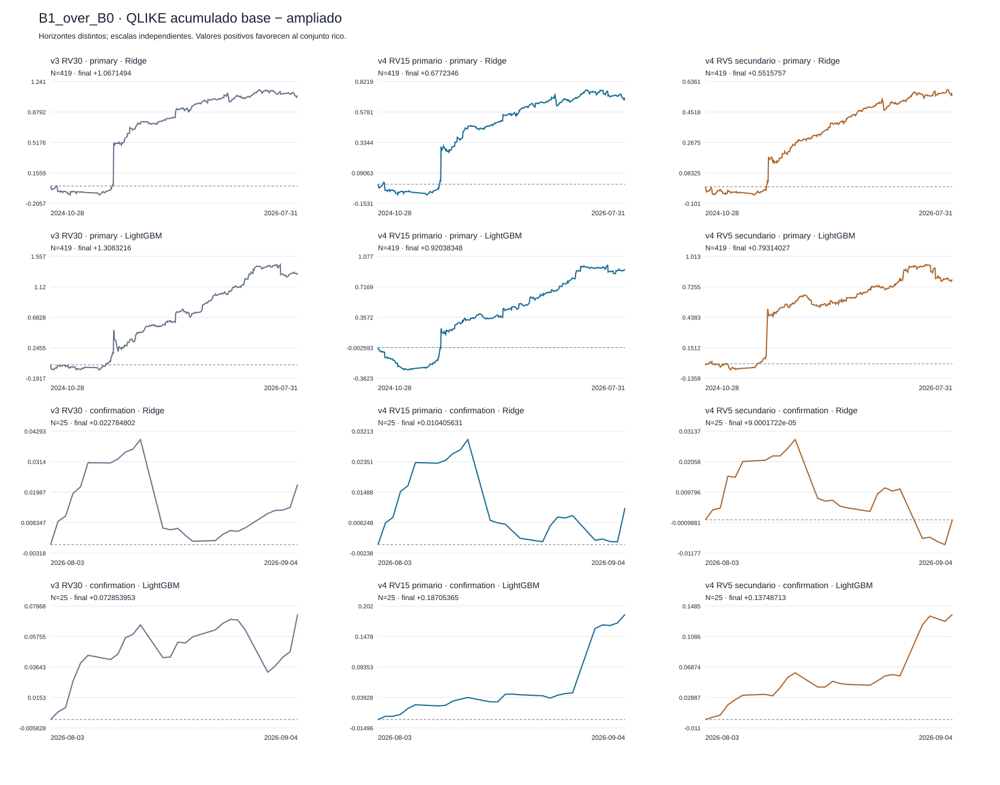
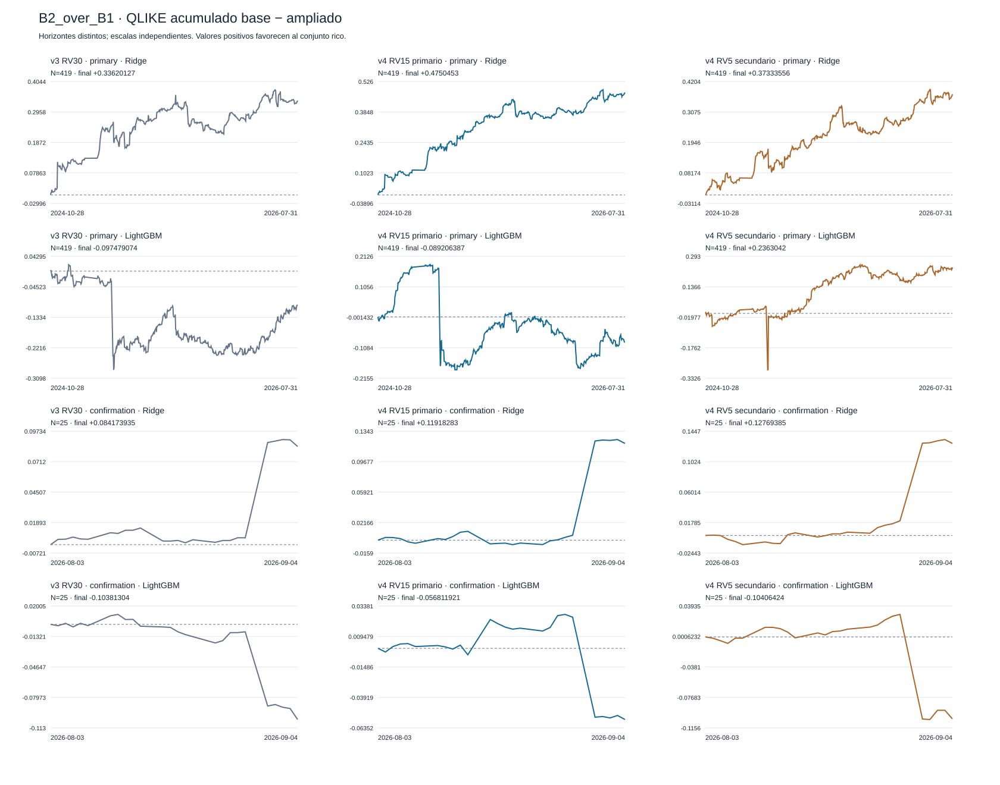

# RP4 v4 — final flow-horizon closeout

out-of-sample walk-forward, split fixed 2026-09-07.

RESEARCH_ONLY · NOT INVESTMENT ADVICE · capital_go=false.

## Result and closeout rule

RV15 satisfies H1 → H2 in: log_ridge_harq. Scope is reported by family; RV5 does not determine the result.

There is no v5. The at-least-one-family rule is operational; it does not imply global 5% control across families or versions.

## Primary comparison

| Family / contrast | v3 RV30 Δ [95% CI] | one-sided / formal p | % QLIKE | N sessions/origins | v4 RV15 primary Δ [95% CI] | one-sided / formal p | % QLIKE | N sessions/origins | v4 RV5 secondary Δ [95% CI] | one-sided / formal p | % QLIKE | N sessions/origins |
| --- | --- | --- | --- | --- | --- | --- | --- | --- | --- | --- | --- | --- |
| Ridge / B1_over_B0 | +0.0025468959 [0.00055700527, 0.0055407196] | 0.0439 / 0.0439 | +1.7289745 | 419/160832 | +0.0016163117 [0.00025298627, 0.0034535344] | 0.039 / 0.039 | +0.88005468 | 419/160832 | +0.0013164098 [0.00046645265, 0.0023758316] | 0.0092 / 0.0092 | +0.3772631 | 419/160832 |
| Ridge / B2_over_B1 | +0.00080238966 [-0.0001534347, 0.0017735437] | 0.0525 / 0.0525 | +0.55429022 | 419/160832 | +0.0011337597 [0.00033503697, 0.0019321616] | 0.0032 / 0.0032 | +0.6227941 | 419/160832 | +0.00089101565 [7.1046944e-05, 0.0016978277] | 0.0172 / 0.0172 | +0.25631858 | 419/160832 |
| LightGBM / B1_over_B0 | +0.0031224859 [0.0010149407, 0.0054860165] | 0.0053 / 0.0053 | +2.0911798 | 419/160832 | +0.0021966193 [0.00061098995, 0.0041026687] | 0.0135 / 0.0135 | +1.1699687 | 419/160832 | +0.0018929362 [0.00017647987, 0.0043734357] | 0.0608 / 0.0608 | +0.53577565 | 419/160832 |
| LightGBM / B2_over_B1 | -0.00023264695 [-0.0016475987, 0.00083196677] | 0.6631 / 0.6631 | -0.15913527 | 419/160832 | -0.00021290307 [-0.0020441248, 0.0011041695] | 0.628 / 0.628 | -0.11473937 | 419/160832 | +0.00056397184 [-0.00092542456, 0.0019566394] | 0.1927 / NOT OPENED | +0.16048613 | 419/160832 |

## Confirmation comparison

| Family / contrast | v3 RV30 Δ [95% CI] | one-sided / formal p | % QLIKE | N sessions/origins | v4 RV15 primary Δ [95% CI] | one-sided / formal p | % QLIKE | N sessions/origins | v4 RV5 secondary Δ [95% CI] | one-sided / formal p | % QLIKE | N sessions/origins |
| --- | --- | --- | --- | --- | --- | --- | --- | --- | --- | --- | --- | --- |
| Ridge / B1_over_B0 | +0.00091139207 [-0.0028274372, 0.0039476574] | 0.3238 / 0.3238 | +0.50109827 | 25/9750 | +0.00041622522 [-0.0022086273, 0.0028780554] | 0.3908 / 0.3908 | +0.1740826 | 25/9750 | +3.6000689e-06 [-0.0025838904, 0.0025449241] | 0.5015 / 0.5015 | +0.00086580567 | 25/9750 |
| Ridge / B2_over_B1 | +0.0033669574 [-0.00074430232, 0.010222763] | 0.1612 / NOT OPENED | +1.8605313 | 25/9750 | +0.0047673133 [-0.0011087291, 0.014742153] | 0.1758 / NOT OPENED | +1.9973646 | 25/9750 | +0.0051077539 [-0.00076922146, 0.014481554] | 0.1086 / NOT OPENED | +1.22841 | 25/9750 |
| LightGBM / B1_over_B0 | +0.0029141581 [-0.0016852924, 0.0074221881] | 0.1104 / 0.1104 | +1.6658018 | 25/9750 | +0.0074821462 [0.0016443642, 0.016807137] | 0.0568 / 0.0568 | +3.1626275 | 25/9750 | +0.0054994851 [0.0013003445, 0.01086431] | 0.0224 / 0.0224 | +1.3305248 | 25/9750 |
| LightGBM / B2_over_B1 | -0.0041525214 [-0.010378797, 2.4918119e-05] | 0.9266 / NOT OPENED | -2.4138902 | 25/9750 | -0.0022724768 [-0.0090719655, 0.0021952091] | 0.7554 / NOT OPENED | -0.99192382 | 25/9750 | -0.0041625696 [-0.014423982, 0.0021786847] | 0.7716 / 0.7716 | -1.0206566 | 25/9750 |

Positive delta favours the richer set. The 95% CI is a two-sided percentile interval; the one-sided p-value uses a centred null. H2 NOT OPENED means H1 did not reject; its nominal p-value is not a formal test. The two windows are reported separately and are not added together as independent replications.

In the decisions, rejection means rejection of the null delta≤0, that is, evidence favouring the increment; it does not mean rejection of the advantage as a substantive hypothesis.

[Full statistics, two-sided p-values and Holm, DM/GW and decisions](../../artifacts/rp4_v4_b4/primary_statistics.csv). Reduction % = 100 × mean of session differences / mean baseline QLIKE. The horizons have different targets.

## Sample coverage

| Horizon | Window | Asset | Scheduled | Eligible | % |
| --- | --- | --- | --- | --- | --- |
| 30 | primary | AAPL | 27055 | 26898 | 99.419701 |
| 30 | primary | AMZN | 27055 | 26743 | 98.846794 |
| 30 | primary | META | 27054 | 26853 | 99.257041 |
| 30 | primary | MSFT | 27055 | 26729 | 98.795047 |
| 30 | primary | NVDA | 27055 | 26764 | 98.924413 |
| 30 | primary | TSLA | 27055 | 26845 | 99.223803 |
| 30 | confirmation | AAPL | 1625 | 1625 | 100 |
| 30 | confirmation | AMZN | 1625 | 1625 | 100 |
| 30 | confirmation | META | 1625 | 1625 | 100 |
| 30 | confirmation | MSFT | 1625 | 1625 | 100 |
| 30 | confirmation | NVDA | 1625 | 1625 | 100 |
| 30 | confirmation | TSLA | 1625 | 1625 | 100 |
| 15 | primary | AAPL | 27055 | 26898 | 99.419701 |
| 15 | primary | AMZN | 27055 | 26743 | 98.846794 |
| 15 | primary | META | 27054 | 26853 | 99.257041 |
| 15 | primary | MSFT | 27055 | 26729 | 98.795047 |
| 15 | primary | NVDA | 27055 | 26764 | 98.924413 |
| 15 | primary | TSLA | 27055 | 26845 | 99.223803 |
| 15 | confirmation | AAPL | 1625 | 1625 | 100 |
| 15 | confirmation | AMZN | 1625 | 1625 | 100 |
| 15 | confirmation | META | 1625 | 1625 | 100 |
| 15 | confirmation | MSFT | 1625 | 1625 | 100 |
| 15 | confirmation | NVDA | 1625 | 1625 | 100 |
| 15 | confirmation | TSLA | 1625 | 1625 | 100 |
| 5 | primary | AAPL | 27055 | 26898 | 99.419701 |
| 5 | primary | AMZN | 27055 | 26743 | 98.846794 |
| 5 | primary | META | 27054 | 26853 | 99.257041 |
| 5 | primary | MSFT | 27055 | 26729 | 98.795047 |
| 5 | primary | NVDA | 27055 | 26764 | 98.924413 |
| 5 | primary | TSLA | 27055 | 26845 | 99.223803 |
| 5 | confirmation | AAPL | 1625 | 1625 | 100 |
| 5 | confirmation | AMZN | 1625 | 1625 | 100 |
| 5 | confirmation | META | 1625 | 1625 | 100 |
| 5 | confirmation | MSFT | 1625 | 1625 | 100 |
| 5 | confirmation | NVDA | 1625 | 1625 | 100 |
| 5 | confirmation | TSLA | 1625 | 1625 | 100 |

[Counts and reasons](../../artifacts/rp4_v4_b4/coverage.csv). The v3 mask and training are retained; RV15/RV5 do not gain new origins because they are shorter.

## Registered secondaries that cannot be promoted to primary evidence

### RV15 · primary

| Family | Contrast | Statistic | Delta | 95% CI | two-sided p | Holm | N |
| --- | --- | --- | --- | --- | --- | --- | --- |
| log_ridge_harq | B1_over_B0 | median | +0.00079194115 | [0.00025940821, 0.0014001378] | 0.0064 | 0.0256 | 419 |
| log_ridge_harq | B2_over_B1 | median | +0.00072999165 | [0.00040040552, 0.0014178263] | 0.0237 | 0.0711 | 419 |
| lightgbm_qlike | B1_over_B0 | median | +0.00082578317 | [-0.00010985772, 0.0016799001] | 0.0726 | 0.087 | 419 |
| lightgbm_qlike | B2_over_B1 | median | +0.00059446737 | [8.7127359e-05, 0.0012429547] | 0.0435 | 0.087 | 419 |
| log_ridge_harq | B1_over_B0 | trimmed_mean_5pct | +0.00091645007 | [0.00027737671, 0.0015383181] | 0.0048 | 0.0144 | 419 |
| log_ridge_harq | B2_over_B1 | trimmed_mean_5pct | +0.0010592488 | [0.0004938845, 0.0016800045] | 0.001 | 0.004 | 419 |
| lightgbm_qlike | B1_over_B0 | trimmed_mean_5pct | +0.001155971 | [0.0002639171, 0.0020959526] | 0.0147 | 0.0294 | 419 |
| lightgbm_qlike | B2_over_B1 | trimmed_mean_5pct | +0.00048048462 | [-0.00016423668, 0.0010806748] | 0.1258 | 0.1258 | 419 |

| Family | Contrast | Conditional P(delta>0) | HAC SE | N |
| --- | --- | --- | --- | --- |
| log_ridge_harq | B1_over_B0 | 0.97205884 | 0.00084537239 | 419 |
| log_ridge_harq | B2_over_B1 | 0.99687959 | 0.00041455964 | 419 |
| lightgbm_qlike | B1_over_B0 | 0.99235244 | 0.00090570484 | 419 |
| lightgbm_qlike | B2_over_B1 | 0.3983471 | 0.00082639798 | 419 |

### RV15 · confirmation

| Family | Contrast | Statistic | Delta | 95% CI | two-sided p | Holm | N |
| --- | --- | --- | --- | --- | --- | --- | --- |
| log_ridge_harq | B1_over_B0 | median | +0.00068380618 | [-0.00071032924, 0.0016768518] | 0.5165 | 0.7614 | 25 |
| log_ridge_harq | B2_over_B1 | median | +0.0010321516 | [-0.0011059622, 0.0025021961] | 0.2016 | 0.6048 | 25 |
| lightgbm_qlike | B1_over_B0 | median | +0.0030868423 | [0.00028117749, 0.0051318542] | 0.0079 | 0.0316 | 25 |
| lightgbm_qlike | B2_over_B1 | median | -0.001089333 | [-0.0016001402, 0.00076264786] | 0.3807 | 0.7614 | 25 |
| log_ridge_harq | B1_over_B0 | trimmed_mean_5pct | +0.0010286997 | [-0.0017065835, 0.0030386661] | 0.3936 | 1 | 25 |
| log_ridge_harq | B2_over_B1 | trimmed_mean_5pct | +0.00080154365 | [-0.00083801043, 0.011340792] | 0.4786 | 1 | 25 |
| lightgbm_qlike | B1_over_B0 | trimmed_mean_5pct | +0.0034853065 | [0.0014452642, 0.013515386] | 0.2517 | 1 | 25 |
| lightgbm_qlike | B2_over_B1 | trimmed_mean_5pct | -0.00022018762 | [-0.0070881576, 0.001664705] | 0.819 | 1 | 25 |

| Family | Contrast | Conditional P(delta>0) | HAC SE | N |
| --- | --- | --- | --- | --- |
| log_ridge_harq | B1_over_B0 | 0.62914632 | 0.0012628453 | 25 |
| log_ridge_harq | B2_over_B1 | 0.86661386 | 0.0042928413 | 25 |
| lightgbm_qlike | B1_over_B0 | 0.96624954 | 0.004092352 | 25 |
| lightgbm_qlike | B2_over_B1 | 0.22086108 | 0.0029539988 | 25 |

### RV5 · primary

| Family | Contrast | Statistic | Delta | 95% CI | two-sided p | Holm | N |
| --- | --- | --- | --- | --- | --- | --- | --- |
| log_ridge_harq | B1_over_B0 | median | +0.00089428866 | [0.00022839364, 0.0011027043] | 0.0032 | 0.0096 | 419 |
| log_ridge_harq | B2_over_B1 | median | +0.0010462176 | [0.00065711686, 0.0017339862] | 0.0012 | 0.0048 | 419 |
| lightgbm_qlike | B1_over_B0 | median | +0.00086541288 | [0.00021508678, 0.0014522672] | 0.0041 | 0.0096 | 419 |
| lightgbm_qlike | B2_over_B1 | median | +0.00098041164 | [0.00033590325, 0.0014554574] | 0.0038 | 0.0096 | 419 |
| log_ridge_harq | B1_over_B0 | trimmed_mean_5pct | +0.0010872913 | [0.00058818697, 0.0015549382] | 0.0001 | 0.0004 | 419 |
| log_ridge_harq | B2_over_B1 | trimmed_mean_5pct | +0.0011751167 | [0.00053116064, 0.0018628871] | 0.0008 | 0.0024 | 419 |
| lightgbm_qlike | B1_over_B0 | trimmed_mean_5pct | +0.00096857315 | [0.00021839781, 0.0017606776] | 0.0148 | 0.0148 | 419 |
| lightgbm_qlike | B2_over_B1 | trimmed_mean_5pct | +0.00081230447 | [0.0002791993, 0.001334074] | 0.0025 | 0.005 | 419 |

| Family | Contrast | Conditional P(delta>0) | HAC SE | N |
| --- | --- | --- | --- | --- |
| log_ridge_harq | B1_over_B0 | 0.99558764 | 0.00050268225 | 419 |
| log_ridge_harq | B2_over_B1 | 0.98147992 | 0.00042727981 | 419 |
| lightgbm_qlike | B1_over_B0 | 0.95836053 | 0.0010929383 | 419 |
| lightgbm_qlike | B2_over_B1 | 0.80097252 | 0.00066734327 | 419 |

### RV5 · confirmation

| Family | Contrast | Statistic | Delta | 95% CI | two-sided p | Holm | N |
| --- | --- | --- | --- | --- | --- | --- | --- |
| log_ridge_harq | B1_over_B0 | median | +0.00041053831 | [-0.0010233368, 0.0015046105] | 0.2092 | 0.5973 | 25 |
| log_ridge_harq | B2_over_B1 | median | +0.001765858 | [-0.00051828745, 0.0025508901] | 0.1991 | 0.5973 | 25 |
| lightgbm_qlike | B1_over_B0 | median | +0.0030588169 | [2.3967566e-06, 0.0061576793] | 0.0802 | 0.3208 | 25 |
| lightgbm_qlike | B2_over_B1 | median | +0.00015529218 | [-0.0015972949, 0.0026213277] | 0.7469 | 0.7469 | 25 |
| log_ridge_harq | B1_over_B0 | trimmed_mean_5pct | +0.00041718979 | [-0.0022234737, 0.0026993844] | 0.765 | 1 | 25 |
| log_ridge_harq | B2_over_B1 | trimmed_mean_5pct | +0.0011214957 | [-0.0010426461, 0.011296229] | 0.479 | 1 | 25 |
| lightgbm_qlike | B1_over_B0 | trimmed_mean_5pct | +0.0038749833 | [0.0013538537, 0.009255121] | 0.0679 | 0.2716 | 25 |
| lightgbm_qlike | B2_over_B1 | trimmed_mean_5pct | +0.00066262319 | [-0.010429602, 0.0024950569] | 0.6391 | 1 | 25 |

| Family | Contrast | Conditional P(delta>0) | HAC SE | N |
| --- | --- | --- | --- | --- |
| log_ridge_harq | B1_over_B0 | 0.50115695 | 0.0012413855 | 25 |
| log_ridge_harq | B2_over_B1 | 0.89776101 | 0.0040253511 | 25 |
| lightgbm_qlike | B1_over_B0 | 0.98721341 | 0.002463229 | 25 |
| lightgbm_qlike | B2_over_B1 | 0.17552464 | 0.0044636138 | 25 |

The posterior is a Gaussian approximation with plug-in HAC variance: it does not integrate uncertainty in that variance. The paired median is not the difference of medians; 5% trimming from each tail applies only to the secondary analysis.

[All regimes with N, unknowns, intervals and p-values](../../artifacts/rp4_v4_b4/regime_secondary.csv) · [Assets, blocks, exclusions and last 30 sessions](../../artifacts/rp4_v4_b4/robustness.csv) · [High-gamma interaction against the rest](../../artifacts/rp4_v4_b4/high_gamma_vs_rest.csv). First/last hour, calendar Friday, third Friday, high flow, events and empty/nonempty windows are retained; a favourable stratum is not promoted.

## Empty windows and bounds

| RV | Window | Flow window | Asset | N | Empty | Nonempty | Unknown |
| --- | --- | --- | --- | --- | --- | --- | --- |
| 15 | primary | 5m | AAPL | 26898 | 69 | 26829 | 0 |
| 15 | primary | 5m | AMZN | 26743 | 68 | 26675 | 0 |
| 15 | primary | 5m | META | 26853 | 63 | 26790 | 0 |
| 15 | primary | 5m | MSFT | 26729 | 63 | 26666 | 0 |
| 15 | primary | 5m | NVDA | 26764 | 77 | 26687 | 0 |
| 15 | primary | 5m | TSLA | 26845 | 72 | 26773 | 0 |
| 15 | primary | 30m | AAPL | 26898 | 65 | 26833 | 0 |
| 15 | primary | 30m | AMZN | 26743 | 65 | 26678 | 0 |
| 15 | primary | 30m | META | 26853 | 59 | 26794 | 0 |
| 15 | primary | 30m | MSFT | 26729 | 59 | 26670 | 0 |
| 15 | primary | 30m | NVDA | 26764 | 71 | 26693 | 0 |
| 15 | primary | 30m | TSLA | 26845 | 65 | 26780 | 0 |
| 15 | confirmation | 5m | AAPL | 1625 | 0 | 1625 | 0 |
| 15 | confirmation | 5m | AMZN | 1625 | 0 | 1625 | 0 |
| 15 | confirmation | 5m | META | 1625 | 0 | 1625 | 0 |
| 15 | confirmation | 5m | MSFT | 1625 | 0 | 1625 | 0 |
| 15 | confirmation | 5m | NVDA | 1625 | 0 | 1625 | 0 |
| 15 | confirmation | 5m | TSLA | 1625 | 0 | 1625 | 0 |
| 15 | confirmation | 30m | AAPL | 1625 | 0 | 1625 | 0 |
| 15 | confirmation | 30m | AMZN | 1625 | 0 | 1625 | 0 |
| 15 | confirmation | 30m | META | 1625 | 0 | 1625 | 0 |
| 15 | confirmation | 30m | MSFT | 1625 | 0 | 1625 | 0 |
| 15 | confirmation | 30m | NVDA | 1625 | 0 | 1625 | 0 |
| 15 | confirmation | 30m | TSLA | 1625 | 0 | 1625 | 0 |
| 5 | primary | 5m | AAPL | 26898 | 69 | 26829 | 0 |
| 5 | primary | 5m | AMZN | 26743 | 68 | 26675 | 0 |
| 5 | primary | 5m | META | 26853 | 63 | 26790 | 0 |
| 5 | primary | 5m | MSFT | 26729 | 63 | 26666 | 0 |
| 5 | primary | 5m | NVDA | 26764 | 77 | 26687 | 0 |
| 5 | primary | 5m | TSLA | 26845 | 72 | 26773 | 0 |
| 5 | primary | 30m | AAPL | 26898 | 65 | 26833 | 0 |
| 5 | primary | 30m | AMZN | 26743 | 65 | 26678 | 0 |
| 5 | primary | 30m | META | 26853 | 59 | 26794 | 0 |
| 5 | primary | 30m | MSFT | 26729 | 59 | 26670 | 0 |
| 5 | primary | 30m | NVDA | 26764 | 71 | 26693 | 0 |
| 5 | primary | 30m | TSLA | 26845 | 65 | 26780 | 0 |
| 5 | confirmation | 5m | AAPL | 1625 | 0 | 1625 | 0 |
| 5 | confirmation | 5m | AMZN | 1625 | 0 | 1625 | 0 |
| 5 | confirmation | 5m | META | 1625 | 0 | 1625 | 0 |
| 5 | confirmation | 5m | MSFT | 1625 | 0 | 1625 | 0 |
| 5 | confirmation | 5m | NVDA | 1625 | 0 | 1625 | 0 |
| 5 | confirmation | 5m | TSLA | 1625 | 0 | 1625 | 0 |
| 5 | confirmation | 30m | AAPL | 1625 | 0 | 1625 | 0 |
| 5 | confirmation | 30m | AMZN | 1625 | 0 | 1625 | 0 |
| 5 | confirmation | 30m | META | 1625 | 0 | 1625 | 0 |
| 5 | confirmation | 30m | MSFT | 1625 | 0 | 1625 | 0 |
| 5 | confirmation | 30m | NVDA | 1625 | 0 | 1625 | 0 |
| 5 | confirmation | 30m | TSLA | 1625 | 0 | 1625 | 0 |

The B2/B1 contrast inside and outside empty windows is in the regime CSV, with intervals and N; no origin is excluded for being empty.

[Rounds/leaves/lambda, bounds and bound hits for each session](../../artifacts/rp4_v4_b4/fit_selection_bounds.csv). Bounds are calculated only from P1/P99 of the training target for the corresponding horizon.

| RV | Window | Ridge | Phase | N forecasts | Lower bound | Upper bound |
| --- | --- | --- | --- | --- | --- | --- |
| 5 | confirmation | B0 | evaluation | 9750 | 0 | 0 |
| 5 | confirmation | B0 | validation | 97500 | 0 | 0 |
| 5 | confirmation | B1 | evaluation | 9750 | 0 | 0 |
| 5 | confirmation | B1 | validation | 97500 | 0 | 0 |
| 5 | confirmation | B2 | evaluation | 9750 | 0 | 0 |
| 5 | confirmation | B2 | validation | 97500 | 0 | 0 |
| 5 | primary | B0 | evaluation | 160832 | 0 | 196 |
| 5 | primary | B0 | validation | 1608320 | 0 | 2058 |
| 5 | primary | B1 | evaluation | 160832 | 0 | 287 |
| 5 | primary | B1 | validation | 1608320 | 0 | 3173 |
| 5 | primary | B2 | evaluation | 160832 | 0 | 270 |
| 5 | primary | B2 | validation | 1608320 | 0 | 2907 |
| 15 | confirmation | B0 | evaluation | 9750 | 0 | 0 |
| 15 | confirmation | B0 | validation | 97500 | 0 | 0 |
| 15 | confirmation | B1 | evaluation | 9750 | 0 | 0 |
| 15 | confirmation | B1 | validation | 97500 | 0 | 0 |
| 15 | confirmation | B2 | evaluation | 9750 | 0 | 0 |
| 15 | confirmation | B2 | validation | 97500 | 0 | 0 |
| 15 | primary | B0 | evaluation | 160832 | 0 | 223 |
| 15 | primary | B0 | validation | 1608320 | 0 | 2027 |
| 15 | primary | B1 | evaluation | 160832 | 0 | 324 |
| 15 | primary | B1 | validation | 1608320 | 0 | 3487 |
| 15 | primary | B2 | evaluation | 160832 | 0 | 302 |
| 15 | primary | B2 | validation | 1608320 | 0 | 3311 |

Validation denominators sum applications across successive fits, not unique origins. [Bound counts](../../artifacts/rp4_v4_b4/bound_counts.csv).

## Extreme days

### RV15 · primary: ten largest B2 losses by family

| Family | Day | Rank | QLIKE B0 | QLIKE B1 | QLIKE B2 | Delta B1/B0 | Delta B2/B1 |
| --- | --- | --- | --- | --- | --- | --- | --- |
| log_ridge_harq | 2025-04-09 | 1 | 1.8695092 | 1.5956309 | 1.6115988 | +0.27387831 | -0.015967904 |
| log_ridge_harq | 2026-06-05 | 2 | 0.87105186 | 0.89909039 | 0.93494652 | -0.028038533 | -0.035856129 |
| log_ridge_harq | 2026-03-16 | 3 | 0.8570822 | 0.85306135 | 0.86185969 | +0.0040208545 | -0.0087983412 |
| log_ridge_harq | 2025-04-07 | 4 | 0.88472467 | 0.81794814 | 0.80640871 | +0.066776529 | +0.011539429 |
| log_ridge_harq | 2024-11-14 | 5 | 0.76955742 | 0.82199026 | 0.75681349 | -0.052432843 | +0.06517677 |
| log_ridge_harq | 2026-01-21 | 6 | 0.63627291 | 0.61783488 | 0.6093062 | +0.018438031 | +0.0085286853 |
| log_ridge_harq | 2026-06-17 | 7 | 0.57371988 | 0.6072878 | 0.59384133 | -0.033567913 | +0.013446472 |
| log_ridge_harq | 2025-10-10 | 8 | 0.57021887 | 0.57593971 | 0.56374939 | -0.0057208341 | +0.012190321 |
| log_ridge_harq | 2025-09-17 | 9 | 0.60333416 | 0.55517537 | 0.52923569 | +0.048158792 | +0.025939679 |
| log_ridge_harq | 2026-06-11 | 10 | 0.53881936 | 0.52510362 | 0.52334016 | +0.013715738 | +0.001763458 |
| lightgbm_qlike | 2025-04-09 | 1 | 2.2217684 | 1.9798989 | 1.9012007 | +0.24186943 | +0.078698183 |
| lightgbm_qlike | 2025-04-07 | 2 | 1.5804779 | 1.4592283 | 1.8036455 | +0.12124965 | -0.3444172 |
| lightgbm_qlike | 2026-06-05 | 3 | 0.86287838 | 0.8610624 | 0.84544985 | +0.0018159811 | +0.015612552 |
| lightgbm_qlike | 2024-11-14 | 4 | 0.79069835 | 0.85422264 | 0.83959621 | -0.063524293 | +0.014626429 |
| lightgbm_qlike | 2026-03-16 | 5 | 0.74937287 | 0.72866897 | 0.73264397 | +0.020703899 | -0.0039750011 |
| lightgbm_qlike | 2025-10-10 | 6 | 0.65613537 | 0.62353247 | 0.6504197 | +0.032602897 | -0.02688722 |
| lightgbm_qlike | 2026-01-21 | 7 | 0.63401811 | 0.61051596 | 0.63852258 | +0.023502146 | -0.028006622 |
| lightgbm_qlike | 2026-06-11 | 8 | 0.599809 | 0.59440798 | 0.60159709 | +0.0054010165 | -0.007189108 |
| lightgbm_qlike | 2026-06-17 | 9 | 0.48318206 | 0.56820682 | 0.57024356 | -0.085024756 | -0.0020367435 |
| lightgbm_qlike | 2024-12-18 | 10 | 0.48302419 | 0.50567545 | 0.47940592 | -0.022651255 | +0.026269532 |

### RV15 · confirmation: ten largest B2 losses by family

| Family | Day | Rank | QLIKE B0 | QLIKE B1 | QLIKE B2 | Delta B1/B0 | Delta B2/B1 |
| --- | --- | --- | --- | --- | --- | --- | --- |
| log_ridge_harq | 2026-08-31 | 1 | 1.7215322 | 1.7285112 | 1.6122633 | -0.0069790761 | +0.1162479 |
| log_ridge_harq | 2026-08-17 | 2 | 0.47935999 | 0.50222947 | 0.51773005 | -0.022869478 | -0.015500577 |
| log_ridge_harq | 2026-08-10 | 3 | 0.23055762 | 0.23072524 | 0.22504364 | -0.00016761816 | +0.0056815949 |
| log_ridge_harq | 2026-08-25 | 4 | 0.2295356 | 0.22506444 | 0.22047686 | +0.004471159 | +0.0045875858 |
| log_ridge_harq | 2026-08-05 | 5 | 0.22140425 | 0.21413893 | 0.21546664 | +0.0072653223 | -0.0013277134 |
| log_ridge_harq | 2026-08-13 | 6 | 0.21117657 | 0.21009727 | 0.20483302 | +0.0010792966 | +0.0052642459 |
| log_ridge_harq | 2026-08-11 | 7 | 0.17144593 | 0.17067692 | 0.17178288 | +0.0007690122 | -0.0011059622 |
| log_ridge_harq | 2026-09-04 | 8 | 0.1741978 | 0.16458279 | 0.16935986 | +0.0096150149 | -0.004777077 |
| log_ridge_harq | 2026-08-20 | 9 | 0.16481639 | 0.16680303 | 0.1686757 | -0.0019866405 | -0.0018726721 |
| log_ridge_harq | 2026-08-27 | 10 | 0.16990769 | 0.17016777 | 0.16713625 | -0.00026008541 | +0.0030315263 |
| lightgbm_qlike | 2026-08-31 | 1 | 1.6618076 | 1.5472068 | 1.6270845 | +0.11460072 | -0.079877675 |
| lightgbm_qlike | 2026-08-17 | 2 | 0.40542644 | 0.41313556 | 0.38500549 | -0.00770912 | +0.028130069 |
| lightgbm_qlike | 2026-08-25 | 3 | 0.22118367 | 0.22541833 | 0.22261442 | -0.0042346528 | +0.0028039024 |
| lightgbm_qlike | 2026-08-10 | 4 | 0.21990212 | 0.22193282 | 0.22114657 | -0.0020306943 | +0.00078624877 |
| lightgbm_qlike | 2026-08-13 | 5 | 0.21844485 | 0.21526774 | 0.21212672 | +0.0031771078 | +0.0031410209 |
| lightgbm_qlike | 2026-08-05 | 6 | 0.21369621 | 0.21033102 | 0.20829591 | +0.0033651871 | +0.0020351127 |
| lightgbm_qlike | 2026-09-04 | 7 | 0.21578528 | 0.20065202 | 0.2038479 | +0.015133264 | -0.0031958775 |
| lightgbm_qlike | 2026-08-11 | 8 | 0.17433801 | 0.17341756 | 0.17450689 | +0.00092045003 | -0.001089333 |
| lightgbm_qlike | 2026-08-20 | 9 | 0.16974817 | 0.169467 | 0.17106714 | +0.00028117749 | -0.0016001402 |
| lightgbm_qlike | 2026-09-03 | 10 | 0.17607571 | 0.17144987 | 0.16950307 | +0.0046258435 | +0.0019467977 |

### RV5 · primary: ten largest B2 losses by family

| Family | Day | Rank | QLIKE B0 | QLIKE B1 | QLIKE B2 | Delta B1/B0 | Delta B2/B1 |
| --- | --- | --- | --- | --- | --- | --- | --- |
| log_ridge_harq | 2025-04-09 | 1 | 1.579212 | 1.4291185 | 1.4967558 | +0.15009352 | -0.067637261 |
| log_ridge_harq | 2026-03-16 | 2 | 1.0242364 | 1.0200459 | 1.0135825 | +0.0041905407 | +0.006463389 |
| log_ridge_harq | 2025-04-07 | 3 | 1.0774041 | 1.0185903 | 1.0072708 | +0.05881378 | +0.011319456 |
| log_ridge_harq | 2026-06-05 | 4 | 0.90930152 | 0.91078942 | 0.94403848 | -0.0014878987 | -0.033249058 |
| log_ridge_harq | 2024-11-14 | 5 | 0.8780304 | 0.90567419 | 0.88920572 | -0.027643783 | +0.016468471 |
| log_ridge_harq | 2026-01-21 | 6 | 0.78116317 | 0.77488272 | 0.7756739 | +0.0062804506 | -0.00079118064 |
| log_ridge_harq | 2026-06-17 | 7 | 0.7674357 | 0.79363137 | 0.77468283 | -0.026195671 | +0.018948538 |
| log_ridge_harq | 2026-06-11 | 8 | 0.78905565 | 0.77614571 | 0.76981425 | +0.012909941 | +0.0063314574 |
| log_ridge_harq | 2026-05-27 | 9 | 0.74678693 | 0.75193263 | 0.73971181 | -0.0051457047 | +0.01222082 |
| log_ridge_harq | 2026-03-09 | 10 | 0.63071978 | 0.63856171 | 0.64618069 | -0.007841931 | -0.0076189807 |
| lightgbm_qlike | 2025-04-07 | 1 | 2.2375433 | 1.7894643 | 2.1161678 | +0.44807899 | -0.3267035 |
| lightgbm_qlike | 2025-04-09 | 2 | 2.1373067 | 2.1694027 | 1.8931991 | -0.032095989 | +0.27620359 |
| lightgbm_qlike | 2024-11-14 | 3 | 0.93127235 | 0.95380724 | 1.0077704 | -0.022534892 | -0.053963118 |
| lightgbm_qlike | 2026-03-16 | 4 | 0.91279143 | 0.8886799 | 0.89959852 | +0.024111525 | -0.010918621 |
| lightgbm_qlike | 2026-06-05 | 5 | 0.78868116 | 0.84386724 | 0.84524811 | -0.055186083 | -0.0013808709 |
| lightgbm_qlike | 2026-06-11 | 6 | 0.83612874 | 0.82375495 | 0.83270321 | +0.012373788 | -0.008948263 |
| lightgbm_qlike | 2026-01-21 | 7 | 0.75796931 | 0.74711607 | 0.75356633 | +0.010853236 | -0.0064502518 |
| lightgbm_qlike | 2026-06-17 | 8 | 0.66721939 | 0.76482544 | 0.74620934 | -0.097606045 | +0.018616095 |
| lightgbm_qlike | 2025-10-10 | 9 | 0.75524301 | 0.73094099 | 0.72001332 | +0.02430202 | +0.010927668 |
| lightgbm_qlike | 2026-03-09 | 10 | 0.65174762 | 0.64012401 | 0.63118728 | +0.01162361 | +0.0089367245 |

### RV5 · confirmation: ten largest B2 losses by family

| Family | Day | Rank | QLIKE B0 | QLIKE B1 | QLIKE B2 | Delta B1/B0 | Delta B2/B1 |
| --- | --- | --- | --- | --- | --- | --- | --- |
| log_ridge_harq | 2026-08-31 | 1 | 1.8691449 | 1.886627 | 1.7789474 | -0.017482111 | +0.10767964 |
| log_ridge_harq | 2026-08-17 | 2 | 0.68524907 | 0.70600264 | 0.71178283 | -0.020753566 | -0.0057801918 |
| log_ridge_harq | 2026-08-25 | 3 | 0.42851582 | 0.42229096 | 0.41453466 | +0.00622486 | +0.0077563027 |
| log_ridge_harq | 2026-08-10 | 4 | 0.40145397 | 0.40100008 | 0.39724453 | +0.00045388986 | +0.0037555535 |
| log_ridge_harq | 2026-08-05 | 5 | 0.40153044 | 0.39028224 | 0.39564344 | +0.011248203 | -0.0053612007 |
| log_ridge_harq | 2026-08-11 | 6 | 0.38341262 | 0.381908 | 0.38377786 | +0.0015046105 | -0.0018698594 |
| log_ridge_harq | 2026-08-04 | 7 | 0.36798788 | 0.36738919 | 0.36790748 | +0.00059869046 | -0.00051828745 |
| log_ridge_harq | 2026-08-13 | 8 | 0.38153879 | 0.37885818 | 0.36645943 | +0.0026806053 | +0.012398753 |
| log_ridge_harq | 2026-08-20 | 9 | 0.35232201 | 0.35444681 | 0.35450999 | -0.0021248 | -6.3181467e-05 |
| log_ridge_harq | 2026-08-27 | 10 | 0.34974255 | 0.35086837 | 0.34878792 | -0.0011258195 | +0.0020804444 |
| lightgbm_qlike | 2026-08-31 | 1 | 1.7762318 | 1.7092651 | 1.8422083 | +0.066966786 | -0.1329432 |
| lightgbm_qlike | 2026-08-17 | 2 | 0.62670022 | 0.64530449 | 0.63906671 | -0.018604274 | +0.0062377758 |
| lightgbm_qlike | 2026-08-25 | 3 | 0.4226856 | 0.41701863 | 0.41439028 | +0.0056669733 | +0.0026283448 |
| lightgbm_qlike | 2026-08-05 | 4 | 0.40131519 | 0.38807188 | 0.39151889 | +0.013243318 | -0.0034470121 |
| lightgbm_qlike | 2026-08-10 | 5 | 0.40437664 | 0.40331517 | 0.38967654 | +0.0010614787 | +0.013638626 |
| lightgbm_qlike | 2026-08-11 | 6 | 0.38634685 | 0.38824658 | 0.38833109 | -0.0018997288 | -8.4517763e-05 |
| lightgbm_qlike | 2026-09-04 | 7 | 0.37952501 | 0.37034357 | 0.38122298 | +0.0091814411 | -0.010879403 |
| lightgbm_qlike | 2026-08-13 | 8 | 0.37191052 | 0.35884489 | 0.36327078 | +0.013065629 | -0.004425891 |
| lightgbm_qlike | 2026-08-04 | 9 | 0.36004048 | 0.35719469 | 0.36034769 | +0.0028457955 | -0.0031530087 |
| lightgbm_qlike | 2026-08-20 | 10 | 0.35813797 | 0.36101138 | 0.36030009 | -0.002873407 | +0.00071129281 |

[Ten extremes for each family and set, including B0 and B1](../../artifacts/rp4_v4_b4/top_loss_sessions.csv). All signs are retained.

## Cumulative evolution

## Data, execution and traceability

[RV15/RV5 validation](../../artifacts/rp4_v4_a2/REPORT.md) · [Frozen specification](specification_v4.md) · [Decision 133](decision_133_v4.md). The confirmation window has no earlier RV15/RV5 reference; parity with a nonexistent file is not claimed.

Eight disjoint shards × four threads, with complete past training per shard. No additional evaluation trial, downloads or publication. [Actual timings and observed resources: logical CPUs, RAM and thread limits](../../artifacts/rp4_v4_b4/timing.csv). The releases and receipts for the four executions are linked in the report manifest.

## Disclosure and closeout

This is the fourth evaluation of the same windows: v1 initial design; v2 coverage/capacity/regularisation; v3 mechanism and empty windows; v4 a predeclared conditional horizon. RV5 is a secondary endpoint of v4, not a fifth version or an independent replication. Within-version p-values do not correct the entire preceding search.

The window from 20 July to 28 August was read once by the Phase 8 bridge under another specification. PIT uses a source-time proxy at 120 s, as in the literature.

Accepted UW gap: 2025-01-25 to 2025-02-24, without filling. Dealer inventory and historical client availability are not directly observed. A non-rejected result does not demonstrate absence or absorption; the intervals bound what was measured.

[Unchanged v3 results](results_v3.md) · [v3 secondary closeout](results_v3_revision1.md) · [Manifest and hashes](../../artifacts/rp4_v4_b4/report_manifest.json). The v3 primary analysis does not depend on repairing its secondaries.
